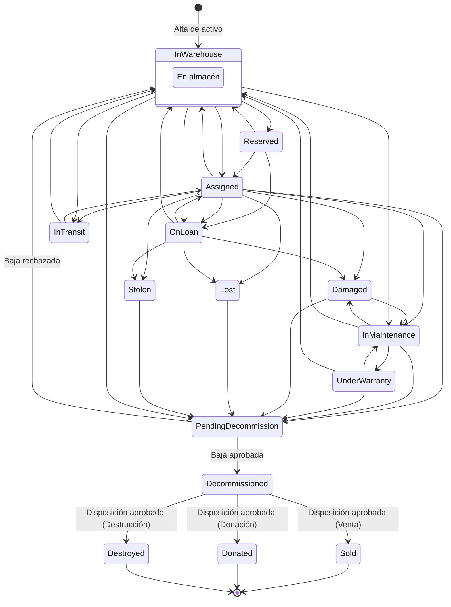

## 6.1 Activos

El módulo de Activos es el registro maestro de inventario de TI de la aplicación. Es el punto de entrada de todo el ciclo de vida de un equipo: alta con folio y etiqueta, edición de sus datos, reubicación física dentro de la empresa, y su salida definitiva del inventario mediante baja y disposición. Todos los demás módulos operativos (Asignaciones, Préstamos, Mantenimiento, Movimientos, Transferencias entre empresas, Aprobaciones) actúan **sobre** un activo que ya existe en este registro.

Solo pueden usar este módulo los usuarios de TI/Activos de cada empresa del grupo. Las acciones de alta, edición, reubicación, baja y disposición requieren permisos específicos (`Assets.Create`, `Assets.Update`, `Assets.Decommission`, `Assets.Read`) que el sistema valida siempre en el servidor, sin importar lo que muestre o permita la pantalla.

**Importante para toda esta sección**: en esta versión del sistema **no existe depreciación ni contabilidad de activos**. Los campos financieros (costo, factura, proveedor, orden de compra, etc.) son de captura libre y puramente informativos — el sistema no realiza ningún cálculo, amortización ni asiento contable a partir de ellos.

---

### El ciclo de vida de un activo

Cada activo del inventario transita a lo largo de su vida útil por una serie fija de **estados**. El sistema controla estrictamente qué cambios de estado son posibles: no es posible, por ejemplo, marcar como "vendido" un activo que nunca fue dado de baja, ni "asignar" un activo que está en trámite de baja. Si una pantalla o una integración intenta forzar un cambio que no está permitido, el sistema lo rechaza con el mensaje **"No es válido transicionar un activo de '{estado origen}' a '{estado destino}'."**

A continuación se explica, en términos de negocio, qué significa cada estado:

- **En almacén** (`InWarehouse`): el activo está disponible, no asignado a ninguna persona ni en préstamo. Es el estado de "reposo" normal y también el estado inicial de todo activo recién dado de alta.
- **Reservado** (`Reserved`): el activo está apartado para una asignación o préstamo futuro, pero todavía no salió físicamente del almacén.
- **Asignado** (`Assigned`): el activo está entregado de forma permanente a un colaborador o a un puesto de trabajo.
- **Prestado** (`OnLoan`): el activo salió temporalmente bajo la modalidad de préstamo (con fecha de devolución esperada).
- **En tránsito** (`InTransit`): el activo está en movimiento físico entre ubicaciones (por ejemplo, en camino a otra sucursal), sin haber llegado aún a su destino.
- **En mantenimiento** (`InMaintenance`): el activo está fuera de servicio porque tiene una orden de mantenimiento abierta.
- **En garantía** (`UnderWarranty`): el activo está en proceso de reparación o reemplazo por parte del proveedor, cubierto por su garantía.
- **Dañado** (`Damaged`): el activo presenta un daño que le impide operar con normalidad, pendiente de decidir si se repara o se da de baja.
- **Extraviado** (`Lost`): el activo se reportó como perdido.
- **Robado** (`Stolen`): el activo se reportó como robado.
- **Pendiente de baja** (`PendingDecommission`): se solicitó la baja del activo y esa solicitud está esperando la aprobación correspondiente. El activo ya no está disponible para uso mientras se resuelve.
- **Dado de baja** (`Decommissioned`): la baja fue aprobada; el activo salió de servicio de forma definitiva, aunque todavía permanece en el inventario en espera de definir su destino final.
- **Vendido** (`Sold`), **Donado** (`Donated`) y **Destruido** (`Destroyed`): son los tres destinos finales posibles de un activo dado de baja, una vez aprobada su disposición. Son estados terminales: un activo que llega a cualquiera de ellos ya no puede volver a moverse dentro del sistema.

El siguiente diagrama muestra el mapa completo de transiciones permitidas:

Puntos importantes a tener presentes como usuario:

- Un activo **nuevo siempre nace "En almacén"**. No existe forma de crear un activo directamente en otro estado.
- Muchos de los cambios de estado (asignar, prestar, poner en mantenimiento, transferir entre empresas) **no se disparan desde este módulo**, sino desde los módulos de Asignaciones, Préstamos, Mantenimiento y Transferencias. El módulo de Activos solo dispara directamente la creación, la solicitud de baja y la solicitud de disposición.
- **La solicitud de baja cambia el estado de inmediato**, a "Pendiente de baja", sin esperar a que la aprobación se resuelva. Si la aprobación se **rechaza**, el activo regresa automáticamente a "En almacén" — sin importar cuál era su estado antes de solicitar la baja.
- **La solicitud de disposición NO cambia el estado mientras está pendiente.** El activo permanece visiblemente "Dado de baja" durante todo el trámite; solo cambia a Vendido/Donado/Destruido si la disposición se aprueba. Si se rechaza, simplemente no ocurre nada: el activo se queda "Dado de baja".
- Quién debe aprobar una baja o una disposición **no es un permiso fijo de este módulo**: depende de cómo cada empresa haya configurado sus flujos de aprobación en el módulo correspondiente. Consulte con su administrador si no sabe quién debe autorizar estas solicitudes en su empresa.

---

### Consultar el listado de activos

#### Objetivo
Permitir a un usuario con acceso al módulo consultar, filtrar, buscar y exportar el inventario de activos de TI de su empresa.

#### Cuándo utilizarlo
Es el punto de partida habitual del módulo: úselo cuando necesite ubicar un activo concreto, revisar cuántos activos hay en un estado o categoría determinados, o generar un archivo de Excel/PDF con el inventario (completo o filtrado) para reportes internos o auditorías.

#### Paso a paso detallado

1. Acceda a la sección **"Activos"** del menú. Se muestra el encabezado **"Activos"** con el subtítulo **"Inventario de activos de TI por empresa."**

   

2. Si lo desea, use los filtros disponibles en la parte superior de la tabla: **Categoría**, **Estado** y el campo de **Buscar**.
3. Escriba, si aplica, un término en el campo de búsqueda (folio, marca, modelo o número de serie).
4. Pulse el botón **"Filtrar"** para aplicar los criterios. La pantalla recarga la lista respetando los filtros indicados.
5. Revise los resultados en la tabla. Si hay más de 20 activos que cumplen los filtros, use el componente de paginación al pie de la tabla para navegar entre páginas (20 elementos por página).
6. Para consultar el detalle de un activo específico, haga clic sobre su **folio** (aparece como enlace, en fuente monoespaciada) en la primera columna.
7. Para descargar el inventario filtrado, use los botones **"Exportar Excel"** o **"Exportar PDF"** (ver más abajo).
8. Para dar de alta un nuevo activo, use el botón **"Nuevo activo"**.

   

#### Campos

**Filtros del listado:**

| Campo | Descripción | Obligatorio | Validaciones |
|---|---|---|---|
| Categoría | Lista desplegable con la opción "Todas" seguida de las categorías de activos activas en la empresa | No | Ninguna — si no se selecciona, no filtra por categoría |
| Estado | Lista desplegable con la opción "Todos" seguida de los 15 estados posibles del activo | No | Ninguna |
| Buscar | Campo de texto libre, con el texto de ejemplo **"Folio, marca, modelo, serie"** | No | Búsqueda por coincidencia parcial (subcadena) contra el folio interno, la marca, el modelo y el número de serie |

**Columnas de la tabla de resultados:**

| Columna | Descripción | Visible en móvil |
|---|---|---|
| Folio | Folio interno del activo, enlaza al detalle, en fuente monoespaciada | Sí |
| Categoría | Nombre de la categoría del activo | No (oculta en pantallas pequeñas) |
| Marca/Modelo | Marca y modelo del activo | Sí |
| Serie | Número de serie | No (oculta en pantallas pequeñas) |
| Estado | Insignia (badge) con color según el estado | Sí |
| Condición | Condición física del activo | No (oculta en pantallas pequeñas) |

#### Botones y acciones

| Botón/acción | Efecto |
|---|---|
| Filtrar | Recarga la lista aplicando los filtros de Categoría, Estado y Buscar (mediante parámetros en la URL) |
| Exportar Excel | Descarga el inventario en formato `.xlsx`, respetando los filtros actualmente aplicados |
| Exportar PDF | Descarga el inventario en formato `.pdf`, respetando los filtros actualmente aplicados |
| Nuevo activo | Navega al formulario de alta de activo |
| Clic en el folio | Navega al detalle del activo correspondiente |

#### Reglas de negocio

- La lista siempre está acotada a la empresa activa del usuario (`CompanyId`); no es posible ver desde este listado activos de una empresa a la que el usuario no tiene acceso.
- La búsqueda por texto usa coincidencia de subcadena; la distinción entre mayúsculas y minúsculas depende de la configuración regional de la base de datos, por lo que en algunos entornos una búsqueda puede comportarse de forma distinta según el uso de mayúsculas.
- Los botones de exportación generan el archivo respetando exactamente los mismos filtros de categoría, estado y búsqueda que estén aplicados en pantalla en ese momento.

#### Mensajes del sistema

**Errores:**
- "No tienes permiso para consultar activos (Assets.Read)." — se muestra cuando el usuario no cuenta con el permiso necesario (respuesta 403 del servidor).
- "No fue posible consultar los activos." — mensaje genérico para cualquier otro error al cargar el listado o las categorías.
- "No se encontraron activos con estos filtros." — se muestra dentro de la tabla cuando la combinación de filtros no arroja resultados.

#### Casos especiales

- Si la empresa actual del usuario no tiene ninguna empresa asociada, en lugar del listado se muestra un panel informativo indicando que no hay empresa disponible (pantalla compartida con otros módulos del sistema).
- Si escribe un término de búsqueda muy corto o muy genérico, es normal obtener muchos resultados: combine la búsqueda con los filtros de Categoría o Estado para acotar mejor.

#### Resultado esperado
El usuario visualiza únicamente los activos de su empresa que cumplen los filtros indicados, puede navegar al detalle de cualquiera de ellos y puede obtener un archivo de exportación (Excel o PDF) con exactamente ese mismo subconjunto de datos.

#### Buenas prácticas
- Utilice el campo de búsqueda combinado con el filtro de Estado para ubicar rápidamente, por ejemplo, todos los equipos "Dañados" de una marca concreta.
- Antes de exportar un reporte para una auditoría, verifique que los filtros aplicados en pantalla correspondan exactamente al alcance que necesita, ya que la exportación respeta esos mismos filtros.
- Use el filtro de Categoría junto con el de Estado para dar seguimiento periódico a los equipos "Pendiente de baja" o "En mantenimiento" de cada línea de activos.

---

### Dar de alta un activo

#### Objetivo
Registrar un nuevo activo en el inventario de la empresa, generando automáticamente su folio interno y su etiqueta de identificación.

#### Cuándo utilizarlo
Cada vez que ingrese un equipo nuevo (o uno que no estaba registrado) al inventario de TI de la empresa: una compra nueva, un equipo que se incorpora desde otra fuente, etc.

#### Paso a paso detallado

1. Desde el listado de activos, pulse **"Nuevo activo"**. Se abre la pantalla con encabezado **"Nuevo activo"** y subtítulo **"Alta y etiquetado — se genera folio y etiqueta al guardar."**

   

2. Si la empresa no tiene ninguna categoría de activos activa, el formulario no puede continuar y se muestra el mensaje **"No hay categorías de activos activas todavía. Pide a un administrador que las configure."** En ese caso, solicite a un administrador que configure al menos una categoría antes de continuar.
3. Seleccione la **Categoría** del activo. Al elegirla, el formulario incorpora automáticamente los **campos técnicos** propios de esa categoría (ver explicación de campos dinámicos más abajo).
4. Complete **Marca** y **Modelo** (obligatorios).
5. Capture, si lo desea, el **Número de serie** y la **Descripción**.
6. Seleccione la **Condición física** (por defecto viene en "Buena").
7. Seleccione, si aplica, la **Ubicación** inicial del activo dentro de la estructura organizacional de la empresa. Si la empresa todavía no tiene unidades organizacionales configuradas, se muestra el aviso **"Esta empresa todavía no tiene estructura organizacional configurada."** y el activo puede darse de alta igualmente sin ubicación (queda "Sin asignar").
8. Complete los **campos técnicos de la categoría** que hayan aparecido dinámicamente (ver más abajo). Los marcados como obligatorios por el administrador de categorías deben llenarse forzosamente.

   

9. Pulse **"Guardar y emitir etiqueta"**. El botón cambia a **"Guardando…"** y se deshabilita mientras se procesa la solicitud.
10. Si todo es correcto, el sistema crea el activo, genera su folio interno, emite su etiqueta y lo redirige automáticamente al detalle del activo recién creado.

#### Campos dinámicos por categoría — explicación

Cada categoría de activo puede tener definidos sus propios **campos técnicos personalizados** (por ejemplo, "Capacidad de RAM" para laptops, "Tamaño de pantalla" para monitores, etc.), configurados previamente por un administrador en el módulo de Categorías. Al elegir una categoría en el formulario de alta:

- El formulario muestra automáticamente todos los campos técnicos definidos para esa categoría, con el tipo de control que corresponde a su tipo de dato: texto, número, fecha, o una lista de selección (Sí/No para campos booleanos, o las opciones configuradas para campos de selección).
- Cada campo técnico puede ser obligatorio u opcional, según lo haya definido el administrador al crear la categoría. Los campos obligatorios se marcan como tales en el formulario (`required`).
- Si cambia de categoría después de haber llenado algunos campos técnicos, los campos mostrados cambian para reflejar la nueva categoría.
- El servidor valida, de forma independiente a lo que muestre la pantalla, que **todos** los campos obligatorios de la categoría elegida estén presentes y que **ninguno** de los valores enviados corresponda a un campo de otra categoría distinta.

#### Campos

| Campo | Descripción | Obligatorio | Validaciones |
|---|---|---|---|
| Categoría | Categoría del activo; determina los campos técnicos dinámicos que se muestran | Sí | Debe seleccionarse una categoría existente |
| Marca | Marca comercial del equipo | Sí | Máximo 100 caracteres |
| Modelo | Modelo del equipo | Sí | Máximo 100 caracteres |
| Número de serie | Número de serie del fabricante | No | Máximo 100 caracteres |
| Condición física | Estado físico del equipo (por defecto "Buena") | Sí | Debe ser uno de los valores permitidos |
| Descripción | Texto libre descriptivo | No | Máximo 500 caracteres |
| Ubicación | Unidad organizacional donde queda físicamente el activo (por defecto "Sin asignar") | No | Si se indica, debe existir y pertenecer a la misma empresa |
| Campos técnicos de la categoría | Definidos dinámicamente por la categoría elegida (texto, número, fecha, Sí/No o lista de opciones) | Depende de la configuración de cada campo en la categoría | Deben pertenecer a la categoría elegida; los obligatorios de la categoría deben estar presentes |

#### Botones y acciones

| Botón | Efecto |
|---|---|
| Guardar y emitir etiqueta | Envía el formulario, crea el activo, genera el folio interno y emite la etiqueta en una sola operación. Cambia a "Guardando…" y se deshabilita mientras se procesa |

#### Reglas de negocio

- El folio interno se genera automáticamente al guardar; no se captura manualmente.
- La etiqueta se emite automáticamente en la misma operación de alta. **Un activo solo puede tener una etiqueta emitida en toda su vida** — no existe un flujo posterior de "reemitir etiqueta", solo de reimprimir la misma etiqueta ya emitida (ver sección 6.8).
- No es posible dar de alta un activo con una categoría desactivada: si se intenta, el servidor rechaza la operación aunque los activos ya existentes de esa categoría no se vean afectados.
- El activo se crea siempre en el estado inicial "En almacén", sin excepción.
- El número de serie, cuando se captura, debe ser único dentro de la empresa (no se exige unicidad si se deja vacío).

#### Mensajes del sistema

**Éxito:**
- Redirección directa al detalle del activo recién creado (sin mensaje de confirmación adicional en pantalla; la llegada al detalle es la confirmación).

**Error:**
- "Empresa, categoría, marca y modelo son obligatorios." — validación previa a enviar el formulario, cuando falta alguno de estos datos clave.
- "No fue posible crear el activo." — mensaje de reserva (fallback) cuando el servidor rechaza la operación sin un detalle más específico.
- Cuando el servidor sí devuelve un detalle específico del error, ese texto se muestra literalmente en lugar del mensaje de reserva.
- "No hay categorías de activos activas todavía. Pide a un administrador que las configure." — si no hay categorías disponibles.
- "Esta empresa todavía no tiene estructura organizacional configurada." — si la empresa no tiene unidades organizacionales.

**Errores de validación de campos personalizados (del servidor):**
- "Faltan campos obligatorios de la categoría: {lista de nombres}." — si no se completó algún campo técnico obligatorio de la categoría.
- "Uno o más campos personalizados no pertenecen a esta categoría." — si se envía un valor para un campo técnico que no corresponde a la categoría elegida.

#### Casos especiales

- Si cambia la categoría después de haber capturado valores en los campos técnicos, esos valores capturados para la categoría anterior se descartan visualmente al cambiar el conjunto de campos mostrados.
- Un campo técnico de tipo "Lista de selección" siempre tiene opciones predefinidas por el administrador de categorías; no es posible escribir un valor libre en ese tipo de campo.
- No hay pantalla de confirmación intermedia antes de guardar: al pulsar el botón, el alta se ejecuta de inmediato.

#### Resultado esperado
El activo queda registrado en el inventario de la empresa, en estado "En almacén", con folio interno y etiqueta generados automáticamente, y el usuario es dirigido al detalle del activo recién creado.

#### Buenas prácticas
- Capture el número de serie siempre que esté disponible físicamente en el equipo: facilita búsquedas futuras y previene altas duplicadas.
- Revise con atención los campos técnicos obligatorios de la categoría antes de guardar, ya que un campo faltante detiene el alta con un mensaje que lista los campos pendientes.
- Asigne la ubicación inicial correcta desde el alta cuando sea posible; recuerde que después del alta, cambiar la ubicación requiere usar la operación de reubicación (sección 6.5), no la edición general.

---

### Ver el detalle de un activo

#### Objetivo
Consultar toda la información registrada de un activo específico: datos generales, identificación/etiqueta, información financiera, garantía y soporte, campos técnicos de su categoría, historial de movimientos y documentos adjuntos.

#### Cuándo utilizarlo
Cuando necesite revisar el estado y los datos completos de un activo puntual, antes de editarlo, reubicarlo, solicitarle una baja/disposición, o simplemente para consulta.

#### Paso a paso detallado

1. Acceda al detalle haciendo clic en el folio de un activo desde el listado (sección 6.1), o navegando directamente a su URL si conoce el identificador.

   

2. Revise el encabezado: folio (en fuente monoespaciada), marca/modelo, categoría y la insignia de estado.
3. Revise la tarjeta **General**: Folio patrimonial, Número de serie, Condición física, Descripción.
4. Si el activo tiene etiqueta emitida, revise la tarjeta **Identificación**: Tecnología, Código (monoespaciado) y Veces impresa.
5. Si existe al menos un dato capturado, revise la tarjeta **Información financiera (informativa)**: Fecha de adquisición, Costo (con su moneda), Proveedor, Factura, Orden de compra.
6. Si existe al menos un dato capturado, revise la tarjeta **Garantía y soporte**: Inicio de garantía, Fin de garantía, Contrato de soporte, Proveedor de soporte.
7. Si la categoría del activo tiene campos técnicos con valores capturados, revise la tarjeta de **Campos técnicos** correspondiente.
8. Si el activo tiene movimientos registrados, revise el **Historial de movimientos** (hasta los 20 más recientes): folio del movimiento, tipo y fecha.
9. Revise el panel de **Documentos** para ver los archivos adjuntos al activo.
10. Use los botones de acción disponibles según el estado actual del activo (ver más abajo) para editar, reubicar, transferir, mandar a mantenimiento, dar de baja o disponer del activo, o ver su etiqueta.

#### Campos

Todos los campos de esta pantalla son de solo lectura. Cualquier campo sin valor capturado se muestra como **"—"**.

| Tarjeta | Campos mostrados |
|---|---|
| General | Folio patrimonial, Número de serie, Condición física, Descripción |
| Identificación (solo si hay etiqueta) | Tecnología, Código, Veces impresa |
| Información financiera (solo si hay algún dato) | Fecha de adquisición, Costo (con moneda), Proveedor, Factura, Orden de compra |
| Garantía y soporte (solo si hay algún dato) | Inicio de garantía, Fin de garantía, Contrato de soporte, Proveedor de soporte |
| Campos técnicos de la categoría (solo si hay valores) | Lista dinámica según la configuración de la categoría |
| Historial de movimientos (solo si hay registros) | Folio, Tipo, Fecha (formato es-MX) — hasta 20 más recientes |
| Documentos | Archivos adjuntos al activo |

#### Botones y acciones

| Botón | Condición para mostrarse | Efecto |
|---|---|---|
| Ver etiqueta | El activo tiene etiqueta emitida | Navega a la pantalla de etiqueta |
| Editar | Siempre visible | Navega a la pantalla de edición |
| Reubicar | Siempre visible | Navega a la pantalla de reubicación |
| Solicitar transferencia | Solo si el estado es "En almacén" | Navega al alta de transferencia entre empresas (módulo de Transferencias) |
| Abrir orden de mantenimiento | Solo si el estado es "En almacén" o "Asignado" | Navega al alta de orden de mantenimiento |
| Solicitar baja | Solo si el estado es uno de los elegibles para baja (ver Reglas de negocio) | Navega a la pantalla de solicitud de baja |
| Solicitar disposición | Solo si el estado es "Dado de baja" | Navega a la pantalla de solicitud de disposición |

#### Reglas de negocio

- Los estados desde los cuales la pantalla permite solicitar la baja son: En almacén, Asignado, En mantenimiento, En garantía, Dañado, Extraviado y Robado.
- El botón "Solicitar transferencia" y "Abrir orden de mantenimiento" navegan a otros módulos del sistema, fuera del alcance de esta sección.
- Si el activo no existe (identificador inválido o inexistente), el sistema muestra la página estándar de "no encontrado".

#### Mensajes del sistema

- No hay mensajes de éxito o error propios de esta pantalla más allá de los ya cubiertos (activo no encontrado). Los campos vacíos se representan siempre con el carácter **"—"**.

#### Casos especiales

- **Nota de seguridad importante**: actualmente el sistema no restringe por empresa la consulta del detalle de un activo si usted ya conoce su identificador interno (por ejemplo, si lo obtuvo de un enlace o de otra pantalla). Es decir, un usuario con permiso para consultar activos podría, en teoría, ver el detalle de un activo de una empresa distinta a la suya si conoce su identificador exacto, aun cuando el listado general sí respeta correctamente los límites entre empresas. Si esto representa una preocupación para su organización (por ejemplo, en grupos empresariales con información sensible entre unidades de negocio), consúltelo con su administrador de sistema para que lo evalúe con el equipo responsable.
- Esta misma observación aplica también a la reimpresión de etiqueta y a los tres formularios de edición (general, financiera y garantía/soporte) descritos en la sección 6.4: técnicamente no verifican que el activo pertenezca a una empresa a la que el usuario tenga acceso, a diferencia del listado, el alta, la reubicación y las solicitudes de baja/disposición, que sí lo hacen.
- El apartado de "Información financiera" y el de "Garantía y soporte" no se muestran en absoluto si no hay ningún dato capturado en ellos — no aparecen vacíos, simplemente no se despliegan.

#### Resultado esperado
El usuario obtiene una vista completa y de solo lectura de toda la información relevante del activo, junto con acceso directo a las acciones disponibles según su estado actual.

#### Buenas prácticas
- Antes de solicitar una baja o disposición, revise el historial de movimientos y los documentos adjuntos del activo para confirmar que la información esté completa y respaldada.
- Verifique la insignia de estado antes de intentar cualquier acción: los botones disponibles cambian según el estado actual, y esto le indica qué operaciones son válidas para ese activo en ese momento.

---

### Editar información de un activo

#### Objetivo
Actualizar los datos de un activo ya existente, organizados en tres formularios independientes: información general, información financiera y garantía/soporte.

#### Cuándo utilizarlo
Cuando necesite corregir o completar datos de un activo que ya fue dado de alta: por ejemplo, actualizar su condición física, agregar datos de factura y proveedor, o registrar las fechas de garantía.

#### Paso a paso detallado

1. Desde el detalle del activo, pulse **"Editar"**. Se abre la pantalla con encabezado de sección **"Activos"**, título **"Editar {folio}"** y el botón **"← Volver al detalle"**.

   

2. La pantalla presenta **tres formularios independientes entre sí**. Cada uno se guarda por separado, con su propio botón "Guardar" y su propio mensaje de éxito o error. Modificar y guardar uno no afecta ni requiere guardar los otros.
3. Complete el formulario que necesite (General, Financiera, o Garantía y soporte) y pulse su botón **"Guardar"** correspondiente.
4. Observe el mensaje de resultado que aparece junto a ese formulario específico.

#### a) Formulario General

Permite modificar Marca, Modelo, Número de serie, Folio patrimonial, Condición física, Descripción y los campos técnicos dinámicos de la categoría del activo (los mismos tipos de campo explicados en la sección 6.2).

**Importante**: el campo de **Ubicación no es editable desde este formulario**. En su lugar se muestra el enlace **"Reubicar activo →"**, acompañado de la nota: *"La ubicación se cambia desde un movimiento auditado, no desde este formulario."* Para cambiar la ubicación física del activo debe usar la operación de Reubicación (sección 6.5).

| Campo | Descripción | Obligatorio | Validaciones |
|---|---|---|---|
| Marca | Marca del equipo | Sí | Máximo 100 caracteres |
| Modelo | Modelo del equipo | Sí | Máximo 100 caracteres |
| Número de serie | Número de serie | No | Máximo 100 caracteres |
| Folio patrimonial | Folio de activo fijo/patrimonial de la empresa (distinto del folio interno del sistema) | No | Máximo 100 caracteres |
| Condición física | Estado físico del equipo | Sí | Debe ser uno de los valores permitidos |
| Ubicación | No editable — solo enlace a Reubicar | — | — |
| Descripción | Texto libre | No | Máximo 500 caracteres |
| Campos técnicos de la categoría | Dinámicos según la categoría del activo | Según configuración de cada campo | Deben pertenecer a la categoría del activo |

#### b) Formulario de Información financiera (informativa)

Recuerde: estos campos son puramente informativos, no generan ningún cálculo contable ni de depreciación.

| Campo | Descripción | Obligatorio | Validaciones |
|---|---|---|---|
| Fecha de adquisición | Fecha en que se adquirió el activo | No | — |
| Costo | Monto del costo del activo | No | Debe ser mayor o igual a 0 cuando se captura |
| Moneda | Código de moneda ISO 4217 (por ejemplo, MXN, USD) | No | Debe tener exactamente 3 caracteres cuando se captura; el sistema la normaliza automáticamente a mayúsculas al guardar, aunque el formulario no lo muestre visualmente |
| Proveedor | Nombre del proveedor | No | Máximo 200 caracteres |
| Factura | Número o folio de factura | No | Máximo 100 caracteres |
| Orden de compra | Número de orden de compra | No | Máximo 100 caracteres |

#### c) Formulario de Garantía y soporte

| Campo | Descripción | Obligatorio | Validaciones |
|---|---|---|---|
| Inicio de garantía | Fecha de inicio de la garantía | No | Debe ser anterior o igual a la fecha de fin, si ambas están presentes |
| Fin de garantía | Fecha de fin de la garantía | No | Debe ser posterior o igual a la fecha de inicio, si ambas están presentes |
| Contrato de soporte | Número o referencia del contrato de soporte | No | Máximo 100 caracteres |
| Proveedor de soporte | Nombre del proveedor de soporte | No | Máximo 200 caracteres |

#### Botones y acciones

| Botón | Formulario | Efecto |
|---|---|---|
| Guardar (General) | General | Guarda los cambios de datos generales y campos técnicos |
| Guardar (Financiera) | Información financiera | Guarda los cambios de datos financieros |
| Guardar (Garantía y soporte) | Garantía y soporte | Guarda los cambios de garantía y soporte |
| Reubicar activo → | General | Navega a la pantalla de reubicación (sección 6.5) |
| ← Volver al detalle | General de la pantalla | Regresa al detalle del activo sin guardar |

Mientras cualquiera de los tres guardados está en curso, el botón correspondiente cambia su texto a **"Guardando…"**.

#### Reglas de negocio

- Los tres formularios son completamente independientes: guardar uno no envía ni valida los datos de los otros dos.
- El campo Ubicación se excluyó deliberadamente de la edición general porque cada cambio de ubicación debe generar un movimiento auditado con su propio folio; por eso se maneja únicamente desde la operación de Reubicación.
- Los campos técnicos de la categoría, al editarse, se validan igual que en el alta: deben pertenecer a la categoría del activo y respetar la obligatoriedad configurada.
- La moneda capturada en el formulario financiero se normaliza a mayúsculas al guardar, sin importar cómo se haya escrito.
- La regla de fechas de garantía solo se valida si ambas fechas (inicio y fin) están presentes; si solo se captura una de las dos, no se valida el orden.
- Si dos personas editan el mismo activo al mismo tiempo, la segunda operación de guardado que llega es rechazada por un conflicto de concurrencia (ver Mensajes del sistema).
- Ninguno de los tres formularios de edición genera una entrada visible en el panel de auditoría funcional del sistema — a diferencia del alta, la reubicación, la baja y la disposición, que sí quedan auditadas. Las ediciones solo quedan registradas en los registros técnicos internos del sistema, no en el historial de auditoría consultable por los usuarios.

#### Mensajes del sistema

**Éxito (los tres formularios):**
- "Guardado." (se muestra en color verde)

**Error (los tres formularios):**
- El detalle específico devuelto por el servidor, cuando existe.
- "No fue posible guardar los cambios." — mensaje de reserva cuando no hay un detalle más específico.

**Validación cruzada (Garantía y soporte):**
- "La fecha de inicio de garantía debe ser anterior o igual a la fecha de fin."

**Concurrencia (cualquiera de los tres formularios, si otro usuario editó el mismo activo primero):**
- "The record was modified by someone else. Reload and try again." — este mensaje aparece en inglés (no está traducido al español); indica que debe recargar la página y volver a intentar el cambio, dado que otra persona guardó una modificación sobre el mismo activo mientras usted lo tenía abierto.

**Nota (informativa, no es un error):**
- "La ubicación se cambia desde un movimiento auditado, no desde este formulario." (junto al enlace "Reubicar activo →")

#### Casos especiales

- Si dos usuarios abren el mismo activo y editan el mismo formulario casi al mismo tiempo, el segundo en guardar recibirá el mensaje de conflicto de concurrencia en inglés mencionado arriba; deberá recargar la página para ver los cambios más recientes antes de reintentar los suyos.
- Nota: al igual que en el detalle del activo, estos tres formularios de edición actualmente no verifican que el activo pertenezca a una empresa a la que usted tenga acceso — si conoce el identificador de un activo de otra empresa, el sistema podría permitirle editarlo. Consulte con su administrador si esto es una preocupación para su organización.
- Si intenta guardar el formulario General con campos técnicos incompletos u obligatorios vacíos, el sistema rechaza el guardado indicando qué campos de la categoría faltan.

#### Resultado esperado
Los datos del activo quedan actualizados según el formulario guardado, con confirmación visual "Guardado." junto al formulario correspondiente, sin afectar los datos de los otros dos formularios.

#### Buenas prácticas
- Guarde cada formulario apenas termine de editarlo, en lugar de completar los tres y guardar al final: al ser independientes, no hay ninguna ventaja en posponer el guardado, y hacerlo por separado reduce el riesgo de perder cambios si ocurre un error de conexión.
- Si recibe el mensaje de conflicto de concurrencia, recargue la página completa antes de reintentar, para partir de la versión más reciente del activo y no sobrescribir sin darse cuenta los cambios de otra persona.
- Use el formulario financiero y el de garantía/soporte para mantener trazabilidad de proveedores y vigencias, aunque el sistema no calcule vencimientos automáticamente: revise manualmente las fechas de fin de garantía como parte de su rutina de mantenimiento preventivo.

---

### Reubicar un activo

#### Objetivo
Registrar el cambio de ubicación física de un activo dentro de la estructura organizacional de su empresa, dejando un movimiento auditado del cambio.

#### Cuándo utilizarlo
Cuando un activo cambia físicamente de lugar (de oficina, de sucursal, de departamento) dentro de la misma empresa, y se necesita dejar constancia formal y auditable de ese cambio.

#### Paso a paso detallado

1. Desde el detalle del activo, pulse **"Reubicar"**. Se abre la pantalla con encabezado **"Reubicar activo"** y subtítulo `"{folio} — {marca} {modelo}"`.

   

2. Seleccione la **Nueva ubicación** en la lista desplegable de unidades organizacionales (por defecto aparece seleccionada la ubicación actual del activo). Puede seleccionar la opción **"Sin asignar"** si desea dejar el activo sin ubicación específica.
3. Capture, si lo desea, el **Motivo** de la reubicación.
4. Pulse **"Reubicar"**. El botón cambia a **"Guardando…"** mientras se procesa.
5. Si la operación es exitosa, el sistema lo redirige de vuelta al detalle del activo.

#### Campos

| Campo | Descripción | Obligatorio | Validaciones |
|---|---|---|---|
| Nueva ubicación | Unidad organizacional destino (o "Sin asignar") | No | Si se indica, debe existir dentro de la misma empresa del activo |
| Motivo | Texto libre explicando la razón de la reubicación | No | Máximo 500 caracteres |

Si la empresa no tiene unidades organizacionales configuradas, se muestra el aviso: **"Esta empresa todavía no tiene estructura organizacional configurada."**

#### Botones y acciones

| Botón | Efecto |
|---|---|
| Reubicar | Envía la solicitud de reubicación; cambia a "Guardando…" mientras está pendiente |
| ← Volver | Regresa a la pantalla anterior sin realizar cambios |

#### Reglas de negocio

- Esta operación **no cambia el estado (`Status`) del activo**, únicamente su ubicación (unidad organizacional actual).
- Cada reubicación genera un **movimiento auditado** con folio propio con el formato `MOV-REL-NNNNNN`, visible en el historial de movimientos del detalle del activo.
- Si la nueva ubicación seleccionada es exactamente la misma que la ubicación actual del activo, el sistema rechaza la operación (ver mensaje de error abajo) — no tiene sentido registrar un movimiento a la misma ubicación.
- Esta es la única forma correcta de cambiar la ubicación de un activo; el formulario de edición general deliberadamente no permite hacerlo (ver sección 6.4).

#### Mensajes del sistema

**Éxito:**
- Redirección al detalle del activo (no se muestra un mensaje textual adicional; la llegada al detalle confirma la operación).

**Error:**
- "El activo ya está en esa unidad organizacional." — si se intenta reubicar hacia la misma ubicación actual.
- "No fue posible reubicar el activo." — mensaje de reserva para cualquier otro error no específico.
- "Esta empresa todavía no tiene estructura organizacional configurada." — si no hay unidades organizacionales definidas.

#### Casos especiales

- No existe una pantalla de confirmación adicional ("¿está seguro de reubicar?") antes de ejecutar la reubicación: el envío del formulario ejecuta la operación de inmediato.
- Reubicar un activo no afecta si puede o no solicitarse su baja o transferencia; esos criterios dependen únicamente del estado (`Status`), no de la ubicación.

#### Resultado esperado
El activo queda registrado en la nueva ubicación seleccionada, con un movimiento auditado generado automáticamente, visible en su historial de movimientos.

#### Buenas prácticas
- Capture siempre el motivo de la reubicación cuando el cambio no sea evidente por sí mismo (por ejemplo, reorganización de área, cambio de oficina), ya que este campo queda como parte del respaldo auditado del movimiento.
- Verifique la ubicación actual mostrada por defecto antes de guardar, para evitar reubicaciones accidentales a la misma ubicación (que el sistema rechazará) o a una ubicación incorrecta.

---

### Solicitar la baja de un activo

#### Objetivo
Iniciar el trámite formal para retirar de servicio un activo, sujeto a la aprobación configurada por la empresa.

#### Cuándo utilizarlo
Cuando un activo ya no debe seguir en uso operativo: por daño irreparable, obsolescencia, pérdida, robo, o cualquier otra causa que amerite sacarlo de circulación dentro del inventario activo.

#### Paso a paso detallado

1. Desde el detalle del activo (disponible solo si su estado actual lo permite — ver Reglas de negocio), pulse **"Solicitar baja"**. Se abre la pantalla con encabezado **"Solicitar baja"** y subtítulo `"{folio} — {marca} {modelo}"`.

   

2. Capture la **Justificación** de la baja en el área de texto (obligatoria). El texto de ejemplo del campo indica: **"Motivo de la baja — se envía como evidencia junto con la solicitud de aprobación."**
3. Pulse **"Solicitar baja"**. El botón cambia a **"Enviando…"** mientras se procesa.
4. El sistema cambia de inmediato el estado del activo a "Pendiente de baja" y crea la solicitud de aprobación correspondiente.
5. El usuario es redirigido al detalle del activo (no a la pantalla de la solicitud de aprobación), donde puede confirmar visualmente que el estado ya cambió a "Pendiente de baja".

#### Campos

| Campo | Descripción | Obligatorio | Validaciones |
|---|---|---|---|
| Justificación | Motivo de la baja, en texto libre (área de texto de 4 líneas visibles) | Sí | Máximo 1000 caracteres; no puede quedar vacía (ni con solo espacios en blanco) |

#### Botones y acciones

| Botón | Efecto |
|---|---|
| Solicitar baja | Envía la solicitud; cambia el estado del activo de inmediato y crea la solicitud de aprobación; cambia a "Enviando…" mientras está pendiente |
| ← Volver | Regresa a la pantalla anterior sin enviar la solicitud |

#### Reglas de negocio

- El botón "Solicitar baja" solo está disponible en el detalle del activo cuando su estado actual es uno de los siguientes: En almacén, Asignado, En mantenimiento, En garantía, Dañado, Extraviado o Robado. Desde cualquier otro estado, la opción no aparece en pantalla.
- **El estado del activo cambia a "Pendiente de baja" de inmediato al enviar la solicitud**, sin esperar a que la aprobación se resuelva. El activo deja de estar disponible para operación normal desde ese momento.
- La solicitud de baja dispara automáticamente una instancia de aprobación. Quién debe aprobarla depende de cómo la empresa haya configurado su flujo de aprobación para este tipo de trámite — no es un permiso fijo de este módulo. Consulte con su administrador si no sabe quién debe resolver la aprobación.
- Si la aprobación es **rechazada**, el activo regresa automáticamente al estado "En almacén", sin importar cuál era su estado antes de solicitar la baja.
- Si la aprobación es **aceptada**, el activo pasa automáticamente al estado "Dado de baja".
- La "evidencia" de la baja es únicamente el texto de justificación capturado; el sistema no permite adjuntar un archivo como parte de esta solicitud específica (aunque el activo puede tener documentos adjuntos por separado, ver sección 6.3).
- Una vez que el activo está en "Pendiente de baja", el botón "Solicitar baja" desaparece de la pantalla de detalle, evitando reintentos desde la interfaz. Un segundo intento a través de otro medio sería rechazado de todas formas por la máquina de estados.

#### Mensajes del sistema

**Éxito:**
- Redirección al detalle del activo, donde el estado visible ya es "Pendiente de baja" (no hay un mensaje de texto adicional de confirmación).

**Error:**
- "La justificación es obligatoria." — validación en el propio navegador, si se intenta enviar sin capturar el motivo.
- "No fue posible solicitar la baja." — mensaje de reserva para otros errores no específicos.
- El detalle específico devuelto por el servidor, cuando existe, se muestra en lugar del mensaje de reserva.

#### Casos especiales

- No hay pantalla de confirmación intermedia ("¿está seguro?") antes de enviar la solicitud de baja, a pesar de tratarse de una acción con efecto inmediato sobre el estado del activo. La única protección posterior es que otra persona debe aprobar (o rechazar) la solicitud.
- Si usted no cuenta con permiso para consultar el módulo de Aprobaciones, de todas formas puede confirmar que su solicitud se envió correctamente simplemente observando que el activo aparece en estado "Pendiente de baja" en su detalle.
- Recuerde que un rechazo de la baja siempre devuelve el activo a "En almacén" — incluso si antes de solicitar la baja estaba, por ejemplo, "Dañado" o "En garantía". Si necesita que el activo regrese a un estado distinto tras el rechazo, deberá gestionarlo por separado desde el módulo correspondiente (por ejemplo, volviendo a abrir una orden de mantenimiento).

#### Resultado esperado
El activo queda en estado "Pendiente de baja" de inmediato, con una solicitud de aprobación creada y en espera de resolución según el flujo de aprobación configurado por la empresa.

#### Buenas prácticas
- Redacte una justificación clara y completa, ya que es el único respaldo textual que verá la persona que apruebe o rechace la solicitud.
- Verifique el estado actual del activo antes de solicitar la baja: si el botón no aparece en el detalle, significa que el estado actual del activo no admite esta operación en este momento.
- Después de enviar la solicitud, dé seguimiento con la persona responsable de aprobar bajas en su empresa si el trámite tarda más de lo esperado, ya que el activo queda fuera de servicio mientras la solicitud está pendiente.

---

### Solicitar la disposición de un activo dado de baja

#### Objetivo
Definir y solicitar el destino final de un activo que ya fue dado de baja: venta, donación o destrucción.

#### Cuándo utilizarlo
Únicamente cuando un activo ya se encuentra en estado "Dado de baja" y la empresa necesita formalizar su destino definitivo dentro o fuera del inventario.

#### Paso a paso detallado

1. Desde el detalle de un activo en estado "Dado de baja", pulse **"Solicitar disposición"**. Se abre la pantalla con encabezado **"Solicitar disposición"** y subtítulo `"{folio} — {marca} {modelo}"`.

   

2. Seleccione el **Destino** deseado: Venta (opción por defecto), Donación o Destrucción.
3. Capture la **Justificación** en el área de texto (obligatoria, sin texto de ejemplo).
4. Pulse **"Solicitar disposición"**. El botón cambia a **"Enviando…"** mientras se procesa.
5. El sistema crea la solicitud de aprobación correspondiente al destino elegido. El usuario es redirigido al detalle del activo.

#### Campos

| Campo | Descripción | Obligatorio | Validaciones |
|---|---|---|---|
| Destino | Destino final del activo: Venta, Donación o Destrucción (por defecto: Venta) | Sí | El servidor exige que sea exactamente uno de los tres valores permitidos |
| Justificación | Motivo de la disposición, en texto libre (área de texto de 4 líneas visibles) | Sí | Máximo 1000 caracteres; no puede quedar vacía |

#### Botones y acciones

| Botón | Efecto |
|---|---|
| Solicitar disposición | Envía la solicitud de aprobación para el destino elegido; cambia a "Enviando…" mientras está pendiente |
| ← Volver | Regresa a la pantalla anterior sin enviar la solicitud |

#### Reglas de negocio

- El botón "Solicitar disposición" solo está disponible desde el detalle de un activo cuyo estado actual sea exactamente "Dado de baja". Solo puede solicitarse la disposición de un activo previamente dado de baja mediante el proceso de la sección 6.6.
- **A diferencia de la baja, esta solicitud no cambia el estado del activo mientras está pendiente.** El activo permanece visiblemente "Dado de baja" durante todo el trámite de aprobación.
- Si la solicitud de disposición es **aprobada**, el activo pasa al estado correspondiente: "Vendido", "Donado" o "Destruido", según el destino elegido. Estos son estados terminales — el activo ya no puede volver a moverse dentro del sistema una vez alcanzado alguno de ellos.
- Si la solicitud es **rechazada**, no ocurre ningún cambio de estado: el activo simplemente permanece "Dado de baja", como si la solicitud nunca se hubiera hecho.
- Al igual que en la baja, la "evidencia" es únicamente el texto de justificación; no se adjunta un archivo como parte de este trámite.
- El formulario permite elegir cualquiera de los tres destinos aun si, por alguna razón, la pantalla se abrió para un activo que ya no está en "Dado de baja" — la validación real de que el activo esté en ese estado ocurre en el servidor al momento de enviar la solicitud, no antes.

#### Mensajes del sistema

**Éxito:**
- Redirección al detalle del activo (sin mensaje textual adicional).

**Error:**
- "Solo un activo dado de baja puede solicitarse para disposición." — si el activo no está actualmente en estado "Dado de baja" al momento de procesar la solicitud.
- "El destino de disposición debe ser Sold, Donated o Destroyed." — mensaje de validación del servidor; nótese que **aparece en inglés, con los nombres técnicos de los valores**, en lugar de mostrar "Venta, Donación o Destrucción" en español. Es una inconsistencia conocida de la pantalla: si lo recibe, simplemente confirme que seleccionó una de las tres opciones del campo Destino antes de reintentar.
- "La justificación es obligatoria." — si se intenta enviar sin capturar el motivo.
- "No fue posible solicitar la disposición." — mensaje de reserva para otros errores no específicos.

#### Casos especiales

- No existe un estado intermedio visible de "pendiente de disposición": mientras la solicitud está en trámite, el activo se ve exactamente igual que cualquier otro activo "Dado de baja" sin solicitud pendiente. Si necesita saber si ya existe una solicitud de disposición en trámite para un activo, deberá consultarlo en el módulo de Aprobaciones (si cuenta con permiso) o con la persona responsable de aprobarlas.
- No hay pantalla de confirmación intermedia antes de enviar la solicitud.
- Si la solicitud es rechazada, el sistema no muestra ninguna notificación específica dentro de este módulo; el activo simplemente continúa apareciendo como "Dado de baja" de forma indefinida hasta que se solicite nuevamente su disposición.

#### Resultado esperado
Se genera una solicitud de aprobación para el destino de disposición elegido; si se aprueba, el activo pasa a su estado terminal correspondiente (Vendido, Donado o Destruido); si se rechaza, el activo permanece "Dado de baja" sin cambios.

#### Buenas prácticas
- Confirme el estado "Dado de baja" del activo antes de intentar la disposición; si el botón no aparece en el detalle, el activo no es candidato para este trámite en este momento.
- Elija cuidadosamente el destino (Venta, Donación o Destrucción) antes de enviar, ya que una vez aprobada la disposición el activo llega a un estado terminal del que no puede regresar.
- Si necesita reintentar tras un mensaje de error sobre el destino, verifique que efectivamente seleccionó una opción del campo Destino — el mensaje de error correspondiente se muestra con los nombres técnicos en inglés, lo cual puede generar confusión.

---

### Ver e imprimir la etiqueta de un activo

#### Objetivo
Consultar y, en su caso, reimprimir la etiqueta de identificación física (QR, código de barras u otra tecnología) generada para un activo.

#### Cuándo utilizarlo
Cuando necesite obtener o volver a imprimir la etiqueta física que se coloca sobre el equipo para su identificación mediante lectura de código.

#### Paso a paso detallado

1. Desde el detalle del activo, pulse **"Ver etiqueta"** (disponible solo si el activo tiene una etiqueta emitida). Se abre la pantalla de etiqueta, diseñada especialmente para impresión (sin el encabezado general de la aplicación).

   

2. Revise el contenido de la etiqueta: nombre comercial de la empresa, nombre de la categoría, código QR o texto de la tecnología correspondiente, folio interno en tamaño grande, y el código de la etiqueta.
3. Si necesita imprimir la etiqueta, use el botón de impresión, que invoca la función de impresión del navegador.
4. Si necesita reimprimir la etiqueta (por ejemplo, porque la etiqueta física se dañó o se perdió), pulse **"Reimprimir (+1)"**.
5. Use **"← Volver al activo"** para regresar al detalle.

#### Campos

Esta pantalla es de solo lectura. No tiene campos editables.

| Elemento mostrado | Descripción |
|---|---|
| Nombre de la empresa | Nombre comercial de la empresa propietaria del activo (o "Empresa" si no se pudo cargar) |
| Nombre de la categoría | Categoría del activo (o "Categoría" si no se pudo cargar) |
| Código QR / texto de tecnología | Si la tecnología de identificación es QR o "QR y código de barras", se muestra la imagen del código QR generada automáticamente. Si la tecnología es únicamente código de barras, NFC o RFID, en su lugar se muestra el texto: "Tecnología {tecnología} — se codifica con el equipo de impresión/grabado correspondiente." (no hay previsualización visual para estas tecnologías) |
| Folio interno | Folio del activo, en tamaño grande |
| Código de la etiqueta | Identificador único de la etiqueta (en fuente monoespaciada) |
| Contador de impresión (oculto al imprimir) | "Impresa {n} {vez|veces}. Reimprimir no cambia la identidad del activo." |

#### Botones y acciones

| Botón | Efecto |
|---|---|
| ← Volver al activo | Regresa al detalle del activo |
| Reimprimir (+1) | Incrementa en 1 el contador de impresiones de la etiqueta y actualiza la fecha del último reimpreso; recarga la información de la pantalla al finalizar |
| Imprimir | Invoca la función de impresión del navegador; no realiza ninguna llamada al servidor |

#### Reglas de negocio

- **El código de la etiqueta es independiente del folio interno del activo, de forma deliberada**: el folio interno es único solo dentro de la empresa, mientras que el código de la etiqueta es único en todo el sistema, sin importar la empresa, precisamente para que un lector de código QR o de barras pueda resolver sin ambigüedad a qué activo corresponde sin importar quién lo escanee.
- **Reimprimir nunca genera un código nuevo.** El botón "Reimprimir (+1)" únicamente incrementa el contador de veces impresa y registra la fecha de la última impresión; el código de la etiqueta permanece siempre igual desde su emisión original.
- **No existe una función para reemitir o reemplazar la etiqueta de un activo.** Como la etiqueta se genera automáticamente al dar de alta el activo, y un activo solo puede tener una etiqueta en toda su vida, la única acción posterior disponible es la reimpresión del mismo código.
- Si el activo no tiene una etiqueta emitida, la pantalla de etiqueta no está disponible (se muestra la página estándar de "no encontrado").

#### Mensajes del sistema

- "Impresa {n} {vez|veces}. Reimprimir no cambia la identidad del activo." — texto informativo permanente al pie de la etiqueta (no se imprime, solo se ve en pantalla), donde {n} es el número de veces que se ha impreso.
- "Tecnología {tecnología} — se codifica con el equipo de impresión/grabado correspondiente." — se muestra en lugar del código QR cuando la tecnología de identificación no admite previsualización visual (código de barras, NFC o RFID).

#### Casos especiales

- Si la tecnología de identificación configurada para la categoría es código de barras, NFC o RFID, no verá ninguna imagen en pantalla ni al imprimir: deberá generar físicamente el código correspondiente con el equipo de impresión o grabado adecuado (impresora de código de barras, grabador NFC/RFID), ya que el sistema únicamente conserva el texto del código, no una representación gráfica para esas tecnologías.
- Al igual que en el detalle y en los formularios de edición, la operación de reimpresión de etiqueta actualmente no verifica que el activo pertenezca a una empresa a la que usted tenga acceso — si conoce el identificador de la etiqueta o del activo, en teoría podría reimprimirla aunque pertenezca a otra empresa del grupo. Consulte con su administrador si esto es una preocupación para su organización.

#### Resultado esperado
El usuario visualiza el contenido completo de la etiqueta del activo y, en caso de reimprimir, el contador de impresiones aumenta en uno sin alterar el código ni la identidad de la etiqueta.

#### Buenas prácticas
- Reimprima la etiqueta únicamente cuando la etiqueta física original se haya dañado, despegado o extraviado; recuerde que el código no cambia, así que reimprimir no soluciona un problema de identificación duplicada.
- Para activos con tecnología de código de barras, NFC o RFID, coordine con el área encargada del equipo de impresión/grabado antes de dar de alta el activo, para asegurar que la etiqueta física pueda producirse correctamente desde el primer momento.
- Verifique visualmente el código QR o el texto de tecnología contra el equipo físico antes de colocar la etiqueta, para evitar errores de identificación en campo.
