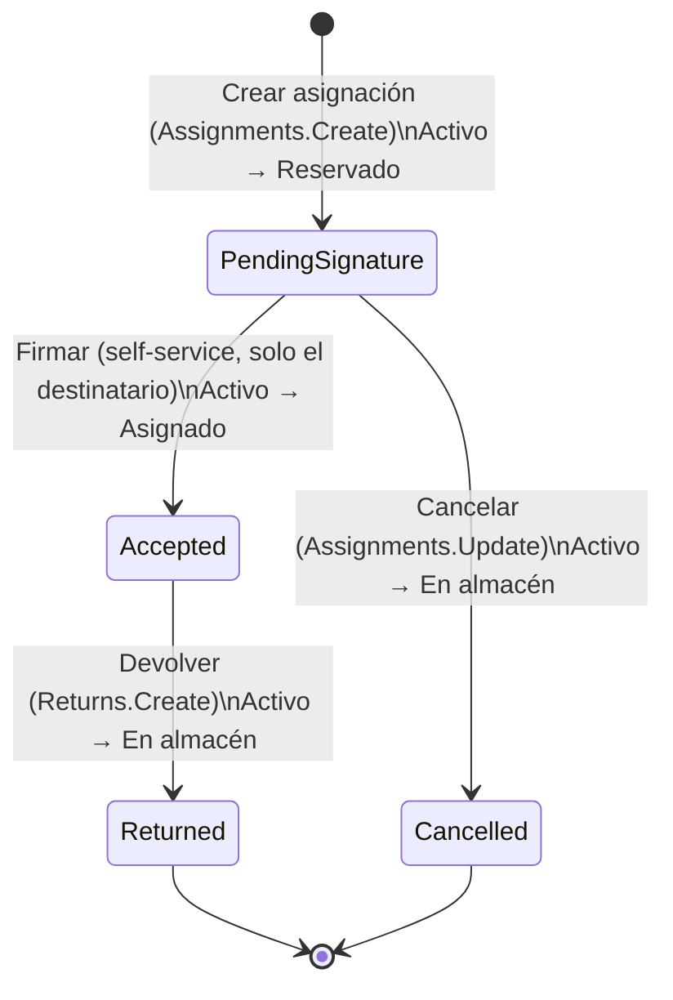
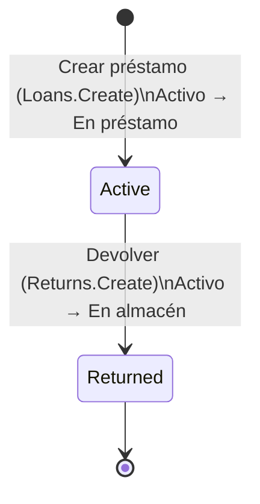
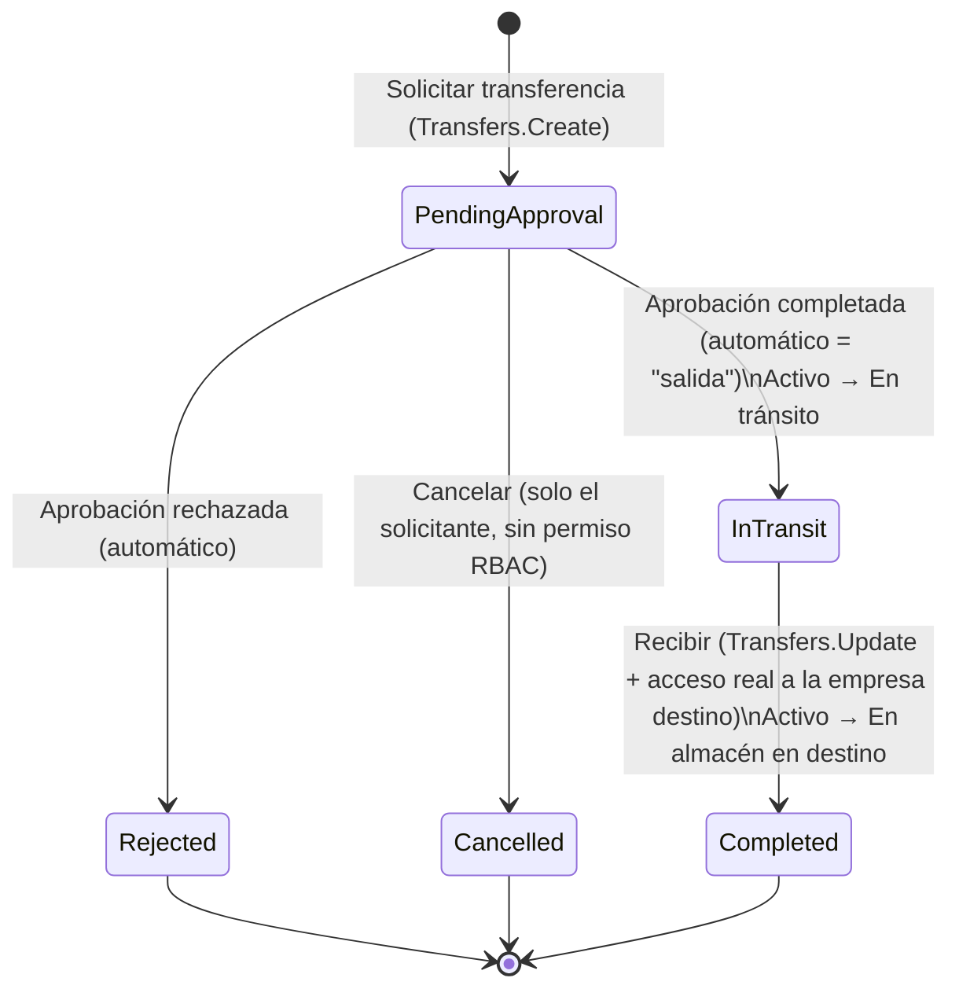

## 6.2 Inventario y movimientos

### Introducción al módulo

El módulo de Inventario y movimientos agrupa las operaciones que cambian la **custodia** de un
activo (quién lo tiene físicamente) y, en algunos casos, su **empresa** dentro del tenant. Son
cuatro submódulos que trabajan juntos:

| Submódulo | Qué resuelve | Duración | Firma | Efecto sobre el estado del activo |
|---|---|---|---|---|
| **Asignación** (`Assignment`) | Custodia formal de largo plazo (por ejemplo, entregar un equipo a un colaborador) | Larga, hasta que se devuelve | Sí — el destinatario firma para aceptar | Al crear: **Reservado**. Al firmar: **Asignado**. Al devolver: **En almacén** |
| **Préstamo** (`Loan`) | Préstamo informal de corto plazo, con una fecha esperada de devolución | Corta, con fecha de referencia | No | Al crear: **En préstamo**. Al devolver: **En almacén** |
| **Transferencia** (`Transfer`) | Reasignar un activo a otra empresa del mismo tenant, con aprobación y firma de recepción | Variable (depende de la aprobación) | Sí, al recibir | Al aprobarse: **En tránsito**. Al recibirse: **En almacén** en la empresa destino |
| **Movimientos** (`Movement`) | Bitácora consolidada y de solo lectura de todo lo anterior, más las reubicaciones internas | — | — | No cambia el estado; una reubicación solo actualiza la unidad organizacional |

Cada vez que se crea, firma, devuelve, aprueba, recibe o cancela una Asignación, un Préstamo o una
Transferencia, el sistema genera automáticamente un **Movimiento**. El Movimiento es la bitácora
del sistema: se crea solo, nunca se edita y nunca se borra manualmente — no existe en el sistema
ningún botón ni pantalla para modificar o eliminar un movimiento ya registrado. Esto es intencional:
el historial de custodia de un activo debe poder auditarse sin que nadie, ni siquiera un
administrador, pueda alterarlo después.

El backend reconoce siete tipos de movimiento: **Assignment** (asignación creada), **AssignmentReturn**
(asignación devuelta), **Loan** (préstamo creado), **LoanReturn** (préstamo devuelto), **Relocation**
(reubicación interna de unidad organizacional), **CrossCompanyTransferOut** (salida por transferencia)
y **CrossCompanyTransferIn** (entrada por transferencia). La reubicación interna (cambiar la unidad
organizacional de un activo dentro de la misma empresa) se gestiona desde la ficha del activo — ver
el capítulo de Administración de activos, "Reubicar activo" — y **no** es una Transferencia: no
requiere aprobación y no cambia el estado (`AssetStatus`) del activo, solo su unidad organizacional.

Un matiz importante sobre la Asignación: a diferencia del Préstamo, que se completa en un solo paso,
la Asignación es deliberadamente un proceso de **dos pasos** — se crea (queda pendiente de firma) y
luego se firma (queda aceptada) — para dejar constancia de que el destinatario efectivamente recibió
el activo. Esta es una simplificación de la primera versión del sistema: no hay conceptos más
avanzados (por ejemplo, aceptación parcial o firma delegada).

#### Permisos relevantes en este capítulo

| Permiso | Se usa para |
|---|---|
| `Movements.Read` | Consultar la bitácora de movimientos |
| `Assignments.Read` | Ver el listado y el detalle de asignaciones |
| `Assignments.Create` | Crear una asignación |
| `Assignments.Update` | Cancelar una asignación pendiente de firma |
| `Loans.Read` | Ver el listado y el detalle de préstamos |
| `Loans.Create` | Crear un préstamo |
| `Loans.Update` | Existe en el catálogo de permisos, pero actualmente **ningún** botón ni acción del sistema lo utiliza. Otorgarlo no habilita ninguna función adicional hoy. |
| `Transfers.Read` | Ver el listado y el detalle de transferencias |
| `Transfers.Create` | Solicitar una transferencia |
| `Transfers.Update` | Recibir una transferencia (junto con la validación de empresa, ver 6.8) |
| `Returns.Create` | Registrar la devolución de una asignación o de un préstamo |

La firma de aceptación de una asignación (`/my-assignments`) y la cancelación de una transferencia
por parte de quien la solicitó **no** requieren ningún permiso RBAC: están protegidas por identidad
(solo el propio destinatario puede firmar su asignación; solo quien solicitó la transferencia puede
cancelarla), no por el catálogo de permisos.

#### Diagramas de estado

**Asignación (`AssignmentStatus`)**

**Préstamo (`LoanStatus`)**

El préstamo no tiene estado de cancelación: una vez creado, su único destino posible es "Devuelto".

**Transferencia (`TransferStatus`)**

No existe un estado intermedio de "aprobado pero todavía no salió del almacén de origen": en cuanto
el flujo de aprobación se completa, el sistema mueve automáticamente la transferencia a "En tránsito"
en la misma operación. No hay un botón separado de "salida".

---

### Consultar la bitácora de movimientos

#### Objetivo
Revisar, de forma consolidada y de solo lectura, todos los movimientos de custodia y ubicación que
ha tenido el inventario de la empresa activa: asignaciones, devoluciones, préstamos, reubicaciones y
transferencias entre empresas.

#### Cuándo utilizarlo
- Para auditar el historial de un activo específico sin tener que revisar cada submódulo por
  separado.
- Para verificar que una operación (asignación, préstamo, transferencia) efectivamente generó su
  movimiento correspondiente.
- Como fuente de verdad ante una discrepancia de custodia, ya que los movimientos no pueden editarse
  ni borrarse una vez creados.

#### Paso a paso detallado
1. En el menú lateral, seleccione **Movimientos**.
2. El sistema muestra el listado de movimientos de la empresa actualmente seleccionada en el
   selector de empresas (`CompanySwitcher`) de la parte superior. El filtro de empresa no aparece
   como campo explícito en el formulario: se aplica automáticamente según la empresa activa.
3. Opcionalmente, use el filtro **Tipo** para acotar el listado a un tipo de movimiento concreto.
4. Revise la tabla de resultados, que se pagina de 30 en 30 registros.
5. Haga clic sobre el folio del activo en la columna **Activo** para ir directamente a su ficha.

#### Campos (tabla de filtros)

| Campo | Tipo | Obligatorio | Notas |
|---|---|---|---|
| Tipo | Lista desplegable | No | Opciones: "Todos" + 5 tipos de movimiento (ver "Casos especiales" — faltan 2 de los 7 tipos que existen en el backend) |
| Empresa | Oculto | — | Se toma automáticamente de la empresa activa en el selector superior, no es un campo del formulario |

#### Columnas del listado

| Columna | Descripción |
|---|---|
| Folio | Folio del movimiento |
| Activo | Enlace a la ficha del activo involucrado |
| Tipo | Tipo de movimiento (Asignación, Devolución de asignación, Préstamo, Devolución de préstamo, Reubicación, Salida por transferencia, Entrada por transferencia) |
| Fecha | Fecha en que se registró el movimiento |
| Notas | Notas asociadas, si existen |

#### Botones y acciones
Esta pantalla es exclusivamente de consulta: no incluye botones de creación, edición ni eliminación.
No existen endpoints `POST`, `PUT` ni `DELETE` para movimientos — únicamente `GET`.

#### Reglas de negocio
- Requiere el permiso `Movements.Read`.
- Un movimiento nace en estado "Completado" para Préstamo, Devolución de préstamo, Reubicación y
  ambos movimientos de transferencia (un solo paso). Únicamente el movimiento de **Asignación** nace
  en estado "Pendiente", porque depende de que el destinatario firme.
- No hay forma de editar ni borrar un movimiento desde ninguna pantalla del sistema: la
  inmutabilidad está implementada a nivel de código, no es solo una convención documental.

#### Mensajes del sistema
- Listado vacío: **"No hay movimientos con estos filtros."**
- Sin permiso: **"No tienes permiso para consultar movimientos (Movements.Read)."**

#### Casos especiales
- **Tipos de movimiento faltantes en el filtro**: el filtro **Tipo** solo ofrece 5 de los 7 tipos de
  movimiento que existen realmente. Faltan "Salida por transferencia" y "Entrada por transferencia".
  Esto tiene dos consecuencias prácticas: (1) no es posible filtrar el listado para ver únicamente
  los movimientos de transferencias, y (2) cuando esos movimientos sí aparecen en la tabla general
  (por ejemplo, al no aplicar filtro de tipo), la columna **Tipo** se muestra **vacía** para esas
  filas en lugar de indicar de qué tipo de movimiento se trata. Si necesita rastrear una
  transferencia específica, use el módulo de Transferencias (ver 6.7–6.9) en lugar de este filtro.

#### Resultado esperado
Una vista consolidada, ordenada por fecha, de todos los eventos de custodia y ubicación del
inventario de la empresa activa, con trazabilidad hacia el activo de origen.

#### Buenas prácticas
- Use esta pantalla como primer punto de consulta ante cualquier duda sobre "quién tuvo este activo
  y cuándo", antes de revisar cada submódulo por separado.
- Si necesita el detalle completo de una transferencia (empresas de origen/destino, firma de
  recepción), acceda directamente a `/transfers` en lugar de buscarla aquí, dado el bug de filtro
  descrito arriba.

---

### Crear una asignación

#### Objetivo
Formalizar la entrega de un activo a un colaborador de forma prolongada, dejando constancia mediante
una firma de aceptación por parte del destinatario.

#### Cuándo utilizarlo
- Al entregar un equipo (laptop, celular, monitor, etc.) a un colaborador que lo usará de forma
  continua, no solo por unos días.
- Cuando se requiere evidencia de que el destinatario aceptó formalmente la custodia del activo.

#### Paso a paso detallado
1. En el menú lateral, seleccione **Asignaciones**. Se muestra el listado de asignaciones de la
   empresa activa.
2. Haga clic en el botón **"Nueva asignación"**.
3. Seleccione el **Activo** a asignar. Solo se listan activos en estado **En almacén**
   (`InWarehouse`); un activo ya reservado, asignado, en préstamo o en tránsito no aparece como
   opción.
4. Seleccione el **Destinatario** de la lista de usuarios. El selector muestra todos los usuarios
   del sistema, sin filtrar por su membresía a la empresa del activo — esa validación ocurre en el
   servidor al enviar el formulario, no antes.
5. Opcionalmente, indique la **Unidad organizacional** donde quedará físicamente el activo. Si no se
   especifica, el sistema usa "Sin asignar" por defecto.
6. Opcionalmente, agregue **Notas** (máximo 500 caracteres).
7. Haga clic en **"Guardar"** (o el botón equivalente de confirmación del formulario).
8. Si el destinatario no tiene acceso a la empresa del activo, el sistema rechaza la operación (ver
   "Mensajes del sistema").
9. Si la operación es exitosa, el sistema crea la asignación en estado **Pendiente de firma**, mueve
   el activo a estado **Reservado** y genera el movimiento correspondiente con su folio.

#### Campos

| Campo | Tipo | Obligatorio | Validación / notas |
|---|---|---|---|
| Activo | Selector | Sí | Solo activos en estado En almacén |
| Destinatario | Selector de usuarios | Sí | No filtrado visualmente por empresa; se valida en el servidor |
| Unidad organizacional | Selector | No | Por defecto "Sin asignar" |
| Notas | Texto libre | No | Máximo 500 caracteres |

#### Botones y acciones

| Botón | Ubicación | Efecto |
|---|---|---|
| "Nueva asignación" | Listado `/assignments` | Abre el formulario de creación |
| Botón de guardar del formulario | `/assignments/new` | Envía `POST /api/v1/assignments`; requiere `Assignments.Create` |
| "Cancelar asignación" | Detalle `/assignments/[id]`, solo visible si el estado es Pendiente de firma | Envía `POST /api/v1/assignments/{id}/cancel`; requiere `Assignments.Update`; devuelve el activo a En almacén |

#### Reglas de negocio
- Crear una asignación exige el permiso `Assignments.Create`.
- El activo debe estar en estado **En almacén**; cualquier otro estado de origen resulta en un error
  de transición inválida.
- El destinatario debe tener acceso (membresía) a la empresa del activo; esta validación ocurre en
  el servidor, no en el selector del formulario.
- Al crearse, el activo pasa a **Reservado** — todavía no está formalmente entregado, eso ocurre al
  firmar (ver 6.3).
- No es posible crear una segunda asignación sobre un activo que ya está Reservado o Asignado: el
  sistema lo bloquea automáticamente porque esos estados no permiten una nueva transición a
  Reservado. El bloqueo lo produce la máquina de estados del activo, no una validación explícita y
  personalizada del formulario — el mensaje que verá es el genérico de transición inválida.
- Esta operación queda registrada en el módulo de Auditoría (comando auditable).

#### Mensajes del sistema
- Validación de formulario incompleto: **"Selecciona el activo y el destinatario."**
- Destinatario sin acceso a la empresa del activo (409): **"El destinatario no tiene acceso a la
  empresa de este activo."**
- Transición de estado inválida (422), por ejemplo intentar asignar un activo que no está en
  almacén o que ya tiene una asignación en curso: **"No es válido transicionar un activo de
  '{estado origen}' a '{estado destino}'."**
- Sin permiso para consultar el listado (403): **"No tienes permiso para consultar asignaciones
  (Assignments.Read)."**
- Listado vacío: **"No hay asignaciones todavía."**

#### Casos especiales
- **Reubicación posterior del activo asignado**: una vez que el activo queda Reservado o Asignado,
  sigue siendo posible reubicarlo a otra unidad organizacional desde la ficha del activo (la
  reubicación no valida el estado del activo). Sin embargo, la unidad organizacional registrada en
  la asignación **no se actualiza automáticamente** cuando esto ocurre. En la práctica, esto significa
  que la asignación puede quedar mostrando una unidad organizacional distinta de la unidad real y
  actual del activo si alguien lo reubica después de asignarlo — conviene revisar la ficha del activo,
  no solo la asignación, si necesita conocer su ubicación actual.
- **Selector de destinatario sin filtrar**: como el selector de destinatarios no excluye a los
  usuarios sin acceso a la empresa del activo, es posible completar y enviar el formulario con un
  destinatario incorrecto; el sistema lo rechazará recién al guardar, con el mensaje 409 indicado
  arriba. Verifique la pertenencia del destinatario a la empresa correspondiente antes de guardar,
  para evitar reintentos.

#### Resultado esperado
Una nueva asignación en estado **Pendiente de firma**, el activo en estado **Reservado**, y un
movimiento de tipo Asignación registrado en la bitácora.

#### Buenas prácticas
- Confirme el estado **En almacén** del activo y la pertenencia empresarial del destinatario antes
  de completar el formulario, para evitar rechazos innecesarios del servidor.
- Use el campo Notas para dejar constancia de contexto relevante (por ejemplo, número de acta interna
  o motivo de la entrega), ya que no hay otro campo libre en el formulario.
- Comunique al destinatario que debe ingresar a **"Mis asignaciones"** (ver 6.3) para firmar y
  completar la entrega; mientras no firme, el activo permanece en Reservado y no en Asignado.

---

### Ver y firmar mis asignaciones pendientes (autoservicio)

#### Objetivo
Permitir que cualquier usuario del sistema revise, sin necesidad de permisos especiales, las
asignaciones que tiene a su nombre y confirme (firme) la recepción de las que estén pendientes.

#### Cuándo utilizarlo
- Cuando usted es el destinatario de una asignación y necesita confirmar formalmente que recibió el
  activo.
- Para revisar el estado de todos los activos que tiene asignados, sin depender de que otra persona
  le informe.

#### Paso a paso detallado
1. En el menú lateral, seleccione **"Mis asignaciones"** (ruta `/my-assignments`).
2. El sistema muestra todas las asignaciones asociadas a su usuario, sin importar la empresa activa
   seleccionada.
3. Para cada asignación en estado **Pendiente de firma**, se muestra un formulario embebido con el
   campo **"Escribe tu nombre completo para confirmar"**.
4. Complete su nombre completo y haga clic en **"Confirmar recepción"**.
5. El sistema registra la firma, cambia la asignación a **Aceptada** y el activo a **Asignado**.

#### Campos

| Campo | Tipo | Obligatorio | Notas |
|---|---|---|---|
| Nombre completo (firma) | Texto libre | Sí | Se usa como confirmación de identidad del destinatario; no hay firma dibujada aquí, solo texto |

#### Botones y acciones

| Botón | Efecto |
|---|---|
| "Confirmar recepción" | Envía `POST /api/v1/assignments/{id}/sign`; no requiere permiso RBAC, es autoservicio; solo funciona si usted es el destinatario registrado |

#### Reglas de negocio
- Firmar una asignación es una acción de autoservicio: no depende de ningún permiso del catálogo
  RBAC, solo de que el usuario autenticado sea efectivamente el destinatario de esa asignación.
- Solo se puede firmar una asignación que esté en estado **Pendiente de firma**.
- Al firmar, el activo pasa de Reservado a **Asignado**.
- Esta operación de autoservicio **no queda registrada como evento auditable** en el módulo de
  Auditoría (a diferencia de la creación de la asignación, que sí lo es).

#### Mensajes del sistema
- Éxito: **"Recepción confirmada."**
- Listado vacío: **"No tienes activos asignados."**
- Error al consultar el listado (tanto por falta de acceso como por error genérico): **"No fue
  posible consultar tus asignaciones."** — a diferencia de otras pantallas del sistema, aquí el
  mensaje de error de permisos y el de error genérico son idénticos; no hay forma de distinguir, solo
  desde el mensaje en pantalla, si el problema fue de permisos o un error técnico.
- Si intenta firmar una asignación que no está Pendiente de firma (422): **"Solo una asignación
  pendiente de firma puede aceptarse/cancelarse."**
- Si por alguna razón intenta firmar una asignación que no es suya (403): **"Solo el destinatario de
  la asignación puede firmarla."**

#### Casos especiales
- **Firma sin revalidar el estado físico real del activo**: firmar una asignación solo verifica que
  la asignación esté Pendiente de firma; no vuelve a comprobar en qué estado se encuentra el activo
  en ese momento. Esto importa en un escenario específico: si, por una vía distinta a los formularios
  estándar, el mismo activo llegó a prestarse (Préstamo) estando todavía en estado Reservado, la
  firma de la asignación pendiente se completará igualmente y el activo quedará marcado como
  **Asignado** en el sistema aunque físicamente esté en poder de otra persona por un préstamo. Este
  escenario no es alcanzable siguiendo el flujo normal de las pantallas de creación de préstamos (que
  solo ofrecen activos En almacén), pero si detecta una inconsistencia de este tipo entre el estado
  registrado y la ubicación física real, repórtelo y verifique el historial completo en
  **Movimientos** (6.1) antes de confiar en el estado mostrado.

#### Resultado esperado
La asignación pasa a **Aceptada**, el activo queda en estado **Asignado** y el usuario cuenta con
constancia de haber confirmado la recepción.

#### Buenas prácticas
- Firme la asignación tan pronto reciba físicamente el activo; mientras no lo haga, el sistema lo
  sigue mostrando como Reservado y no como formalmente entregado.
- Revise esta pantalla periódicamente si maneja varios activos asignados, ya que es la única vista
  centrada en "lo que tengo yo", independiente de la empresa activa seleccionada.

---

### Devolver una asignación

#### Objetivo
Registrar la devolución de un activo previamente asignado y aceptado, liberándolo de vuelta a
inventario disponible.

#### Cuándo utilizarlo
- Cuando un colaborador deja de necesitar el activo (cambio de puesto, baja, fin de proyecto, etc.)
  y lo devuelve físicamente.

#### Paso a paso detallado
1. Acceda al detalle de la asignación desde el listado **Asignaciones** (`/assignments`), haciendo
   clic sobre el folio correspondiente.
2. En la ficha de detalle, ubique el formulario de devolución. Solo está visible si la asignación se
   encuentra en estado **Aceptada**.
3. Complete el campo **"Tu nombre completo"** — corresponde a quien recibe físicamente el activo de
   vuelta (típicamente personal de TI o de almacén), **no** a quien lo entrega.
4. Opcionalmente, agregue **Notas**.
5. Haga clic en **"Registrar devolución"**.
6. El sistema cambia la asignación a **Devuelta** y el activo a **En almacén**.

[Captura pendiente: detalle de asignación/préstamo/transferencia]

#### Campos

| Campo | Tipo | Obligatorio | Validación |
|---|---|---|---|
| Tu nombre completo | Texto libre | Sí | Máximo 200 caracteres |
| Notas | Texto libre | No | Máximo 500 caracteres |

#### Botones y acciones

| Botón | Ubicación | Efecto |
|---|---|---|
| "Registrar devolución" | `/assignments/[id]`, visible solo si estado = Aceptada | Envía `POST /api/v1/assignments/{id}/return`; requiere permiso `Returns.Create` |
| "Cancelar asignación" | Mismo detalle, visible solo si estado = Pendiente de firma | Ver 6.2; no aplica una vez Aceptada |

#### Reglas de negocio
- Solo se puede devolver una asignación en estado **Aceptada**. Una asignación Pendiente de firma se
  **cancela** (6.2), no se devuelve; una ya Devuelta o Cancelada no admite ninguna acción adicional.
- Requiere el permiso `Returns.Create` — no `Assignments.Update` ni ningún permiso "de asignaciones".
  En la práctica, quien registra la devolución suele ser personal de TI/almacén con ese permiso, no
  necesariamente el propio destinatario.
- La firma de devolución es de quien **recibe** el activo de vuelta, no de quien lo entrega. Esto es
  una simplificación deliberada de esta primera versión del sistema: no busque un campo para que el
  colaborador que devuelve firme su propia entrega, no existe.
- Al completarse, el activo pasa a **En almacén**.
- Esta operación **no queda registrada** como evento auditable en el módulo de Auditoría.

#### Mensajes del sistema
- Transición inválida (422), por ejemplo si la asignación no está Aceptada: **"Solo una asignación
  aceptada puede devolverse."**

#### Casos especiales
- Si necesita corregir una devolución ya registrada, recuerde que las asignaciones (como todos los
  movimientos de este módulo) son inmutables: no existe edición ni reversión. Cualquier corrección
  requiere un nuevo movimiento (por ejemplo, una nueva asignación) documentado en las notas.

#### Resultado esperado
La asignación queda en estado **Devuelta**, el activo vuelve a estar **En almacén** y disponible
para una nueva asignación, préstamo o transferencia.

#### Buenas prácticas
- Registre la devolución el mismo día en que el activo se recibe físicamente, para que el estado del
  inventario refleje la realidad lo antes posible.
- Use las notas para registrar el estado físico del activo al momento de la devolución (por ejemplo,
  daños o accesorios faltantes), ya que no hay un campo dedicado para condición del equipo en este
  formulario.

---

### Crear un préstamo

#### Objetivo
Registrar la entrega temporal e informal de un activo, sin necesidad de firma, indicando una fecha
esperada de devolución.

#### Cuándo utilizarlo
- Para préstamos de corto plazo (por ejemplo, un proyector para una reunión, un equipo de respaldo
  mientras se repara el habitual).
- Cuando no se requiere el nivel de formalidad de una asignación (sin firma de aceptación).

#### Paso a paso detallado
1. En el menú lateral, seleccione **Préstamos**. Se muestra el listado de préstamos de la empresa
   activa.
2. Haga clic en **"Nuevo préstamo"**.
3. Seleccione el **Activo** — solo se listan activos en estado **En almacén**.
4. Seleccione el **Destinatario**.
5. Indique la **Fecha esperada de devolución** (obligatoria). El campo no permite, desde el propio
   selector del navegador, elegir una fecha anterior a hoy; el dominio también valida esta regla del
   lado del servidor.
6. Opcionalmente, agregue **Notas** (máximo 500 caracteres).
7. Confirme el formulario. El préstamo se crea directamente en estado **Activo** (a diferencia de la
   asignación, no requiere un paso de firma) y el activo pasa a **En préstamo**.

#### Campos

| Campo | Tipo | Obligatorio | Validación / notas |
|---|---|---|---|
| Activo | Selector | Sí | Solo activos en estado En almacén |
| Destinatario | Selector de usuarios | Sí | Validación de acceso a la empresa en el servidor |
| Fecha esperada de devolución | Fecha | Sí | Mínimo: hoy (restricción en el propio campo y validación de dominio) |
| Notas | Texto libre | No | Máximo 500 caracteres |

#### Botones y acciones

| Botón | Ubicación | Efecto |
|---|---|---|
| "Nuevo préstamo" | Listado `/loans` | Abre el formulario de creación |
| Botón de guardar del formulario | `/loans/new` | Envía `POST /api/v1/loans`; requiere `Loans.Create` |

#### Reglas de negocio
- Requiere el permiso `Loans.Create`.
- El destinatario debe tener acceso a la empresa del activo; de lo contrario el servidor rechaza la
  operación con un error 409.
- La fecha esperada de devolución no puede ser anterior a hoy.
- A diferencia de la asignación, el préstamo **no tiene firma ni paso de aceptación**: se completa en
  un solo paso y el movimiento generado nace directamente en estado Completado.
- Esta operación queda registrada en el módulo de Auditoría (comando auditable).

#### Mensajes del sistema
- Fecha en el pasado (422): **"La fecha esperada de devolución no puede ser en el pasado."**
- Destinatario sin acceso a la empresa del activo (409): (mismo tipo de mensaje que en asignaciones)
  **"El destinatario no tiene acceso a la empresa de este activo."**
- Transición de estado inválida (422): **"No es válido transicionar un activo de '{estado origen}'
  a '{estado destino}'."**
- Sin permiso para consultar el listado (403): **"No tienes permiso para consultar préstamos
  (Loans.Read)."**
- Listado vacío: **"No hay préstamos todavía."**

#### Casos especiales
- **La fecha esperada de devolución es solo informativa**: el sistema no vence préstamos
  automáticamente, no marca un préstamo como "atrasado" y no existe ninguna tarea programada que
  cambie su estado al pasar la fecha. Si documentación de otras áreas del sistema menciona que un
  vencimiento genera una notificación, tenga presente que, en el alcance de este módulo, esa
  notificación automática **no está implementada**: el seguimiento de préstamos vencidos es manual.
  Planifique recordatorios propios (calendario, reportes periódicos) si necesita controlar plazos de
  devolución.
- **Activos que técnicamente no están En almacén**: la pantalla de creación de préstamos solo ofrece
  activos En almacén, por lo que en el uso normal del sistema no debería poder prestar un activo que
  esté Reservado, Asignado o en otro estado. Si en algún reporte llegara a encontrar un préstamo sobre
  un activo que no estaba En almacén al momento de crearse, tenga en cuenta que esto puede dejar
  inconsistencias con una asignación pendiente sobre el mismo activo (ver el caso especial descrito
  en 6.3): repórtelo para su revisión.

#### Resultado esperado
Un nuevo préstamo en estado **Activo**, el activo en estado **En préstamo**, y un movimiento de tipo
Préstamo registrado en la bitácora.

#### Buenas prácticas
- Establezca siempre una fecha de devolución realista, ya que el sistema no la corrige ni la
  actualiza automáticamente después de creada.
- Dado que no hay firma ni notificación de vencimiento, dé seguimiento manual a los préstamos activos
  desde el listado `/loans`, especialmente los de mayor duración esperada.

---

### Devolver un préstamo

#### Objetivo
Registrar la devolución de un activo prestado y liberarlo de vuelta a inventario disponible.

#### Cuándo utilizarlo
- Cuando el colaborador devuelve físicamente el activo prestado, antes o después de la fecha
  esperada de devolución.

#### Paso a paso detallado
1. Acceda al detalle del préstamo desde el listado **Préstamos** (`/loans`), haciendo clic sobre el
   folio correspondiente.
2. Si el préstamo está en estado **Activo**, se muestra el formulario de devolución.
3. Complete, opcionalmente, el campo **Notas**. A diferencia de la devolución de una asignación, este
   formulario **no** solicita nombre ni firma de ningún tipo — es consistente con el diseño "sin
   firma" del préstamo desde su creación.
4. Haga clic en **"Registrar devolución"**.
5. El sistema cambia el préstamo a **Devuelto** y el activo a **En almacén**.

[Captura pendiente: detalle de asignación/préstamo/transferencia]

#### Campos

| Campo | Tipo | Obligatorio | Notas |
|---|---|---|---|
| Notas | Texto libre | No | Máximo 500 caracteres; es el único campo del formulario |

#### Botones y acciones

| Botón | Ubicación | Efecto |
|---|---|---|
| "Registrar devolución" | `/loans/[id]`, visible solo si estado = Activo | Envía `POST /api/v1/loans/{id}/return`; requiere permiso `Returns.Create` |

#### Reglas de negocio
- Solo se puede devolver un préstamo en estado **Activo**.
- Requiere el permiso `Returns.Create` (el mismo permiso que se usa para devolver asignaciones).
- No hay firma ni campo de nombre — el registro de la devolución no exige identificar a quien la
  recibe, a diferencia de la devolución de una asignación.
- El permiso `Loans.Update`, aunque existe en el catálogo de roles, no es utilizado por esta ni por
  ninguna otra acción del sistema sobre préstamos; no lo confunda con el permiso real que sí se
  necesita (`Returns.Create`).
- Esta operación **no queda registrada** como evento auditable en el módulo de Auditoría.

#### Mensajes del sistema
- Transición inválida (422), si el préstamo no está Activo: **"Solo un préstamo activo puede
  devolverse."**

#### Casos especiales
- **Préstamos vencidos sin alerta**: como se indicó en 6.5, el sistema no marca automáticamente un
  préstamo como atrasado ni envía notificaciones al vencerse la fecha esperada de devolución. Registre
  la devolución tan pronto ocurra, sin esperar ningún aviso del sistema que le indique que el plazo
  se cumplió.

#### Resultado esperado
El préstamo queda en estado **Devuelto**, el activo vuelve a **En almacén** y disponible para una
nueva operación.

#### Buenas prácticas
- Aproveche el campo Notas para registrar el estado físico del activo devuelto o cualquier
  observación relevante (retraso, daños), ya que es el único campo disponible en este formulario.

---

### Solicitar una transferencia entre empresas

#### Objetivo
Iniciar el traslado formal de un activo desde la empresa actual hacia otra empresa del mismo
tenant, sujeto a aprobación y a una firma de recepción posterior.

#### Cuándo utilizarlo
- Cuando un activo debe pasar a formar parte del inventario de otra empresa del grupo (por ejemplo,
  una reorganización, un préstamo prolongado entre unidades de negocio, o una reasignación
  administrativa entre empresas del mismo tenant).

#### Paso a paso detallado
1. En el menú lateral, seleccione **Transferencias**. Se muestra el listado de transferencias donde
   la empresa activa participa como origen o como destino.
2. Haga clic en **"Nueva transferencia"**.
3. Seleccione el **Activo** a transferir. Solo se listan activos en estado **En almacén**; si no hay
   ninguno disponible, el sistema muestra la ayuda **"No hay activos en almacén disponibles para
   transferir."**
4. Seleccione la **Empresa destino**. El selector lista **todas las empresas activas del tenant
   excepto la actual** — no se restringe a empresas donde usted, como solicitante, tenga membresía.
5. Opcionalmente, redacte una **Justificación** (máximo 1000 caracteres).
6. Haga clic en **"Solicitar transferencia"**.
7. Si la operación es exitosa, el sistema crea la transferencia en estado **Pendiente de aprobación**
   y lo redirige a la pantalla de detalle de la transferencia recién creada.
8. La transferencia queda a la espera de que el flujo de aprobación configurado para transferencias
   entre empresas (`asset.cross-company-transfer`) sea resuelto por la persona o rol correspondiente
   (ver el capítulo de Aprobaciones).

#### Campos

| Campo | Tipo | Obligatorio | Validación / notas |
|---|---|---|---|
| Activo | Selector | Sí | Solo activos en estado En almacén |
| Empresa destino | Selector | Sí | Todas las empresas activas del tenant, salvo la actual; **no filtrado por membresía del solicitante** |
| Justificación | Texto libre | No | Máximo 1000 caracteres |

#### Botones y acciones

| Botón | Ubicación | Efecto |
|---|---|---|
| "Nueva transferencia" | Listado `/transfers` | Abre el formulario de solicitud |
| "Solicitar transferencia" | `/transfers/new` | Envía `POST /api/v1/transfers`; requiere `Transfers.Create` |

#### Reglas de negocio
- Requiere el permiso `Transfers.Create` y acceso a la empresa de origen del activo.
- El activo debe estar en estado **En almacén**.
- La empresa destino debe ser distinta de la empresa de origen.
- Al aprobarse la solicitud, el sistema mueve automáticamente la transferencia a **En tránsito** —
  no hay un paso manual de "salida" separado de la aprobación.
- Si la solicitud es rechazada en el flujo de aprobación, el activo nunca salió del almacén de
  origen: no queda nada pendiente de revertir, simplemente la transferencia pasa a **Rechazada**.
- Esta operación queda registrada en el módulo de Auditoría (comando auditable).

#### Mensajes del sistema
- Validación de formulario incompleto: **"Selecciona el activo y la empresa destino."**
- Activo no disponible para transferir (409): **"Solo un activo en almacén puede transferirse entre
  empresas."**
- Empresa destino igual a la de origen (422/409, según validación): **"La empresa destino debe ser
  distinta de la empresa de origen."**
- Sin acceso a la empresa de origen del activo (403): **"El usuario no tiene acceso a la empresa de
  este activo."**
- Sin permiso para consultar el listado (403): **"No tienes permiso para consultar transferencias
  (Transfers.Read)."**
- Listado vacío: **"No hay transferencias todavía."**

#### Casos especiales
- **La empresa destino no se valida contra la membresía del solicitante**: al solicitar una
  transferencia, el sistema le permite elegir **cualquier** empresa activa del tenant como destino,
  sin comprobar que usted (o alguien más) tenga realmente acceso o relación con esa empresa. Esto
  significa que una solicitud de transferencia hacia una empresa "equivocada" o hacia la que nadie de
  su equipo tiene acceso **se puede crear sin ningún error**. La validación real ocurre recién en el
  momento de **recibir** la transferencia (ver 6.8): solo alguien con permiso y membresía efectiva en
  la empresa destino puede completarla. En la práctica, esto quiere decir que solicitar una
  transferencia no garantiza que llegue a buen puerto — verifique, antes de solicitarla, que la
  empresa destino elegida es correcta y que alguien allí podrá recibirla.
- La pantalla de listado de transferencias (`/transfers`) muestra una transferencia si la empresa
  activa es **origen o destino** — es la única consulta del sistema que filtra por dos empresas a la
  vez en lugar de una sola.

#### Resultado esperado
Una nueva transferencia en estado **Pendiente de aprobación**, visible tanto para la empresa de
origen como, una vez completada, para la empresa destino, a la espera de resolución del flujo de
aprobación configurado.

#### Buenas prácticas
- Confirme la empresa destino correcta antes de enviar la solicitud: el sistema no le avisará si se
  equivocó de empresa, y el error solo se hará evidente cuando alguien intente (o no pueda) recibirla.
- Use la Justificación para dejar constancia del motivo de negocio de la transferencia; es el único
  campo libre disponible y resulta útil durante la aprobación.

---

### Recibir una transferencia (firma de recepción)

#### Objetivo
Confirmar, mediante una firma, que el activo transferido fue recibido físicamente por la empresa
destino, completando el cambio de empresa del activo.

#### Cuándo utilizarlo
- Cuando una transferencia ya fue aprobada (estado **En tránsito**) y el activo llegó físicamente a
  la empresa destino.

#### Paso a paso detallado
1. Acceda al detalle de la transferencia desde el listado **Transferencias** (`/transfers`), haciendo
   clic sobre el folio.
2. Si la transferencia está en estado **En tránsito**, se muestra el formulario de recepción.
3. Elija el mecanismo de firma disponible: **confirmación tipada** (escribir un texto de
   confirmación) o **firma dibujada**, según lo que la pantalla ofrezca en ese momento.
4. Complete la firma según el mecanismo elegido.
5. Haga clic en **"Confirmar recepción"**.
6. El sistema valida que usted tenga acceso real a la empresa destino y el permiso correspondiente
   (ver "Reglas de negocio"), y de ser así completa la transferencia.

[Captura pendiente: detalle de asignación/préstamo/transferencia]

#### Campos

| Campo | Tipo | Obligatorio | Notas |
|---|---|---|---|
| Firma (confirmación tipada o firma dibujada) | Según mecanismo | Sí | El mecanismo disponible depende de la configuración del sistema para firmas |

#### Botones y acciones

| Botón | Ubicación | Efecto |
|---|---|---|
| "Confirmar recepción" | `/transfers/[id]`, visible solo si estado = En tránsito | Envía `POST /api/v1/transfers/{id}/receive`; requiere `Transfers.Update` **y** acceso real a la empresa destino |

#### Reglas de negocio
- Solo se puede recibir una transferencia que esté **En tránsito**.
- La recepción exige un **doble candado**: el permiso RBAC `Transfers.Update` **y**, además,
  membresía real del usuario en la empresa destino (`ToCompanyId`). Este es el único punto de todo el
  proceso de transferencia donde se verifica genuinamente que quien actúa pertenece a la empresa
  destino — recuerde que, al solicitar la transferencia (6.7), el sistema no hace esa comprobación.
- Al completarse la recepción, el sistema: regenera el folio interno del activo en la empresa
  destino, conserva el número de etiqueta física (`AssetTag`) y todo el historial del activo, borra
  su unidad organizacional anterior (queda sin asignar en la empresa destino) y fuerza el estado del
  activo a **En almacén** en la nueva empresa.
- Esta operación queda registrada en el módulo de Auditoría (comando auditable).

#### Mensajes del sistema
- Éxito: **"Transferencia recibida."**
- Transición inválida (422), si la transferencia no está En tránsito: **"Solo una transferencia en
  tránsito puede recibirse."**

#### Casos especiales
- **Protección contra recepción por la empresa equivocada**: gracias al doble candado descrito
  arriba, aunque la solicitud de una transferencia pudo haberse creado hacia una empresa incorrecta
  sin ninguna advertencia (ver 6.7), la recepción **sí** está protegida: solo un usuario con el
  permiso adecuado y membresía real en la empresa destino puede completarla. Si la transferencia se
  solicitó hacia una empresa donde nadie cumple ambas condiciones, quedará indefinidamente **En
  tránsito** hasta que alguien con acceso legítimo la reciba o el solicitante original la cancele —
  aunque, según el diagrama de estados, la cancelación solo es posible mientras la transferencia está
  Pendiente de aprobación, no una vez En tránsito (ver 6.9).

#### Resultado esperado
La transferencia queda en estado **Completada**, el activo aparece ahora en el inventario de la
empresa destino con estado **En almacén**, nuevo folio interno, mismo número de etiqueta física e
historial completo preservado.

#### Buenas prácticas
- Reciba la transferencia tan pronto el activo llegue físicamente, ya que mientras permanezca En
  tránsito no formará parte del inventario disponible de ninguna de las dos empresas para operaciones
  nuevas (asignación, préstamo, otra transferencia).
- Verifique el número de etiqueta física (`AssetTag`) del activo recibido contra el que muestra el
  sistema antes de confirmar, ya que el folio interno cambiará al completarse la recepción.

---

### Cancelar una transferencia

#### Objetivo
Anular una solicitud de transferencia que todavía no fue aprobada, por ejemplo porque se solicitó
por error o ya no es necesaria.

#### Cuándo utilizarlo
- Cuando usted mismo solicitó una transferencia y necesita revertirla antes de que sea aprobada.

#### Paso a paso detallado
1. Acceda al detalle de la transferencia desde el listado **Transferencias** (`/transfers`).
2. Si la transferencia está en estado **Pendiente de aprobación** y usted es quien la solicitó, verá
   el botón **"Cancelar solicitud"**.
3. Haga clic en el botón. El sistema cambia la transferencia a **Cancelada**.
4. Como el activo nunca salió de la empresa de origen mientras estuvo Pendiente de aprobación, no
   hay ningún estado de activo que revertir: simplemente permanece **En almacén** en la empresa de
   origen.

[Captura pendiente: detalle de asignación/préstamo/transferencia]

#### Campos
No aplica — esta acción no requiere completar ningún campo, solo confirmar con el botón.

#### Botones y acciones

| Botón | Ubicación | Efecto |
|---|---|---|
| "Cancelar solicitud" | `/transfers/[id]`, visible solo si estado = Pendiente de aprobación y el usuario es el solicitante | Envía `POST /api/v1/transfers/{id}/cancel`; **sin permiso RBAC**, protegido por identidad |

#### Reglas de negocio
- Solo el usuario que **solicitó** la transferencia puede cancelarla — no se puede cancelar la
  solicitud de otra persona, ni siquiera con un permiso administrativo, porque esta acción no está
  gobernada por el catálogo de permisos sino por la identidad del solicitante original.
- Solo se puede cancelar una transferencia que esté **Pendiente de aprobación**. Una vez que pasó a
  En tránsito (es decir, una vez aprobada), ya no es posible cancelarla desde esta pantalla.

#### Mensajes del sistema
- Si quien cancela no es el solicitante o el estado no es Pendiente de aprobación (422): **"Solo
  quien solicitó la transferencia puede cancelarla."** / **"Solo una transferencia pendiente de
  aprobación puede salir/rechazarse/cancelarse."**

#### Casos especiales
- **No hay forma de cancelar una transferencia ya En tránsito**: si se equivocó y la transferencia
  ya fue aprobada, no existe un botón de cancelación en ese estado. Las únicas salidas posibles desde
  En tránsito son que alguien la reciba (6.8) — completándola — o que quede indefinidamente en ese
  estado. Si esto ocurre por error, contacte a un administrador para evaluar alternativas fuera de
  este flujo estándar (por ejemplo, coordinando la recepción y una transferencia posterior en
  sentido inverso).

#### Resultado esperado
La transferencia queda en estado **Cancelada**, sin ningún efecto sobre el estado ni la empresa del
activo, que permanece En almacén en la empresa de origen.

#### Buenas prácticas
- Cancele la solicitud tan pronto detecte el error, idealmente antes de que el flujo de aprobación la
  resuelva, ya que una vez aprobada (En tránsito) esta pantalla deja de ofrecer la opción de
  cancelación.
