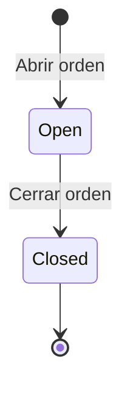

## 6.3 Mantenimiento

El módulo de Mantenimiento permite gestionar dos objetos relacionados pero independientes: los
**checklists de mantenimiento** (plantillas reutilizables de verificación) y las **órdenes de
mantenimiento** (la ejecución real de un mantenimiento sobre un activo concreto). Este capítulo
explica cómo crear y administrar checklists, y cómo abrir y cerrar órdenes de mantenimiento.

Los permisos que gobiernan este módulo son `Maintenance.Read`, `Maintenance.Create` y
`Maintenance.Update`. No existe un permiso `Maintenance.Delete`: ni los checklists ni las órdenes
de mantenimiento pueden eliminarse desde la aplicación.

### Introducción al módulo

#### La relación entre un Checklist y una Orden de mantenimiento

Un **checklist de mantenimiento** (`MaintenanceChecklistDefinition`) es una plantilla reutilizable
de ítems de verificación en texto libre (por ejemplo, "Revisar ventilador", "Verificar batería",
"Limpiar contactos"). Un checklist puede tener varias **versiones**: cada vez que se agrega una
nueva versión, la anterior queda congelada e inmutable, y la nueva pasa a ser la versión vigente.
Opcionalmente, un checklist puede asociarse a una categoría de activo, aunque esa asociación es
solo informativa: el sistema no filtra checklists por la categoría del activo en ningún formulario.

Una **orden de mantenimiento** (`MaintenanceOrder`) es la ejecución concreta de un mantenimiento
sobre un activo específico. Al abrir una orden, el usuario puede elegir opcionalmente un checklist.
Si lo hace, el sistema **copia (hace un snapshot de) la versión vigente del checklist en ese
momento** dentro de la propia orden. A partir de ahí, la orden nunca vuelve a consultar la
definición "en vivo" del checklist: aunque después se agregue una nueva versión o se desactive el
checklist original, la orden conserva exactamente los ítems que tenía copiados al momento de
abrirse.

En otras palabras: el checklist es la plantilla; la orden es la fotografía de esa plantilla tomada
en el instante en que se abrió el mantenimiento, más el resultado de marcar cada ítem durante la
ejecución.

#### Estados de una Orden de mantenimiento

Una orden de mantenimiento tiene un ciclo de vida simple y sin retorno: se abre y, en algún
momento, se cierra. No existe cancelación, reapertura ni ningún estado intermedio.

Mientras la orden está **Open** (abierta), el activo asociado queda en estado "En mantenimiento" y
no puede asignarse, transferirse ni prestarse. Al **Closed** (cerrarse), el activo pasa a "En
almacén" (si se reparó) o a "Dañado" (si no se pudo reparar), según el resultado que indique quien
cierra la orden.

Una orden de mantenimiento puede abrirse de dos maneras: manualmente (lo que se describe en la
sección 6.5) o automáticamente cuando se aprueba una solicitud interna de tipo mantenimiento (ver
capítulo 2, "Aprobaciones y solicitudes"). Esta segunda vía tiene particularidades que se detallan
en "Casos especiales" de la sección 6.5.

---

### Crear un checklist de mantenimiento

#### Objetivo

Registrar una nueva plantilla de verificación reutilizable, que luego podrá copiarse dentro de
cualquier orden de mantenimiento que la seleccione.

#### Cuándo utilizarlo

Cuando el equipo de mantenimiento necesita estandarizar los pasos de revisión para un tipo de
activo o un tipo de intervención (por ejemplo, un checklist de mantenimiento preventivo para
laptops, o uno de revisión de UPS). Se crea una sola vez y se reutiliza en todas las órdenes que lo
necesiten.

#### Paso a paso detallado

1. En el menú lateral, ingresar a **Mantenimiento → Checklists**. Se muestra el listado de
   checklists existentes.

   

2. Hacer clic en el botón **"Nuevo checklist"**.

   

3. Completar el nombre y la clave del checklist.
4. Opcionalmente, seleccionar una categoría de activo (por defecto queda "Cualquier categoría").
5. Escribir los ítems del checklist en el cuadro de texto, **uno por línea**. Cada línea se
   convierte en un ítem independiente de verificación.
6. Hacer clic en **"Crear checklist"**.
7. El sistema valida los datos, crea la primera versión (versión 1) del checklist y redirige a la
   pantalla de detalle del checklist recién creado.

#### Campos

| Campo | Obligatorio | Descripción |
|---|---|---|
| Nombre | Sí (máx. 200 caracteres) | Nombre descriptivo del checklist. |
| Clave | Sí (máx. 100 caracteres) | Identificador corto y único del checklist. Es único a nivel global del sistema, no por empresa. |
| Categoría de activo | No | Categoría a la que se sugiere asociar el checklist. Es solo informativa; el sistema no la usa para filtrar checklists en ningún formulario. |
| Ítems | Sí (al menos uno) | Uno por línea en el cuadro de texto. Ninguna línea puede quedar vacía. |

#### Botones y acciones

| Botón | Acción |
|---|---|
| Nuevo checklist | Abre el formulario de creación (paso 2). |
| Crear checklist | Envía el formulario, crea el checklist con su primera versión y redirige al detalle. |

#### Reglas de negocio

- La clave y el nombre son obligatorios; el checklist debe tener al menos un ítem y ninguno puede
  estar vacío.
- La clave debe ser única en todo el sistema. Si ya existe un checklist con esa clave, el sistema
  rechaza la creación.
- Si se indica una categoría de activo que no existe, el sistema rechaza la creación.
- El checklist es una entidad **global**: no pertenece a ninguna empresa en particular y está
  disponible para todas las empresas del sistema. A diferencia de la mayoría de las entidades
  transaccionales de la aplicación, no lleva `CompanyId`. Trátelo como un catálogo compartido, en
  el mismo sentido que una lista maestra de categorías.
- Crear un checklist requiere el permiso `Maintenance.Create`.
- Crear un checklist **no genera un registro de auditoría** (`AuditEntry`). Si su organización
  necesita trazabilidad de quién creó o modificó checklists, debe complementarse con un control
  externo hasta que esta funcionalidad se incorpore al módulo.

#### Mensajes del sistema

- Validación de formulario incompleto: **"Clave, nombre y al menos un ítem son obligatorios."**
- Error de dominio si falta la clave: **"La clave del checklist es obligatoria."**
- Error de dominio si falta el nombre: **"El nombre del checklist es obligatorio."**
- Error de dominio si no hay ítems válidos: **"El checklist debe tener al menos un ítem, y ninguno
  puede estar vacío."**
- Clave duplicada: **"Ya existe un checklist con esa clave."**
- Sin permiso para consultar el listado: **"No tienes permiso para consultar checklists
  (Maintenance.Read)."**
- Listado vacío: **"No hay checklists todavía."**

#### Casos especiales

- **La clave es global, no por empresa.** Dos empresas distintas dentro del mismo sistema no
  pueden usar la misma clave de checklist; si una ya la usó, la otra deberá elegir una clave
  diferente aunque se trate de plantillas conceptualmente distintas.
- **La categoría de activo no restringe nada todavía.** Asociar un checklist a una categoría es
  únicamente descriptivo: al abrir una orden de mantenimiento sobre un activo de otra categoría,
  el sistema igual permitirá elegir ese checklist.
- **Los ítems duplicados están permitidos.** El sistema no impide escribir el mismo texto de ítem
  más de una vez dentro del mismo checklist.

#### Resultado esperado

El checklist queda creado con su versión 1 y estado activo, disponible de inmediato para ser
seleccionado al abrir cualquier orden de mantenimiento en cualquier empresa.

#### Buenas prácticas

- Use claves breves y descriptivas (por ejemplo, `PREV-LAPTOP`, `REV-UPS`) para que sean fáciles de
  identificar en el listado y evitar colisiones con otras áreas.
- Redacte los ítems como acciones verificables en un vistazo ("Verificar carga de batería" en lugar
  de "Batería"), ya que el texto se copiará literalmente en cada orden que use este checklist.
- Antes de crear un checklist nuevo, revise el listado existente para evitar duplicar plantillas
  equivalentes, dado que la clave es única en todo el sistema.

---

### Agregar una nueva versión a un checklist existente

#### Objetivo

Actualizar el contenido de un checklist (agregar, quitar o modificar ítems) sin alterar el
historial de versiones anteriores ni afectar las órdenes de mantenimiento que ya copiaron una
versión previa.

#### Cuándo utilizarlo

Cuando el conjunto de pasos de verificación de un checklist necesita cambiar — por ejemplo, se
agrega un nuevo punto de revisión exigido por el fabricante, o se corrige la redacción de un ítem.
Como las versiones son inmutables, cualquier cambio de contenido implica crear una versión nueva,
no editar la existente.

#### Paso a paso detallado

1. Desde el listado de checklists (**Mantenimiento → Checklists**), hacer clic en el nombre del
   checklist que se desea actualizar para entrar a su detalle.

   [Captura pendiente: detalle de checklist/orden de mantenimiento]

2. En la pantalla de detalle, localizar la sección **"Agregar nueva versión"**.
3. Escribir en el cuadro de texto los ítems de la nueva versión, uno por línea. Esta lista
   **reemplaza completamente** el contenido de la versión anterior; no se heredan ítems
   automáticamente.
4. Confirmar el envío del formulario.
5. El sistema crea una nueva versión numerada correlativamente (por ejemplo, si la vigente era
   v2, la nueva queda como v3) y la muestra al final del historial de versiones del checklist.

#### Campos

| Campo | Obligatorio | Descripción |
|---|---|---|
| Ítems | Sí (al menos uno) | Uno por línea. Ninguna línea puede quedar vacía. Reemplaza el contenido de la versión anterior en la nueva versión creada. |

#### Botones y acciones

| Botón | Acción |
|---|---|
| Agregar nueva versión | Envía el listado de ítems y crea la siguiente versión numerada del checklist. |

#### Reglas de negocio

- Debe indicarse al menos un ítem, y ninguno puede quedar vacío.
- Cada versión es **inmutable** una vez creada: no puede editarse ni borrarse. La única forma de
  "modificar" un checklist es agregar una versión nueva.
- La numeración de versiones es correlativa y automática (v1, v2, v3…), sin intervención manual.
- Agregar una versión nueva **no afecta las órdenes de mantenimiento ya abiertas**: cada orden
  conserva la copia de la versión que estaba vigente al momento en que se abrió, aunque después el
  checklist evolucione.
- Requiere el permiso `Maintenance.Update`.
- Agregar una versión **no genera un registro de auditoría**.

#### Mensajes del sistema

- Validación de formulario incompleto: **"Debes indicar al menos un ítem."**
- Error de dominio si no hay ítems válidos: **"El checklist debe tener al menos un ítem, y ninguno
  puede estar vacío."**
- Confirmación de éxito: **"Versión agregada."**

#### Casos especiales

- **Los ítems duplicados siguen sin estar prohibidos** dentro de una nueva versión.
- Si el checklist estaba desactivado, agregar una nueva versión no lo reactiva automáticamente; la
  activación es una acción independiente (ver sección 6.4).
- Las órdenes de mantenimiento abiertas antes de la nueva versión **no se actualizan**: seguirán
  mostrando los ítems de la versión que tenían copiada.

#### Resultado esperado

El checklist queda con una versión adicional, visible en su historial de versiones con el formato
`v{n} — {fecha}` seguido de la lista de ítems de esa versión. Las versiones anteriores permanecen
intactas en el historial.

#### Buenas prácticas

- Revise el historial de versiones antes de crear una nueva, para no repetir cambios ya
  incorporados en una versión previa.
- Como las versiones anteriores quedan congeladas en las órdenes ya abiertas, documente fuera del
  sistema (por ejemplo, en la descripción de la orden) si un cambio de versión responde a una
  corrección importante que el equipo de mantenimiento debería conocer para órdenes en curso.

---

### Activar o desactivar un checklist

#### Objetivo

Controlar si un checklist está disponible para ser seleccionado al abrir nuevas órdenes de
mantenimiento, sin necesidad de eliminarlo (dado que no existe la opción de borrado).

#### Cuándo utilizarlo

Cuando un checklist quedó obsoleto (por ejemplo, corresponde a un modelo de equipo que ya no se
usa) y no se desea que siga apareciendo como opción al abrir órdenes nuevas, pero se quiere
conservar su historial para las órdenes que ya lo usaron. También para reactivar un checklist que
había sido desactivado por error o que vuelve a ser necesario.

#### Paso a paso detallado

1. Ingresar al detalle del checklist desde el listado (**Mantenimiento → Checklists**).

   [Captura pendiente: detalle de checklist/orden de mantenimiento]

2. En el encabezado de la pantalla de detalle, hacer clic en el botón **Activar** o
   **Desactivar**, según el estado actual del checklist.
3. El cambio se aplica de inmediato, **sin pedir confirmación**.

#### Campos

Esta acción no tiene formulario ni campos: es un interruptor de un solo clic.

#### Botones y acciones

| Botón | Acción |
|---|---|
| Activar | Marca el checklist como activo; vuelve a estar disponible para seleccionarse al abrir órdenes de mantenimiento nuevas. |
| Desactivar | Marca el checklist como inactivo; deja de estar disponible para seleccionarse en órdenes nuevas. |

#### Reglas de negocio

- El cambio de estado es inmediato y no requiere confirmación ni justificación.
- Desactivar un checklist **no afecta las órdenes de mantenimiento que ya lo copiaron**: esas
  órdenes conservan su checklist copiado normalmente, incluyendo la posibilidad de cerrarse.
- Un checklist desactivado sigue visible en el listado de checklists (columna Estado), pero no
  aparece como opción seleccionable en el formulario de apertura de una orden nueva.
- Requiere el permiso `Maintenance.Update`.
- Esta acción **no genera un registro de auditoría**.

#### Mensajes del sistema

No hay mensajes de confirmación ni de error específicos para esta acción: el cambio de estado se
refleja directamente en la columna "Estado" del listado y en el encabezado del detalle.

#### Casos especiales

- Desactivar un checklist no elimina sus versiones ni su historial; toda la información permanece
  accesible desde el detalle del checklist.
- No existe un motivo obligatorio para desactivar: el botón no abre ningún formulario ni pide
  confirmación, así que debe usarse con cuidado en entornos donde varias personas administran
  checklists.

#### Resultado esperado

El checklist cambia de estado (Activo/Inactivo) y esa condición se refleja de inmediato en el
listado y en el formulario de apertura de nuevas órdenes de mantenimiento.

#### Buenas prácticas

- Antes de desactivar un checklist muy utilizado, confirme con el equipo de mantenimiento que ya
  no se necesita para órdenes nuevas, dado que el cambio es instantáneo y sin confirmación.
- Prefiera desactivar en lugar de "vaciar" un checklist con una versión sin ítems útiles: como no
  existe borrado, desactivar es el mecanismo correcto para retirar una plantilla de circulación.

---

### Abrir una orden de mantenimiento

#### Objetivo

Registrar el envío de un activo a mantenimiento, dejando constancia del tipo de intervención, la
descripción del problema o tarea, y opcionalmente el checklist de verificación que se usará
durante la ejecución.

#### Cuándo utilizarlo

Cuando un activo que está en almacén o asignado a un usuario necesita una intervención de
mantenimiento preventivo o correctivo. También ocurre automáticamente cuando se aprueba una
solicitud interna de mantenimiento (ver capítulo 2), sin que el usuario deba abrir la orden
manualmente en ese caso.

#### Paso a paso detallado

1. En el menú lateral, ingresar a **Mantenimiento → Órdenes de mantenimiento**. Es necesario tener
   seleccionada una empresa en el selector de empresas (`CompanySwitcher`).

   

2. Hacer clic en el botón **"Nueva orden"**. Si se llega a esta pantalla desde el detalle de un
   activo, el campo Activo puede venir preseleccionado automáticamente.

   

3. Seleccionar el **Activo** a enviar a mantenimiento. Solo se listan activos que estén en almacén
   o asignados.
4. Seleccionar el **Tipo** de mantenimiento: Preventivo o Correctivo.
5. Opcionalmente, seleccionar un **Checklist** (por defecto, "Sin checklist"). Solo se listan
   checklists activos.
6. Escribir la **Descripción** de la tarea o problema a atender.
7. Hacer clic en **"Abrir orden"**.
8. El sistema valida los datos, cambia el estado del activo a "En mantenimiento", copia la versión
   vigente del checklist seleccionado (si corresponde) dentro de la nueva orden, y redirige a la
   pantalla de detalle de la orden recién creada.

#### Campos

| Campo | Obligatorio | Descripción |
|---|---|---|
| Activo | Sí | Activo a enviar a mantenimiento. Solo admite activos en estado "En almacén" o "Asignado". Puede venir preseleccionado por parámetro `assetId` en la URL. |
| Tipo | Sí | Preventivo o Correctivo. |
| Checklist | No | Checklist a copiar dentro de la orden. Por defecto, "Sin checklist". Solo se muestran checklists activos. |
| Descripción | Sí (máx. 1000 caracteres) | Detalle de la tarea o problema a atender. |

#### Botones y acciones

| Botón | Acción |
|---|---|
| Nueva orden | Abre el formulario de apertura de orden (paso 2). |
| Abrir orden | Envía el formulario, crea la orden, cambia el estado del activo y redirige al detalle de la orden. |

#### Reglas de negocio

- Solo puede abrirse una orden de mantenimiento sobre un activo que esté **en almacén o
  asignado**. Si el activo está en otro estado (por ejemplo, ya en mantenimiento, dado de baja o
  en tránsito), el sistema rechaza la apertura.
- Al abrirse la orden, el activo cambia automáticamente a estado **"En mantenimiento"**.
- Si se selecciona un checklist que todavía no tiene ninguna versión cargada, el sistema rechaza la
  apertura de la orden.
- Si se selecciona un checklist, se copia (snapshot) la versión vigente en ese momento dentro de la
  orden; la orden nunca vuelve a consultar la definición original del checklist.
- Requiere el permiso `Maintenance.Create`.
- Requiere que el usuario tenga acceso a la empresa del activo; el sistema nunca confía en un
  identificador de empresa recibido directamente del cliente sin validar la membresía del usuario.
- Abrir una orden **sí genera un registro de auditoría**, aunque —por una limitación conocida del
  módulo— ese registro queda sin empresa asociada (`CompanyId` vacío), ya que la orden no tiene esa
  propiedad propia.

#### Mensajes del sistema

- Validación de formulario incompleto: **"Activo, tipo y descripción son obligatorios."**
- Error de aplicación si el activo no está disponible: **"Solo un activo en almacén o asignado
  puede enviarse a mantenimiento."**
- Error de aplicación si el checklist no tiene versiones: **"Este checklist todavía no tiene
  ninguna versión."**
- Error de acceso a empresa: **"El usuario no tiene acceso a la empresa de este activo."**
- Sin permiso para consultar el listado: **"No tienes permiso para consultar mantenimientos
  (Maintenance.Read)."**
- Listado vacío: **"No hay órdenes de mantenimiento todavía."**

#### Casos especiales

- **Una orden puede abrirse automáticamente**, sin que nadie complete este formulario, cuando se
  aprueba una **solicitud interna de mantenimiento** (módulo de Aprobaciones y solicitudes). En ese
  caso particular:
  - El **tipo queda fijado siempre en Correctivo**, sin posibilidad de elegir Preventivo.
  - La orden se abre **sin checklist**, aunque existan checklists activos disponibles.
  - La orden queda registrada como creada "por el sistema" (sin un usuario responsable asociado a
    su apertura), ya que se originó de un flujo de aprobación y no de una acción manual directa en
    este formulario.
- La categoría de activo asociada a un checklist **no filtra** las opciones del selector de
  checklist en este formulario: puede elegirse cualquier checklist activo, sin importar la
  categoría del activo seleccionado.
- La validación de que el activo esté en almacén o asignado se aplica al momento de abrir la orden;
  no es una regla que quede grabada de forma permanente en el activo ni en la orden.

#### Resultado esperado

Se crea una nueva orden de mantenimiento en estado **Open**, el activo pasa a estado "En
mantenimiento", y —si se eligió checklist— la orden queda con una copia de los ítems de la versión
vigente al momento de abrirla, todos sin marcar todavía.

#### Buenas prácticas

- Seleccione siempre un checklist cuando exista uno adecuado para el tipo de activo o de
  intervención: facilita una ejecución estandarizada y deja constancia clara de qué se verificó al
  cerrar la orden.
- Redacte la descripción con el detalle suficiente para que quien cierre la orden (que puede ser
  otra persona) entienda el motivo original del mantenimiento.
- Si el mantenimiento se originó por una solicitud interna aprobada, verifique el detalle de la
  orden generada automáticamente: recuerde que en ese caso siempre será de tipo Correctivo y sin
  checklist, aunque el motivo real de la solicitud haya sido preventivo.

---

### Cerrar una orden de mantenimiento

#### Objetivo

Registrar el resultado final de una intervención de mantenimiento: qué ítems del checklist
copiado se verificaron, el estado en que queda el activo (reparado o dañado) y la evidencia
descriptiva del resultado.

#### Cuándo utilizarlo

Cuando la intervención de mantenimiento sobre el activo terminó, sin importar si el resultado fue
exitoso o no. Toda orden abierta debe cerrarse eventualmente para que el activo vuelva a estar
disponible (en almacén) o quede correctamente marcado como dañado.

#### Paso a paso detallado

1. Ingresar al detalle de la orden de mantenimiento desde el listado
   (**Mantenimiento → Órdenes de mantenimiento**), haciendo clic en su folio.

   [Captura pendiente: detalle de checklist/orden de mantenimiento]

2. Si la orden está en estado **Open**, la pantalla de detalle muestra la tarjeta **"Cerrar
   orden"** con el formulario de cierre.
3. Si la orden tiene un checklist copiado, se muestra la lista de sus ítems, cada uno con una
   casilla de verificación y un campo opcional de notas.
4. Marcar la casilla de cada ítem que efectivamente se verificó durante la intervención. Es posible
   dejar ítems sin marcar.
5. Opcionalmente, escribir una nota por ítem (por ejemplo, una observación puntual sobre ese punto
   de la revisión).
6. Seleccionar el **Resultado**: "Reparado — vuelve a almacén" o "No se pudo reparar — queda
   dañado".
7. Escribir la **Descripción del resultado/evidencia**, explicando qué se hizo o por qué no pudo
   repararse.
8. Hacer clic en **"Cerrar orden"**.
9. El sistema valida los datos, marca la orden como **Closed**, guarda el resultado de cada ítem
   del checklist tal como quedó marcado, y cambia el estado del activo según el resultado elegido.

#### Campos

| Campo | Obligatorio | Descripción |
|---|---|---|
| Ítems del checklist (checkbox + notas) | No (por ítem) | Uno por cada ítem copiado en la orden. Cada uno se marca como completado o no, con una nota opcional. No es necesario marcar todos. |
| Resultado | Sí | Únicamente dos opciones: "Reparado — vuelve a almacén" (el activo pasa a En almacén) o "No se pudo reparar — queda dañado" (el activo pasa a Dañado). |
| Descripción del resultado/evidencia | Sí (máx. 2000 caracteres) | Explicación del resultado de la intervención. |

#### Botones y acciones

| Botón | Acción |
|---|---|
| Cerrar orden | Envía el formulario de cierre, marca la orden como Closed y actualiza el estado del activo. |

#### Reglas de negocio

- Solo una orden en estado **Open** puede cerrarse. Intentar cerrar una orden ya cerrada es
  rechazado por el sistema.
- El resultado y la descripción son obligatorios; los ítems del checklist, no.
- Al cerrarse la orden, el activo cambia de estado según el resultado elegido: a "En almacén" si
  fue reparado, o a "Dañado" si no se pudo reparar. No hay otras opciones de resultado posibles.
- El checklist copiado en la orden **queda fijo desde que se abrió**: aunque el checklist original
  haya recibido versiones nuevas o haya sido desactivado mientras la orden estaba abierta, el
  formulario de cierre siempre muestra los ítems tal como se copiaron al momento de abrir la orden.
- Requiere el permiso `Maintenance.Update`.
- Cerrar una orden **sí genera un registro de auditoría**, aunque —igual que al abrirla— ese
  registro queda sin empresa asociada (`CompanyId` vacío).
- La evidencia exigida al cerrar es exclusivamente el texto de la descripción del resultado.
  Adjuntar archivos (fotos, informes técnicos) es opcional y se hace aparte, desde el panel de
  documentos de la orden.

#### Mensajes del sistema

- Validación de formulario incompleto: **"El resultado y la descripción son obligatorios."**
- Error de dominio si se intenta cerrar una orden que ya está cerrada: **"Solo una orden de
  mantenimiento abierta puede cerrarse."**
- Error de dominio si se envía un resultado distinto a los dos permitidos: **"El resultado de una
  orden de mantenimiento solo puede ser 'En almacén' (reparado) o 'Dañado' (no se pudo
  reparar)."**
- Error de dominio si falta la descripción del resultado: **"Cerrar una orden de mantenimiento
  requiere describir el resultado (evidencia)."**

#### Casos especiales

- **No es necesario completar el checklist al 100% para cerrar la orden.** El sistema no exige
  marcar todos los ítems como verificados. Cualquier ítem que se deje sin marcar simplemente queda
  registrado como "no completado", de la misma forma que una casilla que nunca se marcó — no
  bloquea ni condiciona el cierre de la orden.
- **El resultado de cierre solo admite dos opciones, ninguna más.** No es posible cerrar una orden
  indicando, por ejemplo, que el activo queda "pendiente de baja" o "en garantía": esas situaciones
  deben gestionarse por otros flujos del sistema (solicitud de baja o el submódulo de garantías),
  no desde el cierre de una orden de mantenimiento.
- **Una orden abierta automáticamente por la aprobación de una solicitud interna de mantenimiento
  siempre es de tipo Correctivo y se abre sin checklist** (ver sección 6.5). Al cerrar este tipo de
  orden, por lo tanto, no habrá ítems de checklist que marcar: el formulario de cierre solo pedirá
  el resultado y la descripción.
- Si un cliente distinto a la aplicación web enviara una nota de ítem excesivamente larga, el
  formulario web limita la longitud, pero esa validación no está reforzada en el mismo comando de
  cierre del lado del servidor; en el uso normal desde la aplicación web esto no representa un
  problema.

#### Resultado esperado

La orden queda en estado **Closed**, con su resultado final, fecha de cierre, descripción de
evidencia y el detalle de cada ítem del checklist (marcado con ✓ o ✗ según corresponda) visible en
la pantalla de detalle. El activo asociado queda en "En almacén" o "Dañado" según el resultado
elegido.

#### Buenas prácticas

- Marque los ítems del checklist a medida que se van verificando durante la intervención, y no solo
  al final, para reducir el riesgo de omitir alguno.
- Use las notas por ítem para dejar constancia de hallazgos puntuales (por ejemplo, un valor fuera
  de rango), incluso si el ítem se marcó como completado.
- Redacte la descripción del resultado pensando en que puede ser leída después por otra persona
  (auditoría interna, garantía del proveedor, o el propio usuario del activo): incluya qué se hizo,
  qué se reemplazó y por qué se llegó al resultado elegido.
- Si el resultado es "Dañado", adjunte evidencia fotográfica o documentos de respaldo en el panel
  de documentos de la orden, ya que el sistema no lo exige pero facilita decisiones posteriores
  (por ejemplo, iniciar una solicitud de baja del activo).
