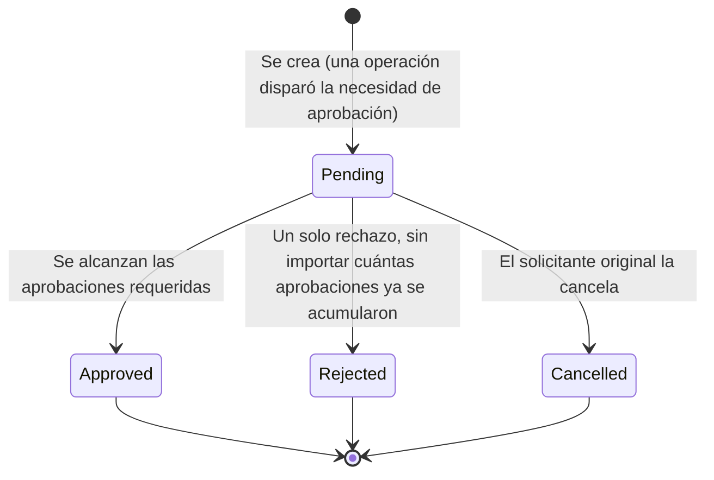
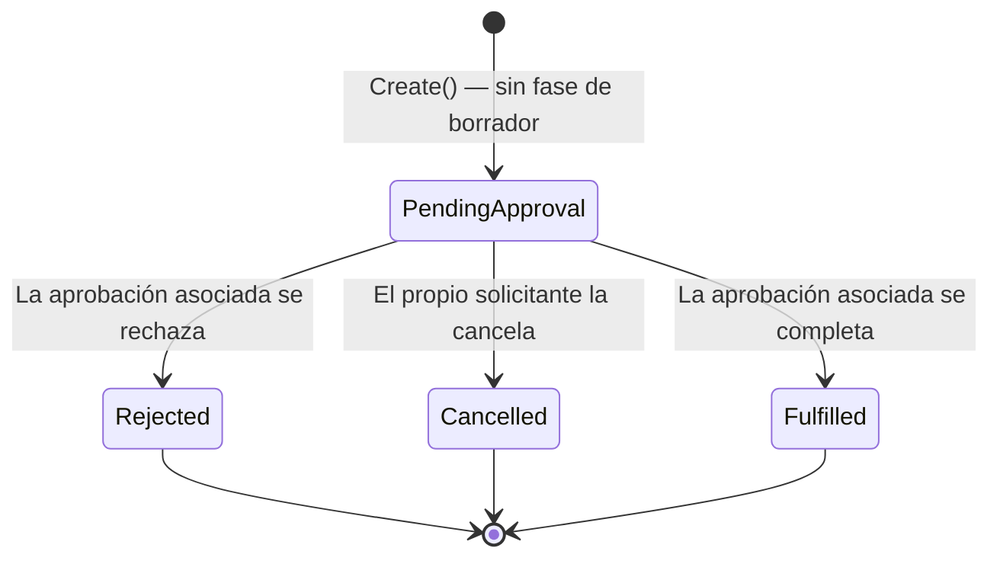

## 6.5 Solicitudes y aprobaciones

### Introducción al módulo

Este módulo resuelve dos necesidades relacionadas pero distintas: por un lado, permitir que
ciertas operaciones (dar de baja un activo, disponer de él, o que un empleado pida algo para sí
mismo) queden condicionadas a la decisión de una o varias personas con un rol determinado; por
otro, dar a cualquier empleado una forma sencilla de autoservicio para pedir una asignación, un
préstamo o un mantenimiento sin tener que pasar por el módulo operativo correspondiente.

Para entenderlo hay que distinguir tres conceptos que a veces se confunden porque comparten
pantallas y menú:

- **Flujo de aprobación** (`/approval-flows`) es la **configuración**: para un tipo de operación
  identificado con una clave textual (por ejemplo `internal-request.loan` o
  `asset.decommission`), define qué roles pueden aprobarla, cuántas aprobaciones hacen falta y en
  qué modo (secuencial o paralelo). Un flujo se configura una sola vez y se reutiliza para todas
  las operaciones futuras de ese tipo, hasta que se desactiva.
- **Aprobación** (`ApprovalInstance`, visible en `/my-approvals` y `/approvals/{id}`) es la
  **instancia concreta**: la decisión pendiente que se genera cada vez que ocurre una operación de
  ese tipo. Cuando se crea, copia las reglas del flujo vigente en ese momento (roles, número de
  aprobaciones, modo), de modo que si alguien reconfigura el flujo después, las aprobaciones que ya
  estaban en curso no se ven afectadas.
- **Solicitud interna** (`InternalRequest`, visible en `/requests` y `/my-requests`) es el
  mecanismo de autoservicio: cuando un empleado pide una asignación de activo, un préstamo o un
  mantenimiento para sí mismo, el sistema crea automáticamente, detrás de esa solicitud, una
  Aprobación del flujo correspondiente. La solicitud interna no reemplaza a la Asignación, el
  Préstamo o la Orden de mantenimiento: solo dispara el proceso de aprobación; al aprobarse, el
  sistema construye la Asignación, el Préstamo o la Orden de mantenimiento exactamente igual que si
  se hubiera hecho desde esos módulos directamente.

En otras palabras: usted configura **un** flujo de aprobación para "préstamos", y a partir de ahí,
**cada** solicitud de préstamo que haga cualquier empleado genera **una** aprobación nueva que se
decide según las reglas de ese flujo.

#### Ciclo de vida de una Aprobación

Ninguno de los tres estados finales (`Approved`, `Rejected`, `Cancelled`) tiene salida: una vez
decidida o cancelada, una aprobación no vuelve a moverse.

#### Ciclo de vida de una Solicitud interna

Una solicitud interna nace directamente en `PendingApproval` — no existe una etapa de borrador
donde revisarla antes de enviarla. Es importante notar que esta máquina de estados **no está
sincronizada automáticamente en ambos sentidos** con la de la Aprobación: cuando la Aprobación se
completa o se rechaza, sí actualiza el estado de la Solicitud (`Fulfilled` o `Rejected`); pero si
es la Solicitud la que se cancela primero, la Aprobación **no** se cancela automáticamente (vea el
detalle en "Casos especiales" de la sección 6.6).

Las siguientes secciones explican, en el orden en que normalmente se usan, cómo configurar un
flujo, cómo activarlo o desactivarlo, cómo crear y gestionar solicitudes internas, y cómo decidir
sobre las aprobaciones pendientes.

---

### Configurar un flujo de aprobación

#### Objetivo

Definir, para un tipo de operación, qué roles deben aprobarla, cuántas aprobaciones distintas se
necesitan y si deben darse en un orden específico o pueden darse en cualquier orden.

#### Cuándo utilizarlo

Antes de que cualquier persona pueda enviar una solicitud interna de un tipo determinado (de
asignación de activo, de préstamo o de mantenimiento), o antes de que otro proceso que dependa de
aprobación (por ejemplo una baja o disposición de activo) pueda completarse. **Si no existe un
flujo activo para ese tipo de operación, el sistema simplemente no permite que se genere la
solicitud** — no hay manera de "aprobar sobre la marcha" sin configuración previa.

#### Paso a paso detallado

1. En el menú, entre al grupo **"Solicitudes y aprobaciones"** y seleccione **"Flujos de
   aprobación"**. Se abre `/approval-flows` con la lista de flujos existentes, de todas las
   empresas a las que su cuenta tiene acceso (ver captura ).
2. Presione el botón **"Nuevo flujo"**, ubicado junto al título. El sistema navega a
   `/approval-flows/new` (ver captura ).
3. Escriba la **Clave** del flujo. Debe coincidir exactamente con la clave que el proceso que
   consumirá este flujo espera (por ejemplo `internal-request.loan` para préstamos,
   `internal-request.asset-assignment` para asignaciones, `internal-request.maintenance` para
   mantenimientos, o claves propias de otros procesos como `asset.decommission`).
4. Elija el **Alcance**: déjelo en **"Todas las empresas"** si el flujo debe aplicar como
   respaldo general, o seleccione una empresa específica si esta debe tener sus propias reglas de
   aprobación para esa clave.
5. Elija el **Modo**: **"Paralelo (cualquier orden)"** si cualquier persona con alguno de los
   roles elegidos puede decidir en cualquier momento, o **"Secuencial (en el orden de la lista)"**
   si las aprobaciones deben darse en un orden estricto, rol por rol.
6. Agregue uno o más **roles aprobadores** usando el botón **"+ Agregar rol"**; quite alguno con
   **"Quitar"** (disponible solo si hay más de un rol en la lista). En modo secuencial, el orden en
   que aparecen los roles en la lista es el orden en que deberán decidir.
7. Revise el campo **Aprobaciones requeridas**. En modo paralelo puede escribir cualquier número
   igual o mayor a 1 (incluso mayor que la cantidad de roles elegidos, si se necesita que varias
   personas del mismo rol aprueben por separado). En modo secuencial este campo se calcula
   automáticamente como la cantidad de roles de la lista y no se puede editar.
8. Marque **"Exigir justificación al solicitar"** si quiere obligar a quien pida esta operación a
   escribir un comentario explicando el motivo.
9. Presione **"Crear flujo"**. Mientras se guarda, el botón muestra **"Guardando…"**. Al terminar,
   el sistema regresa a la lista de flujos.

#### Campos

| Campo | Tipo | Obligatorio | Detalle |
|---|---|---|---|
| Clave (`key`) | Texto | Sí | Máximo 100 caracteres. Debe coincidir con la clave que espera el proceso consumidor (p. ej. `internal-request.loan`). |
| Alcance (`companyId`) | Selección | No | Vacío = flujo global (todas las empresas); o una empresa específica de las asociadas a su cuenta. |
| Modo (`mode`) | Selección | Sí | "Paralelo (cualquier orden)" o "Secuencial (en el orden de la lista)". Por defecto, Paralelo. |
| Aprobaciones requeridas (`requiredApprovals`) | Numérico | Sí | Mínimo 1. En modo Secuencial queda fijo e igual a la cantidad de roles listados (solo lectura). |
| Roles aprobadores (`approverRoleIds`) | Lista de selecciones | Sí, al menos uno | Un rol por casilla; se pueden agregar o quitar casillas. En modo Secuencial, el orden importa y se numeran. |
| Exigir justificación al solicitar (`requiresComment`) | Casilla | No | Si se marca, quien solicite esta operación deberá escribir un comentario obligatorio. |

#### Botones y acciones

- **"Nuevo flujo"**: navega al formulario de creación.
- **"+ Agregar rol"** / **"Quitar"**: agregan o eliminan casillas de rol dentro del formulario.
- **"Crear flujo"**: envía el formulario (`POST /api/v1/approval-flows`). Deshabilitado mientras
  se procesa, mostrando **"Guardando…"**.

#### Reglas de negocio

- No hay condiciones basadas en montos, categorías u otros criterios variables: el flujo aplicable
  se determina únicamente por la combinación de **Clave** y **Empresa**.
- Un flujo específico de una empresa siempre tiene prioridad sobre un flujo global con la misma
  clave; el flujo global funciona como respaldo para las empresas que no tienen uno propio.
- **Un flujo nunca se edita.** Si las reglas cambian, se desactiva el flujo existente y se crea uno
  nuevo con la clave y el alcance correspondientes.
- En modo Secuencial, la cantidad de aprobaciones requeridas siempre es igual a la cantidad de
  roles listados, uno por uno, en ese orden.
- En modo Paralelo, la cantidad de aprobaciones requeridas es independiente de la cantidad de
  roles: puede pedirse, por ejemplo, un solo rol pero tres aprobaciones distintas de tres personas
  diferentes que tengan ese rol.
- Los roles que aprueban son **dinámicos**: no se fija a personas concretas al crear el flujo, sino
  al rol. Quien tenga asignado ese rol en el momento de decidir es quien puede hacerlo, aunque el
  rol haya cambiado de titulares desde que se creó el flujo.
- No existe validación que impida repetir el mismo rol más de una vez en la lista de roles
  aprobadores; si esto ocurre, tenga presente que puede generar ambigüedad al calcular turnos.

#### Mensajes del sistema

- Clave vacía: **"La clave del flujo de aprobación es obligatoria."**
- Sin roles aprobadores: **"Un flujo de aprobación necesita al menos un rol aprobador."**
- Aprobaciones requeridas menor a 1: **"El número de aprobaciones requeridas debe ser al menos 1."**
- Modo secuencial con número de aprobaciones distinto a la cantidad de roles: **"En modo
  secuencial se requiere una aprobación por cada rol, en orden."**
- Validación de formulario (antes de llamar al servidor): **"La clave y al menos un rol aprobador
  son obligatorios."**
- Ya existe un flujo activo con la misma clave y alcance: **"Ya existe un flujo activo con esa
  clave para ese alcance. Desactívalo antes de crear uno nuevo."**
- Algún rol seleccionado ya no existe: **"Uno o más roles aprobadores no existen."**
- Empresa sin roles activos: **"No hay roles activos todavía. Crea al menos un rol en Roles antes
  de configurar un flujo."**
- Sin permiso para consultar flujos: **"No tienes permiso para consultar flujos de aprobación
  (Approvals.Read)."**
- Sin permiso para consultar roles al abrir el formulario: **"Configurar un flujo requiere también
  poder consultar roles (Roles.Read)."**
- Error genérico al consultar: **"No fue posible consultar los flujos de aprobación."**
- Error genérico al crear (sin detalle específico del servidor): **"No fue posible crear el flujo
  de aprobación."**

#### Casos especiales

- Si intenta crear un flujo con la misma clave y el mismo alcance de uno que ya está activo, el
  sistema lo rechaza; primero debe desactivar el existente (vea la sección 6.3).
- Si su empresa todavía no tiene roles configurados, no podrá seleccionar ningún aprobador; deberá
  crear los roles primero desde el módulo de Roles.
- La lista de flujos (`/approval-flows`) muestra los de **todas las empresas** a las que su cuenta
  tiene acceso, sin distinguir por empresa en la vista — revise la columna "Alcance" de cada fila
  para saber a cuál corresponde.

#### Resultado esperado

Se crea un nuevo flujo activo. A partir de ese momento, cualquier operación que solicite
aprobación con esa clave (y, si aplica, en esa empresa) generará una Aprobación siguiendo estas
reglas. El flujo aparece en la lista con estado **"Activo"**.

#### Buenas prácticas

- Use claves consistentes y documentadas dentro de su organización — no hay un catálogo cerrado de
  claves válidas en la pantalla, así que un error de escritura en la clave generará un flujo que
  nunca se usará.
- Prefiera el modo Secuencial cuando el orden de las decisiones importe (por ejemplo, primero el
  jefe directo y después TI); use Paralelo cuando cualquier persona del rol pueda decidir sin
  depender de otras.
- Antes de crear un flujo específico de empresa, confirme si ya existe uno global con la misma
  clave — de lo contrario podría terminar con dos flujos activos que compiten por la misma
  operación en distintos alcances.

---

### Activar o desactivar un flujo de aprobación

#### Objetivo

Pausar (o reanudar) un flujo de aprobación sin eliminarlo del historial, dado que los flujos nunca
se editan directamente.

#### Cuándo utilizarlo

Cuando las reglas de aprobación de un tipo de operación deben cambiar: se desactiva el flujo
vigente y, junto con esto, se crea un flujo nuevo con la clave y el alcance correspondientes (ver
sección 6.2). También se usa para reactivar un flujo que se había desactivado por error o que
vuelve a ser necesario tal como estaba configurado.

#### Paso a paso detallado

1. Vaya a **"Flujos de aprobación"** (`/approval-flows`).
2. Ubique la fila del flujo que quiere pausar o reanudar (ver captura
   , columna "Estado" con el badge **"Activo"** o
   **"Inactivo"**).
3. Presione el botón de la fila: dirá **"Desactivar"** si el flujo está activo, o **"Activar"** si
   está inactivo.
4. El cambio se aplica de inmediato; la fila actualiza su badge de estado.

#### Campos

No aplica — esta acción no usa formulario, solo alterna un valor booleano (`isActive`) sobre el
flujo existente.

#### Botones y acciones

- **"Desactivar"**: envía `PATCH /api/v1/approval-flows/{id}/active` con valor `false`.
- **"Activar"**: mismo endpoint con valor `true`.

#### Reglas de negocio

- Desactivar un flujo **no afecta** a las Aprobaciones que ya se generaron bajo sus reglas (siguen
  su curso normal hasta que se decidan o cancelen), porque cada Aprobación guarda una copia de las
  reglas vigentes en el momento en que se creó.
- Mientras un flujo esté activo, no se puede crear otro con la misma clave y el mismo alcance; para
  reemplazar sus reglas, primero desactívelo.
- Reactivar un flujo antiguo restaura exactamente las reglas con las que fue creado — no es
  posible modificarlas al reactivar; si necesita reglas distintas, cree un flujo nuevo en su lugar.

#### Mensajes del sistema

- Si el flujo no existe (por ejemplo, un enlace obsoleto): respuesta 404 del servidor.
- Sin permiso: **"No tienes permiso para consultar flujos de aprobación (Approvals.Read)."** (para
  ver la lista); la acción de activar/desactivar en sí exige el permiso **Approvals.Configure**.

#### Casos especiales

- Si desactiva un flujo y **no** crea un reemplazo, cualquier intento posterior de generar una
  operación de ese tipo (por ejemplo, una solicitud interna de préstamo) fallará con: **"No hay un
  flujo de aprobación configurado para '{flowKey}'. Pide a un administrador que configure uno en
  Aprobaciones."**
- No hay confirmación adicional ("¿está seguro?") antes de desactivar un flujo — el cambio se
  aplica al primer clic.

#### Resultado esperado

El badge de estado del flujo cambia entre **"Activo"** e **"Inactivo"** de inmediato. Un flujo
inactivo deja de poder usarse para nuevas solicitudes, pero permanece visible en la lista para
referencia histórica.

#### Buenas prácticas

- Desactive el flujo viejo **y** cree el nuevo en la misma sesión de trabajo, para minimizar el
  tiempo en que ese tipo de operación queda sin flujo configurado (lo que bloquearía nuevas
  solicitudes).
- Antes de desactivar un flujo, verifique si hay aprobaciones pendientes que dependan de él —
  seguirán su curso, pero es buena práctica coordinar el cambio con quienes deben decidir.

---

### Crear una solicitud interna

#### Objetivo

Permitir que cualquier empleado pida, para sí mismo, una asignación de un activo del almacén, un
préstamo temporal, o un servicio de mantenimiento sobre un activo — sin necesitar acceso a los
módulos operativos de Asignaciones, Préstamos o Mantenimiento, y dejando que el proceso de
aprobación decida si procede.

#### Cuándo utilizarlo

- Necesita que le asignen un activo disponible en almacén.
- Necesita un préstamo temporal de un activo, con fecha estimada de devolución.
- Detecta que un activo (que está en almacén o que ya tiene asignado) necesita mantenimiento.

#### Paso a paso detallado

1. Vaya a **"Solicitudes"** en el menú de autoservicio, o directamente a **"Mis solicitudes"** y
   presione **"Nueva solicitud"**. Se abre `/requests/new` (ver captura
   ).
2. Elija el **Tipo de solicitud**: Asignación de activo, Préstamo o Mantenimiento.
3. Elija el **Activo**. La lista de activos disponibles cambia según el tipo elegido:
   - Para Asignación o Préstamo, solo se listan activos **en almacén**. La etiqueta del campo
     muestra **"Activo (debe estar en almacén)"**.
   - Para Mantenimiento, se listan activos **en almacén o ya asignados** (incluyendo los que están
     asignados a usted mismo). La etiqueta cambia a **"Activo (en almacén o asignado a ti)"**.
   - Si no hay ningún activo elegible para el tipo elegido, el sistema lo indica con: **"No hay
     activos elegibles para este tipo de solicitud."**
4. Si el tipo es **Préstamo**, aparece el campo **Fecha esperada de devolución** — es obligatorio
   solo en este caso; para los otros tipos el campo ni siquiera se muestra.
5. Escriba la **Justificación**: explique brevemente por qué hace esta solicitud (hasta 1000
   caracteres).
6. Presione **"Enviar solicitud"** (mientras se procesa, el botón muestra **"Enviando…"**).
7. Al enviarse correctamente, el sistema lo lleva a **"Mis solicitudes"**, donde su nueva solicitud
   aparece con estado **"Pendiente de aprobación"**.

#### Campos

| Campo | Tipo | Obligatorio | Detalle |
|---|---|---|---|
| Tipo de solicitud (`type`) | Selección | Sí | Asignación de activo / Préstamo / Mantenimiento. |
| Activo (`assetId`) | Selección | Sí | Lista filtrada según el tipo elegido (ver paso 3). |
| Fecha esperada de devolución (`expectedReturnDate`) | Fecha | Sí, solo si el tipo es Préstamo | No se muestra para los demás tipos. |
| Justificación (`justification`) | Texto largo | Sí | Máximo 1000 caracteres. Placeholder: "Explica por qué haces esta solicitud". |

#### Botones y acciones

- **"Nueva solicitud"**: navega al formulario, desde "Solicitudes" o desde "Mis solicitudes".
- **"Enviar solicitud"**: envía la solicitud (`POST /api/v1/requests`); muestra **"Enviando…"**
  mientras está en curso.

#### Reglas de negocio

- Una solicitud interna **no tiene fase de borrador**: en cuanto se envía, queda directamente en
  estado "Pendiente de aprobación" — no hay forma de guardarla a medias ni de editarla después.
- El activo debe cumplir la regla de elegibilidad según el tipo: para Asignación y Préstamo debe
  estar en almacén; para Mantenimiento puede estar en almacén o ya asignado.
- Enviar una solicitud dispara automáticamente la creación de una Aprobación bajo el flujo
  configurado para ese tipo (`internal-request.asset-assignment`, `internal-request.loan` o
  `internal-request.maintenance`, según corresponda). Si no existe un flujo activo para esa clave,
  la solicitud no puede crearse.
- El activo **no cambia de estado** mientras la solicitud está pendiente — solo cambia si la
  aprobación se completa (ver sección 6.1 y 6.7).
- El beneficiario de la solicitud es siempre la persona que la creó; no es posible pedir algo en
  nombre de otra persona desde esta pantalla.

#### Mensajes del sistema

- Campos incompletos: **"Tipo, activo y justificación son obligatorios."**
- Préstamo sin fecha de devolución: **"Una solicitud de préstamo requiere la fecha esperada de
  devolución."**
- Activo no elegible para mantenimiento: **"Solo un activo en almacén o asignado puede reportarse
  a mantenimiento."**
- Activo no elegible para asignación o préstamo: **"Solo un activo en almacén puede solicitarse."**
- Sin flujo de aprobación configurado para ese tipo: **"No hay un flujo de aprobación configurado
  para '{flowKey}'. Pide a un administrador que configure uno en Aprobaciones."**
- Error genérico al enviar: **"No fue posible enviar la solicitud."**

#### Casos especiales

- Si el administrador todavía no configuró un flujo de aprobación para el tipo de solicitud que
  usted necesita, no podrá enviarla — deberá pedir que se configure uno (sección 6.2) antes de
  intentarlo de nuevo.
- Si el único activo elegible para el tipo elegido cambia de estado entre que usted abre el
  formulario y lo envía (por ejemplo, alguien más lo toma primero), la solicitud puede rechazarse
  con el mensaje de elegibilidad correspondiente.

#### Resultado esperado

Se crea una nueva solicitud interna en estado **"Pendiente de aprobación"**, y de forma automática
una Aprobación asociada, notificando a todas las personas con un rol elegible para decidir sobre
ella (vea la sección 6.7). Su solicitud aparece de inmediato en **"Mis solicitudes"**.

#### Buenas prácticas

- Escriba una justificación clara y específica: quien deba aprobar solo ve ese texto (y, en
  préstamos, la fecha de devolución) para decidir.
- Verifique la fecha de devolución antes de enviar una solicitud de préstamo — no se puede
  modificar después de enviada.
- Si necesita el activo con urgencia, avise directamente a quien deba aprobar, ya que el sistema no
  tiene mecanismo de prioridad ni de vencimiento automático de la aprobación.

---

### Consultar las solicitudes de la empresa

#### Objetivo

Dar a quien administra o gestiona una empresa visibilidad de **todas** las solicitudes internas
hechas por cualquier persona de esa empresa, sin importar quién las creó.

#### Cuándo utilizarlo

Para dar seguimiento operativo a las solicitudes en curso de la empresa, revisar su historial, o
verificar el estado de una solicitud que un empleado reporta como pendiente.

#### Paso a paso detallado

1. En el menú, entre a **"Solicitudes"** (`/requests`). Se muestra la tabla con todas las
   solicitudes de la empresa actualmente seleccionada (ver captura
   ).
2. Si su cuenta tiene acceso a más de una empresa, use el selector de empresa para cambiar de
   contexto; la tabla se actualiza para mostrar las solicitudes de la empresa elegida.
3. Revise la tabla: folio del activo (con enlace al detalle de la solicitud), tipo, quién la
   solicitó, estado y fecha.
4. Presione el folio de una fila para ver el detalle de esa solicitud en `/requests/{id}`.
   [Captura pendiente: detalle de una solicitud interna, `/requests/[id]`]. En esa pantalla se
   muestra el tipo, quién la solicitó, un badge de estado, la justificación completa, la fecha
   esperada de devolución (si aplica), la fecha en que se solicitó y, si ya fue decidida, la fecha
   de la decisión. Un botón **"← Volver"** regresa a la lista. Esta pantalla es de solo lectura: no
   tiene botones de acción, ni siquiera un enlace hacia la Aprobación asociada.

#### Campos

No aplica — esta vista es de solo lectura, sin formulario. Columnas de la tabla:

| Columna | Contenido |
|---|---|
| Activo | Folio del activo, con enlace al detalle de la solicitud. |
| Tipo | "Asignación de activo", "Préstamo" o "Mantenimiento". |
| Solicitante | Nombre de quien la creó (oculto en pantallas pequeñas). |
| Estado | Badge de estado. |
| Fecha | Fecha de creación (oculta en pantallas pequeñas). |

#### Botones y acciones

- **"Nueva solicitud"**: navega a `/requests/new` (equivalente al botón descrito en la sección
  6.4).
- Enlace sobre el folio de cada fila: navega al detalle de esa solicitud.
- **No hay botones de acción** en esta vista — ni cancelar ni decidir; cancelar solo está
  disponible desde "Mis solicitudes" (sección 6.6) para el propio solicitante, y decidir solo desde
  "Mis aprobaciones" (sección 6.7).

#### Reglas de negocio

- Requiere el permiso **Requests.Read**.
- Solo muestra solicitudes de empresas a las que la cuenta tiene acceso.
- El detalle por id (`/requests/{id}`) no vuelve a validar el acceso a la empresa de esa solicitud
  específica — a diferencia del listado, que sí filtra por empresa accesible. Es una limitación
  conocida: si usted tiene el permiso **Requests.Read**, en principio podría llegar al detalle de
  una solicitud de una empresa a la que no debería tener acceso si conociera o adivinara su
  identificador.

#### Mensajes del sistema

- Sin permiso: **"No tienes permiso para consultar solicitudes (Requests.Read)."**
- Lista vacía: **"No hay solicitudes todavía."**
- Error genérico: **"No fue posible consultar las solicitudes."**
- Detalle no encontrado: página 404 estándar del sistema.

#### Casos especiales

- Esta pantalla **no reemplaza** a "Mis solicitudes": incluso si usted mismo aparece como
  solicitante de alguna fila, no podrá cancelarla desde aquí — deberá ir a "Mis solicitudes".
- El detalle de una solicitud no muestra ni enlaza a la Aprobación asociada; si necesita revisar
  quién debe decidir o qué se decidió, consulte "Mis aprobaciones" o pida a la persona
  correspondiente que verifique desde ahí.

#### Resultado esperado

Una vista completa y actualizada de las solicitudes de la empresa seleccionada, útil para
seguimiento sin necesidad de intervenir en ellas.

#### Buenas prácticas

- Combine esta vista con "Flujos de aprobación" para detectar rápidamente si un tipo de solicitud
  se está acumulando sin decidirse por falta de un flujo activo o de aprobadores disponibles.
- Si detecta una solicitud estancada, verifique primero si el flujo correspondiente sigue activo y
  si existen personas con el rol aprobador asignado.

---

### Consultar y cancelar mis solicitudes

#### Objetivo

Que cada persona revise el estado de las solicitudes internas que ella misma ha hecho, y pueda
cancelar las que ya no necesite mientras sigan pendientes de decisión.

#### Cuándo utilizarlo

Para dar seguimiento a sus propias solicitudes, o para retirarlas si ya no las necesita, cambió de
opinión, o se equivocó al crearlas, siempre que aún no hayan sido decididas.

#### Paso a paso detallado

1. Vaya a **"Mis solicitudes"** (`/my-requests`) desde el menú de autoservicio (ver captura
   ).
2. Revise cada tarjeta: folio del activo (enlazado a `/assets/{assetId}`, es decir, a la ficha del
   activo, no al detalle de la solicitud), tipo, badge de estado, justificación completa y, si
   aplica, la fecha esperada de devolución.
3. Si una solicitud todavía está en estado **"Pendiente de aprobación"**, aparece el botón
   **"Cancelar"**. Presiónelo si ya no la necesita.
4. Para crear una nueva, presione **"Nueva solicitud"** (misma acción que en la sección 6.4).

#### Campos

No aplica — esta vista no tiene formulario propio; la única acción disponible es cancelar.

#### Botones y acciones

- **"Cancelar"**: visible únicamente si `estado == "Pendiente de aprobación"`. Envía `POST
  /api/v1/requests/{id}/cancel`.
- **"Nueva solicitud"**: navega a `/requests/new`.

#### Reglas de negocio

- Solo se listan las solicitudes creadas por la persona que consulta — no requiere ningún permiso
  RBAC, es autoservicio puro.
- Solo se puede cancelar una solicitud propia, y solo mientras esté **"Pendiente de aprobación"**.
- Cancelar una solicitud no revierte ningún cambio de estado del activo, porque el activo nunca
  cambió de estado mientras la solicitud estaba pendiente.

#### Mensajes del sistema

- Intento de cancelar una solicitud que ya no está pendiente: **"Solo una solicitud pendiente de
  aprobación puede cancelarse."**
- Intento de cancelar la solicitud de otra persona: **"Solo quien solicitó puede cancelar su
  propia solicitud."**
- Vacío: **"No has hecho ninguna solicitud todavía."**
- Error genérico: **"No fue posible consultar tus solicitudes."**

#### Casos especiales

- **Cancelar su solicitud no cancela la Aprobación asociada.** La solicitud pasa a estado
  "Cancelada" y desaparece de sus pendientes, pero la Aprobación que se había generado para ella
  **sigue existiendo y sigue en estado "Pendiente"** en el sistema. Esto significa que la persona
  que debía decidir sobre ella puede seguir viéndola en su bandeja "Mis aprobaciones" aunque la
  solicitud original ya no exista como tal. Si usted cancela una solicitud, es buena práctica
  avisar directamente a quien debía aprobarla, porque el sistema no hace esa notificación por
  usted ni retira la aprobación de su bandeja automáticamente.
- El enlace del folio en esta pantalla lleva a la ficha del activo, no al detalle de la solicitud;
  si necesita ver el detalle de la solicitud en sí, use la vista general de "Solicitudes" descrita
  en la sección 6.5 (siempre que tenga el permiso correspondiente).

#### Resultado esperado

La solicitud cambia a estado **"Cancelada"**, deja de mostrar el botón "Cancelar" y ya no es
elegible para ser aprobada o completada.

#### Buenas prácticas

- Cancele una solicitud tan pronto sepa que ya no la necesita, para no ocupar el tiempo de quien
  debe decidir sobre ella.
- Después de cancelar, si sabe quién debía aprobarla, avísele directamente — recuerde que la
  aprobación pendiente no se retira sola de su bandeja.

---

### Decidir sobre una aprobación pendiente

#### Objetivo

Permitir que una persona con un rol elegible apruebe o rechace una decisión pendiente, dejando
constancia firmada de esa decisión.

#### Cuándo utilizarlo

Cuando una aprobación aparece en su bandeja personal porque usted tiene, en ese momento, un rol
habilitado para decidir sobre ella (según el flujo configurado y, en modo secuencial, según el
turno correspondiente).

#### Paso a paso detallado

1. Vaya a **"Mis aprobaciones"** (`/my-approvals`) desde el menú de autoservicio (ver captura
   ).
2. Revise cada tarjeta: el tipo de contexto (por ejemplo "Solicitud interna", "Baja de activo"),
   quién la solicitó, la fecha, y la justificación entre comillas si el solicitante escribió una.
3. Si quiere revisar más detalle antes de decidir, presione **"Ver detalle"** (ver sección 6.8).
4. Para decidir, presione **"Aprobar"** o **"Rechazar"** en la propia tarjeta:
   - Si presiona **"Aprobar"**: se muestran los campos de firma (ver más abajo). Complételos y
     presione **"Confirmar aprobación"** (el botón muestra **"Enviando…"** mientras se procesa).
   - Si presiona **"Rechazar"**: se muestra el campo **"Motivo del rechazo"** (obligatorio) además
     de los campos de firma. Escriba el motivo y presione **"Confirmar rechazo"**.
   - En cualquiera de los dos modos puede presionar **"Cancelar"** para volver al estado inicial
     sin enviar nada (esto solo cancela el formulario en pantalla, no tiene relación con cancelar
     la Aprobación en el sistema).
5. Al confirmar, si todo es válido, la tarjeta se reemplaza por el mensaje **"Decisión
   registrada."** y la aprobación desaparece de la bandeja (ya no está pendiente para usted).

#### Campos

| Campo | Tipo | Obligatorio | Cuándo aparece |
|---|---|---|---|
| Motivo del rechazo (`comment`) | Texto | Sí, solo al rechazar | Máximo 1000 caracteres. Solo en el modo "Rechazar". |
| Mecanismo de firma (`signatureMechanism`) | Radio: "Escribir mi nombre" / "Dibujar firma" | Sí | Al aprobar o al rechazar. Por defecto, "Escribir mi nombre". |
| Nombre completo (`typedFullName`) | Texto | Sí, si el mecanismo es "Escribir mi nombre" | Máximo 200 caracteres. |
| Firma dibujada (`signatureImageDataUrl`) | Lienzo de dibujo | Sí, si el mecanismo es "Dibujar firma" | El sistema usa automáticamente el nombre de su cuenta; no se pide nombre por separado. |

#### Botones y acciones

- **"Ver detalle"**: enlaza a `/approvals/{id}` (sección 6.8).
- **"Aprobar"** / **"Rechazar"**: abren el formulario correspondiente.
- **"Cancelar"**: descarta el formulario en pantalla y regresa a los botones iniciales.
- **"Confirmar aprobación"** / **"Confirmar rechazo"**: envían la decisión.

#### Reglas de negocio

- La elegibilidad para decidir se basa en **rol de negocio**, no en un permiso de acceso: no hace
  falta ningún permiso especial de "Aprobaciones" para aprobar o rechazar desde esta bandeja —
  basta con tener asignado, en el momento de decidir, alguno de los roles definidos en el flujo.
- En modo **Secuencial**, solo puede decidir quien tenga el rol que corresponde al turno actual
  (el primero pendiente en el orden configurado); los demás roles listados deberán esperar su
  turno.
- En modo **Paralelo**, cualquier persona con alguno de los roles listados puede decidir en
  cualquier momento, hasta completar el número de aprobaciones requeridas.
- Una persona no puede registrar más de una decisión sobre la misma aprobación.
- Rechazar exige siempre un motivo; aprobar no lo exige (salvo que el flujo tenga marcada la
  opción de justificación obligatoria al solicitar, que aplica a quien solicita, no a quien
  decide).
- La firma (nombre escrito o dibujo) es obligatoria para registrar cualquier decisión; queda
  almacenada de forma inmutable. El sistema **no verifica** que el nombre escrito corresponda
  realmente a la persona que firma — confía en la sesión autenticada.

#### Mensajes del sistema

- Quien solicitó no puede decidir sobre su propia solicitud: **"Quien solicita una aprobación no
  puede decidir sobre su propia solicitud."**
- La aprobación ya no está pendiente (alguien más decidió primero, o ya se completó/rechazó):
  **"Esta aprobación ya no está pendiente."**
- Ya había registrado una decisión antes: **"Ya registraste una decisión para esta aprobación."**
- Rechazo sin motivo: **"Rechazar una aprobación requiere indicar el motivo."** / validación de
  formulario: **"Escribe el motivo del rechazo."**
- Sin rol elegible: **"No tienes un rol elegible para decidir sobre esta aprobación."**
- No es su turno (modo secuencial): **"Todavía no es el turno del rol correspondiente en este
  flujo secuencial."**
- Falta de datos de firma: **"Escribe tu nombre completo para firmar con este mecanismo."** /
  **"Dibuja tu firma para firmar con este mecanismo."**
- Éxito: **"Decisión registrada."**
- Error genérico: **"No fue posible aprobar."** / **"No fue posible rechazar."**
- Bandeja vacía: **"No tienes aprobaciones pendientes."**
- Error al consultar la bandeja: **"No fue posible consultar tus aprobaciones."**

#### Casos especiales

- **Quien solicita algo nunca puede aprobar su propia solicitud**, sin excepción — el sistema lo
  bloquea aunque esa persona tenga el rol requerido.
- **Un solo rechazo termina el proceso**, sin importar cuántas aprobaciones ya se hubieran
  acumulado antes. Si un flujo requiere tres aprobaciones y ya se registraron dos, un tercer
  aprobador que rechace hace que toda la aprobación pase a "Rechazada" de inmediato; las dos
  aprobaciones previas no cuentan para nada distinto de quedar en el historial de decisiones.
- **Es posible ser elegible para decidir sobre una aprobación sin tener permiso para ver su
  pantalla de detalle.** La elegibilidad para aprobar/rechazar depende de su rol de negocio; el
  botón "Ver detalle" de esta misma bandeja lleva a `/approvals/{id}`, que exige el permiso
  **Approvals.Read**. Si usted no tiene ese permiso, hacer clic en "Ver detalle" le mostrará un
  error de acceso denegado, aunque sí pueda aprobar o rechazar sin problema desde la propia
  tarjeta. **Recomendación**: decida siempre desde "Mis aprobaciones" — no necesita, ni debe
  intentar, construir o adivinar la URL de detalle de una aprobación para poder decidir sobre
  ella.
- Una decisión, una vez registrada, no se puede deshacer ni editar — ni por usted ni por nadie más.
  Cualquier corrección debe hacerse fuera del sistema o mediante los mecanismos de compensación del
  proceso de origen (por ejemplo, una nueva solicitud).

#### Resultado esperado

La decisión queda registrada de forma permanente. Si era la última aprobación requerida, la
Aprobación pasa a **"Aprobada"** y, si el contexto era una Solicitud interna, esta se completa
automáticamente (se genera la Asignación, el Préstamo o la Orden de mantenimiento correspondiente,
según el tipo). Si fue un rechazo, la Aprobación pasa a **"Rechazada"** y, en el caso de una
Solicitud interna, esta también queda **"Rechazada"**, sin que el activo haya cambiado de estado
en ningún momento del proceso.

#### Buenas prácticas

- Revise la justificación (y, si la hay, la fecha de devolución esperada en préstamos) antes de
  aprobar.
- Use siempre "Ver detalle" solo como consulta adicional, no como paso obligatorio — puede decidir
  directamente desde la tarjeta de "Mis aprobaciones".
- Si va a rechazar, escriba un motivo claro y útil: es lo único que verá el solicitante para
  entender por qué no procedió su pedido.

---

### Ver el detalle de una aprobación

#### Objetivo

Consultar el expediente completo de una aprobación concreta: qué se solicitó, quién lo solicitó,
qué reglas aplicaban (modo y número de aprobaciones requeridas), y el historial de decisiones ya
registradas.

#### Cuándo utilizarlo

Para revisar antecedentes de una aprobación ya decidida, dar seguimiento a una que sigue pendiente,
o verificar exactamente qué comentarios dejó cada persona que decidió.

#### Paso a paso detallado

1. La única forma prevista de llegar a esta pantalla es presionando **"Ver detalle"** desde **"Mis
   aprobaciones"** (sección 6.7); no existe un listado general de aprobaciones desde el cual
   navegar aquí.
2. La pantalla (`/approvals/{id}`) muestra:
   - Una migaja de pan: "Mis aprobaciones" → nombre del contexto.
   - Un encabezado con el nombre del contexto (por ejemplo "Solicitud interna", "Baja de activo",
     "Disposición de activo (venta/donación/destrucción)"), quién lo solicitó, el modo (Secuencial
     o Paralelo) y cuántas aprobaciones se requieren.
   - Un badge de estado: **"Pendiente"**, **"Aprobada"**, **"Rechazada"** o **"Cancelada"**.
   - Una tarjeta **"Justificación"**, visible solo si el solicitante escribió un comentario.
   - Una tarjeta **"Decisiones"**, con la lista de quién decidió, qué decidió y cuándo, con su
     comentario entre comillas si lo escribió. Si nadie ha decidido todavía: **"Todavía no hay
     decisiones registradas."**
   - **Esta pantalla no tiene botones de acción**: no se puede aprobar, rechazar ni cancelar desde
     aquí — esas acciones existen únicamente en "Mis aprobaciones".

   [Captura pendiente: detalle de una aprobación, `/approvals/[id]`]

3. **Importante — sobre la ruta directa `/approvals` sin identificador**: si usted (o alguien más)
   intenta entrar directamente a la dirección `/approvals`, sin especificar el identificador de una
   aprobación concreta, el sistema responde con una página no encontrada (ver captura
   ). **Esto no es un error del sistema**, sino
   el comportamiento esperado por diseño: deliberadamente **no existe** una pantalla de listado
   general de aprobaciones (a diferencia de, por ejemplo, "Solicitudes", que sí tiene una vista de
   lista en la sección 6.5). La única vista de aprobaciones que agrupa varias en una lista es la
   bandeja personal "Mis aprobaciones" (sección 6.7); el detalle de una aprobación específica solo
   se alcanza a través de un enlace que ya incluye su identificador — nunca escribiendo la
   dirección a mano.

#### Campos

No aplica — pantalla de solo lectura.

#### Botones y acciones

Ninguno. Es una vista exclusivamente de consulta.

#### Reglas de negocio

- Requiere el permiso **Approvals.Read** para poder consultarse — a diferencia de aprobar o
  rechazar desde "Mis aprobaciones", que no exige ningún permiso, solo el rol elegible.
- El acceso se resuelve únicamente por el identificador de la aprobación; el sistema no vuelve a
  validar que la empresa de esa aprobación esté entre las empresas accesibles para quien consulta.
  Es una limitación conocida: cualquier persona con el permiso **Approvals.Read**, en principio,
  podría consultar el detalle de una aprobación de una empresa a la que no debería tener acceso, si
  llegara a conocer su identificador.
- Si el identificador no corresponde a ninguna aprobación existente, la respuesta es una página no
  encontrada (404).

#### Mensajes del sistema

- Etiquetas de estado: **"Pendiente"**, **"Aprobada"**, **"Rechazada"**, **"Cancelada"**.
- Sin decisiones registradas todavía: **"Todavía no hay decisiones registradas."**
- Sin permiso: error de acceso denegado (403) al intentar abrir el detalle.
- Identificador inexistente: página no encontrada (404).

#### Casos especiales

- **Puede ser elegible para decidir sobre una aprobación sin poder ver su detalle.** Como se
  explicó en la sección 6.7, la capacidad de aprobar/rechazar depende de un rol de negocio, no del
  permiso **Approvals.Read**. Es perfectamente posible — y no es un error — que usted vea una
  aprobación en "Mis aprobaciones" y pueda decidir sobre ella, pero al presionar "Ver detalle"
  reciba un error de acceso denegado porque no tiene ese permiso. En ese caso, decida directamente
  desde la tarjeta de "Mis aprobaciones" sin necesidad de ver el detalle.
- No hay forma de llegar a esta pantalla desde el detalle de una Solicitud interna
  (`/requests/{id}`): esa pantalla no muestra ni enlaza el identificador de la aprobación asociada.
  Si necesita revisar el detalle de la aprobación de una solicitud específica, deberá ubicarla
  desde "Mis aprobaciones" (si usted es quien debe decidir) o pedir a la persona correspondiente
  que la consulte desde ahí.
- Nunca intente construir la dirección `/approvals/{id}` a mano ni adivinar identificadores: además
  de no ser el flujo previsto, no hay ninguna pantalla que le permita descubrir identificadores de
  aprobaciones de otras personas por su cuenta.

#### Resultado esperado

Una vista completa, de solo lectura, del historial de una aprobación específica: contexto,
solicitante, reglas aplicadas y todas las decisiones registradas hasta el momento.

#### Buenas prácticas

- Use esta pantalla para auditoría y seguimiento puntual, no como paso obligatorio del flujo de
  decisión — para decidir, use siempre "Mis aprobaciones".
- Si necesita compartir evidencia de una decisión (por ejemplo, el motivo de un rechazo), copie el
  texto de la tarjeta "Decisiones" en lugar de compartir la dirección de esta pantalla, ya que quien
  la reciba podría no tener el permiso **Approvals.Read** para abrirla.
