## 6.6 Importación masiva de activos

### Objetivo

Permitir dar de alta muchos activos a la vez a partir de un archivo CSV, en lugar de capturarlos
uno por uno desde el formulario de alta individual de Activos.

### Cuándo utilizarlo

- Carga inicial del inventario de una empresa nueva en el sistema.
- Migración de datos desde una hoja de cálculo u otro sistema.
- Altas masivas periódicas (por ejemplo, la llegada de un lote de equipo nuevo).

No es el mecanismo adecuado para dar de alta un solo activo ocasional — para eso existe el alta
individual descrita en el capítulo de Activos.

### Paso a paso detallado

1. Entre al módulo **Importaciones** (`/imports`, ver captura ).
   Verá la tabla de lotes existentes con columnas Archivo, Estado, Filas y Subido. Si aún no hay
   ninguno, el sistema muestra **"No hay lotes de importación todavía."**
2. Presione **"Nueva importación"** para ir a `/imports/new`
   ().
3. Seleccione la categoría de activo correspondiente en el desplegable y presione **"Descargar
   plantilla"** para obtener el archivo CSV con las columnas exactas que espera esa categoría
   (incluyendo sus campos personalizados, si tiene).
4. Llene la plantilla fuera del sistema (Excel, Google Sheets, etc.) respetando exactamente los
   encabezados de columna.
5. Vuelva a `/imports/new`, seleccione el archivo CSV completo (`accept=".csv,text/csv"`) y
   presione **"Subir e iniciar validación"**.
   - Si no seleccionó ningún archivo: **"Selecciona un archivo CSV."**
   - Si no tiene el permiso `Imports.Create`: **"Iniciar una importación requiere permiso
     Imports.Create."**
   - **Importante**: subir el archivo en este paso **no valida ni escribe nada todavía** — el
     sistema únicamente crea el lote de importación en estado `Queued` (En cola) y lo encola para
     que un proceso en segundo plano lo revise.
6. El sistema lo lleva al detalle del lote (`/imports/[id]`, **[Captura pendiente: detalle de un
   lote de importación en validación/confirmación]**). Mientras el proceso en segundo plano
   trabaja, verá el mensaje **"El lote se está procesando en segundo plano. Actualiza la página
   para ver el avance."** junto con un botón **"Actualizar"** — la pantalla no se refresca sola,
   hay que presionar ese botón para ver el progreso más reciente.
7. Cuando el lote termina de validarse (estado `Validated`), la pantalla muestra un resumen de
   filas válidas/inválidas y una tabla **"Detalle por fila"** con columnas Fila, Resultado
   (✓ o ✗, con el folio asignado si fue exitoso) y Detalle (el o los errores encontrados en esa
   fila, si los hay).
8. Elija el modo de confirmación mediante los radios:
   - **"Solo filas válidas"** (opción por defecto): crea un activo por cada fila válida e ignora
     las inválidas.
   - **"Todo o nada"**: solo disponible si **no** hay filas inválidas — la opción aparece
     deshabilitada en cuanto existe al menos una fila con error.
   - Si presiona "Confirmar importación" sin elegir modo: **"Elige un modo de confirmación."**
9. Presione **"Confirmar importación"**. El lote pasa a `Processing` y, al terminar, a
   `Completed` (todo salió bien) o `CompletedWithErrors` (se crearon los activos válidos, pero
   hubo filas con error en modo "solo filas válidas") — o a `Failed` si el modo era "todo o nada"
   y algo invalidó el lote en el momento de confirmar (ver "Casos especiales").
10. Si necesita desistir de un lote antes de confirmarlo, use el botón **"Cancelar lote"**,
    disponible mientras el lote está en `Queued`, `Validating` o `Validated`.

### Campos

**Columnas fijas del CSV** (obligatorias para todas las categorías):

| Columna | Descripción |
|---|---|
| `AssetCategoryCode` | Código de la categoría del activo — debe existir y estar activa. |
| `Brand` | Marca del activo (máx. 100 caracteres). |
| `Model` | Modelo del activo (máx. 100 caracteres). |
| `SerialNumber` | Número de serie — debe ser único dentro del archivo y dentro de la empresa. |
| `Description` | Descripción libre (máx. 500 caracteres). |
| `PhysicalCondition` | Condición física del activo — debe ser un valor válido del catálogo. |
| `OrgUnitCode` | Código de la unidad organizativa, si se indica debe existir. |
| `IdentificationTechnology` | Tecnología de identificación (por ejemplo, código de barras, RFID), si se indica debe ser válida. |

**Columnas dinámicas**: una columna adicional por cada campo personalizado de la categoría
elegida, con el formato `CustomField:{Código}`. Solo se aceptan campos personalizados que
pertenezcan a esa categoría; los campos personalizados marcados como obligatorios deben venir
presentes en cada fila.

### Botones y acciones

| Botón | Dónde | Efecto |
|---|---|---|
| Descargar plantilla | `/imports/new` | Descarga el CSV con las columnas exactas de la categoría elegida. |
| Subir e iniciar validación | `/imports/new` | Crea el lote en `Queued`; no valida en el momento. |
| Actualizar | `/imports/[id]` | Vuelve a consultar el estado más reciente del lote (no hay auto-refresco). |
| Confirmar importación | `/imports/[id]` (lote `Validated`) | Crea los activos según el modo elegido. |
| Cancelar lote | `/imports/[id]` (lote `Queued`/`Validating`/`Validated`) | Marca el lote como `Cancelled`; no crea ningún activo. |

### Reglas de negocio

- La validación de cada fila es **acumulativa**: el sistema revisa todas las reglas de todas las
  filas y no se detiene en el primer error encontrado.
- El emparejamiento de códigos (categoría, unidad organizativa, tecnología de identificación) no
  distingue mayúsculas de minúsculas.
- El procesamiento ocurre en un proceso en segundo plano (un único trabajador que consume una cola
  interna); nunca ocurre de forma inmediata al subir el archivo.
- El sistema es **idempotente** frente a la cola: nunca confía en el mensaje recibido para saber
  qué hacer, siempre vuelve a consultar el estado real del lote guardado en base de datos antes de
  actuar. Un lote que ya no está en el estado esperado simplemente se ignora (no se reprocesa dos
  veces).
- **La confirmación vuelve a validar todo desde cero**, no reutiliza el resultado de la vista
  previa. Esto es intencional: puede haber pasado tiempo entre que se generó la vista previa y el
  momento en que la persona usuaria confirma, y algo pudo haber cambiado mientras tanto.
- Cada fila válida creada genera un Activo con folio y etiqueta propios, igual que si se hubiera
  dado de alta manualmente.
- Un lote solo puede cancelarse **antes** de empezar a confirmarse (`Queued`, `Validating` o
  `Validated`). Una vez que pasa a `Processing`, ya no se puede cancelar.

### Mensajes del sistema

- "El archivo de importación debe ser un CSV (.csv)."
- "El archivo no puede superar 25 MB."
- "Selecciona un archivo CSV."
- "Iniciar una importación requiere permiso Imports.Create."
- "No tienes permiso para consultar importaciones (Imports.Read)."
- "No hay lotes de importación todavía."
- "El lote se está procesando en segundo plano. Actualiza la página para ver el avance."
- "Elige un modo de confirmación."
- "Solo un lote en cola puede comenzar a validarse."
- "Solo un lote validado puede confirmarse."
- "El lote tiene filas inválidas — el modo 'todo o nada' requiere que todas las filas sean válidas."
- "El lote tiene filas inválidas al confirmar (el estado pudo cambiar desde la vista previa); no se creó ningún activo."

**Estados del lote** (como se muestran en la columna Estado del listado):

| Estado interno | Etiqueta en pantalla |
|---|---|
| `Queued` | En cola |
| `Validating` | Validando |
| `Validated` | Validado |
| `Processing` | Procesando |
| `Completed` | Completado |
| `CompletedWithErrors` | Completado con errores |
| `Failed` | Falló |
| `Cancelled` | Cancelado |

### Ciclo de vida de un lote de importación

```mermaid
stateDiagram-v2
    [*] --> Queued: Subir archivo CSV
    Queued --> Validating: El worker toma el lote
    Validating --> Validated: Validación completada
    Validating --> Failed: Error inesperado durante la validación
    Validated --> Processing: Confirmar importación
    Queued --> Cancelled: Cancelar lote
    Validating --> Cancelled: Cancelar lote
    Validated --> Cancelled: Cancelar lote
    Processing --> Completed: Todas las filas válidas se crearon sin errores
    Processing --> CompletedWithErrors: Se crearon las filas válidas; otras quedaron con error (modo 'solo filas válidas')
    Processing --> Failed: Modo 'todo o nada' con filas inválidas detectadas al confirmar
    Completed --> [*]
    CompletedWithErrors --> [*]
    Failed --> [*]
    Cancelled --> [*]
```

> Note que no existe una salida de `Processing` hacia `Cancelled`: una vez que la confirmación
> comenzó, el lote ya no puede cancelarse, solo terminar en alguno de los tres estados finales de
> confirmación.

### Casos especiales

- **El modo "todo o nada" puede fallar igual al confirmar, aunque la vista previa haya mostrado
  todo válido.** Esto ocurre porque la confirmación vuelve a validar todo desde cero contra el
  estado real de la base de datos en ese momento — por ejemplo, si entre la vista previa y la
  confirmación otra persona dio de alta un activo con el mismo número de serie que traía una fila
  del archivo, esa fila que antes era válida ahora deja de serlo, y en modo "todo o nada" el lote
  completo falla sin crear ningún activo, con el mensaje "El lote tiene filas inválidas al
  confirmar (el estado pudo cambiar desde la vista previa); no se creó ningún activo."
- **Un lote no se puede cancelar una vez que empezó a confirmarse** (estado `Processing`). El
  botón "Cancelar lote" solo está disponible en `Queued`, `Validating` y `Validated`.
- **No existe un botón para reintentar un lote que terminó en `Failed`.** Si un lote falla, la
  única opción es iniciar una importación nueva desde cero (subir el archivo otra vez, corrigiendo
  lo que corresponda).
- Subir el archivo por sí solo nunca valida ni escribe nada — únicamente crea el registro del lote
  en `Queued`. La validación real ocurre después, en el proceso en segundo plano.
- En el entorno local, la cola interna que alimenta al proceso en segundo plano vive en memoria: un
  reinicio del proceso puede perder mensajes en cola sin reintento automático. Es una limitación
  conocida de esta versión, no un comportamiento esperado en producción.

### Resultado esperado

Al confirmar un lote, cada fila válida (según el modo elegido) produce un Activo nuevo con folio y
etiqueta propios, visible de inmediato en el listado de Activos. El lote queda con su estado final
(`Completed`, `CompletedWithErrors` o `Failed`) y conserva el detalle fila por fila para consulta
posterior.

### Buenas prácticas

- Descargue siempre la plantilla específica de la categoría que va a importar — las columnas de
  campos personalizados cambian de una categoría a otra.
- Revise con cuidado la vista previa de validación antes de confirmar, especialmente si piensa usar
  el modo "todo o nada".
- Evite dejar números de serie duplicados o en blanco cuando ya existan en el sistema; es la causa
  más común de filas inválidas.
- Para archivos grandes, considere dividir la carga en lotes más pequeños si necesita mayor certeza
  de que todo se procesará junto (modo "todo o nada"), dado el riesgo de que el estado cambie entre
  la vista previa y la confirmación.

## 6.7 Documentos

### Qué es

El panel de Documentos permite adjuntar archivos a un registro de **Activo** o de **Orden de
mantenimiento** — son los dos únicos tipos de entidad admitidos actualmente. No aparece como una
pantalla propia en el menú: es un panel **embebido** dentro del detalle de esos dos tipos de
registro. En el detalle de un Activo (**[Captura pendiente: panel de documentos embebido en el
detalle de un Activo]**) y en el detalle de una Orden de mantenimiento encontrará esta misma
sección de Documentos.

### Cómo funciona

- El panel muestra la lista de archivos ya adjuntos: nombre del archivo, tamaño y quién lo subió.
  Si todavía no hay ninguno: **"Sin documentos todavía."**
- Debajo hay un formulario de carga con un botón **"Cargar"** para adjuntar un archivo nuevo.
- **No hay restricción por tipo de archivo** (no existe una lista de extensiones permitidas) — la
  única restricción es sobre el **tipo de entidad** a la que se adjunta (Activo u Orden de
  mantenimiento); cualquier otro tipo de entidad produce el mensaje **"Tipo de entidad no válido
  para documentos."**
- El límite de tamaño por archivo es de **25 MB**, igual que en importaciones.
- Los archivos se guardan en almacenamiento de blobs, en un único contenedor, aislados por una
  ruta que incluye la empresa, el tipo de entidad y el identificador del registro al que
  pertenecen — de modo que un documento de una empresa nunca queda accesible por confusión desde
  otra.
- **La descarga nunca usa un enlace temporal (URL firmada con expiración)**: el archivo se
  transmite siempre a través de la propia API, que revalida el permiso de acceso en cada descarga,
  no solo al momento de generar un enlace. Esto es intencional para mantener el control de acceso
  vigente incluso si el archivo se descarga tiempo después de haberse compartido el enlace.
- Sin el permiso `Documents.Read`, el panel muestra **"No tienes permiso para consultar documentos
  (Documents.Read)."**

### Reglas de negocio

- Los documentos son **inmutables**: no existe edición ni borrado, solo consulta (`Documents.Read`)
  y carga (`Documents.Create`).
- Cargar un documento (`UploadDocumentCommand`) sí queda registrado en el módulo de Auditoría (ver
  sección siguiente).

## 6.8 Auditoría

### Qué es

La Auditoría es el registro cronológico, de solo lectura, de **todos los comandos auditables**
que se ejecutan en el sistema (identificados internamente como `IAuditableCommand`). Cada vez que
alguien ejecuta una de estas acciones, el sistema crea automáticamente una entrada de auditoría —
tanto si la acción tuvo éxito como si falló.

Un punto importante: solo llega a auditoría lo que **ya pasó** las validaciones de permisos y de
datos del sistema. Es decir, un intento bloqueado por falta de permiso en una capa anterior no
necesariamente genera una entrada (dependiendo de en qué punto del proceso se detuvo la solicitud).

### Por qué es de solo lectura

La auditoría existe para dejar un rastro confiable de "quién hizo qué y cuándo". Por diseño, **no
tiene ningún endpoint de edición ni de borrado** — solo de creación (automática, nunca manual) y de
consulta. No es tampoco un motor de comparación campo por campo entre el antes y el después de un
registro; es, deliberadamente, un rastro de eventos, no un historial de cambios detallado.

### Qué puede consultar la persona usuaria

En la pantalla `/audit` (ver captura ) se muestra una tabla
con las columnas:

| Columna | Contenido |
|---|---|
| Fecha | Momento en que ocurrió la acción. |
| Usuario | Nombre de la persona que ejecutó el comando. |
| Comando | Nombre técnico del comando ejecutado. |
| Módulo.Acción | Identificador del módulo y la acción, por ejemplo `Imports.Commit`. |
| Resultado | Insignia de éxito o fracaso; si falló, se muestra también el mensaje de error. |

Internamente, cada entrada de auditoría guarda más información de la que se ve en pantalla:
empresa (`CompanyId`, cuando el sistema logra determinarla — ver más abajo), identificador y
nombre de la persona usuaria, nombre del comando, módulo/acción, un detalle en formato JSON,
si tuvo éxito o no, mensaje de error (si aplica), dirección IP, agente de usuario, un identificador
de correlación y la fecha/hora exacta en UTC.

**Relevante para los módulos de este capítulo**: entre los comandos auditables se incluyen
`UploadImportBatchCommand`, `CommitImportBatchCommand`, `CancelImportBatchCommand`, las cuatro
consultas de exportación (`ExportAssetsQuery`, `ExportExpiringWarrantiesQuery`,
`ExportLowStockConsumablesQuery`, `ExportMaintenanceKpisQuery`) y `UploadDocumentCommand`.

### Filtros disponibles

En la interfaz solo hay tres filtros expuestos:

- **Comando**: búsqueda de texto libre sobre el nombre del comando.
- **Desde** / **Hasta**: rango de fechas.

> El endpoint del API admite adicionalmente filtrar por usuario y por empresa (`userId` y
> `companyId`), pero estos dos filtros **no están expuestos en la interfaz** — solo se pueden usar
> mediante integración directa con el API.

Esta pantalla **no tiene selector de empresa** (`CompanySwitcher`), a diferencia de la mayoría de
los listados del sistema. Esto es intencional: el permiso `Audit.Read` es un permiso global de
todo el sistema, no ligado a la membresía en una empresa en particular, por lo que la vista de
auditoría siempre abarca todas las empresas a las que la persona tiene alcance según sus permisos.

Si la persona usuaria no cuenta con `Audit.Read`, verá **"No tienes permiso para consultar la
auditoría (Audit.Read)."** Si no hay ninguna entrada que mostrar: **"No hay entradas de auditoría
todavía."**

### Casos especiales

- El dato de empresa (`CompanyId`) de cada entrada se determina de forma automática y "en el mejor
  esfuerzo" a partir del propio comando ejecutado; en algunos comandos el sistema no logra
  determinarlo y la entrada queda con la empresa en blanco.
- Los comandos del módulo de Plantillas (crear plantilla, agregar versión, activar/desactivar) **no
  están marcados como auditables** actualmente, a diferencia de prácticamente todos los demás
  comandos con efecto en el sistema — tómelo en cuenta si necesita rastrear cambios sobre
  plantillas, ya que hoy no quedan registrados en Auditoría.

## 6.9 Plantillas

### Qué es (y qué no es)

El módulo de Plantillas es un **catálogo versionado de texto plano** — pensado, por ejemplo, para
guardar el contenido base de resguardos, correos o notificaciones. **Importante**: en esta versión
del sistema, Plantillas **no genera ningún documento final**. No existe todavía un motor de
sustitución de variables ni de renderizado, y tampoco se produce un PDF ni una firma a partir de
una plantilla. El módulo se limita a guardar y versionar el texto — cualquier uso posterior de ese
contenido (por ejemplo, para armar un resguardo firmado) es, por ahora, un proceso manual fuera del
sistema.

### Crear una plantilla

1. Vaya a `/templates` (ver captura ). El listado muestra
   Nombre, Clave, Versión actual y Estado, con el subtítulo **"Catálogo versionado de texto
   (resguardos, correos, notificaciones) — sin generación de documentos todavía."**
2. Presione el botón para crear una nueva plantilla y llegará a `/templates/new`
   (ver captura ).
3. Complete los campos:

   | Campo | Descripción |
   |---|---|
   | Nombre | Nombre descriptivo de la plantilla. |
   | Clave | Identificador único de la plantilla (no puede repetirse). |
   | Contenido | Texto plano de la plantilla, en un área de texto de hasta 10,000 caracteres. |

4. Si falta cualquiera de los tres campos: **"Clave, nombre y contenido son obligatorios."**
5. Si la clave ya existe en otra plantilla: **"Ya existe una plantilla con esa clave."**

### Agregar una nueva versión

Desde el detalle de una plantilla (`/templates/[id]`, **[Captura pendiente: detalle/edición de una
plantilla]**) hay un botón **"Agregar nueva versión"**, que permite capturar un nuevo contenido de
texto sin perder las versiones anteriores. Al guardar con éxito, el sistema muestra **"Versión
agregada."** y la nueva versión se suma al historial de versiones visible en esa misma pantalla.

### Activar / desactivar

El detalle de la plantilla también incluye un control para **activar** o **desactivar** la
plantilla. Una plantilla desactivada deja de considerarse vigente para su uso, pero **no
desaparece del catálogo ni se elimina**: el sistema no tiene, deliberadamente, un permiso de
borrado para plantillas — una plantilla nunca se elimina, únicamente se desactiva.

### Reglas de negocio

- La clave (`Clave`) es única en todo el sistema; intentar reutilizar una existente produce un
  error 409 con el mensaje "Ya existe una plantilla con esa clave."
- El contenido de cada versión es texto plano, con un límite de 10,000 caracteres.
- No existe permiso ni endpoint de borrado de plantillas — su ciclo de vida termina, a lo sumo, en
  "desactivada".
- Los permisos relevantes son `Templates.Read` (consultar), `Templates.Create` (crear) y
  `Templates.Update` (agregar versión, activar/desactivar).

### Casos especiales

- Como se indicó en la sección de Auditoría, las acciones sobre plantillas (crear, agregar
  versión, activar/desactivar) **no quedan registradas en el módulo de Auditoría** actualmente.
- No espere que una plantilla "activa" produzca automáticamente un documento en algún otro módulo
  (por ejemplo, al completar una asignación o un resguardo) — esa integración no existe todavía en
  esta versión del sistema.

## 6.10 Notificaciones

### Qué es

Mis notificaciones (`/notifications`, ver captura ) es la
bandeja personal de avisos dentro del sistema. **En esta versión, las notificaciones se generan
exclusivamente a partir del ciclo de vida de una Aprobación** — ningún otro módulo (importaciones,
documentos, auditoría, plantillas, reportes, búsqueda) genera notificaciones todavía. Si su cuenta
no participa en ningún flujo de aprobación (ni como solicitante ni como aprobador), es normal que
su bandeja esté siempre vacía.

### Cuándo se generan

| Evento | Quién la recibe | Título | Cuerpo |
|---|---|---|---|
| Se solicita una aprobación | Todas las personas con un rol elegible para decidirla (excepto quien solicitó) | "Tienes una aprobación pendiente" | "Alguien solicitó una aprobación que puedes decidir. Revisa Mis aprobaciones." |
| Una aprobación se completa (aprobada) | Quien la solicitó | "Tu solicitud fue aprobada" | "La aprobación que solicitaste fue completada." |
| Una aprobación se rechaza | Quien la solicitó | "Tu solicitud fue rechazada" | "La aprobación que solicitaste fue rechazada." |

> **Nota**: al solicitarse una aprobación, el sistema notifica a **todos** los titulares del rol
> elegible al mismo tiempo, sin respetar todavía un posible orden de turnos secuencial entre
> aprobadores — es una simplificación conocida de esta versión.

Cada notificación intenta además enviarse por correo electrónico de forma **best-effort**: si no
hay un servidor SMTP configurado, el sistema simplemente omite el envío de correo (la notificación
dentro del sistema se crea de todas formas); si sí hay SMTP configurado y el envío de correo falla,
la falla se ignora silenciosamente y tampoco afecta la notificación dentro del sistema.

### Marcar como leída

Cada tarjeta de notificación muestra su título, una insignia **"Nueva"** cuando aún no ha sido
leída, el cuerpo del mensaje, la fecha y un botón **"Marcar como leída"**.

Marcar una notificación como leída **no requiere ningún permiso RBAC** — el sistema únicamente
valida que la notificación pertenezca a quien la está marcando. Si se intentara marcar la
notificación de otra persona, el sistema respondería **"No puedes marcar como leída la
notificación de otra persona."**

Si todavía no tiene notificaciones: **"No tienes notificaciones todavía."**

> **Nota**: actualmente el sistema muestra el **mismo mensaje** tanto si ocurre un error de
> permisos como si ocurre cualquier otro error genérico al consultar la bandeja: **"No fue posible
> consultar tus notificaciones."** Si ve este mensaje, no hay forma de distinguir desde la propia
> pantalla si el problema fue de permisos o de otro tipo.

### Purga automática a los 90 días

Las notificaciones son el **único dato del sistema que se elimina automáticamente**. Un proceso en
segundo plano revisa periódicamente (cada 24 horas, de forma configurable) y **borra las
notificaciones con más de 90 días de antigüedad** (también configurable). Esto significa que, pasado
ese tiempo, una notificación desaparece de su bandeja sin ninguna acción de su parte y sin poder
recuperarse.

> Para contraste: ningún otro registro histórico del sistema se purga de esta forma — Movimientos,
> Transferencias, Asignaciones, registros de firma y las entradas de Auditoría se conservan de
> forma indefinida.
