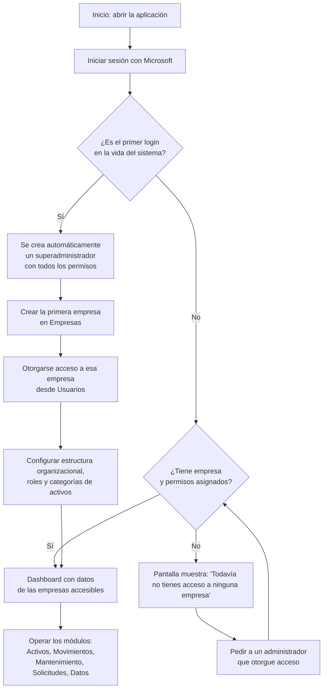
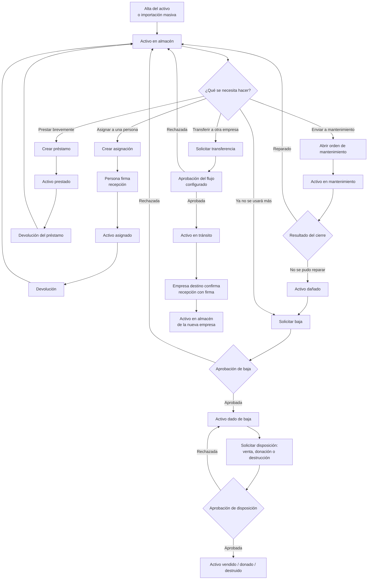
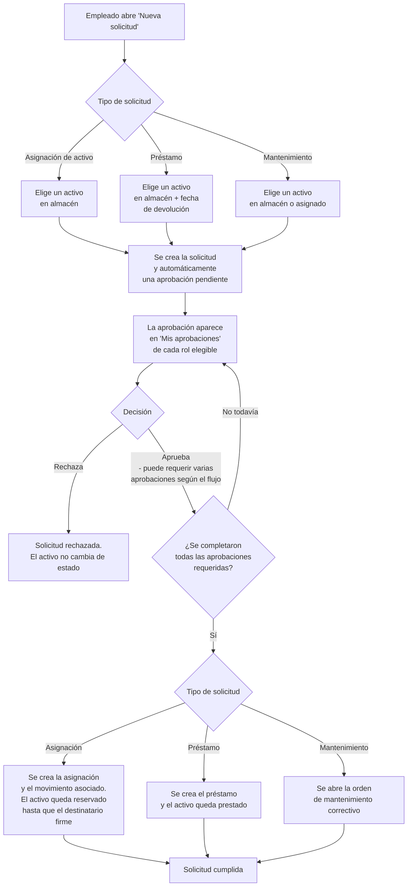

# 9. Flujo operativo completo

Los diagramas de esta sección integran, en una sola vista, los procesos que los capítulos
anteriores documentaron por separado. Sirven como mapa de referencia rápida: no repiten el detalle
de campos, validaciones ni mensajes (ya cubiertos en cada capítulo), solo muestran cómo se
encadenan las pantallas y las decisiones.

## Del primer acceso a la operación diaria

## Ciclo de vida completo de un activo

## Solicitud de autoservicio → aprobación → cumplimiento

## Notas de lectura de estos diagramas

- Las decisiones marcadas como "Aprobación" dependen de que la empresa tenga configurado un flujo
  de aprobación para ese tipo de operación (ver capítulo "Solicitudes y aprobaciones"); sin un flujo
  configurado, el sistema no permite crear la solicitud o la operación correspondiente.
- Cancelar una solicitud propia **no** cierra automáticamente la aprobación pendiente asociada —
  ver la nota correspondiente en el capítulo de Solicitudes y aprobaciones.
- El diagrama de ciclo de vida del activo es una simplificación de la máquina de estados completa
  documentada en el capítulo "Activos" (que incluye además los estados Reservado, Extraviado,
  Robado y En garantía) — consulta ese capítulo para el detalle exhaustivo de las 15 situaciones
  posibles y sus transiciones exactas.
