# Manual de Usuario

## Control de versiones

### Versión
1.0 (generada a partir del análisis exhaustivo del código fuente vigente al momento de la redacción)

### Fecha
2026-09-20

### Autor
Documentación generada mediante análisis automatizado del código fuente y verificación funcional directa sobre un entorno real del sistema, con revisión editorial.

### Alcance
Este manual cubre exclusivamente la **Versión 1 (V1)** del sistema, tal como existe hoy en el código: gestión operativa de activos de TI e infraestructura, multiempresa, sin depreciación ni contabilidad de activos (ver "Beneficios" y notas de alcance funcional más abajo). No documenta funcionalidad planeada a futuro que no esté implementada — cuando una pantalla o botón existe pero no está completamente conectado de extremo a extremo, este manual lo señala explícitamente como tal en vez de presentarlo como una función terminada.

Este documento fue construido leyendo el código fuente real de la aplicación (backend en ASP.NET Core 9 y frontend en Next.js 15) como fuente de verdad, contrastándolo contra la documentación técnica existente del proyecto. Donde el comportamiento observado en el código difiere de lo que otra documentación afirma, este manual describe el comportamiento **real** y lo señala como una nota aclaratoria, para que quien lo use no se sorprenda al usar el sistema.

---

# 1. Introducción

## Objetivo del sistema

El sistema es una aplicación empresarial para la **gestión operativa del inventario de activos de TI e infraestructura** de un grupo de empresas: equipos de cómputo, periféricos, equipo de red, y demás activos tecnológicos. Permite dar de alta cada activo con una etiqueta física (código QR, código de barras u otras tecnologías de identificación), llevar su historial completo de movimientos, asignarlo a personas, prestarlo, transferirlo entre empresas del mismo grupo, enviarlo a mantenimiento, controlar sus garantías, y finalmente darlo de baja y disponer de él (venta, donación o destrucción) de forma auditada.

## Alcance funcional

En esta versión, el sistema cubre:

- **Activos**: alta, edición, reubicación, baja y disposición, con etiquetado automático.
- **Inventario y movimientos**: asignaciones a personas, préstamos de corto plazo, transferencias entre empresas del grupo, y una bitácora consolidada de todo movimiento.
- **Mantenimiento**: checklists reutilizables y órdenes de mantenimiento sobre activos concretos.
- **Consumibles, refacciones y garantías**: control de existencias de insumos, ciclo de vida de piezas serializadas, y coberturas de garantía por activo.
- **Solicitudes y aprobaciones**: un mecanismo de autoservicio para que cualquier persona solicite una asignación, un préstamo o un mantenimiento, sujeto a flujos de aprobación configurables por la empresa.
- **Organización e identidad**: administración de empresas, estructura organizacional interna, roles y permisos, y usuarios (que se crean automáticamente al iniciar sesión por primera vez).
- **Datos**: importación masiva de activos desde archivo CSV, exportación a Excel/PDF, reportes operativos, auditoría de acciones sensibles, plantillas de texto, notificaciones internas y búsqueda global.

**Explícitamente fuera de alcance en V1** (por decisión del cliente, documentada en las reglas del proyecto): no hay depreciación contable de activos, no hay gestión financiera ni de costos más allá de campos informativos de captura libre, y no hay cuentas ni contraseñas locales — el acceso es exclusivamente a través de una cuenta de Microsoft Entra ID de la organización.

## Beneficios

- Un registro único y auditable del inventario de TI de todas las empresas del grupo, sin depender de hojas de cálculo.
- Trazabilidad completa: cada movimiento de un activo (asignación, préstamo, transferencia, reubicación, mantenimiento) queda registrado de forma permanente y no se puede editar ni borrar — solo corregir con un nuevo movimiento.
- Control de acceso centralizado a través de la misma cuenta corporativa que ya usan los empleados para correo y demás sistemas de Microsoft 365, sin contraseñas adicionales que administrar.
- Flujos de aprobación configurables por la propia organización, sin depender de que el proveedor del sistema los programe a la medida.

## Perfil de usuarios

El sistema está pensado para tres perfiles de uso, que en la práctica se definen por los permisos que un administrador les asigne (no son roles fijos de fábrica — ver el capítulo "Gestión de usuarios y permisos"):

- **Personal operativo de TI / Activos**: da de alta activos, los asigna, los envía a mantenimiento, gestiona transferencias.
- **Empleados en general (autoservicio)**: consultan los activos que tienen asignados, confirman su recepción, solicitan un préstamo o reportan un equipo a mantenimiento, y participan en aprobaciones si su rol de negocio se lo permite.
- **Administradores**: configuran empresas, estructura organizacional, roles y permisos, dan de alta a otros usuarios, y configuran los flujos de aprobación de su organización.

---

# 2. Requisitos de acceso

## Navegadores compatibles

El sistema es una aplicación web construida con Next.js 15 (React) y no impone restricciones de navegador específicas en el código; funciona en cualquier navegador moderno con soporte de JavaScript actualizado (Chrome, Edge, Firefox, Safari en sus versiones recientes). No se encontró en el código ninguna advertencia de compatibilidad ni bloqueo por user-agent.

## Dispositivos soportados

La interfaz es responsiva: se adapta a partir de un único punto de quiebre (1024 píxeles de ancho). En pantallas menores a ese ancho (celulares y tabletas en posición vertical) el menú de navegación se colapsa en un botón de menú que abre un panel lateral; en pantallas mayores, el menú permanece fijo a la izquierda. Existe además un componente de aplicación web progresiva (service worker) que cachea la estructura visual básica de la aplicación para una carga más rápida en visitas repetidas, aunque no ofrece funcionalidad completa sin conexión a internet — los datos de negocio siempre requieren conexión al servidor.

## Accesos requeridos

Para usar el sistema se necesita:

1. **Una cuenta de Microsoft Entra ID** válida dentro del tenant (organización) configurado para esta aplicación. No existen cuentas locales ni contraseñas propias del sistema — el inicio de sesión es exclusivamente a través del botón "Iniciar sesión con Microsoft".
2. **Que un administrador te haya dado de alta**, o que tu cuenta sea la primera en usar el sistema (ver el procedimiento de arranque inicial en el capítulo "Configuración inicial"). El solo hecho de iniciar sesión crea tu perfil local, pero **no** te da acceso a ninguna empresa ni permiso por sí mismo — eso lo debe conceder un administrador desde la pantalla de usuarios.
3. **Acceso a al menos una empresa** del sistema para poder usar los módulos operativos (activos, movimientos, mantenimiento, etc.). Sin esto, la mayoría de pantallas mostrarán el mensaje: "Todavía no tienes acceso a ninguna empresa. Pide a un administrador que te agregue desde el módulo de usuarios."

## Roles de usuario

El sistema no trae roles predefinidos de fábrica: los roles se configuran libremente desde la pantalla de administración de Roles, asignándoles los permisos que correspondan de un catálogo fijo. La única excepción es la primera cuenta que inicia sesión en la vida del sistema, que recibe automáticamente un rol de superadministrador con todos los permisos existentes, precisamente para poder configurar todo lo demás sin depender de acceso directo a la base de datos. Ver el capítulo "Gestión de usuarios y permisos" para el detalle completo del catálogo de permisos y ejemplos de combinaciones de rol razonables.

## Consideraciones móviles

- La navegación en pantallas pequeñas usa un menú de tipo panel deslizante (drawer) en vez del menú lateral fijo de escritorio.
- Las tablas de los listados ocultan columnas secundarias en pantallas angostas (por ejemplo, categoría o número de serie en el listado de activos) para priorizar la información esencial.
- No se identificó ninguna función exclusiva de escritorio que esté bloqueada en móvil — todas las pantallas son accesibles, aunque su diseño está optimizado primero para escritorio.

---

# 3. Acceso al sistema

## Inicio de sesión

### Pantalla

Al abrir el sistema sin haber iniciado sesión, se muestra una página de bienvenida con el título
**"Gestión de Activos de TI e Infraestructura"** y el subtítulo **"Registro, etiquetado y control
de activos de TI e infraestructura en todas tus empresas."**

En esta pantalla (ver captura 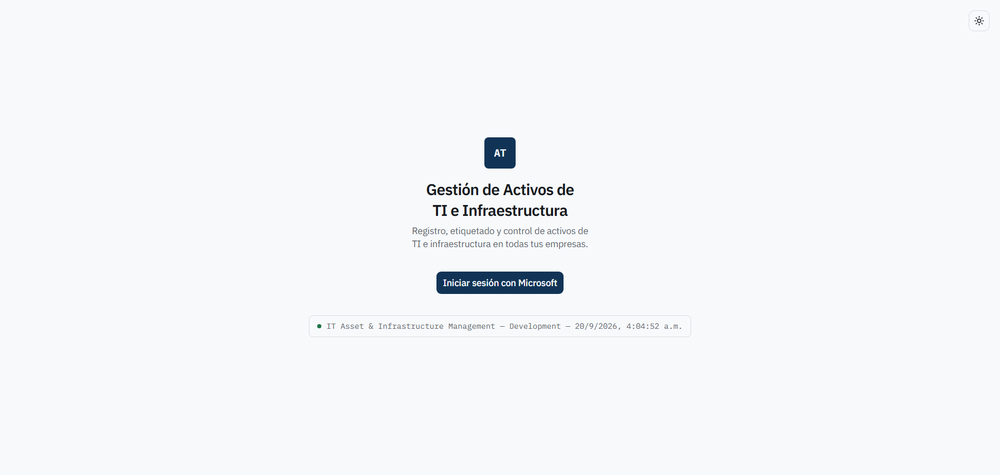) se puede observar:

- Un indicador del estado del servicio (un punto de color verde o rojo) acompañado de un texto con
  el formato `{producto} — {entorno} — {hora del servidor en formato es-MX}`. Este indicador
  consulta al API de forma anónima al cargar la página. Si el API no responde, el punto se muestra
  en rojo y aparece el mensaje **"No fue posible contactar al API."**
- Un selector de tema claro/oscuro, visible incluso sin haber iniciado sesión.
- Un botón para iniciar sesión: **"Iniciar sesión con Microsoft"**.

Al presionar el botón de inicio de sesión, el sistema redirige a la pantalla de autenticación de
Microsoft Entra ID (ver captura ), donde la persona usuaria
ingresa sus credenciales corporativas. Si el tenant de la organización exige verificación en dos
pasos (MFA), Microsoft la solicitará en este mismo flujo, fuera del sistema.

Si la persona ya tiene una sesión activa y regresa a la página de inicio, en lugar del botón de
inicio de sesión verá un botón **"Ir a mi dashboard"**, que la lleva directamente al panel
principal sin pasar de nuevo por Microsoft.

### Campos

El sistema **no tiene formulario propio de usuario y contraseña**. Toda la autenticación se
delega por completo a Microsoft Entra ID (inicio de sesión federado). Esto significa que:

- No existen campos de "usuario" ni "contraseña" dentro de la aplicación.
- No hay opción de "recuperar contraseña" ni de "crear cuenta" — ambas se gestionan, si aplica,
  desde la organización en Microsoft Entra ID, fuera de este sistema.
- El único control disponible en la pantalla de inicio de sesión del sistema es el botón
  **"Iniciar sesión con Microsoft"**, que dispara el flujo de autenticación federada hacia
  Microsoft (protocolo OAuth con inicio de sesión único).

### Validaciones

El sistema realiza las siguientes verificaciones automáticas, sin intervención de la persona
usuaria:

- Al volver de Microsoft con una sesión válida, el sistema consulta el perfil del usuario en el
  API (`GET /api/v1/me`) para obtener sus permisos y las empresas a las que tiene acceso.
- Si es la primera vez que la persona inicia sesión, el sistema crea automáticamente su perfil
  interno, pero **sin ninguna empresa ni rol asignado todavía** — eso lo debe configurar un
  administrador después.
- Si la persona ya había iniciado sesión antes, el sistema actualiza su nombre, correo y fecha de
  último acceso con la información más reciente de Microsoft.
- Si no hay una sesión válida (o si falló la renovación automática de la sesión) al intentar
  entrar al dashboard, el sistema regresa automáticamente a la página de inicio.

### Errores posibles

- **Cuenta desactivada**: si un administrador desactivó la cuenta de la persona usuaria, el
  sistema corta el acceso con el mensaje **"La cuenta de usuario está desactivada."**
- **Error al renovar la sesión**: si la sesión expiró y no fue posible renovarla automáticamente,
  el sistema regresa a la persona a la página de inicio. En este caso particular **no se muestra
  un mensaje explícito de "tu sesión expiró"** — la pantalla de inicio se ve igual que en una
  visita normal, sin distinguir el motivo del regreso. Es una limitación conocida del sistema: si
  usted es enviado inesperadamente a la pantalla de inicio, intente iniciar sesión de nuevo.
- **Cuenta sin empresas asignadas**: no es un error propiamente, pero si la cuenta es nueva y aún
  no tiene ninguna empresa asignada, el dashboard aparecerá vacío (ver "Casos especiales" en la
  sección de Dashboard).

### Procedimiento paso a paso

1. Abra la dirección del sistema en su navegador. Se mostrará la página de inicio
   ().
2. Verifique, si lo desea, el indicador de estado del API en la parte visible de la pantalla.
3. Presione el botón **"Iniciar sesión con Microsoft"**.
4. El navegador lo redirige a la pantalla de autenticación de Microsoft
   (). Escriba su correo y contraseña corporativos.
5. Si su organización tiene habilitada la verificación en dos pasos, complétela cuando Microsoft
   se la solicite.
6. Microsoft lo regresa automáticamente al sistema, ya autenticado.
7. El sistema lo redirige a `/dashboard`.
   - **Si es su primer inicio de sesión**: el sistema crea su perfil interno en ese momento, pero
     usted todavía no tiene ninguna empresa ni permiso asignado. Verá el dashboard
     **completamente en blanco** (a propósito) — ver captura 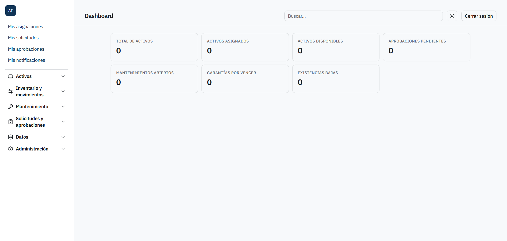, que
     muestra el menú completo pero sin datos ni indicadores. Deberá solicitar a un administrador
     que le asigne una empresa y un rol desde el módulo de usuarios.
   - **Si ya ha iniciado sesión antes y tiene empresas/roles asignados**: el dashboard mostrará los
     indicadores con datos reales, como en la captura 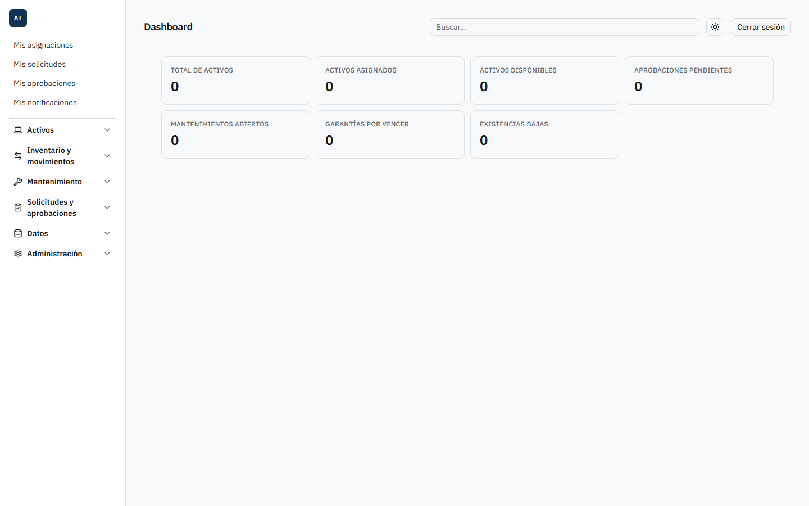.
8. En sesiones posteriores, si usted ya tiene una sesión activa y visita la página de inicio,
   bastará con presionar **"Ir a mi dashboard"** para volver a entrar, sin repetir el paso de
   Microsoft.
9. Para salir del sistema, use el botón **"Cerrar sesión"** de la barra superior (ver sección
   "Barra superior" más abajo).

# 4. Navegación general

## Menú principal

El menú principal se organiza en grupos plegables tipo acordeón, donde solo un grupo permanece
abierto a la vez. Además del menú agrupado, existe una sección de autoservicio siempre visible
para cualquier persona que haya iniciado sesión.

> **Nota importante**: el menú **no oculta opciones según los permisos de la persona usuaria** —
> todas las personas ven todas las opciones del menú, sin importar si tienen permiso para usarlas
> o no. El control de acceso real ocurre al entrar a cada página: si no se tiene el permiso
> correspondiente, la página responderá con un error de acceso denegado (403). Es decir, ver una
> opción en el menú no garantiza poder usarla.

| Grupo | Opciones incluidas |
|---|---|
| Activos | Activos, Categorías, Garantías |
| Inventario y movimientos | Asignaciones, Préstamos, Movimientos, Transferencias, Refacciones, Consumibles |
| Mantenimiento | Mantenimiento, Checklists |
| Solicitudes y aprobaciones | Solicitudes, Flujos de aprobación |
| Datos | Importaciones, Reportes, Plantillas |
| Administración | Empresas, Estructura, Roles, Usuarios, Auditoría |

## Menús secundarios / autoservicio

Independientemente del grupo anterior, toda persona autenticada ve siempre, sin filtrar por
permisos, las siguientes opciones de autoservicio, pensadas para que cada quien gestione lo que
le corresponde de forma personal:

- Mis asignaciones
- Mis solicitudes
- Mis aprobaciones
- Mis notificaciones

## Barra superior

La barra superior (visible en todas las pantallas internas del sistema) incluye:

- **Logo "AT"**: aparece únicamente en pantallas angostas (menores al punto de quiebre móvil,
  ver sección de navegación móvil).
- **Título y subtítulo** de la sección actual.
- **Buscador**: permite buscar por término dentro del sistema.
- **Selector de empresa activa** (`CompanySwitcher`): aparece únicamente en las páginas que lo
  incluyen (alrededor de 20 pantallas de listado y alta de registros). No aparece en el
  `/dashboard` (que siempre muestra datos consolidados de todas las empresas, ver sección 5) ni en
  `/audit` (porque la auditoría es un permiso a nivel de todo el sistema, no ligado a la
  membresía en una empresa en particular).

  > **Nota aclaratoria**: aunque cierta documentación técnica interna describe el cambio de
  > empresa activa como algo pendiente o basado en un mecanismo distinto, en la práctica el
  > selector de empresa **sí existe y funciona**, pero lo hace de una manera particular: el
  > cambio de empresa se guarda como parte de la dirección web (`?companyId=` en la URL) y se
  > gestiona enteramente en el navegador de la persona usuaria, no mediante el mecanismo que otra
  > documentación del proyecto podría hacer suponer. En la práctica, para usted como persona
  > usuaria esto no cambia la forma de usarlo: seleccione la empresa en el desplegable y la
  > página recargará su contenido filtrado a esa empresa. Solo tenga en cuenta que si comparte o
  > guarda el enlace de una página con una empresa seleccionada, ese enlace "recuerda" la empresa
  > elegida.

- **Selector de tema** (`ThemeToggle`): alterna entre tema claro y oscuro. Es un interruptor de
  solo dos posiciones (claro/oscuro); no existe todavía, aunque se planeó, una tercera opción para
  "seguir el tema del sistema operativo".
- **Botón "Cerrar sesión"**: al presionarlo, el sistema cierra la sesión local y además redirige a
  Microsoft para cerrar también la sesión en Entra ID (lo que se conoce como cierre de sesión
  federado). Esto significa que cerrar sesión en el sistema también puede cerrar su sesión general
  de Microsoft, dependiendo de la configuración de su organización.

  > **Nota aclaratoria**: cierta documentación de seguridad del proyecto indica que este cierre de
  > sesión federado está pendiente de implementar. En la práctica, la funcionalidad ya está
  > activa: al cerrar sesión, sí se invalida también la sesión en Microsoft Entra ID.

Debajo de la barra superior siempre se muestra la barra/menú de navegación principal descrita
arriba.

## Acciones rápidas

El buscador de la barra superior funciona como acción rápida disponible desde cualquier pantalla
interna, permitiendo localizar información por término de búsqueda sin necesidad de navegar por
los menús. Fuera de esto, el reporte de análisis no documenta botones de "acciones rápidas"
adicionales (por ejemplo, accesos directos para crear un activo desde cualquier pantalla); si su
instalación cuenta con ellos, no están cubiertos por este capítulo.

## Navegación móvil

El sistema tiene un único punto de quiebre (breakpoint) para adaptar la navegación a pantallas
pequeñas, ubicado en 1024 píxeles de ancho:

- **Pantallas menores a 1024px** (celulares y tablets en vertical): el menú lateral permanece
  oculto por defecto. Aparece un botón de tipo "hamburguesa" que, al presionarse, abre un panel
  deslizante (drawer) desde el lado izquierdo de la pantalla con todas las opciones de
  navegación. Este panel se cierra automáticamente en cuanto se selecciona cualquier opción de
  navegación.
- **Pantallas de 1024px en adelante** (escritorio/laptop): el menú lateral se muestra siempre
  fijo, con un ancho de 224 píxeles, sin necesidad de abrirlo manualmente.
- El logotipo "AT" en la barra superior solo se muestra en las pantallas angostas (menores a
  1024px); en pantallas de escritorio no aparece porque el menú lateral ya está visible.

El sistema también cuenta con una capacidad básica de funcionamiento sin conexión limitada a la
apariencia general de la aplicación (no a los datos): guarda en caché los elementos visuales de la
interfaz (como el menú y la estructura de las páginas) para que la aplicación cargue más rápido,
pero **no guarda en caché la información de activos, movimientos ni ningún otro dato de negocio**.
Esto solo aplica al entorno de producción.

## Dashboard

El dashboard (panel principal) es la primera pantalla que se muestra después de iniciar sesión y
requiere sesión activa. Su contenido depende del permiso **"Dashboards.ViewExecutive"**:

- **Si la persona usuaria cuenta con este permiso**, el sistema consulta los indicadores
  ejecutivos y muestra siete tarjetas de indicador (KPI):

  1. Total de activos
  2. Activos asignados
  3. Activos disponibles
  4. Aprobaciones pendientes (se resalta en color de advertencia cuando hay alguna pendiente)
  5. Mantenimientos abiertos
  6. Garantías por vencer (se resalta en color de advertencia cuando hay garantías que vencen
     dentro de los siguientes 30 días)
  7. Existencias bajas (se resalta en color de alerta/crítico cuando hay existencias por debajo
     del mínimo)

- **Si la persona usuaria no cuenta con este permiso**, no se muestran estos indicadores.

Compare la captura  (dashboard inmediatamente después del primer
inicio de sesión, sin ninguna empresa ni dato configurado — se ve el menú completo, pero sin
indicadores) contra la captura  (dashboard de una cuenta
con al menos una empresa y datos ya cargados, mostrando las siete tarjetas con valores).

**Punto importante sobre el alcance de los datos**: el dashboard ejecutivo **siempre muestra
información consolidada de todas las empresas a las que la persona usuaria tiene acceso**. A
diferencia de otras pantallas del sistema (listados de activos, asignaciones, etc.), el dashboard
**no ofrece un selector de empresa** y no existe manera, desde la interfaz, de acotar estos
indicadores a una sola empresa. Si usted tiene acceso a varias empresas, los totales que ve en el
dashboard son la suma de todas ellas juntas — no de una empresa individual. Actualmente la
pantalla tampoco incluye ningún aviso visual que le recuerde que se trata de una vista
consolidada, así que tome en cuenta esta particularidad al interpretar los números.

**Casos especiales**: Si su cuenta no tiene ninguna empresa asignada todavía, el dashboard se
mostrará vacío, sin los indicadores (esto ocurre por no contar con el permiso correspondiente,
sin un aviso explícito distinto al de una cuenta común sin permisos). En pantallas de listado de
información (no en el dashboard), el sistema sí muestra explícitamente el mensaje "Todavía no
tienes acceso a ninguna empresa. Pide a un administrador que te agregue desde el módulo de
usuarios." Si su cuenta no cuenta con el permiso "Dashboards.ViewExecutive", simplemente no verá
las tarjetas de indicadores, sin un mensaje de error adicional. Si su cuenta fue desactivada por
un administrador, al intentar consultar el dashboard verá el mensaje "Tu cuenta está desactivada.
Contacta a un administrador." Si ocurre cualquier otro problema al consultar el dashboard, se
mostrará el mensaje "No fue posible consultar el dashboard en el API." Por último, si su sesión
expira mientras usa el sistema, el mecanismo de renovación automática intentará mantenerla activa
de forma transparente; si eso falla, será enviado de regreso a la página de inicio sin un aviso
explícito de que su sesión expiró.

---

# 5. Configuración inicial

> **Importante — esta sección reemplaza cualquier instrucción anterior que indique dar de alta el primer administrador, la primera empresa o los primeros roles "directamente en la base de datos" o "por script".** Esas instrucciones correspondían a una versión temprana del sistema en la que la interfaz de administración todavía no existía. **Hoy esa interfaz existe y está completamente operativa de extremo a extremo.** Todo el arranque de un sistema recién desplegado —incluida la creación del primer usuario con privilegios totales— se realiza desde la propia aplicación web, sin tocar la base de datos ni ejecutar scripts manuales.

Un sistema recién desplegado no tiene empresas, ni unidades organizativas, ni roles, ni usuarios cargados. La puesta en marcha sigue siempre esta secuencia, y no puede alterarse:

**Paso 1 — Bootstrap automático del primer superadministrador.**
La primera persona que inicia sesión con su cuenta de Microsoft Entra ID en la vida del sistema recibe automáticamente, sin ninguna acción manual, un rol llamado **"Super Administrador"** con **todos** los permisos del catálogo (a la fecha, 69 permisos). Esto ocurre una sola vez: es una excepción de seguridad deliberada, pensada exclusivamente para resolver el problema de "¿quién administra al primer administrador?", y queda registrada en la auditoría del sistema. La segunda persona que inicia sesión, y todas las siguientes, **no** reciben ningún rol ni acceso automático — deben ser dadas de alta manualmente por alguien que ya tenga los permisos correspondientes (ver §8).

**Paso 2 — Crear la primera empresa.**
Ese primer superadministrador, aunque ya tiene todos los permisos, todavía no tiene acceso a ninguna empresa (el bootstrap otorga permisos, no membresías). Debe entrar a **Administración → Empresas** y crear el primer registro (ver §6.1). Sin al menos una empresa creada, el resto del sistema no tiene dónde operar.

**Paso 3 — Otorgarse a sí mismo acceso a esa empresa.**
Con la empresa ya creada, el superadministrador va a **Administración → Usuarios**, se busca a sí mismo en el listado, entra a su propio perfil y usa la sección "Empresas con acceso" para otorgarse acceso a la empresa recién creada (ver §8). Este paso es indispensable: sin él, pantallas como Estructura organizacional, Activos, Asignaciones, etc. seguirán mostrando el mensaje de "sin acceso a ninguna empresa" aunque el usuario tenga todos los permisos del catálogo.

**Paso 4 — Recién ahora, construir la configuración operativa.**
Con al menos una empresa y acceso a ella, ya es posible:
- Definir la estructura organizacional de esa empresa (§6.2).
- Crear los roles adicionales que necesite la organización y, si corresponde, dar de alta a otros usuarios asignándoles esos roles y el acceso a empresas que les corresponda (§8).
- Definir las categorías de activos y sus campos técnicos (§6.3).
- A partir de ahí, el resto de los módulos operativos (activos, asignaciones, movimientos, mantenimiento, etc.) quedan disponibles.

**Nota:** el selector de empresa activa que aparece en pantallas como Estructura organizacional es solo un filtro de navegación (`?companyId=` en la URL); no otorga acceso por sí mismo. El acceso real a una empresa se define exclusivamente desde el perfil del usuario en **Administración → Usuarios**, tal como se describe en el Paso 3.

---

## Empresas

**Objetivo.** Empresas (`/companies`) es el catálogo de las entidades legales que conviven dentro de un mismo entorno del sistema — hasta 50 empresas comparten un único tenant de Microsoft Entra ID. Es la raíz de toda la segregación multiempresa: cada activo, asignación, movimiento, etc. queda vinculado a una de las empresas de este catálogo.

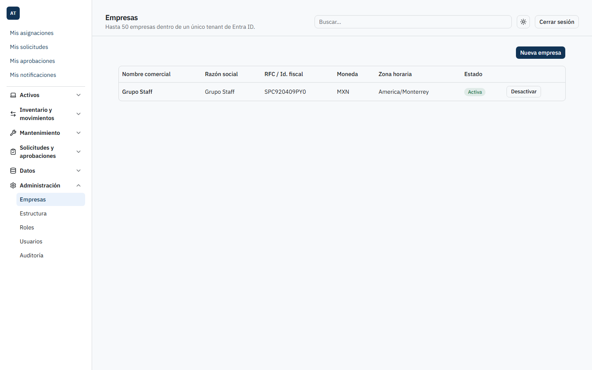

La pantalla de listado muestra, por cada empresa registrada: Nombre comercial, Razón social, RFC/Id. fiscal, Moneda, Zona horaria, Estado (Activa/Inactiva) y un botón para Activar/Desactivar. El subtítulo de la pantalla recuerda el límite: "Hasta 50 empresas dentro de un único tenant de Entra ID." Si todavía no hay ninguna empresa cargada, se muestra el mensaje "Todavía no hay empresas registradas." Si el usuario no tiene el permiso necesario, se muestra "No tienes permiso para consultar empresas (Companies.Read)."

**Configuración.** El alta se hace desde el botón "Nueva empresa", que abre el formulario siguiente:

| Campo | Descripción | Obligatorio | Validaciones |
|---|---|---|---|
| Nombre comercial | Nombre con el que se identifica a la empresa en el día a día. | Sí | Máximo 200 caracteres. Mensaje si falta: "El nombre comercial es obligatorio." |
| Razón social | Denominación legal de la empresa. | Sí | Máximo 200 caracteres. Mensaje si falta: "La razón social es obligatoria." |
| RFC / Identificación fiscal | Identificador fiscal de la empresa. | Sí | Máximo 50 caracteres. Mensaje si falta: "La identificación fiscal es obligatoria." |
| Moneda base (ISO 4217) | Código de moneda en el que opera la empresa. | Sí | Exactamente 3 letras mayúsculas. Valor por defecto al abrir el formulario: `MXN`. Mensaje de dominio si no cumple el formato: "La moneda base debe ser un código ISO 4217 de 3 letras." |
| Zona horaria (IANA) | Zona horaria de referencia de la empresa (usada para fechas y horarios en todo el sistema). | Sí | Lista desplegable poblada con las zonas horarias IANA que reconoce el navegador. Valor por defecto: `America/Mexico_City`. Mensaje de dominio si falta: "La zona horaria es obligatoria." |

Antes de enviar el formulario, si algún campo quedó vacío o la moneda no tiene el formato correcto, el sistema muestra en el propio formulario: "Todos los campos son obligatorios y la moneda debe tener 3 letras (ISO 4217)."

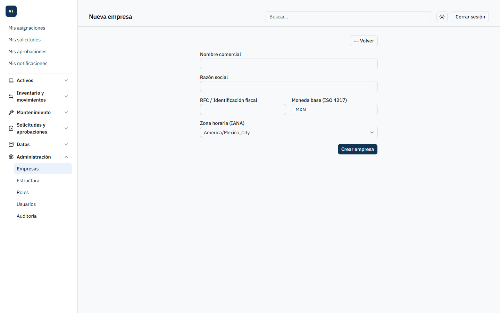

**Valores permitidos.**
- Moneda base: cualquier código de 3 letras en mayúsculas (no se valida contra una lista cerrada de monedas reales, solo el formato).
- Zona horaria: cualquier valor de la lista estándar de zonas horarias IANA que expone el navegador (por ejemplo `America/Mexico_City`, `America/Monterrey`, `America/Bogota`, etc.).
- Cantidad máxima de empresas en el catálogo: **50**. Al intentar crear la número 51, el sistema responde con el error "No se pueden registrar más de 50 empresas."

**Impacto en el sistema.**
- Toda entidad transaccional (activos, asignaciones, movimientos, solicitudes, etc.) queda vinculada a una empresa de este catálogo mediante su `CompanyId`.
- El acceso de un usuario a una empresa es independiente de sus roles: un usuario puede tener el permiso `Companies.Read` y aun así no ver ninguna empresa si nadie le otorgó acceso a ella (ver §8, "Empresas con acceso").
- Desactivar una empresa ("Desactivar" en el listado) no la elimina ni borra su información; solo cambia su estado.

**Limitación conocida:** una vez creada, **no existe forma de editar el perfil de una empresa** (nombre comercial, razón social, RFC, moneda o zona horaria) desde la interfaz. Solo se puede cambiar su estado (Activa/Inactiva). Si se necesita corregir un dato de una empresa ya creada, hoy no hay una vía soportada distinta de contactar a soporte técnico. Verifique con cuidado los datos antes de confirmar el alta.

**Ejemplo de uso.** Una organización llamada "Grupo Staff" despliega el sistema por primera vez. El superadministrador bootstrapeado entra a **Administración → Empresas**, hace clic en "Nueva empresa" y completa: Nombre comercial `Grupo Staff`, Razón social `Grupo Staff`, RFC/Id. fiscal `SPC920409PY0`, Moneda base `MXN`, Zona horaria `America/Monterrey`. Al confirmar con "Crear empresa", la empresa aparece en el listado con estado "Activa".

---

## Estructura organizacional (unidades)

**Objetivo.** Estructura organizacional (`/org-units`) permite construir, empresa por empresa, un árbol jerárquico interno: unidades de negocio, direcciones, gerencias, departamentos, áreas, equipos, sucursales, ubicaciones físicas, almacenes, centros de datos o proyectos. Esta jerarquía se usa después para ubicar activos, encuadrar asignaciones y organizar reportes.

Si el usuario que entra a esta pantalla no tiene acceso a ninguna empresa, ve el mensaje: "Todavía no tienes acceso a ninguna empresa. Pide a un administrador que te agregue desde el módulo de usuarios." — en ese caso, lo que corresponde es completar primero el Paso 3 de §6 (que un administrador le otorgue acceso desde `/users/[id]`).

Con acceso a al menos una empresa, la pantalla muestra un selector de empresa (arriba, junto al buscador) y, debajo, la tabla de unidades de esa empresa: Nombre, Tipo, Código, Estado, y una columna "Mover a" con su botón "Mover". Si la empresa todavía no tiene ninguna unidad cargada, se muestra: "Esta empresa todavía no tiene estructura organizacional." Si falta el permiso correspondiente: "No tienes permiso para consultar la estructura organizacional (Structure.Read)."

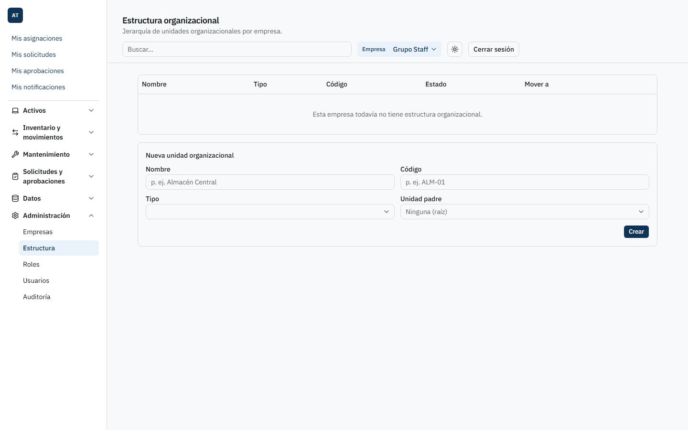

**Configuración.** El formulario de alta ("Nueva unidad organizacional") pide:

| Campo | Descripción | Obligatorio | Validaciones |
|---|---|---|---|
| Nombre | Nombre de la unidad (p. ej. "Almacén Central"). | Sí | Máximo 200 caracteres. Mensaje de dominio si falta: "El nombre de la unidad organizacional es obligatorio." |
| Código | Código corto identificador (p. ej. "ALM-01"). | Sí | Máximo 50 caracteres. Mensaje de dominio si falta: "El código de la unidad organizacional es obligatorio." |
| Tipo | Categoría de la unidad dentro de la jerarquía. | Sí | Debe elegirse de la lista desplegable de tipos activos; un tipo inexistente o inactivo produce un error de "no encontrado". |
| Unidad padre | Unidad de la que depende jerárquicamente. | No | Valor por defecto "Ninguna (raíz)", es decir, sin padre. Si se indica, debe pertenecer a la misma empresa; de lo contrario produce un error de "no encontrado". |

Si el nombre, el código o el tipo quedan vacíos al enviar el formulario, el sistema muestra: "Nombre, código y tipo son obligatorios." Además, el dominio impide que una unidad sea su propio padre: "Una unidad organizacional no puede ser su propio padre."

**Valores permitidos.** Los tipos de unidad organizacional disponibles corresponden a las categorías típicas de una estructura corporativa y física: unidad de negocio, dirección, gerencia, departamento, área, equipo, sucursal, ubicación física, almacén, centro de datos y proyecto.

**Impacto en el sistema.**
- **Mover una unidad** (botón "Mover" junto al selector "Mover a") reubica una unidad dentro del árbol de su misma empresa. El sistema aplica tres controles antes de permitirlo:
  - La nueva unidad padre debe pertenecer a la misma empresa — si no, el error es: "La nueva unidad padre debe pertenecer a la misma empresa."
  - El movimiento no puede crear un ciclo (por ejemplo, mover una unidad para que quede debajo de uno de sus propios descendientes) — error: "El movimiento crearía un ciclo..."
  - Existe un límite de profundidad de validación (hasta 1000 niveles); si se excede, el error es: "La jerarquía organizacional es demasiado profunda para validarse."
- **Activar/Desactivar** cambia el estado de la unidad sin eliminarla.
- No existe edición del nombre o el código de una unidad ya creada: solo se puede dar de alta, mover, activar o desactivar.

**Ejemplo de uso.** Sobre la empresa "Grupo Staff", un administrador crea primero una unidad raíz: Nombre `Dirección de Tecnología`, Código `DT`, Tipo `Dirección`, Unidad padre `Ninguna (raíz)`. Luego crea una segunda unidad: Nombre `Almacén Central`, Código `ALM-01`, Tipo `Almacén`, Unidad padre `Dirección de Tecnología`. Si más adelante la organización decide que el almacén dependa directamente de una nueva "Gerencia de Operaciones", basta con usar "Mover a" sobre la fila de "Almacén Central" y seleccionar la nueva unidad padre.

---

## Categorías de activos y campos técnicos personalizados

**Objetivo.** Categorías de activos (`/asset-categories`) es el catálogo que define los **tipos de activo** que la organización administra (laptops, celulares, monitores, servidores, etc.) y, para cada tipo, los **campos técnicos personalizados** que se le piden a cualquier activo de esa categoría (por ejemplo, "RAM (GB)" para laptops o "Número de puertos" para switches).

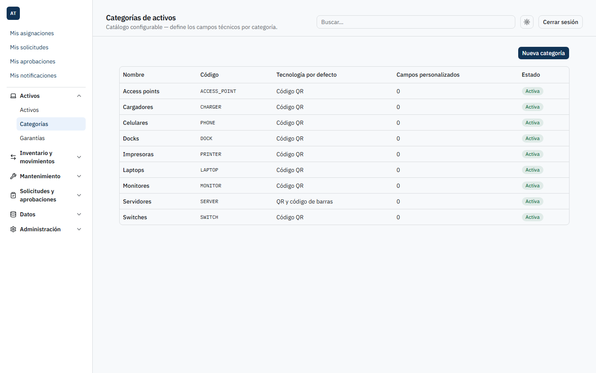

El listado muestra, por categoría: Nombre (con enlace al detalle), Código, Tecnología de identificación por defecto, cantidad de Campos personalizados y Estado. Si falta el permiso correspondiente, el mensaje es: "No tienes permiso para consultar categorías (Catalogs.Read)." **Nota importante:** aunque la entidad se llama "categorías de activos", el permiso que la controla no es uno dedicado, sino el permiso general de catálogos (`Catalogs.Read` / `Catalogs.Create` / `Catalogs.Update`) — ver la tabla completa en §8.

**Configuración — alta de categoría.** El botón "Nueva categoría" abre este formulario:

| Campo | Descripción | Obligatorio | Validaciones |
|---|---|---|---|
| Nombre | Nombre de la categoría (p. ej. "Laptops"). | Sí | Máximo 100 caracteres. |
| Código | Código corto único (p. ej. "LAPTOP"). | Sí | Máximo 50 caracteres. Debe ser único en todo el sistema — si ya existe, el error es: "Ya existe una categoría con el código '{código}'." |
| Tecnología de identificación por defecto | Tecnología de trazabilidad física que se sugiere por defecto para los activos de esta categoría. | Sí (tiene valor por defecto) | Lista desplegable: Código QR / Código de barras / QR y código de barras / NFC / RFID. Valor por defecto: Código QR. |

Si Nombre o Código quedan vacíos, el sistema muestra: "Nombre y código son obligatorios." (En el dominio: "El nombre de la categoría es obligatorio." / "El código de la categoría es obligatorio.")

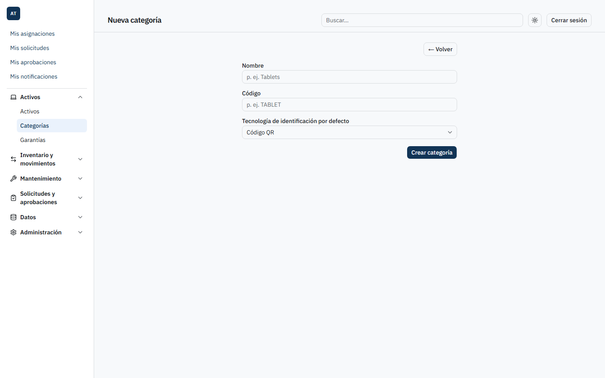

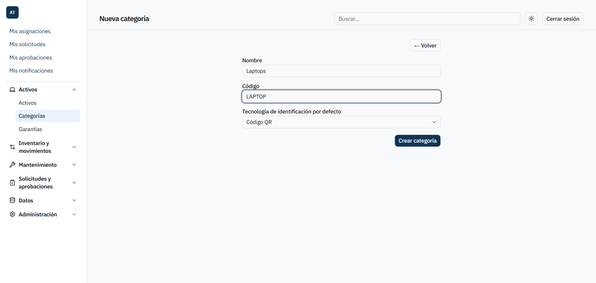

**Configuración — campos técnicos personalizados.** Una vez creada la categoría, se entra a su detalle (`/asset-categories/[id]`) para definir sus campos técnicos. *[Captura pendiente: pantalla de detalle de categoría de activos]* Esa pantalla muestra un encabezado con el botón Activar/Desactivar de la categoría, una tabla con los campos técnicos ya definidos (Nombre, Código, Tipo, Obligatorio, Opciones) y el formulario "Agregar campo técnico":

| Campo | Descripción | Obligatorio | Validaciones |
|---|---|---|---|
| Nombre | Nombre del campo técnico (p. ej. "RAM (GB)"). | Sí | Máximo 100 caracteres. |
| Código | Código corto del campo, único dentro de la categoría. | Sí | Máximo 50 caracteres. Si se repite dentro de la misma categoría: "Ya existe un campo personalizado con el código '{código}' en esta categoría." |
| Tipo de dato | Naturaleza del valor que se va a capturar. | Sí | Texto / Número / Fecha / Sí-No / Selección. |
| Obligatorio | Si el campo debe completarse siempre al registrar un activo de esta categoría. | No (casilla) | — |
| Opciones | Lista de valores posibles, solo aplica al tipo "Selección". | Sí, únicamente si Tipo de dato = Selección | Si se elige "Selección" sin cargar ninguna opción: "Un campo de selección necesita al menos una opción." |

Si Nombre o Código del campo quedan vacíos: "Nombre y código son obligatorios."

**Valores permitidos.**
- Tecnología de identificación: Código QR, Código de barras, QR y código de barras, NFC, RFID.
- Tipo de dato del campo técnico: Texto, Número, Fecha, Sí/No, Selección (esta última exige al menos una opción).

**Impacto en el sistema.** Los campos técnicos definidos aquí son los que después aparecen en el alta y el detalle de cada activo perteneciente a esa categoría, con la obligatoriedad configurada. Desactivar una categoría no borra los activos ya registrados en ella, pero impide su uso para altas nuevas.

**Limitación conocida:** no existe edición ni borrado de un campo técnico una vez creado. Si se necesita corregir el nombre, el tipo de dato o las opciones de un campo, no hay una vía soportada desde la interfaz para modificarlo — revise cuidadosamente cada campo antes de guardarlo.

**Nota sobre mensajes de error:** un código de categoría duplicado se rechaza con un error de "conflicto" (409), mientras que un código de campo técnico duplicado dentro de la misma categoría se rechaza con un error de "regla de negocio" (422). Ambos casos representan el mismo tipo de problema (una duplicidad), pero el sistema los reporta con clasificaciones distintas; en la práctica, el mensaje en pantalla es igualmente claro en ambos casos, aunque un usuario que integre el sistema con herramientas externas debe tenerlo en cuenta.

**Ejemplo de uso.** Se necesita registrar el modelo, la memoria RAM y si el equipo tiene garantía extendida en cada laptop. Se crea la categoría Nombre `Laptops`, Código `LAPTOP`, Tecnología `Código QR`. Luego, dentro del detalle de esa categoría, se agregan tres campos técnicos: `Modelo` (Texto, obligatorio), `RAM (GB)` (Número, obligatorio) y `Garantía extendida` (Sí/No, no obligatorio). A partir de ese momento, cualquier laptop que se dé de alta en el módulo de Activos bajo la categoría "Laptops" solicitará esos tres datos.

---

---

# 6. Administración de activos y operación

Este capítulo es el más extenso del manual porque cubre todos los módulos operativos del día a día:
el ciclo de vida completo de un activo, los movimientos de inventario (asignaciones, préstamos,
transferencias), el mantenimiento, los consumibles/refacciones/garantías, las solicitudes y
aprobaciones, y finalmente las herramientas de datos transversales (importación masiva, documentos,
auditoría, plantillas y notificaciones). Cada subsección sigue el mismo formato: objetivo, cuándo
utilizar el proceso, paso a paso, campos, botones, reglas de negocio, mensajes del sistema, casos
especiales, resultado esperado y buenas prácticas.

## 6.1 Activos

El módulo de Activos es el registro maestro de inventario de TI de la aplicación. Es el punto de entrada de todo el ciclo de vida de un equipo: alta con folio y etiqueta, edición de sus datos, reubicación física dentro de la empresa, y su salida definitiva del inventario mediante baja y disposición. Todos los demás módulos operativos (Asignaciones, Préstamos, Mantenimiento, Movimientos, Transferencias entre empresas, Aprobaciones) actúan **sobre** un activo que ya existe en este registro.

Solo pueden usar este módulo los usuarios de TI/Activos de cada empresa del grupo. Las acciones de alta, edición, reubicación, baja y disposición requieren permisos específicos (`Assets.Create`, `Assets.Update`, `Assets.Decommission`, `Assets.Read`) que el sistema valida siempre en el servidor, sin importar lo que muestre o permita la pantalla.

**Importante para toda esta sección**: en esta versión del sistema **no existe depreciación ni contabilidad de activos**. Los campos financieros (costo, factura, proveedor, orden de compra, etc.) son de captura libre y puramente informativos — el sistema no realiza ningún cálculo, amortización ni asiento contable a partir de ellos.

---

### El ciclo de vida de un activo

Cada activo del inventario transita a lo largo de su vida útil por una serie fija de **estados**. El sistema controla estrictamente qué cambios de estado son posibles: no es posible, por ejemplo, marcar como "vendido" un activo que nunca fue dado de baja, ni "asignar" un activo que está en trámite de baja. Si una pantalla o una integración intenta forzar un cambio que no está permitido, el sistema lo rechaza con el mensaje **"No es válido transicionar un activo de '{estado origen}' a '{estado destino}'."**

A continuación se explica, en términos de negocio, qué significa cada estado:

- **En almacén** (`InWarehouse`): el activo está disponible, no asignado a ninguna persona ni en préstamo. Es el estado de "reposo" normal y también el estado inicial de todo activo recién dado de alta.
- **Reservado** (`Reserved`): el activo está apartado para una asignación o préstamo futuro, pero todavía no salió físicamente del almacén.
- **Asignado** (`Assigned`): el activo está entregado de forma permanente a un colaborador o a un puesto de trabajo.
- **Prestado** (`OnLoan`): el activo salió temporalmente bajo la modalidad de préstamo (con fecha de devolución esperada).
- **En tránsito** (`InTransit`): el activo está en movimiento físico entre ubicaciones (por ejemplo, en camino a otra sucursal), sin haber llegado aún a su destino.
- **En mantenimiento** (`InMaintenance`): el activo está fuera de servicio porque tiene una orden de mantenimiento abierta.
- **En garantía** (`UnderWarranty`): el activo está en proceso de reparación o reemplazo por parte del proveedor, cubierto por su garantía.
- **Dañado** (`Damaged`): el activo presenta un daño que le impide operar con normalidad, pendiente de decidir si se repara o se da de baja.
- **Extraviado** (`Lost`): el activo se reportó como perdido.
- **Robado** (`Stolen`): el activo se reportó como robado.
- **Pendiente de baja** (`PendingDecommission`): se solicitó la baja del activo y esa solicitud está esperando la aprobación correspondiente. El activo ya no está disponible para uso mientras se resuelve.
- **Dado de baja** (`Decommissioned`): la baja fue aprobada; el activo salió de servicio de forma definitiva, aunque todavía permanece en el inventario en espera de definir su destino final.
- **Vendido** (`Sold`), **Donado** (`Donated`) y **Destruido** (`Destroyed`): son los tres destinos finales posibles de un activo dado de baja, una vez aprobada su disposición. Son estados terminales: un activo que llega a cualquiera de ellos ya no puede volver a moverse dentro del sistema.

El siguiente diagrama muestra el mapa completo de transiciones permitidas:

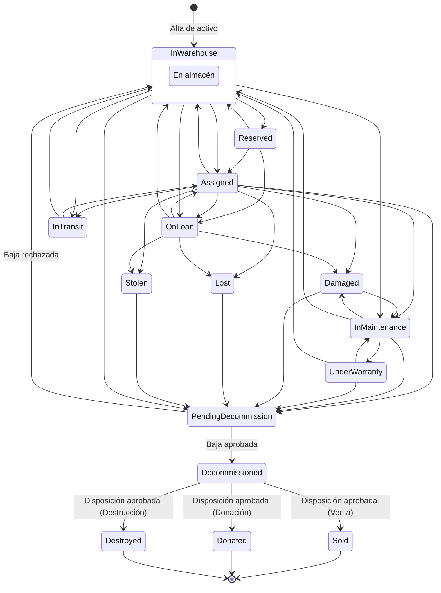
```mermaid
stateDiagram-v2
    [*] --> InWarehouse: Alta de activo

    InWarehouse --> Reserved
    InWarehouse --> Assigned
    InWarehouse --> OnLoan
    InWarehouse --> InTransit
    InWarehouse --> InMaintenance
    InWarehouse --> PendingDecommission

    Reserved --> InWarehouse
    Reserved --> Assigned
    Reserved --> OnLoan

    Assigned --> InWarehouse
    Assigned --> OnLoan
    Assigned --> InTransit
    Assigned --> InMaintenance
    Assigned --> Damaged
    Assigned --> Lost
    Assigned --> Stolen
    Assigned --> PendingDecommission

    OnLoan --> InWarehouse
    OnLoan --> Assigned
    OnLoan --> Damaged
    OnLoan --> Lost
    OnLoan --> Stolen

    InTransit --> InWarehouse
    InTransit --> Assigned

    InMaintenance --> InWarehouse
    InMaintenance --> UnderWarranty
    InMaintenance --> PendingDecommission
    InMaintenance --> Damaged

    UnderWarranty --> InWarehouse
    UnderWarranty --> InMaintenance
    UnderWarranty --> PendingDecommission

    Damaged --> InMaintenance
    Damaged --> PendingDecommission

    Lost --> PendingDecommission
    Stolen --> PendingDecommission

    PendingDecommission --> Decommissioned: Baja aprobada
    PendingDecommission --> InWarehouse: Baja rechazada

    Decommissioned --> Sold: Disposición aprobada (Venta)
    Decommissioned --> Donated: Disposición aprobada (Donación)
    Decommissioned --> Destroyed: Disposición aprobada (Destrucción)

    Sold --> [*]
    Donated --> [*]
    Destroyed --> [*]

    state InWarehouse {
        note: En almacén
    }
```

Puntos importantes a tener presentes como usuario:

- Un activo **nuevo siempre nace "En almacén"**. No existe forma de crear un activo directamente en otro estado.
- Muchos de los cambios de estado (asignar, prestar, poner en mantenimiento, transferir entre empresas) **no se disparan desde este módulo**, sino desde los módulos de Asignaciones, Préstamos, Mantenimiento y Transferencias. El módulo de Activos solo dispara directamente la creación, la solicitud de baja y la solicitud de disposición.
- **La solicitud de baja cambia el estado de inmediato**, a "Pendiente de baja", sin esperar a que la aprobación se resuelva. Si la aprobación se **rechaza**, el activo regresa automáticamente a "En almacén" — sin importar cuál era su estado antes de solicitar la baja.
- **La solicitud de disposición NO cambia el estado mientras está pendiente.** El activo permanece visiblemente "Dado de baja" durante todo el trámite; solo cambia a Vendido/Donado/Destruido si la disposición se aprueba. Si se rechaza, simplemente no ocurre nada: el activo se queda "Dado de baja".
- Quién debe aprobar una baja o una disposición **no es un permiso fijo de este módulo**: depende de cómo cada empresa haya configurado sus flujos de aprobación en el módulo correspondiente. Consulte con su administrador si no sabe quién debe autorizar estas solicitudes en su empresa.

---

### Consultar el listado de activos

#### Objetivo
Permitir a un usuario con acceso al módulo consultar, filtrar, buscar y exportar el inventario de activos de TI de su empresa.

#### Cuándo utilizarlo
Es el punto de partida habitual del módulo: úselo cuando necesite ubicar un activo concreto, revisar cuántos activos hay en un estado o categoría determinados, o generar un archivo de Excel/PDF con el inventario (completo o filtrado) para reportes internos o auditorías.

#### Paso a paso detallado

1. Acceda a la sección **"Activos"** del menú. Se muestra el encabezado **"Activos"** con el subtítulo **"Inventario de activos de TI por empresa."**

   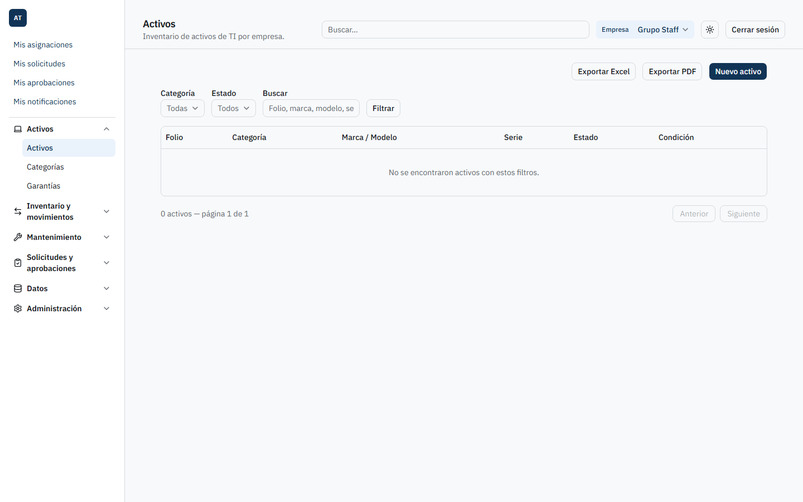

2. Si lo desea, use los filtros disponibles en la parte superior de la tabla: **Categoría**, **Estado** y el campo de **Buscar**.
3. Escriba, si aplica, un término en el campo de búsqueda (folio, marca, modelo o número de serie).
4. Pulse el botón **"Filtrar"** para aplicar los criterios. La pantalla recarga la lista respetando los filtros indicados.
5. Revise los resultados en la tabla. Si hay más de 20 activos que cumplen los filtros, use el componente de paginación al pie de la tabla para navegar entre páginas (20 elementos por página).
6. Para consultar el detalle de un activo específico, haga clic sobre su **folio** (aparece como enlace, en fuente monoespaciada) en la primera columna.
7. Para descargar el inventario filtrado, use los botones **"Exportar Excel"** o **"Exportar PDF"** (ver más abajo).
8. Para dar de alta un nuevo activo, use el botón **"Nuevo activo"**.

   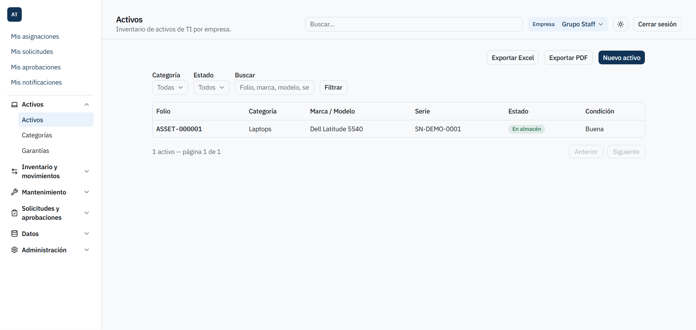

#### Campos

**Filtros del listado:**

| Campo | Descripción | Obligatorio | Validaciones |
|---|---|---|---|
| Categoría | Lista desplegable con la opción "Todas" seguida de las categorías de activos activas en la empresa | No | Ninguna — si no se selecciona, no filtra por categoría |
| Estado | Lista desplegable con la opción "Todos" seguida de los 15 estados posibles del activo | No | Ninguna |
| Buscar | Campo de texto libre, con el texto de ejemplo **"Folio, marca, modelo, serie"** | No | Búsqueda por coincidencia parcial (subcadena) contra el folio interno, la marca, el modelo y el número de serie |

**Columnas de la tabla de resultados:**

| Columna | Descripción | Visible en móvil |
|---|---|---|
| Folio | Folio interno del activo, enlaza al detalle, en fuente monoespaciada | Sí |
| Categoría | Nombre de la categoría del activo | No (oculta en pantallas pequeñas) |
| Marca/Modelo | Marca y modelo del activo | Sí |
| Serie | Número de serie | No (oculta en pantallas pequeñas) |
| Estado | Insignia (badge) con color según el estado | Sí |
| Condición | Condición física del activo | No (oculta en pantallas pequeñas) |

#### Botones y acciones

| Botón/acción | Efecto |
|---|---|
| Filtrar | Recarga la lista aplicando los filtros de Categoría, Estado y Buscar (mediante parámetros en la URL) |
| Exportar Excel | Descarga el inventario en formato `.xlsx`, respetando los filtros actualmente aplicados |
| Exportar PDF | Descarga el inventario en formato `.pdf`, respetando los filtros actualmente aplicados |
| Nuevo activo | Navega al formulario de alta de activo |
| Clic en el folio | Navega al detalle del activo correspondiente |

#### Reglas de negocio

- La lista siempre está acotada a la empresa activa del usuario (`CompanyId`); no es posible ver desde este listado activos de una empresa a la que el usuario no tiene acceso.
- La búsqueda por texto usa coincidencia de subcadena; la distinción entre mayúsculas y minúsculas depende de la configuración regional de la base de datos, por lo que en algunos entornos una búsqueda puede comportarse de forma distinta según el uso de mayúsculas.
- Los botones de exportación generan el archivo respetando exactamente los mismos filtros de categoría, estado y búsqueda que estén aplicados en pantalla en ese momento.

#### Mensajes del sistema

**Errores:**
- "No tienes permiso para consultar activos (Assets.Read)." — se muestra cuando el usuario no cuenta con el permiso necesario (respuesta 403 del servidor).
- "No fue posible consultar los activos." — mensaje genérico para cualquier otro error al cargar el listado o las categorías.
- "No se encontraron activos con estos filtros." — se muestra dentro de la tabla cuando la combinación de filtros no arroja resultados.

#### Casos especiales

- Si la empresa actual del usuario no tiene ninguna empresa asociada, en lugar del listado se muestra un panel informativo indicando que no hay empresa disponible (pantalla compartida con otros módulos del sistema).
- Si escribe un término de búsqueda muy corto o muy genérico, es normal obtener muchos resultados: combine la búsqueda con los filtros de Categoría o Estado para acotar mejor.

#### Resultado esperado
El usuario visualiza únicamente los activos de su empresa que cumplen los filtros indicados, puede navegar al detalle de cualquiera de ellos y puede obtener un archivo de exportación (Excel o PDF) con exactamente ese mismo subconjunto de datos.

#### Buenas prácticas
- Utilice el campo de búsqueda combinado con el filtro de Estado para ubicar rápidamente, por ejemplo, todos los equipos "Dañados" de una marca concreta.
- Antes de exportar un reporte para una auditoría, verifique que los filtros aplicados en pantalla correspondan exactamente al alcance que necesita, ya que la exportación respeta esos mismos filtros.
- Use el filtro de Categoría junto con el de Estado para dar seguimiento periódico a los equipos "Pendiente de baja" o "En mantenimiento" de cada línea de activos.

---

### Dar de alta un activo

#### Objetivo
Registrar un nuevo activo en el inventario de la empresa, generando automáticamente su folio interno y su etiqueta de identificación.

#### Cuándo utilizarlo
Cada vez que ingrese un equipo nuevo (o uno que no estaba registrado) al inventario de TI de la empresa: una compra nueva, un equipo que se incorpora desde otra fuente, etc.

#### Paso a paso detallado

1. Desde el listado de activos, pulse **"Nuevo activo"**. Se abre la pantalla con encabezado **"Nuevo activo"** y subtítulo **"Alta y etiquetado — se genera folio y etiqueta al guardar."**

   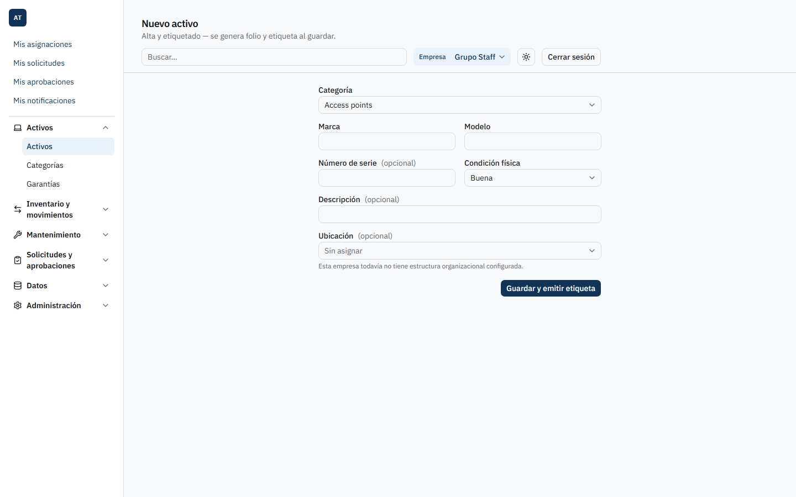

2. Si la empresa no tiene ninguna categoría de activos activa, el formulario no puede continuar y se muestra el mensaje **"No hay categorías de activos activas todavía. Pide a un administrador que las configure."** En ese caso, solicite a un administrador que configure al menos una categoría antes de continuar.
3. Seleccione la **Categoría** del activo. Al elegirla, el formulario incorpora automáticamente los **campos técnicos** propios de esa categoría (ver explicación de campos dinámicos más abajo).
4. Complete **Marca** y **Modelo** (obligatorios).
5. Capture, si lo desea, el **Número de serie** y la **Descripción**.
6. Seleccione la **Condición física** (por defecto viene en "Buena").
7. Seleccione, si aplica, la **Ubicación** inicial del activo dentro de la estructura organizacional de la empresa. Si la empresa todavía no tiene unidades organizacionales configuradas, se muestra el aviso **"Esta empresa todavía no tiene estructura organizacional configurada."** y el activo puede darse de alta igualmente sin ubicación (queda "Sin asignar").
8. Complete los **campos técnicos de la categoría** que hayan aparecido dinámicamente (ver más abajo). Los marcados como obligatorios por el administrador de categorías deben llenarse forzosamente.

   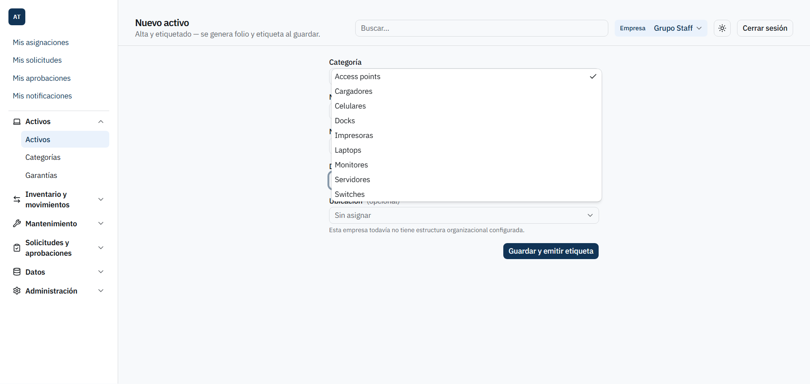

9. Pulse **"Guardar y emitir etiqueta"**. El botón cambia a **"Guardando…"** y se deshabilita mientras se procesa la solicitud.
10. Si todo es correcto, el sistema crea el activo, genera su folio interno, emite su etiqueta y lo redirige automáticamente al detalle del activo recién creado.

#### Campos dinámicos por categoría — explicación

Cada categoría de activo puede tener definidos sus propios **campos técnicos personalizados** (por ejemplo, "Capacidad de RAM" para laptops, "Tamaño de pantalla" para monitores, etc.), configurados previamente por un administrador en el módulo de Categorías. Al elegir una categoría en el formulario de alta:

- El formulario muestra automáticamente todos los campos técnicos definidos para esa categoría, con el tipo de control que corresponde a su tipo de dato: texto, número, fecha, o una lista de selección (Sí/No para campos booleanos, o las opciones configuradas para campos de selección).
- Cada campo técnico puede ser obligatorio u opcional, según lo haya definido el administrador al crear la categoría. Los campos obligatorios se marcan como tales en el formulario (`required`).
- Si cambia de categoría después de haber llenado algunos campos técnicos, los campos mostrados cambian para reflejar la nueva categoría.
- El servidor valida, de forma independiente a lo que muestre la pantalla, que **todos** los campos obligatorios de la categoría elegida estén presentes y que **ninguno** de los valores enviados corresponda a un campo de otra categoría distinta.

#### Campos

| Campo | Descripción | Obligatorio | Validaciones |
|---|---|---|---|
| Categoría | Categoría del activo; determina los campos técnicos dinámicos que se muestran | Sí | Debe seleccionarse una categoría existente |
| Marca | Marca comercial del equipo | Sí | Máximo 100 caracteres |
| Modelo | Modelo del equipo | Sí | Máximo 100 caracteres |
| Número de serie | Número de serie del fabricante | No | Máximo 100 caracteres |
| Condición física | Estado físico del equipo (por defecto "Buena") | Sí | Debe ser uno de los valores permitidos |
| Descripción | Texto libre descriptivo | No | Máximo 500 caracteres |
| Ubicación | Unidad organizacional donde queda físicamente el activo (por defecto "Sin asignar") | No | Si se indica, debe existir y pertenecer a la misma empresa |
| Campos técnicos de la categoría | Definidos dinámicamente por la categoría elegida (texto, número, fecha, Sí/No o lista de opciones) | Depende de la configuración de cada campo en la categoría | Deben pertenecer a la categoría elegida; los obligatorios de la categoría deben estar presentes |

#### Botones y acciones

| Botón | Efecto |
|---|---|
| Guardar y emitir etiqueta | Envía el formulario, crea el activo, genera el folio interno y emite la etiqueta en una sola operación. Cambia a "Guardando…" y se deshabilita mientras se procesa |

#### Reglas de negocio

- El folio interno se genera automáticamente al guardar; no se captura manualmente.
- La etiqueta se emite automáticamente en la misma operación de alta. **Un activo solo puede tener una etiqueta emitida en toda su vida** — no existe un flujo posterior de "reemitir etiqueta", solo de reimprimir la misma etiqueta ya emitida (ver sección 6.8).
- No es posible dar de alta un activo con una categoría desactivada: si se intenta, el servidor rechaza la operación aunque los activos ya existentes de esa categoría no se vean afectados.
- El activo se crea siempre en el estado inicial "En almacén", sin excepción.
- El número de serie, cuando se captura, debe ser único dentro de la empresa (no se exige unicidad si se deja vacío).

#### Mensajes del sistema

**Éxito:**
- Redirección directa al detalle del activo recién creado (sin mensaje de confirmación adicional en pantalla; la llegada al detalle es la confirmación).

**Error:**
- "Empresa, categoría, marca y modelo son obligatorios." — validación previa a enviar el formulario, cuando falta alguno de estos datos clave.
- "No fue posible crear el activo." — mensaje de reserva (fallback) cuando el servidor rechaza la operación sin un detalle más específico.
- Cuando el servidor sí devuelve un detalle específico del error, ese texto se muestra literalmente en lugar del mensaje de reserva.
- "No hay categorías de activos activas todavía. Pide a un administrador que las configure." — si no hay categorías disponibles.
- "Esta empresa todavía no tiene estructura organizacional configurada." — si la empresa no tiene unidades organizacionales.

**Errores de validación de campos personalizados (del servidor):**
- "Faltan campos obligatorios de la categoría: {lista de nombres}." — si no se completó algún campo técnico obligatorio de la categoría.
- "Uno o más campos personalizados no pertenecen a esta categoría." — si se envía un valor para un campo técnico que no corresponde a la categoría elegida.

#### Casos especiales

- Si cambia la categoría después de haber capturado valores en los campos técnicos, esos valores capturados para la categoría anterior se descartan visualmente al cambiar el conjunto de campos mostrados.
- Un campo técnico de tipo "Lista de selección" siempre tiene opciones predefinidas por el administrador de categorías; no es posible escribir un valor libre en ese tipo de campo.
- No hay pantalla de confirmación intermedia antes de guardar: al pulsar el botón, el alta se ejecuta de inmediato.

#### Resultado esperado
El activo queda registrado en el inventario de la empresa, en estado "En almacén", con folio interno y etiqueta generados automáticamente, y el usuario es dirigido al detalle del activo recién creado.

#### Buenas prácticas
- Capture el número de serie siempre que esté disponible físicamente en el equipo: facilita búsquedas futuras y previene altas duplicadas.
- Revise con atención los campos técnicos obligatorios de la categoría antes de guardar, ya que un campo faltante detiene el alta con un mensaje que lista los campos pendientes.
- Asigne la ubicación inicial correcta desde el alta cuando sea posible; recuerde que después del alta, cambiar la ubicación requiere usar la operación de reubicación (sección 6.5), no la edición general.

---

### Ver el detalle de un activo

#### Objetivo
Consultar toda la información registrada de un activo específico: datos generales, identificación/etiqueta, información financiera, garantía y soporte, campos técnicos de su categoría, historial de movimientos y documentos adjuntos.

#### Cuándo utilizarlo
Cuando necesite revisar el estado y los datos completos de un activo puntual, antes de editarlo, reubicarlo, solicitarle una baja/disposición, o simplemente para consulta.

#### Paso a paso detallado

1. Acceda al detalle haciendo clic en el folio de un activo desde el listado (sección 6.1), o navegando directamente a su URL si conoce el identificador.

   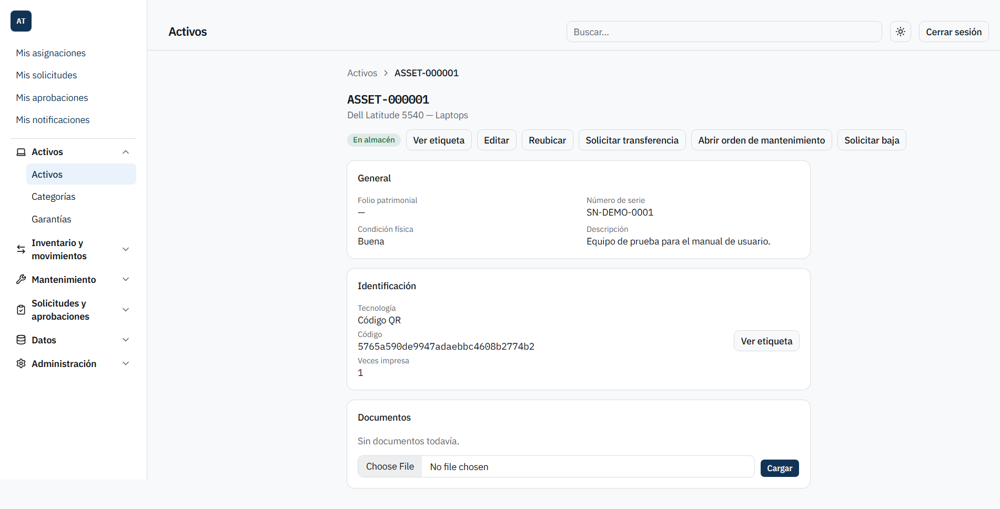

2. Revise el encabezado: folio (en fuente monoespaciada), marca/modelo, categoría y la insignia de estado.
3. Revise la tarjeta **General**: Folio patrimonial, Número de serie, Condición física, Descripción.
4. Si el activo tiene etiqueta emitida, revise la tarjeta **Identificación**: Tecnología, Código (monoespaciado) y Veces impresa.
5. Si existe al menos un dato capturado, revise la tarjeta **Información financiera (informativa)**: Fecha de adquisición, Costo (con su moneda), Proveedor, Factura, Orden de compra.
6. Si existe al menos un dato capturado, revise la tarjeta **Garantía y soporte**: Inicio de garantía, Fin de garantía, Contrato de soporte, Proveedor de soporte.
7. Si la categoría del activo tiene campos técnicos con valores capturados, revise la tarjeta de **Campos técnicos** correspondiente.
8. Si el activo tiene movimientos registrados, revise el **Historial de movimientos** (hasta los 20 más recientes): folio del movimiento, tipo y fecha.
9. Revise el panel de **Documentos** para ver los archivos adjuntos al activo.
10. Use los botones de acción disponibles según el estado actual del activo (ver más abajo) para editar, reubicar, transferir, mandar a mantenimiento, dar de baja o disponer del activo, o ver su etiqueta.

#### Campos

Todos los campos de esta pantalla son de solo lectura. Cualquier campo sin valor capturado se muestra como **"—"**.

| Tarjeta | Campos mostrados |
|---|---|
| General | Folio patrimonial, Número de serie, Condición física, Descripción |
| Identificación (solo si hay etiqueta) | Tecnología, Código, Veces impresa |
| Información financiera (solo si hay algún dato) | Fecha de adquisición, Costo (con moneda), Proveedor, Factura, Orden de compra |
| Garantía y soporte (solo si hay algún dato) | Inicio de garantía, Fin de garantía, Contrato de soporte, Proveedor de soporte |
| Campos técnicos de la categoría (solo si hay valores) | Lista dinámica según la configuración de la categoría |
| Historial de movimientos (solo si hay registros) | Folio, Tipo, Fecha (formato es-MX) — hasta 20 más recientes |
| Documentos | Archivos adjuntos al activo |

#### Botones y acciones

| Botón | Condición para mostrarse | Efecto |
|---|---|---|
| Ver etiqueta | El activo tiene etiqueta emitida | Navega a la pantalla de etiqueta |
| Editar | Siempre visible | Navega a la pantalla de edición |
| Reubicar | Siempre visible | Navega a la pantalla de reubicación |
| Solicitar transferencia | Solo si el estado es "En almacén" | Navega al alta de transferencia entre empresas (módulo de Transferencias) |
| Abrir orden de mantenimiento | Solo si el estado es "En almacén" o "Asignado" | Navega al alta de orden de mantenimiento |
| Solicitar baja | Solo si el estado es uno de los elegibles para baja (ver Reglas de negocio) | Navega a la pantalla de solicitud de baja |
| Solicitar disposición | Solo si el estado es "Dado de baja" | Navega a la pantalla de solicitud de disposición |

#### Reglas de negocio

- Los estados desde los cuales la pantalla permite solicitar la baja son: En almacén, Asignado, En mantenimiento, En garantía, Dañado, Extraviado y Robado.
- El botón "Solicitar transferencia" y "Abrir orden de mantenimiento" navegan a otros módulos del sistema, fuera del alcance de esta sección.
- Si el activo no existe (identificador inválido o inexistente), el sistema muestra la página estándar de "no encontrado".

#### Mensajes del sistema

- No hay mensajes de éxito o error propios de esta pantalla más allá de los ya cubiertos (activo no encontrado). Los campos vacíos se representan siempre con el carácter **"—"**.

#### Casos especiales

- **Nota de seguridad importante**: actualmente el sistema no restringe por empresa la consulta del detalle de un activo si usted ya conoce su identificador interno (por ejemplo, si lo obtuvo de un enlace o de otra pantalla). Es decir, un usuario con permiso para consultar activos podría, en teoría, ver el detalle de un activo de una empresa distinta a la suya si conoce su identificador exacto, aun cuando el listado general sí respeta correctamente los límites entre empresas. Si esto representa una preocupación para su organización (por ejemplo, en grupos empresariales con información sensible entre unidades de negocio), consúltelo con su administrador de sistema para que lo evalúe con el equipo responsable.
- Esta misma observación aplica también a la reimpresión de etiqueta y a los tres formularios de edición (general, financiera y garantía/soporte) descritos en la sección 6.4: técnicamente no verifican que el activo pertenezca a una empresa a la que el usuario tenga acceso, a diferencia del listado, el alta, la reubicación y las solicitudes de baja/disposición, que sí lo hacen.
- El apartado de "Información financiera" y el de "Garantía y soporte" no se muestran en absoluto si no hay ningún dato capturado en ellos — no aparecen vacíos, simplemente no se despliegan.

#### Resultado esperado
El usuario obtiene una vista completa y de solo lectura de toda la información relevante del activo, junto con acceso directo a las acciones disponibles según su estado actual.

#### Buenas prácticas
- Antes de solicitar una baja o disposición, revise el historial de movimientos y los documentos adjuntos del activo para confirmar que la información esté completa y respaldada.
- Verifique la insignia de estado antes de intentar cualquier acción: los botones disponibles cambian según el estado actual, y esto le indica qué operaciones son válidas para ese activo en ese momento.

---

### Editar información de un activo

#### Objetivo
Actualizar los datos de un activo ya existente, organizados en tres formularios independientes: información general, información financiera y garantía/soporte.

#### Cuándo utilizarlo
Cuando necesite corregir o completar datos de un activo que ya fue dado de alta: por ejemplo, actualizar su condición física, agregar datos de factura y proveedor, o registrar las fechas de garantía.

#### Paso a paso detallado

1. Desde el detalle del activo, pulse **"Editar"**. Se abre la pantalla con encabezado de sección **"Activos"**, título **"Editar {folio}"** y el botón **"← Volver al detalle"**.

   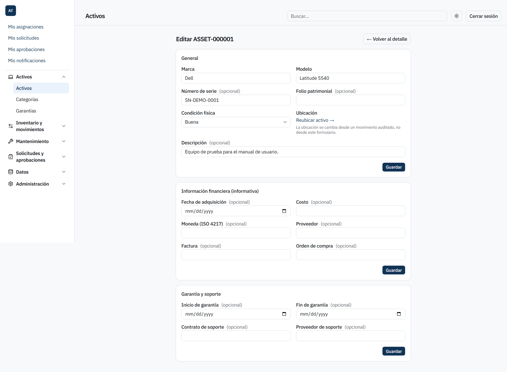

2. La pantalla presenta **tres formularios independientes entre sí**. Cada uno se guarda por separado, con su propio botón "Guardar" y su propio mensaje de éxito o error. Modificar y guardar uno no afecta ni requiere guardar los otros.
3. Complete el formulario que necesite (General, Financiera, o Garantía y soporte) y pulse su botón **"Guardar"** correspondiente.
4. Observe el mensaje de resultado que aparece junto a ese formulario específico.

#### a) Formulario General

Permite modificar Marca, Modelo, Número de serie, Folio patrimonial, Condición física, Descripción y los campos técnicos dinámicos de la categoría del activo (los mismos tipos de campo explicados en la sección 6.2).

**Importante**: el campo de **Ubicación no es editable desde este formulario**. En su lugar se muestra el enlace **"Reubicar activo →"**, acompañado de la nota: *"La ubicación se cambia desde un movimiento auditado, no desde este formulario."* Para cambiar la ubicación física del activo debe usar la operación de Reubicación (sección 6.5).

| Campo | Descripción | Obligatorio | Validaciones |
|---|---|---|---|
| Marca | Marca del equipo | Sí | Máximo 100 caracteres |
| Modelo | Modelo del equipo | Sí | Máximo 100 caracteres |
| Número de serie | Número de serie | No | Máximo 100 caracteres |
| Folio patrimonial | Folio de activo fijo/patrimonial de la empresa (distinto del folio interno del sistema) | No | Máximo 100 caracteres |
| Condición física | Estado físico del equipo | Sí | Debe ser uno de los valores permitidos |
| Ubicación | No editable — solo enlace a Reubicar | — | — |
| Descripción | Texto libre | No | Máximo 500 caracteres |
| Campos técnicos de la categoría | Dinámicos según la categoría del activo | Según configuración de cada campo | Deben pertenecer a la categoría del activo |

#### b) Formulario de Información financiera (informativa)

Recuerde: estos campos son puramente informativos, no generan ningún cálculo contable ni de depreciación.

| Campo | Descripción | Obligatorio | Validaciones |
|---|---|---|---|
| Fecha de adquisición | Fecha en que se adquirió el activo | No | — |
| Costo | Monto del costo del activo | No | Debe ser mayor o igual a 0 cuando se captura |
| Moneda | Código de moneda ISO 4217 (por ejemplo, MXN, USD) | No | Debe tener exactamente 3 caracteres cuando se captura; el sistema la normaliza automáticamente a mayúsculas al guardar, aunque el formulario no lo muestre visualmente |
| Proveedor | Nombre del proveedor | No | Máximo 200 caracteres |
| Factura | Número o folio de factura | No | Máximo 100 caracteres |
| Orden de compra | Número de orden de compra | No | Máximo 100 caracteres |

#### c) Formulario de Garantía y soporte

| Campo | Descripción | Obligatorio | Validaciones |
|---|---|---|---|
| Inicio de garantía | Fecha de inicio de la garantía | No | Debe ser anterior o igual a la fecha de fin, si ambas están presentes |
| Fin de garantía | Fecha de fin de la garantía | No | Debe ser posterior o igual a la fecha de inicio, si ambas están presentes |
| Contrato de soporte | Número o referencia del contrato de soporte | No | Máximo 100 caracteres |
| Proveedor de soporte | Nombre del proveedor de soporte | No | Máximo 200 caracteres |

#### Botones y acciones

| Botón | Formulario | Efecto |
|---|---|---|
| Guardar (General) | General | Guarda los cambios de datos generales y campos técnicos |
| Guardar (Financiera) | Información financiera | Guarda los cambios de datos financieros |
| Guardar (Garantía y soporte) | Garantía y soporte | Guarda los cambios de garantía y soporte |
| Reubicar activo → | General | Navega a la pantalla de reubicación (sección 6.5) |
| ← Volver al detalle | General de la pantalla | Regresa al detalle del activo sin guardar |

Mientras cualquiera de los tres guardados está en curso, el botón correspondiente cambia su texto a **"Guardando…"**.

#### Reglas de negocio

- Los tres formularios son completamente independientes: guardar uno no envía ni valida los datos de los otros dos.
- El campo Ubicación se excluyó deliberadamente de la edición general porque cada cambio de ubicación debe generar un movimiento auditado con su propio folio; por eso se maneja únicamente desde la operación de Reubicación.
- Los campos técnicos de la categoría, al editarse, se validan igual que en el alta: deben pertenecer a la categoría del activo y respetar la obligatoriedad configurada.
- La moneda capturada en el formulario financiero se normaliza a mayúsculas al guardar, sin importar cómo se haya escrito.
- La regla de fechas de garantía solo se valida si ambas fechas (inicio y fin) están presentes; si solo se captura una de las dos, no se valida el orden.
- Si dos personas editan el mismo activo al mismo tiempo, la segunda operación de guardado que llega es rechazada por un conflicto de concurrencia (ver Mensajes del sistema).
- Ninguno de los tres formularios de edición genera una entrada visible en el panel de auditoría funcional del sistema — a diferencia del alta, la reubicación, la baja y la disposición, que sí quedan auditadas. Las ediciones solo quedan registradas en los registros técnicos internos del sistema, no en el historial de auditoría consultable por los usuarios.

#### Mensajes del sistema

**Éxito (los tres formularios):**
- "Guardado." (se muestra en color verde)

**Error (los tres formularios):**
- El detalle específico devuelto por el servidor, cuando existe.
- "No fue posible guardar los cambios." — mensaje de reserva cuando no hay un detalle más específico.

**Validación cruzada (Garantía y soporte):**
- "La fecha de inicio de garantía debe ser anterior o igual a la fecha de fin."

**Concurrencia (cualquiera de los tres formularios, si otro usuario editó el mismo activo primero):**
- "The record was modified by someone else. Reload and try again." — este mensaje aparece en inglés (no está traducido al español); indica que debe recargar la página y volver a intentar el cambio, dado que otra persona guardó una modificación sobre el mismo activo mientras usted lo tenía abierto.

**Nota (informativa, no es un error):**
- "La ubicación se cambia desde un movimiento auditado, no desde este formulario." (junto al enlace "Reubicar activo →")

#### Casos especiales

- Si dos usuarios abren el mismo activo y editan el mismo formulario casi al mismo tiempo, el segundo en guardar recibirá el mensaje de conflicto de concurrencia en inglés mencionado arriba; deberá recargar la página para ver los cambios más recientes antes de reintentar los suyos.
- Nota: al igual que en el detalle del activo, estos tres formularios de edición actualmente no verifican que el activo pertenezca a una empresa a la que usted tenga acceso — si conoce el identificador de un activo de otra empresa, el sistema podría permitirle editarlo. Consulte con su administrador si esto es una preocupación para su organización.
- Si intenta guardar el formulario General con campos técnicos incompletos u obligatorios vacíos, el sistema rechaza el guardado indicando qué campos de la categoría faltan.

#### Resultado esperado
Los datos del activo quedan actualizados según el formulario guardado, con confirmación visual "Guardado." junto al formulario correspondiente, sin afectar los datos de los otros dos formularios.

#### Buenas prácticas
- Guarde cada formulario apenas termine de editarlo, en lugar de completar los tres y guardar al final: al ser independientes, no hay ninguna ventaja en posponer el guardado, y hacerlo por separado reduce el riesgo de perder cambios si ocurre un error de conexión.
- Si recibe el mensaje de conflicto de concurrencia, recargue la página completa antes de reintentar, para partir de la versión más reciente del activo y no sobrescribir sin darse cuenta los cambios de otra persona.
- Use el formulario financiero y el de garantía/soporte para mantener trazabilidad de proveedores y vigencias, aunque el sistema no calcule vencimientos automáticamente: revise manualmente las fechas de fin de garantía como parte de su rutina de mantenimiento preventivo.

---

### Reubicar un activo

#### Objetivo
Registrar el cambio de ubicación física de un activo dentro de la estructura organizacional de su empresa, dejando un movimiento auditado del cambio.

#### Cuándo utilizarlo
Cuando un activo cambia físicamente de lugar (de oficina, de sucursal, de departamento) dentro de la misma empresa, y se necesita dejar constancia formal y auditable de ese cambio.

#### Paso a paso detallado

1. Desde el detalle del activo, pulse **"Reubicar"**. Se abre la pantalla con encabezado **"Reubicar activo"** y subtítulo `"{folio} — {marca} {modelo}"`.

   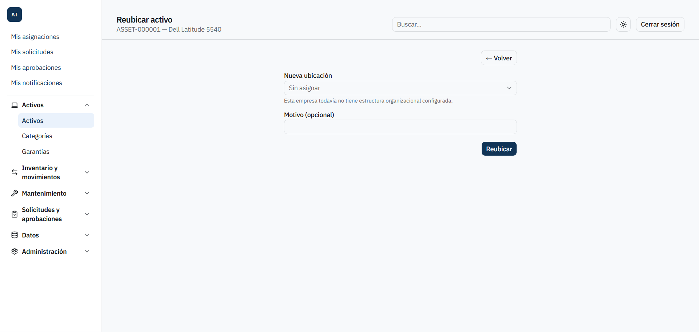

2. Seleccione la **Nueva ubicación** en la lista desplegable de unidades organizacionales (por defecto aparece seleccionada la ubicación actual del activo). Puede seleccionar la opción **"Sin asignar"** si desea dejar el activo sin ubicación específica.
3. Capture, si lo desea, el **Motivo** de la reubicación.
4. Pulse **"Reubicar"**. El botón cambia a **"Guardando…"** mientras se procesa.
5. Si la operación es exitosa, el sistema lo redirige de vuelta al detalle del activo.

#### Campos

| Campo | Descripción | Obligatorio | Validaciones |
|---|---|---|---|
| Nueva ubicación | Unidad organizacional destino (o "Sin asignar") | No | Si se indica, debe existir dentro de la misma empresa del activo |
| Motivo | Texto libre explicando la razón de la reubicación | No | Máximo 500 caracteres |

Si la empresa no tiene unidades organizacionales configuradas, se muestra el aviso: **"Esta empresa todavía no tiene estructura organizacional configurada."**

#### Botones y acciones

| Botón | Efecto |
|---|---|
| Reubicar | Envía la solicitud de reubicación; cambia a "Guardando…" mientras está pendiente |
| ← Volver | Regresa a la pantalla anterior sin realizar cambios |

#### Reglas de negocio

- Esta operación **no cambia el estado (`Status`) del activo**, únicamente su ubicación (unidad organizacional actual).
- Cada reubicación genera un **movimiento auditado** con folio propio con el formato `MOV-REL-NNNNNN`, visible en el historial de movimientos del detalle del activo.
- Si la nueva ubicación seleccionada es exactamente la misma que la ubicación actual del activo, el sistema rechaza la operación (ver mensaje de error abajo) — no tiene sentido registrar un movimiento a la misma ubicación.
- Esta es la única forma correcta de cambiar la ubicación de un activo; el formulario de edición general deliberadamente no permite hacerlo (ver sección 6.4).

#### Mensajes del sistema

**Éxito:**
- Redirección al detalle del activo (no se muestra un mensaje textual adicional; la llegada al detalle confirma la operación).

**Error:**
- "El activo ya está en esa unidad organizacional." — si se intenta reubicar hacia la misma ubicación actual.
- "No fue posible reubicar el activo." — mensaje de reserva para cualquier otro error no específico.
- "Esta empresa todavía no tiene estructura organizacional configurada." — si no hay unidades organizacionales definidas.

#### Casos especiales

- No existe una pantalla de confirmación adicional ("¿está seguro de reubicar?") antes de ejecutar la reubicación: el envío del formulario ejecuta la operación de inmediato.
- Reubicar un activo no afecta si puede o no solicitarse su baja o transferencia; esos criterios dependen únicamente del estado (`Status`), no de la ubicación.

#### Resultado esperado
El activo queda registrado en la nueva ubicación seleccionada, con un movimiento auditado generado automáticamente, visible en su historial de movimientos.

#### Buenas prácticas
- Capture siempre el motivo de la reubicación cuando el cambio no sea evidente por sí mismo (por ejemplo, reorganización de área, cambio de oficina), ya que este campo queda como parte del respaldo auditado del movimiento.
- Verifique la ubicación actual mostrada por defecto antes de guardar, para evitar reubicaciones accidentales a la misma ubicación (que el sistema rechazará) o a una ubicación incorrecta.

---

### Solicitar la baja de un activo

#### Objetivo
Iniciar el trámite formal para retirar de servicio un activo, sujeto a la aprobación configurada por la empresa.

#### Cuándo utilizarlo
Cuando un activo ya no debe seguir en uso operativo: por daño irreparable, obsolescencia, pérdida, robo, o cualquier otra causa que amerite sacarlo de circulación dentro del inventario activo.

#### Paso a paso detallado

1. Desde el detalle del activo (disponible solo si su estado actual lo permite — ver Reglas de negocio), pulse **"Solicitar baja"**. Se abre la pantalla con encabezado **"Solicitar baja"** y subtítulo `"{folio} — {marca} {modelo}"`.

   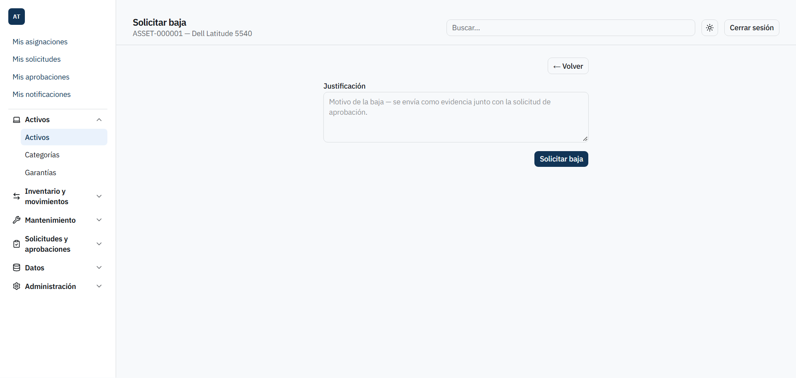

2. Capture la **Justificación** de la baja en el área de texto (obligatoria). El texto de ejemplo del campo indica: **"Motivo de la baja — se envía como evidencia junto con la solicitud de aprobación."**
3. Pulse **"Solicitar baja"**. El botón cambia a **"Enviando…"** mientras se procesa.
4. El sistema cambia de inmediato el estado del activo a "Pendiente de baja" y crea la solicitud de aprobación correspondiente.
5. El usuario es redirigido al detalle del activo (no a la pantalla de la solicitud de aprobación), donde puede confirmar visualmente que el estado ya cambió a "Pendiente de baja".

#### Campos

| Campo | Descripción | Obligatorio | Validaciones |
|---|---|---|---|
| Justificación | Motivo de la baja, en texto libre (área de texto de 4 líneas visibles) | Sí | Máximo 1000 caracteres; no puede quedar vacía (ni con solo espacios en blanco) |

#### Botones y acciones

| Botón | Efecto |
|---|---|
| Solicitar baja | Envía la solicitud; cambia el estado del activo de inmediato y crea la solicitud de aprobación; cambia a "Enviando…" mientras está pendiente |
| ← Volver | Regresa a la pantalla anterior sin enviar la solicitud |

#### Reglas de negocio

- El botón "Solicitar baja" solo está disponible en el detalle del activo cuando su estado actual es uno de los siguientes: En almacén, Asignado, En mantenimiento, En garantía, Dañado, Extraviado o Robado. Desde cualquier otro estado, la opción no aparece en pantalla.
- **El estado del activo cambia a "Pendiente de baja" de inmediato al enviar la solicitud**, sin esperar a que la aprobación se resuelva. El activo deja de estar disponible para operación normal desde ese momento.
- La solicitud de baja dispara automáticamente una instancia de aprobación. Quién debe aprobarla depende de cómo la empresa haya configurado su flujo de aprobación para este tipo de trámite — no es un permiso fijo de este módulo. Consulte con su administrador si no sabe quién debe resolver la aprobación.
- Si la aprobación es **rechazada**, el activo regresa automáticamente al estado "En almacén", sin importar cuál era su estado antes de solicitar la baja.
- Si la aprobación es **aceptada**, el activo pasa automáticamente al estado "Dado de baja".
- La "evidencia" de la baja es únicamente el texto de justificación capturado; el sistema no permite adjuntar un archivo como parte de esta solicitud específica (aunque el activo puede tener documentos adjuntos por separado, ver sección 6.3).
- Una vez que el activo está en "Pendiente de baja", el botón "Solicitar baja" desaparece de la pantalla de detalle, evitando reintentos desde la interfaz. Un segundo intento a través de otro medio sería rechazado de todas formas por la máquina de estados.

#### Mensajes del sistema

**Éxito:**
- Redirección al detalle del activo, donde el estado visible ya es "Pendiente de baja" (no hay un mensaje de texto adicional de confirmación).

**Error:**
- "La justificación es obligatoria." — validación en el propio navegador, si se intenta enviar sin capturar el motivo.
- "No fue posible solicitar la baja." — mensaje de reserva para otros errores no específicos.
- El detalle específico devuelto por el servidor, cuando existe, se muestra en lugar del mensaje de reserva.

#### Casos especiales

- No hay pantalla de confirmación intermedia ("¿está seguro?") antes de enviar la solicitud de baja, a pesar de tratarse de una acción con efecto inmediato sobre el estado del activo. La única protección posterior es que otra persona debe aprobar (o rechazar) la solicitud.
- Si usted no cuenta con permiso para consultar el módulo de Aprobaciones, de todas formas puede confirmar que su solicitud se envió correctamente simplemente observando que el activo aparece en estado "Pendiente de baja" en su detalle.
- Recuerde que un rechazo de la baja siempre devuelve el activo a "En almacén" — incluso si antes de solicitar la baja estaba, por ejemplo, "Dañado" o "En garantía". Si necesita que el activo regrese a un estado distinto tras el rechazo, deberá gestionarlo por separado desde el módulo correspondiente (por ejemplo, volviendo a abrir una orden de mantenimiento).

#### Resultado esperado
El activo queda en estado "Pendiente de baja" de inmediato, con una solicitud de aprobación creada y en espera de resolución según el flujo de aprobación configurado por la empresa.

#### Buenas prácticas
- Redacte una justificación clara y completa, ya que es el único respaldo textual que verá la persona que apruebe o rechace la solicitud.
- Verifique el estado actual del activo antes de solicitar la baja: si el botón no aparece en el detalle, significa que el estado actual del activo no admite esta operación en este momento.
- Después de enviar la solicitud, dé seguimiento con la persona responsable de aprobar bajas en su empresa si el trámite tarda más de lo esperado, ya que el activo queda fuera de servicio mientras la solicitud está pendiente.

---

### Solicitar la disposición de un activo dado de baja

#### Objetivo
Definir y solicitar el destino final de un activo que ya fue dado de baja: venta, donación o destrucción.

#### Cuándo utilizarlo
Únicamente cuando un activo ya se encuentra en estado "Dado de baja" y la empresa necesita formalizar su destino definitivo dentro o fuera del inventario.

#### Paso a paso detallado

1. Desde el detalle de un activo en estado "Dado de baja", pulse **"Solicitar disposición"**. Se abre la pantalla con encabezado **"Solicitar disposición"** y subtítulo `"{folio} — {marca} {modelo}"`.

   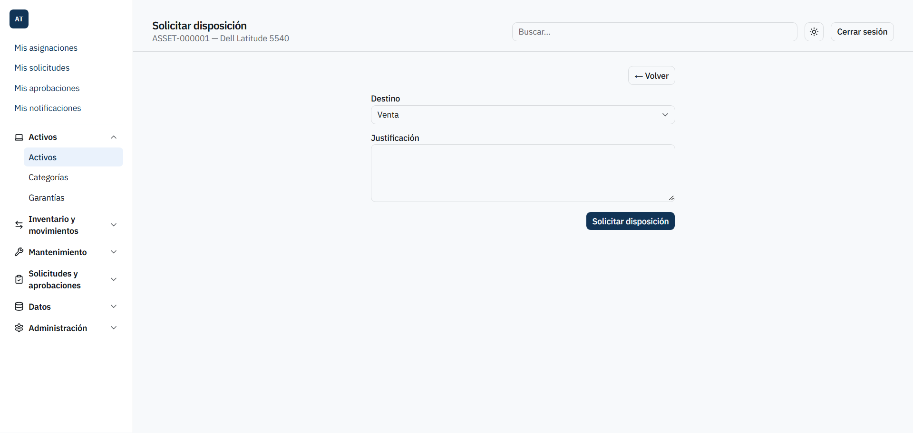

2. Seleccione el **Destino** deseado: Venta (opción por defecto), Donación o Destrucción.
3. Capture la **Justificación** en el área de texto (obligatoria, sin texto de ejemplo).
4. Pulse **"Solicitar disposición"**. El botón cambia a **"Enviando…"** mientras se procesa.
5. El sistema crea la solicitud de aprobación correspondiente al destino elegido. El usuario es redirigido al detalle del activo.

#### Campos

| Campo | Descripción | Obligatorio | Validaciones |
|---|---|---|---|
| Destino | Destino final del activo: Venta, Donación o Destrucción (por defecto: Venta) | Sí | El servidor exige que sea exactamente uno de los tres valores permitidos |
| Justificación | Motivo de la disposición, en texto libre (área de texto de 4 líneas visibles) | Sí | Máximo 1000 caracteres; no puede quedar vacía |

#### Botones y acciones

| Botón | Efecto |
|---|---|
| Solicitar disposición | Envía la solicitud de aprobación para el destino elegido; cambia a "Enviando…" mientras está pendiente |
| ← Volver | Regresa a la pantalla anterior sin enviar la solicitud |

#### Reglas de negocio

- El botón "Solicitar disposición" solo está disponible desde el detalle de un activo cuyo estado actual sea exactamente "Dado de baja". Solo puede solicitarse la disposición de un activo previamente dado de baja mediante el proceso de la sección 6.6.
- **A diferencia de la baja, esta solicitud no cambia el estado del activo mientras está pendiente.** El activo permanece visiblemente "Dado de baja" durante todo el trámite de aprobación.
- Si la solicitud de disposición es **aprobada**, el activo pasa al estado correspondiente: "Vendido", "Donado" o "Destruido", según el destino elegido. Estos son estados terminales — el activo ya no puede volver a moverse dentro del sistema una vez alcanzado alguno de ellos.
- Si la solicitud es **rechazada**, no ocurre ningún cambio de estado: el activo simplemente permanece "Dado de baja", como si la solicitud nunca se hubiera hecho.
- Al igual que en la baja, la "evidencia" es únicamente el texto de justificación; no se adjunta un archivo como parte de este trámite.
- El formulario permite elegir cualquiera de los tres destinos aun si, por alguna razón, la pantalla se abrió para un activo que ya no está en "Dado de baja" — la validación real de que el activo esté en ese estado ocurre en el servidor al momento de enviar la solicitud, no antes.

#### Mensajes del sistema

**Éxito:**
- Redirección al detalle del activo (sin mensaje textual adicional).

**Error:**
- "Solo un activo dado de baja puede solicitarse para disposición." — si el activo no está actualmente en estado "Dado de baja" al momento de procesar la solicitud.
- "El destino de disposición debe ser Sold, Donated o Destroyed." — mensaje de validación del servidor; nótese que **aparece en inglés, con los nombres técnicos de los valores**, en lugar de mostrar "Venta, Donación o Destrucción" en español. Es una inconsistencia conocida de la pantalla: si lo recibe, simplemente confirme que seleccionó una de las tres opciones del campo Destino antes de reintentar.
- "La justificación es obligatoria." — si se intenta enviar sin capturar el motivo.
- "No fue posible solicitar la disposición." — mensaje de reserva para otros errores no específicos.

#### Casos especiales

- No existe un estado intermedio visible de "pendiente de disposición": mientras la solicitud está en trámite, el activo se ve exactamente igual que cualquier otro activo "Dado de baja" sin solicitud pendiente. Si necesita saber si ya existe una solicitud de disposición en trámite para un activo, deberá consultarlo en el módulo de Aprobaciones (si cuenta con permiso) o con la persona responsable de aprobarlas.
- No hay pantalla de confirmación intermedia antes de enviar la solicitud.
- Si la solicitud es rechazada, el sistema no muestra ninguna notificación específica dentro de este módulo; el activo simplemente continúa apareciendo como "Dado de baja" de forma indefinida hasta que se solicite nuevamente su disposición.

#### Resultado esperado
Se genera una solicitud de aprobación para el destino de disposición elegido; si se aprueba, el activo pasa a su estado terminal correspondiente (Vendido, Donado o Destruido); si se rechaza, el activo permanece "Dado de baja" sin cambios.

#### Buenas prácticas
- Confirme el estado "Dado de baja" del activo antes de intentar la disposición; si el botón no aparece en el detalle, el activo no es candidato para este trámite en este momento.
- Elija cuidadosamente el destino (Venta, Donación o Destrucción) antes de enviar, ya que una vez aprobada la disposición el activo llega a un estado terminal del que no puede regresar.
- Si necesita reintentar tras un mensaje de error sobre el destino, verifique que efectivamente seleccionó una opción del campo Destino — el mensaje de error correspondiente se muestra con los nombres técnicos en inglés, lo cual puede generar confusión.

---

### Ver e imprimir la etiqueta de un activo

#### Objetivo
Consultar y, en su caso, reimprimir la etiqueta de identificación física (QR, código de barras u otra tecnología) generada para un activo.

#### Cuándo utilizarlo
Cuando necesite obtener o volver a imprimir la etiqueta física que se coloca sobre el equipo para su identificación mediante lectura de código.

#### Paso a paso detallado

1. Desde el detalle del activo, pulse **"Ver etiqueta"** (disponible solo si el activo tiene una etiqueta emitida). Se abre la pantalla de etiqueta, diseñada especialmente para impresión (sin el encabezado general de la aplicación).

   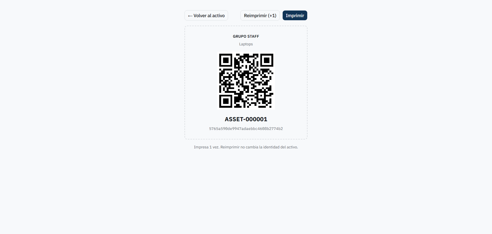

2. Revise el contenido de la etiqueta: nombre comercial de la empresa, nombre de la categoría, código QR o texto de la tecnología correspondiente, folio interno en tamaño grande, y el código de la etiqueta.
3. Si necesita imprimir la etiqueta, use el botón de impresión, que invoca la función de impresión del navegador.
4. Si necesita reimprimir la etiqueta (por ejemplo, porque la etiqueta física se dañó o se perdió), pulse **"Reimprimir (+1)"**.
5. Use **"← Volver al activo"** para regresar al detalle.

#### Campos

Esta pantalla es de solo lectura. No tiene campos editables.

| Elemento mostrado | Descripción |
|---|---|
| Nombre de la empresa | Nombre comercial de la empresa propietaria del activo (o "Empresa" si no se pudo cargar) |
| Nombre de la categoría | Categoría del activo (o "Categoría" si no se pudo cargar) |
| Código QR / texto de tecnología | Si la tecnología de identificación es QR o "QR y código de barras", se muestra la imagen del código QR generada automáticamente. Si la tecnología es únicamente código de barras, NFC o RFID, en su lugar se muestra el texto: "Tecnología {tecnología} — se codifica con el equipo de impresión/grabado correspondiente." (no hay previsualización visual para estas tecnologías) |
| Folio interno | Folio del activo, en tamaño grande |
| Código de la etiqueta | Identificador único de la etiqueta (en fuente monoespaciada) |
| Contador de impresión (oculto al imprimir) | "Impresa {n} {vez|veces}. Reimprimir no cambia la identidad del activo." |

#### Botones y acciones

| Botón | Efecto |
|---|---|
| ← Volver al activo | Regresa al detalle del activo |
| Reimprimir (+1) | Incrementa en 1 el contador de impresiones de la etiqueta y actualiza la fecha del último reimpreso; recarga la información de la pantalla al finalizar |
| Imprimir | Invoca la función de impresión del navegador; no realiza ninguna llamada al servidor |

#### Reglas de negocio

- **El código de la etiqueta es independiente del folio interno del activo, de forma deliberada**: el folio interno es único solo dentro de la empresa, mientras que el código de la etiqueta es único en todo el sistema, sin importar la empresa, precisamente para que un lector de código QR o de barras pueda resolver sin ambigüedad a qué activo corresponde sin importar quién lo escanee.
- **Reimprimir nunca genera un código nuevo.** El botón "Reimprimir (+1)" únicamente incrementa el contador de veces impresa y registra la fecha de la última impresión; el código de la etiqueta permanece siempre igual desde su emisión original.
- **No existe una función para reemitir o reemplazar la etiqueta de un activo.** Como la etiqueta se genera automáticamente al dar de alta el activo, y un activo solo puede tener una etiqueta en toda su vida, la única acción posterior disponible es la reimpresión del mismo código.
- Si el activo no tiene una etiqueta emitida, la pantalla de etiqueta no está disponible (se muestra la página estándar de "no encontrado").

#### Mensajes del sistema

- "Impresa {n} {vez|veces}. Reimprimir no cambia la identidad del activo." — texto informativo permanente al pie de la etiqueta (no se imprime, solo se ve en pantalla), donde {n} es el número de veces que se ha impreso.
- "Tecnología {tecnología} — se codifica con el equipo de impresión/grabado correspondiente." — se muestra en lugar del código QR cuando la tecnología de identificación no admite previsualización visual (código de barras, NFC o RFID).

#### Casos especiales

- Si la tecnología de identificación configurada para la categoría es código de barras, NFC o RFID, no verá ninguna imagen en pantalla ni al imprimir: deberá generar físicamente el código correspondiente con el equipo de impresión o grabado adecuado (impresora de código de barras, grabador NFC/RFID), ya que el sistema únicamente conserva el texto del código, no una representación gráfica para esas tecnologías.
- Al igual que en el detalle y en los formularios de edición, la operación de reimpresión de etiqueta actualmente no verifica que el activo pertenezca a una empresa a la que usted tenga acceso — si conoce el identificador de la etiqueta o del activo, en teoría podría reimprimirla aunque pertenezca a otra empresa del grupo. Consulte con su administrador si esto es una preocupación para su organización.

#### Resultado esperado
El usuario visualiza el contenido completo de la etiqueta del activo y, en caso de reimprimir, el contador de impresiones aumenta en uno sin alterar el código ni la identidad de la etiqueta.

#### Buenas prácticas
- Reimprima la etiqueta únicamente cuando la etiqueta física original se haya dañado, despegado o extraviado; recuerde que el código no cambia, así que reimprimir no soluciona un problema de identificación duplicada.
- Para activos con tecnología de código de barras, NFC o RFID, coordine con el área encargada del equipo de impresión/grabado antes de dar de alta el activo, para asegurar que la etiqueta física pueda producirse correctamente desde el primer momento.
- Verifique visualmente el código QR o el texto de tecnología contra el equipo físico antes de colocar la etiqueta, para evitar errores de identificación en campo.

---

## 6.2 Inventario y movimientos

### Introducción al módulo

El módulo de Inventario y movimientos agrupa las operaciones que cambian la **custodia** de un
activo (quién lo tiene físicamente) y, en algunos casos, su **empresa** dentro del tenant. Son
cuatro submódulos que trabajan juntos:

| Submódulo | Qué resuelve | Duración | Firma | Efecto sobre el estado del activo |
|---|---|---|---|---|
| **Asignación** (`Assignment`) | Custodia formal de largo plazo (por ejemplo, entregar un equipo a un colaborador) | Larga, hasta que se devuelve | Sí — el destinatario firma para aceptar | Al crear: **Reservado**. Al firmar: **Asignado**. Al devolver: **En almacén** |
| **Préstamo** (`Loan`) | Préstamo informal de corto plazo, con una fecha esperada de devolución | Corta, con fecha de referencia | No | Al crear: **En préstamo**. Al devolver: **En almacén** |
| **Transferencia** (`Transfer`) | Reasignar un activo a otra empresa del mismo tenant, con aprobación y firma de recepción | Variable (depende de la aprobación) | Sí, al recibir | Al aprobarse: **En tránsito**. Al recibirse: **En almacén** en la empresa destino |
| **Movimientos** (`Movement`) | Bitácora consolidada y de solo lectura de todo lo anterior, más las reubicaciones internas | — | — | No cambia el estado; una reubicación solo actualiza la unidad organizacional |

Cada vez que se crea, firma, devuelve, aprueba, recibe o cancela una Asignación, un Préstamo o una
Transferencia, el sistema genera automáticamente un **Movimiento**. El Movimiento es la bitácora
del sistema: se crea solo, nunca se edita y nunca se borra manualmente — no existe en el sistema
ningún botón ni pantalla para modificar o eliminar un movimiento ya registrado. Esto es intencional:
el historial de custodia de un activo debe poder auditarse sin que nadie, ni siquiera un
administrador, pueda alterarlo después.

El backend reconoce siete tipos de movimiento: **Assignment** (asignación creada), **AssignmentReturn**
(asignación devuelta), **Loan** (préstamo creado), **LoanReturn** (préstamo devuelto), **Relocation**
(reubicación interna de unidad organizacional), **CrossCompanyTransferOut** (salida por transferencia)
y **CrossCompanyTransferIn** (entrada por transferencia). La reubicación interna (cambiar la unidad
organizacional de un activo dentro de la misma empresa) se gestiona desde la ficha del activo — ver
el capítulo de Administración de activos, "Reubicar activo" — y **no** es una Transferencia: no
requiere aprobación y no cambia el estado (`AssetStatus`) del activo, solo su unidad organizacional.

Un matiz importante sobre la Asignación: a diferencia del Préstamo, que se completa en un solo paso,
la Asignación es deliberadamente un proceso de **dos pasos** — se crea (queda pendiente de firma) y
luego se firma (queda aceptada) — para dejar constancia de que el destinatario efectivamente recibió
el activo. Esta es una simplificación de la primera versión del sistema: no hay conceptos más
avanzados (por ejemplo, aceptación parcial o firma delegada).

#### Permisos relevantes en este capítulo

| Permiso | Se usa para |
|---|---|
| `Movements.Read` | Consultar la bitácora de movimientos |
| `Assignments.Read` | Ver el listado y el detalle de asignaciones |
| `Assignments.Create` | Crear una asignación |
| `Assignments.Update` | Cancelar una asignación pendiente de firma |
| `Loans.Read` | Ver el listado y el detalle de préstamos |
| `Loans.Create` | Crear un préstamo |
| `Loans.Update` | Existe en el catálogo de permisos, pero actualmente **ningún** botón ni acción del sistema lo utiliza. Otorgarlo no habilita ninguna función adicional hoy. |
| `Transfers.Read` | Ver el listado y el detalle de transferencias |
| `Transfers.Create` | Solicitar una transferencia |
| `Transfers.Update` | Recibir una transferencia (junto con la validación de empresa, ver 6.8) |
| `Returns.Create` | Registrar la devolución de una asignación o de un préstamo |

La firma de aceptación de una asignación (`/my-assignments`) y la cancelación de una transferencia
por parte de quien la solicitó **no** requieren ningún permiso RBAC: están protegidas por identidad
(solo el propio destinatario puede firmar su asignación; solo quien solicitó la transferencia puede
cancelarla), no por el catálogo de permisos.

#### Diagramas de estado

**Asignación (`AssignmentStatus`)**

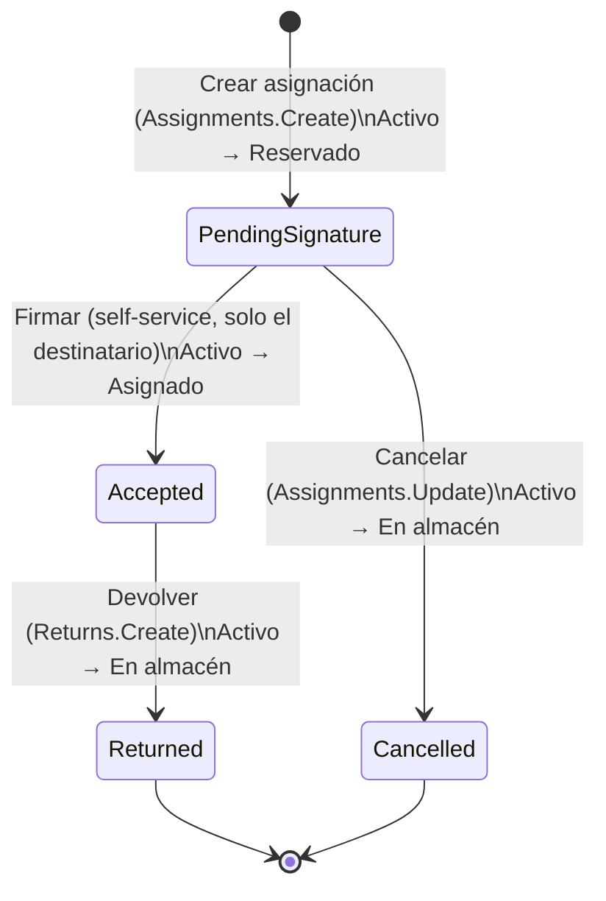
```mermaid
stateDiagram-v2
    [*] --> PendingSignature: Crear asignación (Assignments.Create)\nActivo → Reservado
    PendingSignature --> Accepted: Firmar (self-service, solo el destinatario)\nActivo → Asignado
    PendingSignature --> Cancelled: Cancelar (Assignments.Update)\nActivo → En almacén
    Accepted --> Returned: Devolver (Returns.Create)\nActivo → En almacén
    Returned --> [*]
    Cancelled --> [*]
```

**Préstamo (`LoanStatus`)**

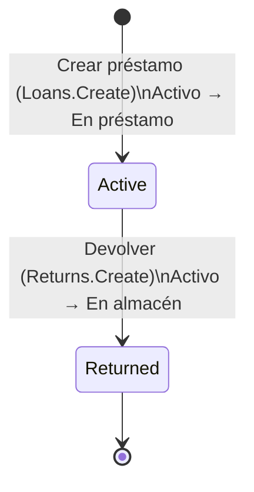
```mermaid
stateDiagram-v2
    [*] --> Active: Crear préstamo (Loans.Create)\nActivo → En préstamo
    Active --> Returned: Devolver (Returns.Create)\nActivo → En almacén
    Returned --> [*]
```

El préstamo no tiene estado de cancelación: una vez creado, su único destino posible es "Devuelto".

**Transferencia (`TransferStatus`)**

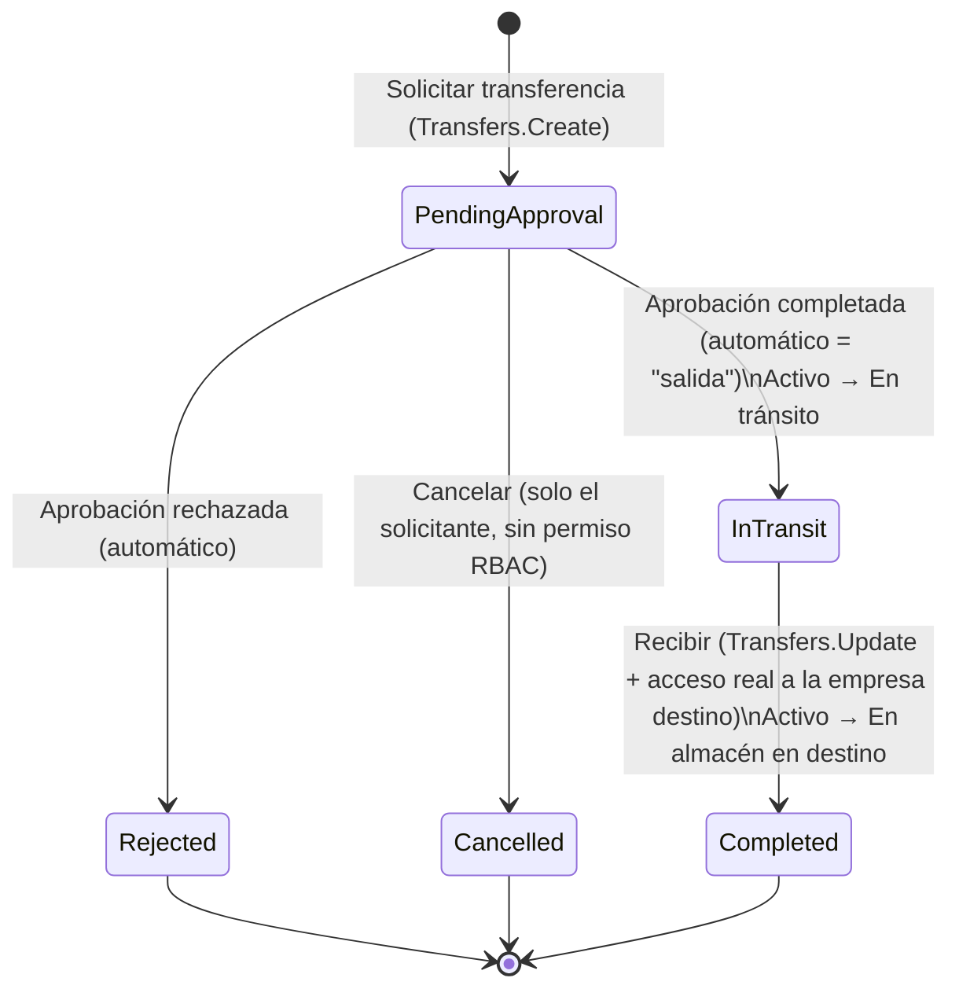
```mermaid
stateDiagram-v2
    [*] --> PendingApproval: Solicitar transferencia (Transfers.Create)
    PendingApproval --> Rejected: Aprobación rechazada (automático)
    PendingApproval --> Cancelled: Cancelar (solo el solicitante, sin permiso RBAC)
    PendingApproval --> InTransit: Aprobación completada (automático = "salida")\nActivo → En tránsito
    InTransit --> Completed: Recibir (Transfers.Update + acceso real a la empresa destino)\nActivo → En almacén en destino
    Rejected --> [*]
    Cancelled --> [*]
    Completed --> [*]
```

No existe un estado intermedio de "aprobado pero todavía no salió del almacén de origen": en cuanto
el flujo de aprobación se completa, el sistema mueve automáticamente la transferencia a "En tránsito"
en la misma operación. No hay un botón separado de "salida".

---

### Consultar la bitácora de movimientos

#### Objetivo
Revisar, de forma consolidada y de solo lectura, todos los movimientos de custodia y ubicación que
ha tenido el inventario de la empresa activa: asignaciones, devoluciones, préstamos, reubicaciones y
transferencias entre empresas.

#### Cuándo utilizarlo
- Para auditar el historial de un activo específico sin tener que revisar cada submódulo por
  separado.
- Para verificar que una operación (asignación, préstamo, transferencia) efectivamente generó su
  movimiento correspondiente.
- Como fuente de verdad ante una discrepancia de custodia, ya que los movimientos no pueden editarse
  ni borrarse una vez creados.

#### Paso a paso detallado
1. En el menú lateral, seleccione **Movimientos**.
2. El sistema muestra el listado de movimientos de la empresa actualmente seleccionada en el
   selector de empresas (`CompanySwitcher`) de la parte superior. El filtro de empresa no aparece
   como campo explícito en el formulario: se aplica automáticamente según la empresa activa.
3. Opcionalmente, use el filtro **Tipo** para acotar el listado a un tipo de movimiento concreto.
4. Revise la tabla de resultados, que se pagina de 30 en 30 registros.
5. Haga clic sobre el folio del activo en la columna **Activo** para ir directamente a su ficha.

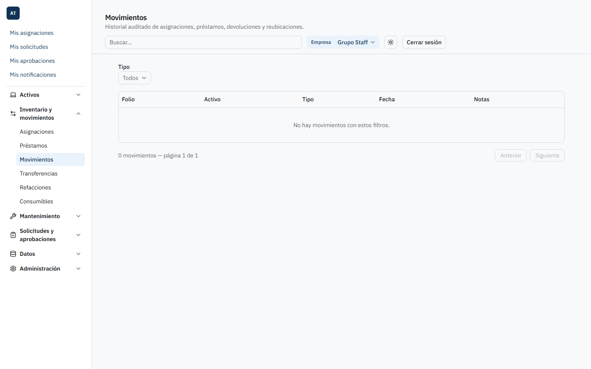

#### Campos (tabla de filtros)

| Campo | Tipo | Obligatorio | Notas |
|---|---|---|---|
| Tipo | Lista desplegable | No | Opciones: "Todos" + 5 tipos de movimiento (ver "Casos especiales" — faltan 2 de los 7 tipos que existen en el backend) |
| Empresa | Oculto | — | Se toma automáticamente de la empresa activa en el selector superior, no es un campo del formulario |

#### Columnas del listado

| Columna | Descripción |
|---|---|
| Folio | Folio del movimiento |
| Activo | Enlace a la ficha del activo involucrado |
| Tipo | Tipo de movimiento (Asignación, Devolución de asignación, Préstamo, Devolución de préstamo, Reubicación, Salida por transferencia, Entrada por transferencia) |
| Fecha | Fecha en que se registró el movimiento |
| Notas | Notas asociadas, si existen |

#### Botones y acciones
Esta pantalla es exclusivamente de consulta: no incluye botones de creación, edición ni eliminación.
No existen endpoints `POST`, `PUT` ni `DELETE` para movimientos — únicamente `GET`.

#### Reglas de negocio
- Requiere el permiso `Movements.Read`.
- Un movimiento nace en estado "Completado" para Préstamo, Devolución de préstamo, Reubicación y
  ambos movimientos de transferencia (un solo paso). Únicamente el movimiento de **Asignación** nace
  en estado "Pendiente", porque depende de que el destinatario firme.
- No hay forma de editar ni borrar un movimiento desde ninguna pantalla del sistema: la
  inmutabilidad está implementada a nivel de código, no es solo una convención documental.

#### Mensajes del sistema
- Listado vacío: **"No hay movimientos con estos filtros."**
- Sin permiso: **"No tienes permiso para consultar movimientos (Movements.Read)."**

#### Casos especiales
- **Tipos de movimiento faltantes en el filtro**: el filtro **Tipo** solo ofrece 5 de los 7 tipos de
  movimiento que existen realmente. Faltan "Salida por transferencia" y "Entrada por transferencia".
  Esto tiene dos consecuencias prácticas: (1) no es posible filtrar el listado para ver únicamente
  los movimientos de transferencias, y (2) cuando esos movimientos sí aparecen en la tabla general
  (por ejemplo, al no aplicar filtro de tipo), la columna **Tipo** se muestra **vacía** para esas
  filas en lugar de indicar de qué tipo de movimiento se trata. Si necesita rastrear una
  transferencia específica, use el módulo de Transferencias (ver 6.7–6.9) en lugar de este filtro.

#### Resultado esperado
Una vista consolidada, ordenada por fecha, de todos los eventos de custodia y ubicación del
inventario de la empresa activa, con trazabilidad hacia el activo de origen.

#### Buenas prácticas
- Use esta pantalla como primer punto de consulta ante cualquier duda sobre "quién tuvo este activo
  y cuándo", antes de revisar cada submódulo por separado.
- Si necesita el detalle completo de una transferencia (empresas de origen/destino, firma de
  recepción), acceda directamente a `/transfers` en lugar de buscarla aquí, dado el bug de filtro
  descrito arriba.

---

### Crear una asignación

#### Objetivo
Formalizar la entrega de un activo a un colaborador de forma prolongada, dejando constancia mediante
una firma de aceptación por parte del destinatario.

#### Cuándo utilizarlo
- Al entregar un equipo (laptop, celular, monitor, etc.) a un colaborador que lo usará de forma
  continua, no solo por unos días.
- Cuando se requiere evidencia de que el destinatario aceptó formalmente la custodia del activo.

#### Paso a paso detallado
1. En el menú lateral, seleccione **Asignaciones**. Se muestra el listado de asignaciones de la
   empresa activa.
2. Haga clic en el botón **"Nueva asignación"**.
3. Seleccione el **Activo** a asignar. Solo se listan activos en estado **En almacén**
   (`InWarehouse`); un activo ya reservado, asignado, en préstamo o en tránsito no aparece como
   opción.
4. Seleccione el **Destinatario** de la lista de usuarios. El selector muestra todos los usuarios
   del sistema, sin filtrar por su membresía a la empresa del activo — esa validación ocurre en el
   servidor al enviar el formulario, no antes.
5. Opcionalmente, indique la **Unidad organizacional** donde quedará físicamente el activo. Si no se
   especifica, el sistema usa "Sin asignar" por defecto.
6. Opcionalmente, agregue **Notas** (máximo 500 caracteres).
7. Haga clic en **"Guardar"** (o el botón equivalente de confirmación del formulario).
8. Si el destinatario no tiene acceso a la empresa del activo, el sistema rechaza la operación (ver
   "Mensajes del sistema").
9. Si la operación es exitosa, el sistema crea la asignación en estado **Pendiente de firma**, mueve
   el activo a estado **Reservado** y genera el movimiento correspondiente con su folio.

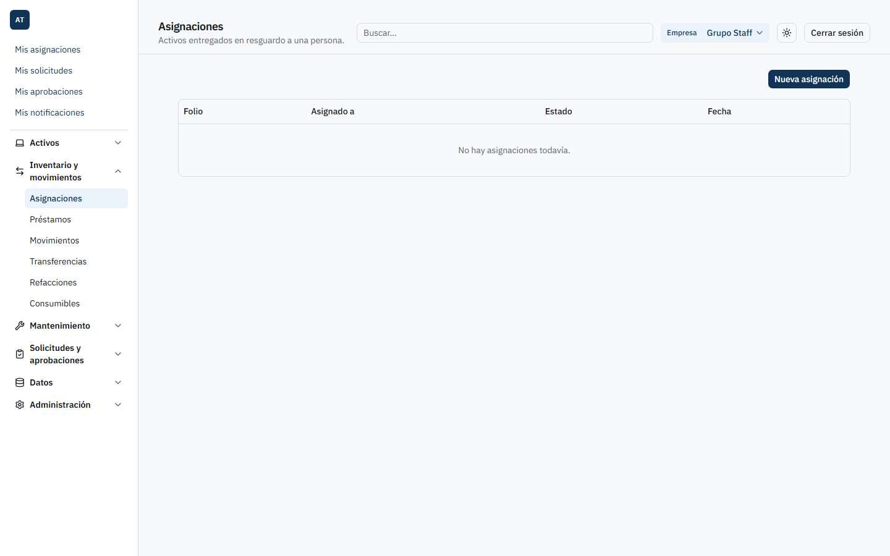

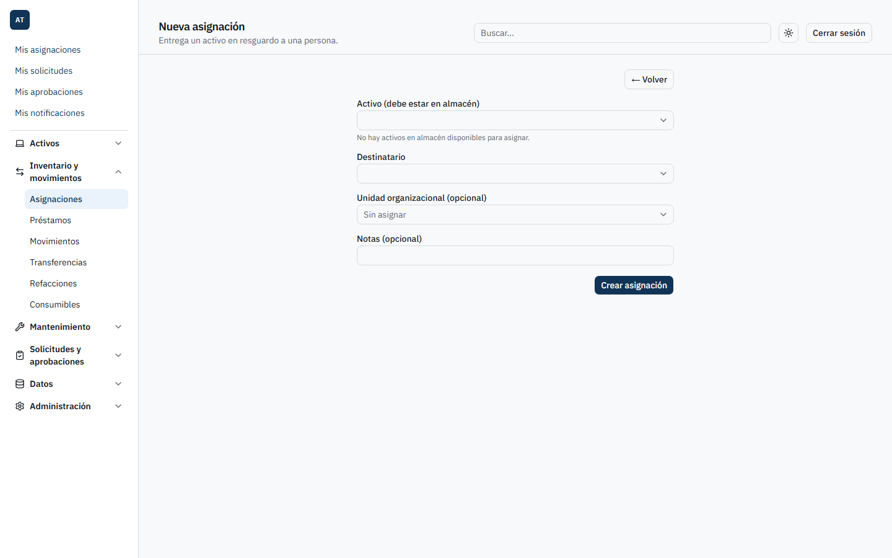

#### Campos

| Campo | Tipo | Obligatorio | Validación / notas |
|---|---|---|---|
| Activo | Selector | Sí | Solo activos en estado En almacén |
| Destinatario | Selector de usuarios | Sí | No filtrado visualmente por empresa; se valida en el servidor |
| Unidad organizacional | Selector | No | Por defecto "Sin asignar" |
| Notas | Texto libre | No | Máximo 500 caracteres |

#### Botones y acciones

| Botón | Ubicación | Efecto |
|---|---|---|
| "Nueva asignación" | Listado `/assignments` | Abre el formulario de creación |
| Botón de guardar del formulario | `/assignments/new` | Envía `POST /api/v1/assignments`; requiere `Assignments.Create` |
| "Cancelar asignación" | Detalle `/assignments/[id]`, solo visible si el estado es Pendiente de firma | Envía `POST /api/v1/assignments/{id}/cancel`; requiere `Assignments.Update`; devuelve el activo a En almacén |

#### Reglas de negocio
- Crear una asignación exige el permiso `Assignments.Create`.
- El activo debe estar en estado **En almacén**; cualquier otro estado de origen resulta en un error
  de transición inválida.
- El destinatario debe tener acceso (membresía) a la empresa del activo; esta validación ocurre en
  el servidor, no en el selector del formulario.
- Al crearse, el activo pasa a **Reservado** — todavía no está formalmente entregado, eso ocurre al
  firmar (ver 6.3).
- No es posible crear una segunda asignación sobre un activo que ya está Reservado o Asignado: el
  sistema lo bloquea automáticamente porque esos estados no permiten una nueva transición a
  Reservado. El bloqueo lo produce la máquina de estados del activo, no una validación explícita y
  personalizada del formulario — el mensaje que verá es el genérico de transición inválida.
- Esta operación queda registrada en el módulo de Auditoría (comando auditable).

#### Mensajes del sistema
- Validación de formulario incompleto: **"Selecciona el activo y el destinatario."**
- Destinatario sin acceso a la empresa del activo (409): **"El destinatario no tiene acceso a la
  empresa de este activo."**
- Transición de estado inválida (422), por ejemplo intentar asignar un activo que no está en
  almacén o que ya tiene una asignación en curso: **"No es válido transicionar un activo de
  '{estado origen}' a '{estado destino}'."**
- Sin permiso para consultar el listado (403): **"No tienes permiso para consultar asignaciones
  (Assignments.Read)."**
- Listado vacío: **"No hay asignaciones todavía."**

#### Casos especiales
- **Reubicación posterior del activo asignado**: una vez que el activo queda Reservado o Asignado,
  sigue siendo posible reubicarlo a otra unidad organizacional desde la ficha del activo (la
  reubicación no valida el estado del activo). Sin embargo, la unidad organizacional registrada en
  la asignación **no se actualiza automáticamente** cuando esto ocurre. En la práctica, esto significa
  que la asignación puede quedar mostrando una unidad organizacional distinta de la unidad real y
  actual del activo si alguien lo reubica después de asignarlo — conviene revisar la ficha del activo,
  no solo la asignación, si necesita conocer su ubicación actual.
- **Selector de destinatario sin filtrar**: como el selector de destinatarios no excluye a los
  usuarios sin acceso a la empresa del activo, es posible completar y enviar el formulario con un
  destinatario incorrecto; el sistema lo rechazará recién al guardar, con el mensaje 409 indicado
  arriba. Verifique la pertenencia del destinatario a la empresa correspondiente antes de guardar,
  para evitar reintentos.

#### Resultado esperado
Una nueva asignación en estado **Pendiente de firma**, el activo en estado **Reservado**, y un
movimiento de tipo Asignación registrado en la bitácora.

#### Buenas prácticas
- Confirme el estado **En almacén** del activo y la pertenencia empresarial del destinatario antes
  de completar el formulario, para evitar rechazos innecesarios del servidor.
- Use el campo Notas para dejar constancia de contexto relevante (por ejemplo, número de acta interna
  o motivo de la entrega), ya que no hay otro campo libre en el formulario.
- Comunique al destinatario que debe ingresar a **"Mis asignaciones"** (ver 6.3) para firmar y
  completar la entrega; mientras no firme, el activo permanece en Reservado y no en Asignado.

---

### Ver y firmar mis asignaciones pendientes (autoservicio)

#### Objetivo
Permitir que cualquier usuario del sistema revise, sin necesidad de permisos especiales, las
asignaciones que tiene a su nombre y confirme (firme) la recepción de las que estén pendientes.

#### Cuándo utilizarlo
- Cuando usted es el destinatario de una asignación y necesita confirmar formalmente que recibió el
  activo.
- Para revisar el estado de todos los activos que tiene asignados, sin depender de que otra persona
  le informe.

#### Paso a paso detallado
1. En el menú lateral, seleccione **"Mis asignaciones"** (ruta `/my-assignments`).
2. El sistema muestra todas las asignaciones asociadas a su usuario, sin importar la empresa activa
   seleccionada.
3. Para cada asignación en estado **Pendiente de firma**, se muestra un formulario embebido con el
   campo **"Escribe tu nombre completo para confirmar"**.
4. Complete su nombre completo y haga clic en **"Confirmar recepción"**.
5. El sistema registra la firma, cambia la asignación a **Aceptada** y el activo a **Asignado**.

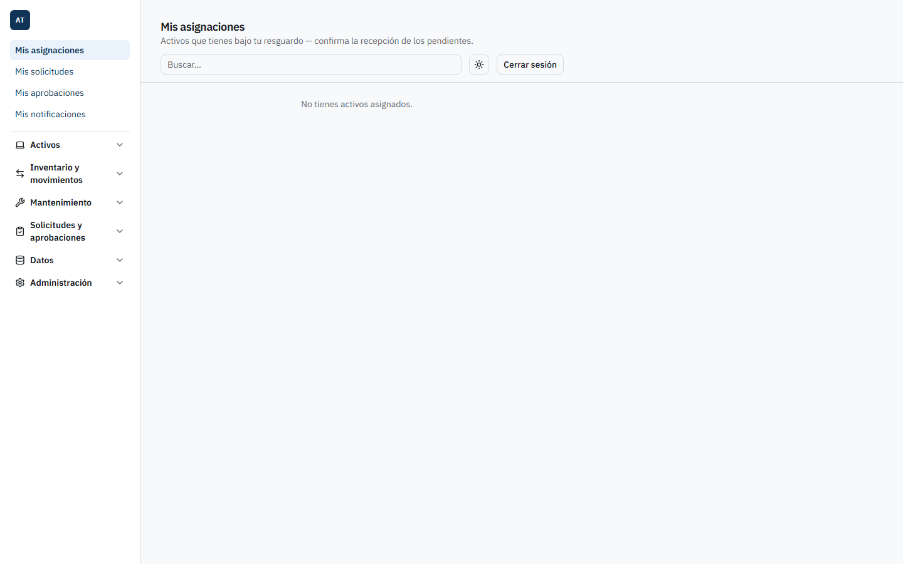

#### Campos

| Campo | Tipo | Obligatorio | Notas |
|---|---|---|---|
| Nombre completo (firma) | Texto libre | Sí | Se usa como confirmación de identidad del destinatario; no hay firma dibujada aquí, solo texto |

#### Botones y acciones

| Botón | Efecto |
|---|---|
| "Confirmar recepción" | Envía `POST /api/v1/assignments/{id}/sign`; no requiere permiso RBAC, es autoservicio; solo funciona si usted es el destinatario registrado |

#### Reglas de negocio
- Firmar una asignación es una acción de autoservicio: no depende de ningún permiso del catálogo
  RBAC, solo de que el usuario autenticado sea efectivamente el destinatario de esa asignación.
- Solo se puede firmar una asignación que esté en estado **Pendiente de firma**.
- Al firmar, el activo pasa de Reservado a **Asignado**.
- Esta operación de autoservicio **no queda registrada como evento auditable** en el módulo de
  Auditoría (a diferencia de la creación de la asignación, que sí lo es).

#### Mensajes del sistema
- Éxito: **"Recepción confirmada."**
- Listado vacío: **"No tienes activos asignados."**
- Error al consultar el listado (tanto por falta de acceso como por error genérico): **"No fue
  posible consultar tus asignaciones."** — a diferencia de otras pantallas del sistema, aquí el
  mensaje de error de permisos y el de error genérico son idénticos; no hay forma de distinguir, solo
  desde el mensaje en pantalla, si el problema fue de permisos o un error técnico.
- Si intenta firmar una asignación que no está Pendiente de firma (422): **"Solo una asignación
  pendiente de firma puede aceptarse/cancelarse."**
- Si por alguna razón intenta firmar una asignación que no es suya (403): **"Solo el destinatario de
  la asignación puede firmarla."**

#### Casos especiales
- **Firma sin revalidar el estado físico real del activo**: firmar una asignación solo verifica que
  la asignación esté Pendiente de firma; no vuelve a comprobar en qué estado se encuentra el activo
  en ese momento. Esto importa en un escenario específico: si, por una vía distinta a los formularios
  estándar, el mismo activo llegó a prestarse (Préstamo) estando todavía en estado Reservado, la
  firma de la asignación pendiente se completará igualmente y el activo quedará marcado como
  **Asignado** en el sistema aunque físicamente esté en poder de otra persona por un préstamo. Este
  escenario no es alcanzable siguiendo el flujo normal de las pantallas de creación de préstamos (que
  solo ofrecen activos En almacén), pero si detecta una inconsistencia de este tipo entre el estado
  registrado y la ubicación física real, repórtelo y verifique el historial completo en
  **Movimientos** (6.1) antes de confiar en el estado mostrado.

#### Resultado esperado
La asignación pasa a **Aceptada**, el activo queda en estado **Asignado** y el usuario cuenta con
constancia de haber confirmado la recepción.

#### Buenas prácticas
- Firme la asignación tan pronto reciba físicamente el activo; mientras no lo haga, el sistema lo
  sigue mostrando como Reservado y no como formalmente entregado.
- Revise esta pantalla periódicamente si maneja varios activos asignados, ya que es la única vista
  centrada en "lo que tengo yo", independiente de la empresa activa seleccionada.

---

### Devolver una asignación

#### Objetivo
Registrar la devolución de un activo previamente asignado y aceptado, liberándolo de vuelta a
inventario disponible.

#### Cuándo utilizarlo
- Cuando un colaborador deja de necesitar el activo (cambio de puesto, baja, fin de proyecto, etc.)
  y lo devuelve físicamente.

#### Paso a paso detallado
1. Acceda al detalle de la asignación desde el listado **Asignaciones** (`/assignments`), haciendo
   clic sobre el folio correspondiente.
2. En la ficha de detalle, ubique el formulario de devolución. Solo está visible si la asignación se
   encuentra en estado **Aceptada**.
3. Complete el campo **"Tu nombre completo"** — corresponde a quien recibe físicamente el activo de
   vuelta (típicamente personal de TI o de almacén), **no** a quien lo entrega.
4. Opcionalmente, agregue **Notas**.
5. Haga clic en **"Registrar devolución"**.
6. El sistema cambia la asignación a **Devuelta** y el activo a **En almacén**.

[Captura pendiente: detalle de asignación/préstamo/transferencia]

#### Campos

| Campo | Tipo | Obligatorio | Validación |
|---|---|---|---|
| Tu nombre completo | Texto libre | Sí | Máximo 200 caracteres |
| Notas | Texto libre | No | Máximo 500 caracteres |

#### Botones y acciones

| Botón | Ubicación | Efecto |
|---|---|---|
| "Registrar devolución" | `/assignments/[id]`, visible solo si estado = Aceptada | Envía `POST /api/v1/assignments/{id}/return`; requiere permiso `Returns.Create` |
| "Cancelar asignación" | Mismo detalle, visible solo si estado = Pendiente de firma | Ver 6.2; no aplica una vez Aceptada |

#### Reglas de negocio
- Solo se puede devolver una asignación en estado **Aceptada**. Una asignación Pendiente de firma se
  **cancela** (6.2), no se devuelve; una ya Devuelta o Cancelada no admite ninguna acción adicional.
- Requiere el permiso `Returns.Create` — no `Assignments.Update` ni ningún permiso "de asignaciones".
  En la práctica, quien registra la devolución suele ser personal de TI/almacén con ese permiso, no
  necesariamente el propio destinatario.
- La firma de devolución es de quien **recibe** el activo de vuelta, no de quien lo entrega. Esto es
  una simplificación deliberada de esta primera versión del sistema: no busque un campo para que el
  colaborador que devuelve firme su propia entrega, no existe.
- Al completarse, el activo pasa a **En almacén**.
- Esta operación **no queda registrada** como evento auditable en el módulo de Auditoría.

#### Mensajes del sistema
- Transición inválida (422), por ejemplo si la asignación no está Aceptada: **"Solo una asignación
  aceptada puede devolverse."**

#### Casos especiales
- Si necesita corregir una devolución ya registrada, recuerde que las asignaciones (como todos los
  movimientos de este módulo) son inmutables: no existe edición ni reversión. Cualquier corrección
  requiere un nuevo movimiento (por ejemplo, una nueva asignación) documentado en las notas.

#### Resultado esperado
La asignación queda en estado **Devuelta**, el activo vuelve a estar **En almacén** y disponible
para una nueva asignación, préstamo o transferencia.

#### Buenas prácticas
- Registre la devolución el mismo día en que el activo se recibe físicamente, para que el estado del
  inventario refleje la realidad lo antes posible.
- Use las notas para registrar el estado físico del activo al momento de la devolución (por ejemplo,
  daños o accesorios faltantes), ya que no hay un campo dedicado para condición del equipo en este
  formulario.

---

### Crear un préstamo

#### Objetivo
Registrar la entrega temporal e informal de un activo, sin necesidad de firma, indicando una fecha
esperada de devolución.

#### Cuándo utilizarlo
- Para préstamos de corto plazo (por ejemplo, un proyector para una reunión, un equipo de respaldo
  mientras se repara el habitual).
- Cuando no se requiere el nivel de formalidad de una asignación (sin firma de aceptación).

#### Paso a paso detallado
1. En el menú lateral, seleccione **Préstamos**. Se muestra el listado de préstamos de la empresa
   activa.
2. Haga clic en **"Nuevo préstamo"**.
3. Seleccione el **Activo** — solo se listan activos en estado **En almacén**.
4. Seleccione el **Destinatario**.
5. Indique la **Fecha esperada de devolución** (obligatoria). El campo no permite, desde el propio
   selector del navegador, elegir una fecha anterior a hoy; el dominio también valida esta regla del
   lado del servidor.
6. Opcionalmente, agregue **Notas** (máximo 500 caracteres).
7. Confirme el formulario. El préstamo se crea directamente en estado **Activo** (a diferencia de la
   asignación, no requiere un paso de firma) y el activo pasa a **En préstamo**.

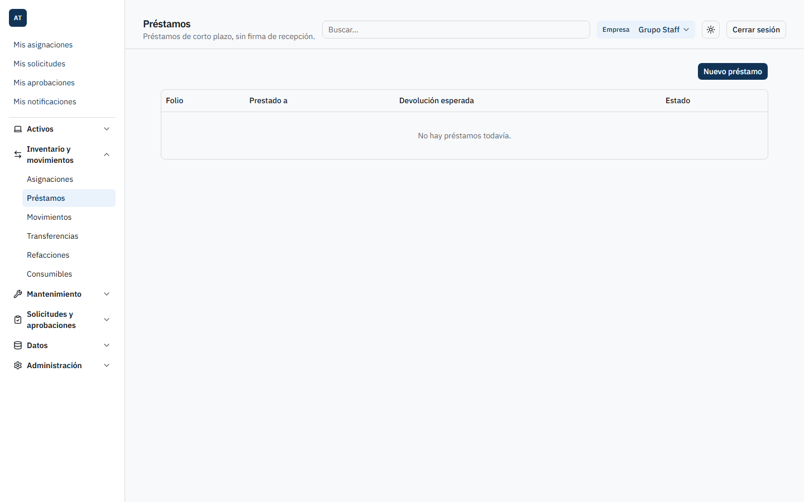

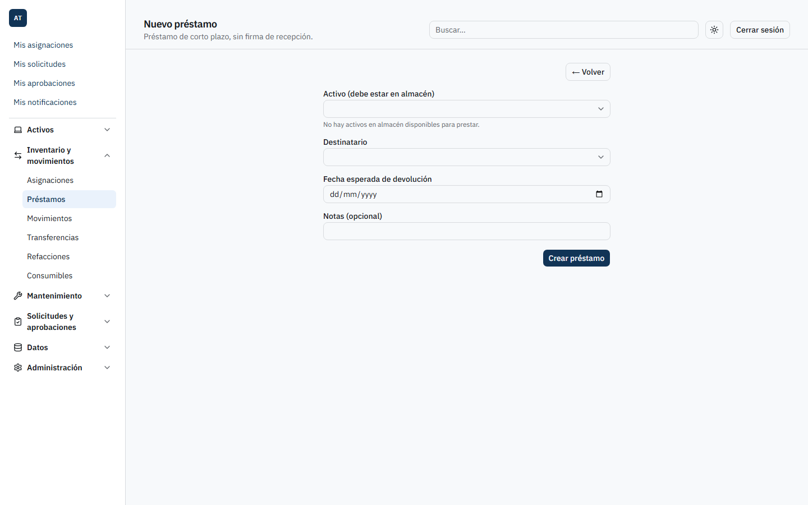

#### Campos

| Campo | Tipo | Obligatorio | Validación / notas |
|---|---|---|---|
| Activo | Selector | Sí | Solo activos en estado En almacén |
| Destinatario | Selector de usuarios | Sí | Validación de acceso a la empresa en el servidor |
| Fecha esperada de devolución | Fecha | Sí | Mínimo: hoy (restricción en el propio campo y validación de dominio) |
| Notas | Texto libre | No | Máximo 500 caracteres |

#### Botones y acciones

| Botón | Ubicación | Efecto |
|---|---|---|
| "Nuevo préstamo" | Listado `/loans` | Abre el formulario de creación |
| Botón de guardar del formulario | `/loans/new` | Envía `POST /api/v1/loans`; requiere `Loans.Create` |

#### Reglas de negocio
- Requiere el permiso `Loans.Create`.
- El destinatario debe tener acceso a la empresa del activo; de lo contrario el servidor rechaza la
  operación con un error 409.
- La fecha esperada de devolución no puede ser anterior a hoy.
- A diferencia de la asignación, el préstamo **no tiene firma ni paso de aceptación**: se completa en
  un solo paso y el movimiento generado nace directamente en estado Completado.
- Esta operación queda registrada en el módulo de Auditoría (comando auditable).

#### Mensajes del sistema
- Fecha en el pasado (422): **"La fecha esperada de devolución no puede ser en el pasado."**
- Destinatario sin acceso a la empresa del activo (409): (mismo tipo de mensaje que en asignaciones)
  **"El destinatario no tiene acceso a la empresa de este activo."**
- Transición de estado inválida (422): **"No es válido transicionar un activo de '{estado origen}'
  a '{estado destino}'."**
- Sin permiso para consultar el listado (403): **"No tienes permiso para consultar préstamos
  (Loans.Read)."**
- Listado vacío: **"No hay préstamos todavía."**

#### Casos especiales
- **La fecha esperada de devolución es solo informativa**: el sistema no vence préstamos
  automáticamente, no marca un préstamo como "atrasado" y no existe ninguna tarea programada que
  cambie su estado al pasar la fecha. Si documentación de otras áreas del sistema menciona que un
  vencimiento genera una notificación, tenga presente que, en el alcance de este módulo, esa
  notificación automática **no está implementada**: el seguimiento de préstamos vencidos es manual.
  Planifique recordatorios propios (calendario, reportes periódicos) si necesita controlar plazos de
  devolución.
- **Activos que técnicamente no están En almacén**: la pantalla de creación de préstamos solo ofrece
  activos En almacén, por lo que en el uso normal del sistema no debería poder prestar un activo que
  esté Reservado, Asignado o en otro estado. Si en algún reporte llegara a encontrar un préstamo sobre
  un activo que no estaba En almacén al momento de crearse, tenga en cuenta que esto puede dejar
  inconsistencias con una asignación pendiente sobre el mismo activo (ver el caso especial descrito
  en 6.3): repórtelo para su revisión.

#### Resultado esperado
Un nuevo préstamo en estado **Activo**, el activo en estado **En préstamo**, y un movimiento de tipo
Préstamo registrado en la bitácora.

#### Buenas prácticas
- Establezca siempre una fecha de devolución realista, ya que el sistema no la corrige ni la
  actualiza automáticamente después de creada.
- Dado que no hay firma ni notificación de vencimiento, dé seguimiento manual a los préstamos activos
  desde el listado `/loans`, especialmente los de mayor duración esperada.

---

### Devolver un préstamo

#### Objetivo
Registrar la devolución de un activo prestado y liberarlo de vuelta a inventario disponible.

#### Cuándo utilizarlo
- Cuando el colaborador devuelve físicamente el activo prestado, antes o después de la fecha
  esperada de devolución.

#### Paso a paso detallado
1. Acceda al detalle del préstamo desde el listado **Préstamos** (`/loans`), haciendo clic sobre el
   folio correspondiente.
2. Si el préstamo está en estado **Activo**, se muestra el formulario de devolución.
3. Complete, opcionalmente, el campo **Notas**. A diferencia de la devolución de una asignación, este
   formulario **no** solicita nombre ni firma de ningún tipo — es consistente con el diseño "sin
   firma" del préstamo desde su creación.
4. Haga clic en **"Registrar devolución"**.
5. El sistema cambia el préstamo a **Devuelto** y el activo a **En almacén**.

[Captura pendiente: detalle de asignación/préstamo/transferencia]

#### Campos

| Campo | Tipo | Obligatorio | Notas |
|---|---|---|---|
| Notas | Texto libre | No | Máximo 500 caracteres; es el único campo del formulario |

#### Botones y acciones

| Botón | Ubicación | Efecto |
|---|---|---|
| "Registrar devolución" | `/loans/[id]`, visible solo si estado = Activo | Envía `POST /api/v1/loans/{id}/return`; requiere permiso `Returns.Create` |

#### Reglas de negocio
- Solo se puede devolver un préstamo en estado **Activo**.
- Requiere el permiso `Returns.Create` (el mismo permiso que se usa para devolver asignaciones).
- No hay firma ni campo de nombre — el registro de la devolución no exige identificar a quien la
  recibe, a diferencia de la devolución de una asignación.
- El permiso `Loans.Update`, aunque existe en el catálogo de roles, no es utilizado por esta ni por
  ninguna otra acción del sistema sobre préstamos; no lo confunda con el permiso real que sí se
  necesita (`Returns.Create`).
- Esta operación **no queda registrada** como evento auditable en el módulo de Auditoría.

#### Mensajes del sistema
- Transición inválida (422), si el préstamo no está Activo: **"Solo un préstamo activo puede
  devolverse."**

#### Casos especiales
- **Préstamos vencidos sin alerta**: como se indicó en 6.5, el sistema no marca automáticamente un
  préstamo como atrasado ni envía notificaciones al vencerse la fecha esperada de devolución. Registre
  la devolución tan pronto ocurra, sin esperar ningún aviso del sistema que le indique que el plazo
  se cumplió.

#### Resultado esperado
El préstamo queda en estado **Devuelto**, el activo vuelve a **En almacén** y disponible para una
nueva operación.

#### Buenas prácticas
- Aproveche el campo Notas para registrar el estado físico del activo devuelto o cualquier
  observación relevante (retraso, daños), ya que es el único campo disponible en este formulario.

---

### Solicitar una transferencia entre empresas

#### Objetivo
Iniciar el traslado formal de un activo desde la empresa actual hacia otra empresa del mismo
tenant, sujeto a aprobación y a una firma de recepción posterior.

#### Cuándo utilizarlo
- Cuando un activo debe pasar a formar parte del inventario de otra empresa del grupo (por ejemplo,
  una reorganización, un préstamo prolongado entre unidades de negocio, o una reasignación
  administrativa entre empresas del mismo tenant).

#### Paso a paso detallado
1. En el menú lateral, seleccione **Transferencias**. Se muestra el listado de transferencias donde
   la empresa activa participa como origen o como destino.
2. Haga clic en **"Nueva transferencia"**.
3. Seleccione el **Activo** a transferir. Solo se listan activos en estado **En almacén**; si no hay
   ninguno disponible, el sistema muestra la ayuda **"No hay activos en almacén disponibles para
   transferir."**
4. Seleccione la **Empresa destino**. El selector lista **todas las empresas activas del tenant
   excepto la actual** — no se restringe a empresas donde usted, como solicitante, tenga membresía.
5. Opcionalmente, redacte una **Justificación** (máximo 1000 caracteres).
6. Haga clic en **"Solicitar transferencia"**.
7. Si la operación es exitosa, el sistema crea la transferencia en estado **Pendiente de aprobación**
   y lo redirige a la pantalla de detalle de la transferencia recién creada.
8. La transferencia queda a la espera de que el flujo de aprobación configurado para transferencias
   entre empresas (`asset.cross-company-transfer`) sea resuelto por la persona o rol correspondiente
   (ver el capítulo de Aprobaciones).

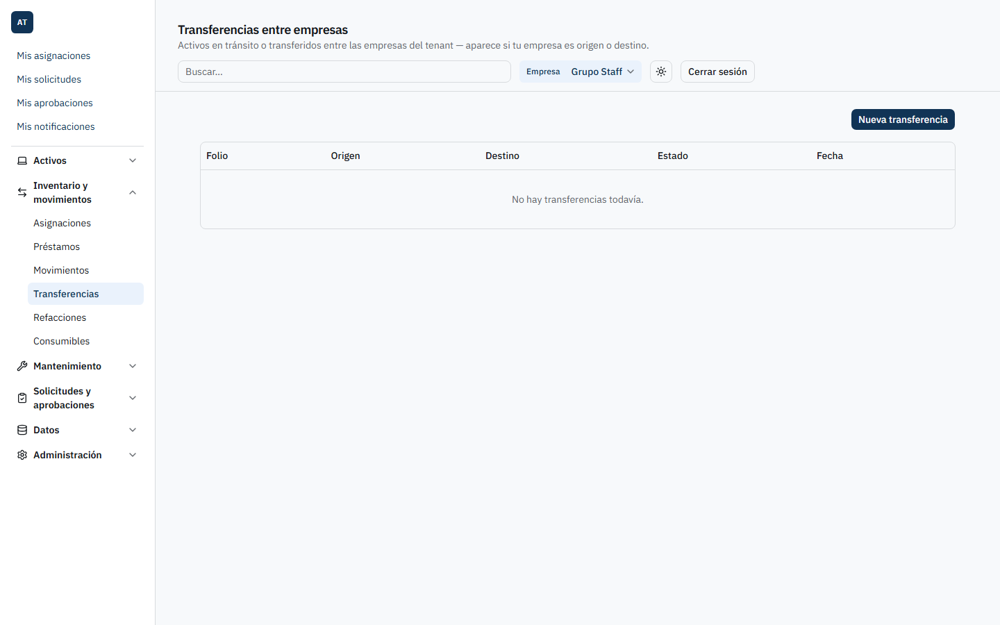

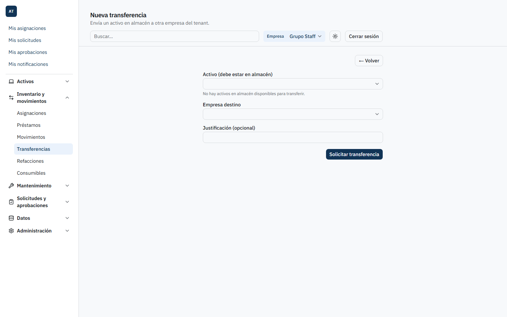

#### Campos

| Campo | Tipo | Obligatorio | Validación / notas |
|---|---|---|---|
| Activo | Selector | Sí | Solo activos en estado En almacén |
| Empresa destino | Selector | Sí | Todas las empresas activas del tenant, salvo la actual; **no filtrado por membresía del solicitante** |
| Justificación | Texto libre | No | Máximo 1000 caracteres |

#### Botones y acciones

| Botón | Ubicación | Efecto |
|---|---|---|
| "Nueva transferencia" | Listado `/transfers` | Abre el formulario de solicitud |
| "Solicitar transferencia" | `/transfers/new` | Envía `POST /api/v1/transfers`; requiere `Transfers.Create` |

#### Reglas de negocio
- Requiere el permiso `Transfers.Create` y acceso a la empresa de origen del activo.
- El activo debe estar en estado **En almacén**.
- La empresa destino debe ser distinta de la empresa de origen.
- Al aprobarse la solicitud, el sistema mueve automáticamente la transferencia a **En tránsito** —
  no hay un paso manual de "salida" separado de la aprobación.
- Si la solicitud es rechazada en el flujo de aprobación, el activo nunca salió del almacén de
  origen: no queda nada pendiente de revertir, simplemente la transferencia pasa a **Rechazada**.
- Esta operación queda registrada en el módulo de Auditoría (comando auditable).

#### Mensajes del sistema
- Validación de formulario incompleto: **"Selecciona el activo y la empresa destino."**
- Activo no disponible para transferir (409): **"Solo un activo en almacén puede transferirse entre
  empresas."**
- Empresa destino igual a la de origen (422/409, según validación): **"La empresa destino debe ser
  distinta de la empresa de origen."**
- Sin acceso a la empresa de origen del activo (403): **"El usuario no tiene acceso a la empresa de
  este activo."**
- Sin permiso para consultar el listado (403): **"No tienes permiso para consultar transferencias
  (Transfers.Read)."**
- Listado vacío: **"No hay transferencias todavía."**

#### Casos especiales
- **La empresa destino no se valida contra la membresía del solicitante**: al solicitar una
  transferencia, el sistema le permite elegir **cualquier** empresa activa del tenant como destino,
  sin comprobar que usted (o alguien más) tenga realmente acceso o relación con esa empresa. Esto
  significa que una solicitud de transferencia hacia una empresa "equivocada" o hacia la que nadie de
  su equipo tiene acceso **se puede crear sin ningún error**. La validación real ocurre recién en el
  momento de **recibir** la transferencia (ver 6.8): solo alguien con permiso y membresía efectiva en
  la empresa destino puede completarla. En la práctica, esto quiere decir que solicitar una
  transferencia no garantiza que llegue a buen puerto — verifique, antes de solicitarla, que la
  empresa destino elegida es correcta y que alguien allí podrá recibirla.
- La pantalla de listado de transferencias (`/transfers`) muestra una transferencia si la empresa
  activa es **origen o destino** — es la única consulta del sistema que filtra por dos empresas a la
  vez en lugar de una sola.

#### Resultado esperado
Una nueva transferencia en estado **Pendiente de aprobación**, visible tanto para la empresa de
origen como, una vez completada, para la empresa destino, a la espera de resolución del flujo de
aprobación configurado.

#### Buenas prácticas
- Confirme la empresa destino correcta antes de enviar la solicitud: el sistema no le avisará si se
  equivocó de empresa, y el error solo se hará evidente cuando alguien intente (o no pueda) recibirla.
- Use la Justificación para dejar constancia del motivo de negocio de la transferencia; es el único
  campo libre disponible y resulta útil durante la aprobación.

---

### Recibir una transferencia (firma de recepción)

#### Objetivo
Confirmar, mediante una firma, que el activo transferido fue recibido físicamente por la empresa
destino, completando el cambio de empresa del activo.

#### Cuándo utilizarlo
- Cuando una transferencia ya fue aprobada (estado **En tránsito**) y el activo llegó físicamente a
  la empresa destino.

#### Paso a paso detallado
1. Acceda al detalle de la transferencia desde el listado **Transferencias** (`/transfers`), haciendo
   clic sobre el folio.
2. Si la transferencia está en estado **En tránsito**, se muestra el formulario de recepción.
3. Elija el mecanismo de firma disponible: **confirmación tipada** (escribir un texto de
   confirmación) o **firma dibujada**, según lo que la pantalla ofrezca en ese momento.
4. Complete la firma según el mecanismo elegido.
5. Haga clic en **"Confirmar recepción"**.
6. El sistema valida que usted tenga acceso real a la empresa destino y el permiso correspondiente
   (ver "Reglas de negocio"), y de ser así completa la transferencia.

[Captura pendiente: detalle de asignación/préstamo/transferencia]

#### Campos

| Campo | Tipo | Obligatorio | Notas |
|---|---|---|---|
| Firma (confirmación tipada o firma dibujada) | Según mecanismo | Sí | El mecanismo disponible depende de la configuración del sistema para firmas |

#### Botones y acciones

| Botón | Ubicación | Efecto |
|---|---|---|
| "Confirmar recepción" | `/transfers/[id]`, visible solo si estado = En tránsito | Envía `POST /api/v1/transfers/{id}/receive`; requiere `Transfers.Update` **y** acceso real a la empresa destino |

#### Reglas de negocio
- Solo se puede recibir una transferencia que esté **En tránsito**.
- La recepción exige un **doble candado**: el permiso RBAC `Transfers.Update` **y**, además,
  membresía real del usuario en la empresa destino (`ToCompanyId`). Este es el único punto de todo el
  proceso de transferencia donde se verifica genuinamente que quien actúa pertenece a la empresa
  destino — recuerde que, al solicitar la transferencia (6.7), el sistema no hace esa comprobación.
- Al completarse la recepción, el sistema: regenera el folio interno del activo en la empresa
  destino, conserva el número de etiqueta física (`AssetTag`) y todo el historial del activo, borra
  su unidad organizacional anterior (queda sin asignar en la empresa destino) y fuerza el estado del
  activo a **En almacén** en la nueva empresa.
- Esta operación queda registrada en el módulo de Auditoría (comando auditable).

#### Mensajes del sistema
- Éxito: **"Transferencia recibida."**
- Transición inválida (422), si la transferencia no está En tránsito: **"Solo una transferencia en
  tránsito puede recibirse."**

#### Casos especiales
- **Protección contra recepción por la empresa equivocada**: gracias al doble candado descrito
  arriba, aunque la solicitud de una transferencia pudo haberse creado hacia una empresa incorrecta
  sin ninguna advertencia (ver 6.7), la recepción **sí** está protegida: solo un usuario con el
  permiso adecuado y membresía real en la empresa destino puede completarla. Si la transferencia se
  solicitó hacia una empresa donde nadie cumple ambas condiciones, quedará indefinidamente **En
  tránsito** hasta que alguien con acceso legítimo la reciba o el solicitante original la cancele —
  aunque, según el diagrama de estados, la cancelación solo es posible mientras la transferencia está
  Pendiente de aprobación, no una vez En tránsito (ver 6.9).

#### Resultado esperado
La transferencia queda en estado **Completada**, el activo aparece ahora en el inventario de la
empresa destino con estado **En almacén**, nuevo folio interno, mismo número de etiqueta física e
historial completo preservado.

#### Buenas prácticas
- Reciba la transferencia tan pronto el activo llegue físicamente, ya que mientras permanezca En
  tránsito no formará parte del inventario disponible de ninguna de las dos empresas para operaciones
  nuevas (asignación, préstamo, otra transferencia).
- Verifique el número de etiqueta física (`AssetTag`) del activo recibido contra el que muestra el
  sistema antes de confirmar, ya que el folio interno cambiará al completarse la recepción.

---

### Cancelar una transferencia

#### Objetivo
Anular una solicitud de transferencia que todavía no fue aprobada, por ejemplo porque se solicitó
por error o ya no es necesaria.

#### Cuándo utilizarlo
- Cuando usted mismo solicitó una transferencia y necesita revertirla antes de que sea aprobada.

#### Paso a paso detallado
1. Acceda al detalle de la transferencia desde el listado **Transferencias** (`/transfers`).
2. Si la transferencia está en estado **Pendiente de aprobación** y usted es quien la solicitó, verá
   el botón **"Cancelar solicitud"**.
3. Haga clic en el botón. El sistema cambia la transferencia a **Cancelada**.
4. Como el activo nunca salió de la empresa de origen mientras estuvo Pendiente de aprobación, no
   hay ningún estado de activo que revertir: simplemente permanece **En almacén** en la empresa de
   origen.

[Captura pendiente: detalle de asignación/préstamo/transferencia]

#### Campos
No aplica — esta acción no requiere completar ningún campo, solo confirmar con el botón.

#### Botones y acciones

| Botón | Ubicación | Efecto |
|---|---|---|
| "Cancelar solicitud" | `/transfers/[id]`, visible solo si estado = Pendiente de aprobación y el usuario es el solicitante | Envía `POST /api/v1/transfers/{id}/cancel`; **sin permiso RBAC**, protegido por identidad |

#### Reglas de negocio
- Solo el usuario que **solicitó** la transferencia puede cancelarla — no se puede cancelar la
  solicitud de otra persona, ni siquiera con un permiso administrativo, porque esta acción no está
  gobernada por el catálogo de permisos sino por la identidad del solicitante original.
- Solo se puede cancelar una transferencia que esté **Pendiente de aprobación**. Una vez que pasó a
  En tránsito (es decir, una vez aprobada), ya no es posible cancelarla desde esta pantalla.

#### Mensajes del sistema
- Si quien cancela no es el solicitante o el estado no es Pendiente de aprobación (422): **"Solo
  quien solicitó la transferencia puede cancelarla."** / **"Solo una transferencia pendiente de
  aprobación puede salir/rechazarse/cancelarse."**

#### Casos especiales
- **No hay forma de cancelar una transferencia ya En tránsito**: si se equivocó y la transferencia
  ya fue aprobada, no existe un botón de cancelación en ese estado. Las únicas salidas posibles desde
  En tránsito son que alguien la reciba (6.8) — completándola — o que quede indefinidamente en ese
  estado. Si esto ocurre por error, contacte a un administrador para evaluar alternativas fuera de
  este flujo estándar (por ejemplo, coordinando la recepción y una transferencia posterior en
  sentido inverso).

#### Resultado esperado
La transferencia queda en estado **Cancelada**, sin ningún efecto sobre el estado ni la empresa del
activo, que permanece En almacén en la empresa de origen.

#### Buenas prácticas
- Cancele la solicitud tan pronto detecte el error, idealmente antes de que el flujo de aprobación la
  resuelva, ya que una vez aprobada (En tránsito) esta pantalla deja de ofrecer la opción de
  cancelación.

---

## 6.3 Mantenimiento

El módulo de Mantenimiento permite gestionar dos objetos relacionados pero independientes: los
**checklists de mantenimiento** (plantillas reutilizables de verificación) y las **órdenes de
mantenimiento** (la ejecución real de un mantenimiento sobre un activo concreto). Este capítulo
explica cómo crear y administrar checklists, y cómo abrir y cerrar órdenes de mantenimiento.

Los permisos que gobiernan este módulo son `Maintenance.Read`, `Maintenance.Create` y
`Maintenance.Update`. No existe un permiso `Maintenance.Delete`: ni los checklists ni las órdenes
de mantenimiento pueden eliminarse desde la aplicación.

### Introducción al módulo

#### La relación entre un Checklist y una Orden de mantenimiento

Un **checklist de mantenimiento** (`MaintenanceChecklistDefinition`) es una plantilla reutilizable
de ítems de verificación en texto libre (por ejemplo, "Revisar ventilador", "Verificar batería",
"Limpiar contactos"). Un checklist puede tener varias **versiones**: cada vez que se agrega una
nueva versión, la anterior queda congelada e inmutable, y la nueva pasa a ser la versión vigente.
Opcionalmente, un checklist puede asociarse a una categoría de activo, aunque esa asociación es
solo informativa: el sistema no filtra checklists por la categoría del activo en ningún formulario.

Una **orden de mantenimiento** (`MaintenanceOrder`) es la ejecución concreta de un mantenimiento
sobre un activo específico. Al abrir una orden, el usuario puede elegir opcionalmente un checklist.
Si lo hace, el sistema **copia (hace un snapshot de) la versión vigente del checklist en ese
momento** dentro de la propia orden. A partir de ahí, la orden nunca vuelve a consultar la
definición "en vivo" del checklist: aunque después se agregue una nueva versión o se desactive el
checklist original, la orden conserva exactamente los ítems que tenía copiados al momento de
abrirse.

En otras palabras: el checklist es la plantilla; la orden es la fotografía de esa plantilla tomada
en el instante en que se abrió el mantenimiento, más el resultado de marcar cada ítem durante la
ejecución.

#### Estados de una Orden de mantenimiento

Una orden de mantenimiento tiene un ciclo de vida simple y sin retorno: se abre y, en algún
momento, se cierra. No existe cancelación, reapertura ni ningún estado intermedio.

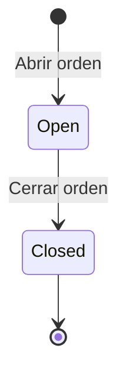
```mermaid
stateDiagram-v2
    [*] --> Open: Abrir orden
    Open --> Closed: Cerrar orden
    Closed --> [*]
```

Mientras la orden está **Open** (abierta), el activo asociado queda en estado "En mantenimiento" y
no puede asignarse, transferirse ni prestarse. Al **Closed** (cerrarse), el activo pasa a "En
almacén" (si se reparó) o a "Dañado" (si no se pudo reparar), según el resultado que indique quien
cierra la orden.

Una orden de mantenimiento puede abrirse de dos maneras: manualmente (lo que se describe en la
sección 6.5) o automáticamente cuando se aprueba una solicitud interna de tipo mantenimiento (ver
capítulo 2, "Aprobaciones y solicitudes"). Esta segunda vía tiene particularidades que se detallan
en "Casos especiales" de la sección 6.5.

---

### Crear un checklist de mantenimiento

#### Objetivo

Registrar una nueva plantilla de verificación reutilizable, que luego podrá copiarse dentro de
cualquier orden de mantenimiento que la seleccione.

#### Cuándo utilizarlo

Cuando el equipo de mantenimiento necesita estandarizar los pasos de revisión para un tipo de
activo o un tipo de intervención (por ejemplo, un checklist de mantenimiento preventivo para
laptops, o uno de revisión de UPS). Se crea una sola vez y se reutiliza en todas las órdenes que lo
necesiten.

#### Paso a paso detallado

1. En el menú lateral, ingresar a **Mantenimiento → Checklists**. Se muestra el listado de
   checklists existentes.

   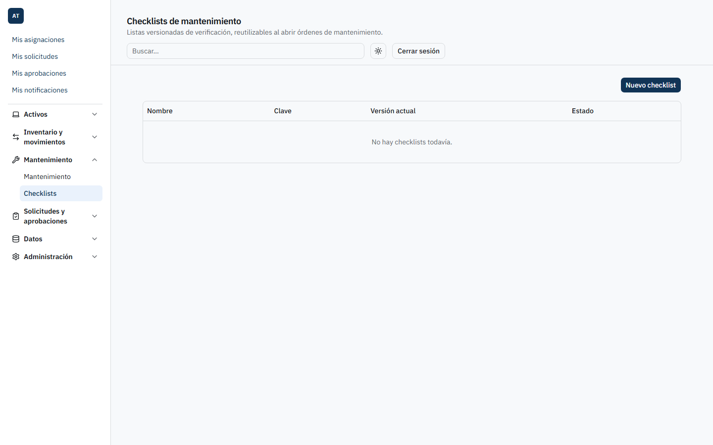

2. Hacer clic en el botón **"Nuevo checklist"**.

   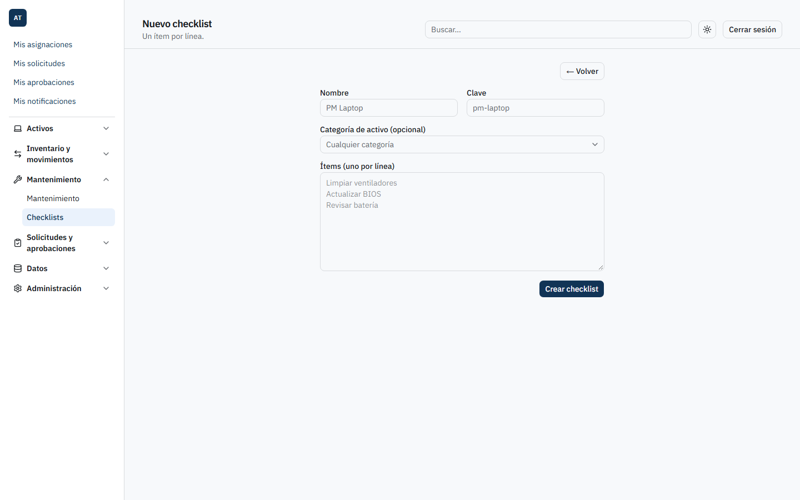

3. Completar el nombre y la clave del checklist.
4. Opcionalmente, seleccionar una categoría de activo (por defecto queda "Cualquier categoría").
5. Escribir los ítems del checklist en el cuadro de texto, **uno por línea**. Cada línea se
   convierte en un ítem independiente de verificación.
6. Hacer clic en **"Crear checklist"**.
7. El sistema valida los datos, crea la primera versión (versión 1) del checklist y redirige a la
   pantalla de detalle del checklist recién creado.

#### Campos

| Campo | Obligatorio | Descripción |
|---|---|---|
| Nombre | Sí (máx. 200 caracteres) | Nombre descriptivo del checklist. |
| Clave | Sí (máx. 100 caracteres) | Identificador corto y único del checklist. Es único a nivel global del sistema, no por empresa. |
| Categoría de activo | No | Categoría a la que se sugiere asociar el checklist. Es solo informativa; el sistema no la usa para filtrar checklists en ningún formulario. |
| Ítems | Sí (al menos uno) | Uno por línea en el cuadro de texto. Ninguna línea puede quedar vacía. |

#### Botones y acciones

| Botón | Acción |
|---|---|
| Nuevo checklist | Abre el formulario de creación (paso 2). |
| Crear checklist | Envía el formulario, crea el checklist con su primera versión y redirige al detalle. |

#### Reglas de negocio

- La clave y el nombre son obligatorios; el checklist debe tener al menos un ítem y ninguno puede
  estar vacío.
- La clave debe ser única en todo el sistema. Si ya existe un checklist con esa clave, el sistema
  rechaza la creación.
- Si se indica una categoría de activo que no existe, el sistema rechaza la creación.
- El checklist es una entidad **global**: no pertenece a ninguna empresa en particular y está
  disponible para todas las empresas del sistema. A diferencia de la mayoría de las entidades
  transaccionales de la aplicación, no lleva `CompanyId`. Trátelo como un catálogo compartido, en
  el mismo sentido que una lista maestra de categorías.
- Crear un checklist requiere el permiso `Maintenance.Create`.
- Crear un checklist **no genera un registro de auditoría** (`AuditEntry`). Si su organización
  necesita trazabilidad de quién creó o modificó checklists, debe complementarse con un control
  externo hasta que esta funcionalidad se incorpore al módulo.

#### Mensajes del sistema

- Validación de formulario incompleto: **"Clave, nombre y al menos un ítem son obligatorios."**
- Error de dominio si falta la clave: **"La clave del checklist es obligatoria."**
- Error de dominio si falta el nombre: **"El nombre del checklist es obligatorio."**
- Error de dominio si no hay ítems válidos: **"El checklist debe tener al menos un ítem, y ninguno
  puede estar vacío."**
- Clave duplicada: **"Ya existe un checklist con esa clave."**
- Sin permiso para consultar el listado: **"No tienes permiso para consultar checklists
  (Maintenance.Read)."**
- Listado vacío: **"No hay checklists todavía."**

#### Casos especiales

- **La clave es global, no por empresa.** Dos empresas distintas dentro del mismo sistema no
  pueden usar la misma clave de checklist; si una ya la usó, la otra deberá elegir una clave
  diferente aunque se trate de plantillas conceptualmente distintas.
- **La categoría de activo no restringe nada todavía.** Asociar un checklist a una categoría es
  únicamente descriptivo: al abrir una orden de mantenimiento sobre un activo de otra categoría,
  el sistema igual permitirá elegir ese checklist.
- **Los ítems duplicados están permitidos.** El sistema no impide escribir el mismo texto de ítem
  más de una vez dentro del mismo checklist.

#### Resultado esperado

El checklist queda creado con su versión 1 y estado activo, disponible de inmediato para ser
seleccionado al abrir cualquier orden de mantenimiento en cualquier empresa.

#### Buenas prácticas

- Use claves breves y descriptivas (por ejemplo, `PREV-LAPTOP`, `REV-UPS`) para que sean fáciles de
  identificar en el listado y evitar colisiones con otras áreas.
- Redacte los ítems como acciones verificables en un vistazo ("Verificar carga de batería" en lugar
  de "Batería"), ya que el texto se copiará literalmente en cada orden que use este checklist.
- Antes de crear un checklist nuevo, revise el listado existente para evitar duplicar plantillas
  equivalentes, dado que la clave es única en todo el sistema.

---

### Agregar una nueva versión a un checklist existente

#### Objetivo

Actualizar el contenido de un checklist (agregar, quitar o modificar ítems) sin alterar el
historial de versiones anteriores ni afectar las órdenes de mantenimiento que ya copiaron una
versión previa.

#### Cuándo utilizarlo

Cuando el conjunto de pasos de verificación de un checklist necesita cambiar — por ejemplo, se
agrega un nuevo punto de revisión exigido por el fabricante, o se corrige la redacción de un ítem.
Como las versiones son inmutables, cualquier cambio de contenido implica crear una versión nueva,
no editar la existente.

#### Paso a paso detallado

1. Desde el listado de checklists (**Mantenimiento → Checklists**), hacer clic en el nombre del
   checklist que se desea actualizar para entrar a su detalle.

   [Captura pendiente: detalle de checklist/orden de mantenimiento]

2. En la pantalla de detalle, localizar la sección **"Agregar nueva versión"**.
3. Escribir en el cuadro de texto los ítems de la nueva versión, uno por línea. Esta lista
   **reemplaza completamente** el contenido de la versión anterior; no se heredan ítems
   automáticamente.
4. Confirmar el envío del formulario.
5. El sistema crea una nueva versión numerada correlativamente (por ejemplo, si la vigente era
   v2, la nueva queda como v3) y la muestra al final del historial de versiones del checklist.

#### Campos

| Campo | Obligatorio | Descripción |
|---|---|---|
| Ítems | Sí (al menos uno) | Uno por línea. Ninguna línea puede quedar vacía. Reemplaza el contenido de la versión anterior en la nueva versión creada. |

#### Botones y acciones

| Botón | Acción |
|---|---|
| Agregar nueva versión | Envía el listado de ítems y crea la siguiente versión numerada del checklist. |

#### Reglas de negocio

- Debe indicarse al menos un ítem, y ninguno puede quedar vacío.
- Cada versión es **inmutable** una vez creada: no puede editarse ni borrarse. La única forma de
  "modificar" un checklist es agregar una versión nueva.
- La numeración de versiones es correlativa y automática (v1, v2, v3…), sin intervención manual.
- Agregar una versión nueva **no afecta las órdenes de mantenimiento ya abiertas**: cada orden
  conserva la copia de la versión que estaba vigente al momento en que se abrió, aunque después el
  checklist evolucione.
- Requiere el permiso `Maintenance.Update`.
- Agregar una versión **no genera un registro de auditoría**.

#### Mensajes del sistema

- Validación de formulario incompleto: **"Debes indicar al menos un ítem."**
- Error de dominio si no hay ítems válidos: **"El checklist debe tener al menos un ítem, y ninguno
  puede estar vacío."**
- Confirmación de éxito: **"Versión agregada."**

#### Casos especiales

- **Los ítems duplicados siguen sin estar prohibidos** dentro de una nueva versión.
- Si el checklist estaba desactivado, agregar una nueva versión no lo reactiva automáticamente; la
  activación es una acción independiente (ver sección 6.4).
- Las órdenes de mantenimiento abiertas antes de la nueva versión **no se actualizan**: seguirán
  mostrando los ítems de la versión que tenían copiada.

#### Resultado esperado

El checklist queda con una versión adicional, visible en su historial de versiones con el formato
`v{n} — {fecha}` seguido de la lista de ítems de esa versión. Las versiones anteriores permanecen
intactas en el historial.

#### Buenas prácticas

- Revise el historial de versiones antes de crear una nueva, para no repetir cambios ya
  incorporados en una versión previa.
- Como las versiones anteriores quedan congeladas en las órdenes ya abiertas, documente fuera del
  sistema (por ejemplo, en la descripción de la orden) si un cambio de versión responde a una
  corrección importante que el equipo de mantenimiento debería conocer para órdenes en curso.

---

### Activar o desactivar un checklist

#### Objetivo

Controlar si un checklist está disponible para ser seleccionado al abrir nuevas órdenes de
mantenimiento, sin necesidad de eliminarlo (dado que no existe la opción de borrado).

#### Cuándo utilizarlo

Cuando un checklist quedó obsoleto (por ejemplo, corresponde a un modelo de equipo que ya no se
usa) y no se desea que siga apareciendo como opción al abrir órdenes nuevas, pero se quiere
conservar su historial para las órdenes que ya lo usaron. También para reactivar un checklist que
había sido desactivado por error o que vuelve a ser necesario.

#### Paso a paso detallado

1. Ingresar al detalle del checklist desde el listado (**Mantenimiento → Checklists**).

   [Captura pendiente: detalle de checklist/orden de mantenimiento]

2. En el encabezado de la pantalla de detalle, hacer clic en el botón **Activar** o
   **Desactivar**, según el estado actual del checklist.
3. El cambio se aplica de inmediato, **sin pedir confirmación**.

#### Campos

Esta acción no tiene formulario ni campos: es un interruptor de un solo clic.

#### Botones y acciones

| Botón | Acción |
|---|---|
| Activar | Marca el checklist como activo; vuelve a estar disponible para seleccionarse al abrir órdenes de mantenimiento nuevas. |
| Desactivar | Marca el checklist como inactivo; deja de estar disponible para seleccionarse en órdenes nuevas. |

#### Reglas de negocio

- El cambio de estado es inmediato y no requiere confirmación ni justificación.
- Desactivar un checklist **no afecta las órdenes de mantenimiento que ya lo copiaron**: esas
  órdenes conservan su checklist copiado normalmente, incluyendo la posibilidad de cerrarse.
- Un checklist desactivado sigue visible en el listado de checklists (columna Estado), pero no
  aparece como opción seleccionable en el formulario de apertura de una orden nueva.
- Requiere el permiso `Maintenance.Update`.
- Esta acción **no genera un registro de auditoría**.

#### Mensajes del sistema

No hay mensajes de confirmación ni de error específicos para esta acción: el cambio de estado se
refleja directamente en la columna "Estado" del listado y en el encabezado del detalle.

#### Casos especiales

- Desactivar un checklist no elimina sus versiones ni su historial; toda la información permanece
  accesible desde el detalle del checklist.
- No existe un motivo obligatorio para desactivar: el botón no abre ningún formulario ni pide
  confirmación, así que debe usarse con cuidado en entornos donde varias personas administran
  checklists.

#### Resultado esperado

El checklist cambia de estado (Activo/Inactivo) y esa condición se refleja de inmediato en el
listado y en el formulario de apertura de nuevas órdenes de mantenimiento.

#### Buenas prácticas

- Antes de desactivar un checklist muy utilizado, confirme con el equipo de mantenimiento que ya
  no se necesita para órdenes nuevas, dado que el cambio es instantáneo y sin confirmación.
- Prefiera desactivar en lugar de "vaciar" un checklist con una versión sin ítems útiles: como no
  existe borrado, desactivar es el mecanismo correcto para retirar una plantilla de circulación.

---

### Abrir una orden de mantenimiento

#### Objetivo

Registrar el envío de un activo a mantenimiento, dejando constancia del tipo de intervención, la
descripción del problema o tarea, y opcionalmente el checklist de verificación que se usará
durante la ejecución.

#### Cuándo utilizarlo

Cuando un activo que está en almacén o asignado a un usuario necesita una intervención de
mantenimiento preventivo o correctivo. También ocurre automáticamente cuando se aprueba una
solicitud interna de mantenimiento (ver capítulo 2), sin que el usuario deba abrir la orden
manualmente en ese caso.

#### Paso a paso detallado

1. En el menú lateral, ingresar a **Mantenimiento → Órdenes de mantenimiento**. Es necesario tener
   seleccionada una empresa en el selector de empresas (`CompanySwitcher`).

   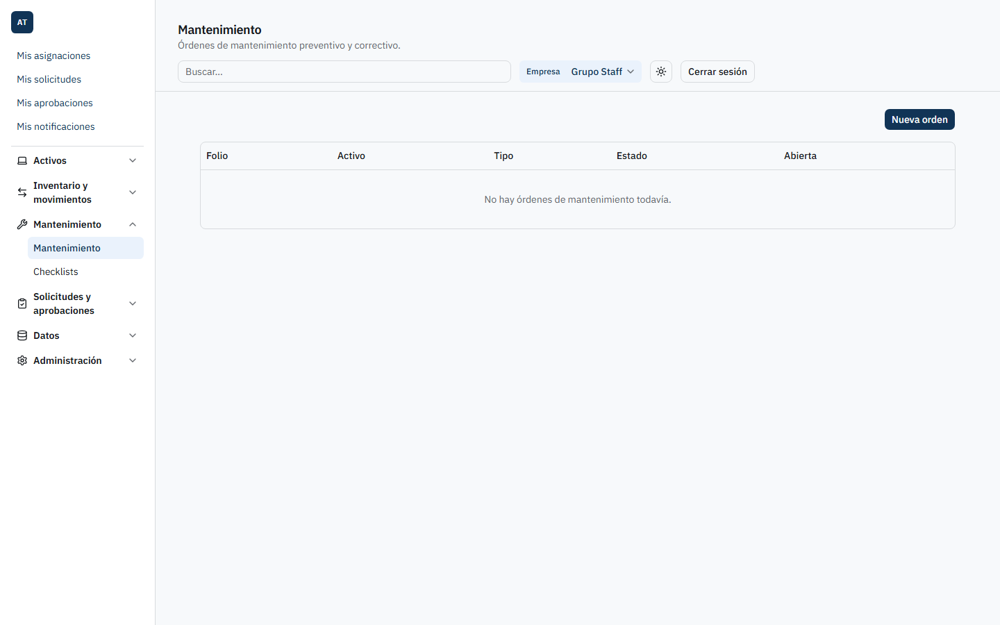

2. Hacer clic en el botón **"Nueva orden"**. Si se llega a esta pantalla desde el detalle de un
   activo, el campo Activo puede venir preseleccionado automáticamente.

   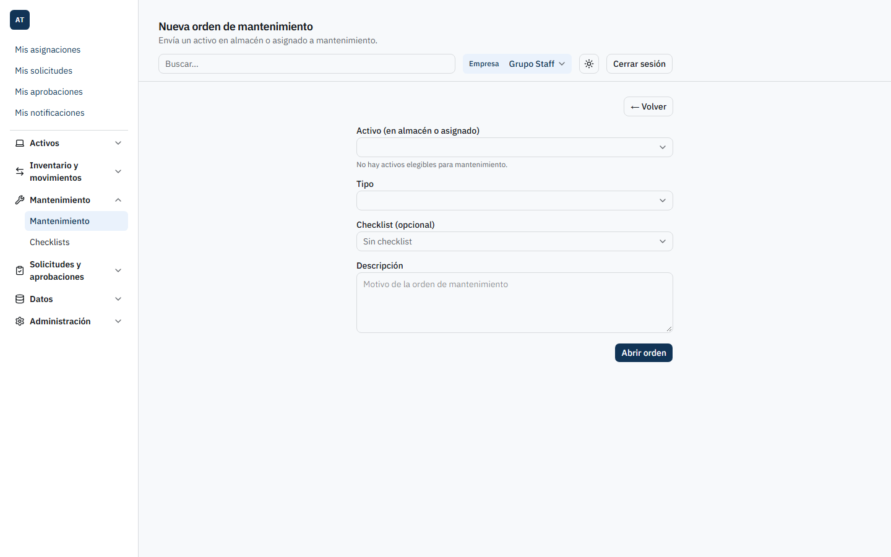

3. Seleccionar el **Activo** a enviar a mantenimiento. Solo se listan activos que estén en almacén
   o asignados.
4. Seleccionar el **Tipo** de mantenimiento: Preventivo o Correctivo.
5. Opcionalmente, seleccionar un **Checklist** (por defecto, "Sin checklist"). Solo se listan
   checklists activos.
6. Escribir la **Descripción** de la tarea o problema a atender.
7. Hacer clic en **"Abrir orden"**.
8. El sistema valida los datos, cambia el estado del activo a "En mantenimiento", copia la versión
   vigente del checklist seleccionado (si corresponde) dentro de la nueva orden, y redirige a la
   pantalla de detalle de la orden recién creada.

#### Campos

| Campo | Obligatorio | Descripción |
|---|---|---|
| Activo | Sí | Activo a enviar a mantenimiento. Solo admite activos en estado "En almacén" o "Asignado". Puede venir preseleccionado por parámetro `assetId` en la URL. |
| Tipo | Sí | Preventivo o Correctivo. |
| Checklist | No | Checklist a copiar dentro de la orden. Por defecto, "Sin checklist". Solo se muestran checklists activos. |
| Descripción | Sí (máx. 1000 caracteres) | Detalle de la tarea o problema a atender. |

#### Botones y acciones

| Botón | Acción |
|---|---|
| Nueva orden | Abre el formulario de apertura de orden (paso 2). |
| Abrir orden | Envía el formulario, crea la orden, cambia el estado del activo y redirige al detalle de la orden. |

#### Reglas de negocio

- Solo puede abrirse una orden de mantenimiento sobre un activo que esté **en almacén o
  asignado**. Si el activo está en otro estado (por ejemplo, ya en mantenimiento, dado de baja o
  en tránsito), el sistema rechaza la apertura.
- Al abrirse la orden, el activo cambia automáticamente a estado **"En mantenimiento"**.
- Si se selecciona un checklist que todavía no tiene ninguna versión cargada, el sistema rechaza la
  apertura de la orden.
- Si se selecciona un checklist, se copia (snapshot) la versión vigente en ese momento dentro de la
  orden; la orden nunca vuelve a consultar la definición original del checklist.
- Requiere el permiso `Maintenance.Create`.
- Requiere que el usuario tenga acceso a la empresa del activo; el sistema nunca confía en un
  identificador de empresa recibido directamente del cliente sin validar la membresía del usuario.
- Abrir una orden **sí genera un registro de auditoría**, aunque —por una limitación conocida del
  módulo— ese registro queda sin empresa asociada (`CompanyId` vacío), ya que la orden no tiene esa
  propiedad propia.

#### Mensajes del sistema

- Validación de formulario incompleto: **"Activo, tipo y descripción son obligatorios."**
- Error de aplicación si el activo no está disponible: **"Solo un activo en almacén o asignado
  puede enviarse a mantenimiento."**
- Error de aplicación si el checklist no tiene versiones: **"Este checklist todavía no tiene
  ninguna versión."**
- Error de acceso a empresa: **"El usuario no tiene acceso a la empresa de este activo."**
- Sin permiso para consultar el listado: **"No tienes permiso para consultar mantenimientos
  (Maintenance.Read)."**
- Listado vacío: **"No hay órdenes de mantenimiento todavía."**

#### Casos especiales

- **Una orden puede abrirse automáticamente**, sin que nadie complete este formulario, cuando se
  aprueba una **solicitud interna de mantenimiento** (módulo de Aprobaciones y solicitudes). En ese
  caso particular:
  - El **tipo queda fijado siempre en Correctivo**, sin posibilidad de elegir Preventivo.
  - La orden se abre **sin checklist**, aunque existan checklists activos disponibles.
  - La orden queda registrada como creada "por el sistema" (sin un usuario responsable asociado a
    su apertura), ya que se originó de un flujo de aprobación y no de una acción manual directa en
    este formulario.
- La categoría de activo asociada a un checklist **no filtra** las opciones del selector de
  checklist en este formulario: puede elegirse cualquier checklist activo, sin importar la
  categoría del activo seleccionado.
- La validación de que el activo esté en almacén o asignado se aplica al momento de abrir la orden;
  no es una regla que quede grabada de forma permanente en el activo ni en la orden.

#### Resultado esperado

Se crea una nueva orden de mantenimiento en estado **Open**, el activo pasa a estado "En
mantenimiento", y —si se eligió checklist— la orden queda con una copia de los ítems de la versión
vigente al momento de abrirla, todos sin marcar todavía.

#### Buenas prácticas

- Seleccione siempre un checklist cuando exista uno adecuado para el tipo de activo o de
  intervención: facilita una ejecución estandarizada y deja constancia clara de qué se verificó al
  cerrar la orden.
- Redacte la descripción con el detalle suficiente para que quien cierre la orden (que puede ser
  otra persona) entienda el motivo original del mantenimiento.
- Si el mantenimiento se originó por una solicitud interna aprobada, verifique el detalle de la
  orden generada automáticamente: recuerde que en ese caso siempre será de tipo Correctivo y sin
  checklist, aunque el motivo real de la solicitud haya sido preventivo.

---

### Cerrar una orden de mantenimiento

#### Objetivo

Registrar el resultado final de una intervención de mantenimiento: qué ítems del checklist
copiado se verificaron, el estado en que queda el activo (reparado o dañado) y la evidencia
descriptiva del resultado.

#### Cuándo utilizarlo

Cuando la intervención de mantenimiento sobre el activo terminó, sin importar si el resultado fue
exitoso o no. Toda orden abierta debe cerrarse eventualmente para que el activo vuelva a estar
disponible (en almacén) o quede correctamente marcado como dañado.

#### Paso a paso detallado

1. Ingresar al detalle de la orden de mantenimiento desde el listado
   (**Mantenimiento → Órdenes de mantenimiento**), haciendo clic en su folio.

   [Captura pendiente: detalle de checklist/orden de mantenimiento]

2. Si la orden está en estado **Open**, la pantalla de detalle muestra la tarjeta **"Cerrar
   orden"** con el formulario de cierre.
3. Si la orden tiene un checklist copiado, se muestra la lista de sus ítems, cada uno con una
   casilla de verificación y un campo opcional de notas.
4. Marcar la casilla de cada ítem que efectivamente se verificó durante la intervención. Es posible
   dejar ítems sin marcar.
5. Opcionalmente, escribir una nota por ítem (por ejemplo, una observación puntual sobre ese punto
   de la revisión).
6. Seleccionar el **Resultado**: "Reparado — vuelve a almacén" o "No se pudo reparar — queda
   dañado".
7. Escribir la **Descripción del resultado/evidencia**, explicando qué se hizo o por qué no pudo
   repararse.
8. Hacer clic en **"Cerrar orden"**.
9. El sistema valida los datos, marca la orden como **Closed**, guarda el resultado de cada ítem
   del checklist tal como quedó marcado, y cambia el estado del activo según el resultado elegido.

#### Campos

| Campo | Obligatorio | Descripción |
|---|---|---|
| Ítems del checklist (checkbox + notas) | No (por ítem) | Uno por cada ítem copiado en la orden. Cada uno se marca como completado o no, con una nota opcional. No es necesario marcar todos. |
| Resultado | Sí | Únicamente dos opciones: "Reparado — vuelve a almacén" (el activo pasa a En almacén) o "No se pudo reparar — queda dañado" (el activo pasa a Dañado). |
| Descripción del resultado/evidencia | Sí (máx. 2000 caracteres) | Explicación del resultado de la intervención. |

#### Botones y acciones

| Botón | Acción |
|---|---|
| Cerrar orden | Envía el formulario de cierre, marca la orden como Closed y actualiza el estado del activo. |

#### Reglas de negocio

- Solo una orden en estado **Open** puede cerrarse. Intentar cerrar una orden ya cerrada es
  rechazado por el sistema.
- El resultado y la descripción son obligatorios; los ítems del checklist, no.
- Al cerrarse la orden, el activo cambia de estado según el resultado elegido: a "En almacén" si
  fue reparado, o a "Dañado" si no se pudo reparar. No hay otras opciones de resultado posibles.
- El checklist copiado en la orden **queda fijo desde que se abrió**: aunque el checklist original
  haya recibido versiones nuevas o haya sido desactivado mientras la orden estaba abierta, el
  formulario de cierre siempre muestra los ítems tal como se copiaron al momento de abrir la orden.
- Requiere el permiso `Maintenance.Update`.
- Cerrar una orden **sí genera un registro de auditoría**, aunque —igual que al abrirla— ese
  registro queda sin empresa asociada (`CompanyId` vacío).
- La evidencia exigida al cerrar es exclusivamente el texto de la descripción del resultado.
  Adjuntar archivos (fotos, informes técnicos) es opcional y se hace aparte, desde el panel de
  documentos de la orden.

#### Mensajes del sistema

- Validación de formulario incompleto: **"El resultado y la descripción son obligatorios."**
- Error de dominio si se intenta cerrar una orden que ya está cerrada: **"Solo una orden de
  mantenimiento abierta puede cerrarse."**
- Error de dominio si se envía un resultado distinto a los dos permitidos: **"El resultado de una
  orden de mantenimiento solo puede ser 'En almacén' (reparado) o 'Dañado' (no se pudo
  reparar)."**
- Error de dominio si falta la descripción del resultado: **"Cerrar una orden de mantenimiento
  requiere describir el resultado (evidencia)."**

#### Casos especiales

- **No es necesario completar el checklist al 100% para cerrar la orden.** El sistema no exige
  marcar todos los ítems como verificados. Cualquier ítem que se deje sin marcar simplemente queda
  registrado como "no completado", de la misma forma que una casilla que nunca se marcó — no
  bloquea ni condiciona el cierre de la orden.
- **El resultado de cierre solo admite dos opciones, ninguna más.** No es posible cerrar una orden
  indicando, por ejemplo, que el activo queda "pendiente de baja" o "en garantía": esas situaciones
  deben gestionarse por otros flujos del sistema (solicitud de baja o el submódulo de garantías),
  no desde el cierre de una orden de mantenimiento.
- **Una orden abierta automáticamente por la aprobación de una solicitud interna de mantenimiento
  siempre es de tipo Correctivo y se abre sin checklist** (ver sección 6.5). Al cerrar este tipo de
  orden, por lo tanto, no habrá ítems de checklist que marcar: el formulario de cierre solo pedirá
  el resultado y la descripción.
- Si un cliente distinto a la aplicación web enviara una nota de ítem excesivamente larga, el
  formulario web limita la longitud, pero esa validación no está reforzada en el mismo comando de
  cierre del lado del servidor; en el uso normal desde la aplicación web esto no representa un
  problema.

#### Resultado esperado

La orden queda en estado **Closed**, con su resultado final, fecha de cierre, descripción de
evidencia y el detalle de cada ítem del checklist (marcado con ✓ o ✗ según corresponda) visible en
la pantalla de detalle. El activo asociado queda en "En almacén" o "Dañado" según el resultado
elegido.

#### Buenas prácticas

- Marque los ítems del checklist a medida que se van verificando durante la intervención, y no solo
  al final, para reducir el riesgo de omitir alguno.
- Use las notas por ítem para dejar constancia de hallazgos puntuales (por ejemplo, un valor fuera
  de rango), incluso si el ítem se marcó como completado.
- Redacte la descripción del resultado pensando en que puede ser leída después por otra persona
  (auditoría interna, garantía del proveedor, o el propio usuario del activo): incluya qué se hizo,
  qué se reemplazó y por qué se llegó al resultado elegido.
- Si el resultado es "Dañado", adjunte evidencia fotográfica o documentos de respaldo en el panel
  de documentos de la orden, ya que el sistema no lo exige pero facilita decisiones posteriores
  (por ejemplo, iniciar una solicitud de baja del activo).

---

## 6.4 Consumibles, Repuestos y Garantías

### Introducción: tres conceptos que no deben confundirse

Este módulo agrupa tres tipos de información que, aunque conviven en el mismo grupo del menú
("Inventario y movimientos" para Consumibles y Refacciones, y "Activos" para Garantías), responden
a lógicas de negocio completamente distintas. Antes de usar cualquiera de los procesos de este
capítulo es importante entender la diferencia:

- **Consumible**: es un insumo que se controla **por cantidad**, no de forma individual. Ejemplos
  típicos son tóner, cables, pilas o etiquetas. El sistema nunca sabe "cuál" cable en particular se
  usó, solo cuántas unidades hay en existencia (`Existencia`) y, opcionalmente, cuál es el mínimo
  aceptable antes de generar una alerta. Cada consumible no tiene número de serie ni se vincula
  directamente a un activo específico; su movimiento se registra contra un almacén.
- **Repuesto (o refacción)**: es una pieza física **identificada individualmente** mediante un
  número de serie único. A diferencia del consumible, el sistema sí sabe exactamente cuál pieza es
  cuál, en dónde está (en un almacén o instalada en un activo concreto) y conserva el historial
  completo de cada instalación y retiro. Un repuesto tiene un ciclo de vida propio: existencia →
  instalado → existencia → ... → baja.
- **Garantía**: es un registro de cobertura (de fábrica, extendida o de terceros) vinculado a un
  activo específico, con vigencia, proveedor y términos.

> **Aclaración importante — dos lugares distintos donde puede haber información de garantía**
>
> El sistema tiene **dos mecanismos separados** para registrar información de garantía de un
> activo, y no están sincronizados entre sí. Es fundamental que usted los distinga para no
> confundirse al buscar o interpretar datos de vigencia:
>
> 1. **Los campos de contrato del propio Activo** (fecha de inicio y fin de garantía, y contrato de
>    soporte), que se editan desde la ficha del activo, en su información contractual.
> 2. **El módulo independiente de Garantías** descrito en este capítulo (pantalla `/warranties`),
>    que permite registrar **varias** coberturas distintas para un mismo activo a lo largo de su
>    vida útil (por ejemplo, la garantía original de fábrica y, más adelante, una extensión
>    contratada con un proveedor distinto).
>
> El sistema fue diseñado deliberadamente así porque un mismo activo puede acumular más de una
> cobertura de garantía a lo largo del tiempo, y los campos simples del activo solo alcanzan para
> guardar una vigencia a la vez. **Sin embargo, el sistema no concilia ni sincroniza automáticamente
> ambos lugares**: es perfectamente posible que la ficha del activo muestre una fecha de vigencia de
> garantía y que el módulo de Garantías muestre una fecha distinta (o varias garantías) para ese
> mismo activo, sin que ninguna de las dos se actualice cuando se cambia la otra. Si necesita saber
> la vigencia "oficial" de garantía de un activo, revise **ambos lugares** y, ante una discrepancia,
> confirme con quien administra los contratos de la empresa cuál de los dos registros es el vigente.
> Este capítulo documenta únicamente el módulo independiente de Garantías; los campos de contrato
> del activo se documentan en el capítulo dedicado a Activos.

Con esta distinción clara, a continuación se documentan los ocho procesos disponibles: alta y
movimiento de consumibles, alta e instalación/retiro/baja de refacciones, y alta/edición de
garantías.

---

### Registrar un consumible

#### Objetivo

Dar de alta un nuevo tipo de consumible en el catálogo de la empresa activa, definiendo su nombre,
unidad de medida y, opcionalmente, un umbral mínimo de existencia para efectos de alerta.

#### Cuándo utilizarlo

Cuando la organización empieza a controlar un insumo que antes no estaba registrado en el sistema
(por ejemplo, un nuevo modelo de tóner o un tipo de cable que se compra con regularidad), antes de
poder registrar cualquier entrada o salida de existencia de ese insumo.

#### Paso a paso detallado

1. En el menú, ingrese a **Inventario y movimientos → Consumibles**. Se muestra el listado de
   consumibles de la empresa activa (ver captura 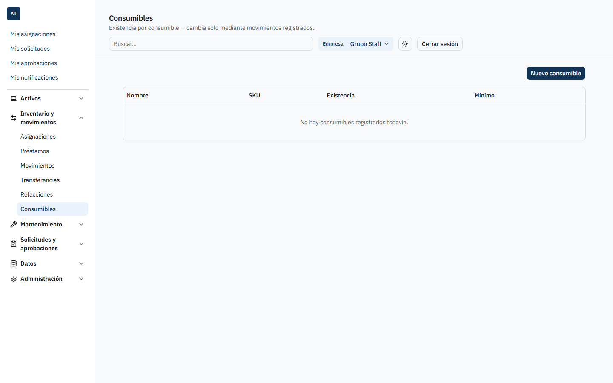).
2. Presione el botón **"Nuevo consumible"**.
3. Se abre el formulario de alta (ver captura 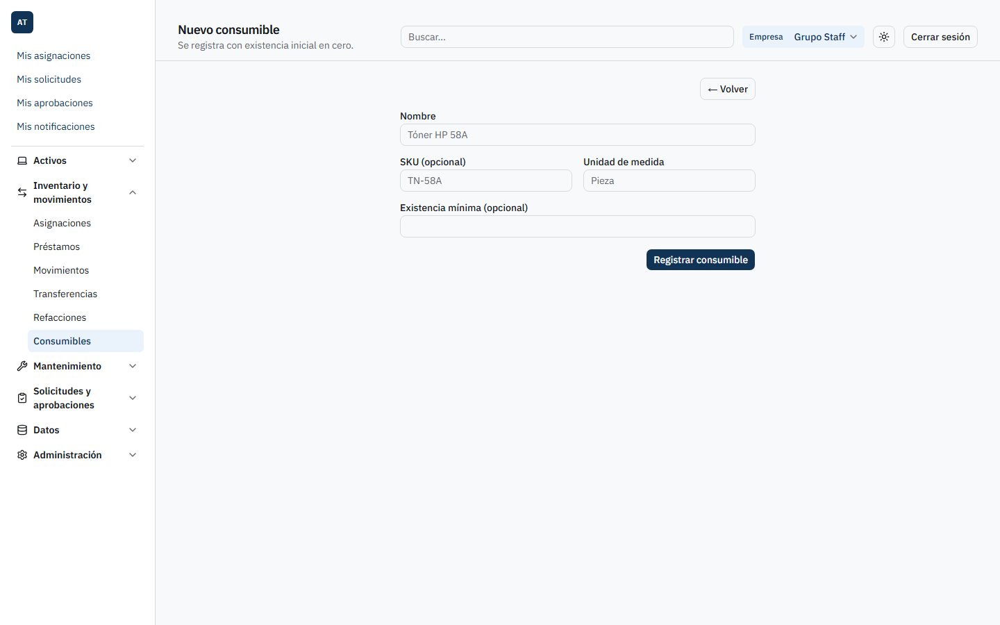).
4. Capture el **Nombre** del consumible (obligatorio).
5. Capture el **SKU**, si su organización maneja uno (opcional).
6. Capture la **Unidad de medida** (obligatorio) — por ejemplo, "pieza", "caja", "metro".
7. Capture, si lo desea, la **Existencia mínima** para que el sistema pueda marcarlo como "bajo
   mínimo" cuando la cantidad disponible caiga por debajo de ese número.
8. Presione **"Registrar consumible"**.
9. El sistema redirige automáticamente a la ficha de detalle del consumible recién creado, con
   existencia inicial en cero.

#### Campos

| Campo | Obligatorio | Longitud / restricción |
|---|---|---|
| Nombre | Sí | Máximo 200 caracteres |
| SKU | No | Máximo 100 caracteres |
| Unidad de medida | Sí | Máximo 50 caracteres |
| Existencia mínima | No | Numérico, no puede ser negativo |

#### Botones y acciones

- **"Nuevo consumible"** (en el listado): abre el formulario de alta.
- **"Registrar consumible"** (en el formulario): envía el alta y, si es exitosa, redirige al
  detalle del consumible.

#### Reglas de negocio

- El consumible se crea siempre asociado a la empresa activa; no se puede reasignar a otra empresa
  después (no existe comando de transferencia de empresa para consumibles).
- El consumible se crea con existencia en cero. Para tener existencia disponible, debe registrarse
  al menos un movimiento de entrada (ver proceso 6.2).
- La existencia mínima es puramente informativa: sirve para el badge "Bajo mínimo" en el listado y
  para el reporte de existencias bajas; no bloquea ninguna operación.

#### Mensajes del sistema

- Validación del formulario si falta algún campo obligatorio: **"Nombre y unidad de medida son
  obligatorios."**
- Errores de dominio, si el backend los detecta: **"El nombre del consumible es obligatorio."**,
  **"La unidad de medida del consumible es obligatoria."**, **"La existencia mínima no puede ser
  negativa."**
- Si no tiene el permiso correspondiente para consultar el listado: **"No tienes permiso para
  consultar consumibles (Consumables.Read)."**

#### Casos especiales

- **No es posible editar un consumible ya registrado desde esta versión del sistema.** Aunque
  técnicamente existe la operación en el servidor, ningún formulario de la interfaz la utiliza. Si
  se equivocó al capturar el nombre, el SKU o la unidad de medida de un consumible, no hay manera
  de corregirlo desde la pantalla: solo puede seguir registrando movimientos de existencia sobre el
  registro tal como quedó dado de alta. Revise cuidadosamente los datos antes de presionar
  "Registrar consumible".

#### Resultado esperado

El consumible queda visible en el listado de `/consumables` con existencia en cero, listo para
recibir su primer movimiento de entrada.

#### Buenas prácticas

- Defina un SKU consistente con el que ya use su organización en otros sistemas (compras,
  almacén), para facilitar la conciliación.
- Capture la existencia mínima desde el alta si ya conoce el umbral deseado; agregarla después
  requeriría edición, que no está disponible.
- Revise el nombre y la unidad de medida con cuidado antes de guardar, ya que no podrá corregirlos
  posteriormente.

---

### Registrar un movimiento de existencia de un consumible (entrada/salida)

#### Objetivo

Aumentar o disminuir la existencia disponible de un consumible ya registrado, dejando un registro
inmutable de cada movimiento.

#### Cuándo utilizarlo

Cada vez que ingrese mercancía al almacén (compra, existencia inicial) o que se consuma o ajuste la
cantidad disponible de un consumible (consumo, ajuste por conteo físico, etc.).

#### Paso a paso detallado

1. Desde el listado de consumibles (), presione el nombre
   del consumible sobre el que desea registrar el movimiento.
2. Se abre la ficha de detalle del consumible, con su existencia actual y el badge de "Bajo
   mínimo" cuando corresponda. [Captura pendiente: detalle de consumible.]
3. En el formulario "Registrar movimiento", seleccione la **Dirección**: Entrada o Salida.
4. Seleccione el **Motivo**: Existencia inicial, Compra, Consumo o Ajuste.
5. Seleccione el **Almacén** — únicamente se listan unidades organizacionales de tipo "Almacén"
   de la empresa activa.
6. Capture la **Cantidad** del movimiento (debe ser mayor a cero).
7. Capture **Notas** adicionales si lo desea (opcional).
8. Presione el botón de registrar el movimiento.
9. El movimiento aparece de inmediato en el historial de movimientos de la ficha, y la existencia
   mostrada en el encabezado se actualiza.

#### Campos

| Campo | Obligatorio | Restricción |
|---|---|---|
| Dirección | Sí | Entrada / Salida |
| Motivo | Sí | Existencia inicial / Compra / Consumo / Ajuste |
| Almacén | Sí | Debe ser una unidad organizacional de tipo "Almacén" de la misma empresa |
| Cantidad | Sí | Numérico, mayor a cero |
| Notas | No | Máximo 1000 caracteres |

#### Botones y acciones

- Botón de registrar movimiento en la ficha de detalle del consumible: envía el movimiento y
  refresca la existencia y el historial.

#### Reglas de negocio

- Todo cambio de existencia genera un registro de movimiento (folio, dirección, motivo, cantidad,
  fecha) que **no puede editarse ni borrarse** después de creado.
- La existencia nunca puede quedar negativa: si una salida deja la existencia por debajo de cero,
  el sistema rechaza la operación.
- El almacén seleccionado se vuelve a validar en el servidor en cada movimiento (existencia real,
  tipo "Almacén", misma empresa que el consumible) — el sistema nunca confía únicamente en lo que
  ofrece la lista desplegable del formulario.
- Este proceso queda registrado en la bitácora de auditoría del sistema.
- Si no existe ninguna unidad organizacional de tipo "Almacén" configurada en la empresa, no será
  posible registrar el movimiento hasta que se cree una desde el módulo de Estructura organizacional.

#### Mensajes del sistema

- Validación de formulario si falta algún campo: **"Almacén, dirección, motivo y una cantidad
  mayor a cero son obligatorios."**
- Si no hay almacenes disponibles en la empresa: **"No hay unidades de tipo Almacén en la
  estructura organizacional."**
- Error de dominio si la cantidad no es mayor a cero: **"La cantidad del movimiento de existencia
  debe ser mayor a cero."**
- Error de dominio si el movimiento dejaría la existencia negativa: **"Este movimiento dejaría la
  existencia del consumible en negativo."**
- Error de conflicto si el almacén no es válido para la empresa: **"El almacén indicado no es
  válido para esta empresa."**
- Historial vacío (consumible recién creado, sin movimientos todavía): **"Sin movimientos
  todavía."**

#### Casos especiales

- **Los movimientos son verdaderamente inmutables.** El sistema no ofrece un comando dedicado de
  "movimiento compensatorio": si registró un movimiento por error, la única corrección posible es
  capturar un **nuevo** movimiento en dirección contraria, normalmente con motivo "Ajuste", que
  compense la cantidad equivocada. El movimiento original permanecerá siempre visible en el
  historial, tal como quedó capturado.
- El indicador de "Bajo mínimo" en el listado general y el reporte de existencias bajas usan
  criterios de comparación ligeramente distintos entre sí (uno más estricto que el otro), por lo
  que en casos límite podría ver el badge activado en un lugar y no en el otro para el mismo
  consumible. Ante cualquier duda sobre si un consumible está realmente por debajo de su mínimo,
  confíe en el valor numérico de existencia y mínimo mostrados, más que en el badge.

#### Resultado esperado

La existencia del consumible se actualiza de inmediato y el movimiento queda agregado al final del
historial de movimientos de la ficha, con su folio, dirección, motivo, cantidad y fecha.

#### Buenas prácticas

- Use el motivo "Existencia inicial" únicamente para la primera carga de inventario de un
  consumible recién creado; para reposiciones posteriores use "Compra".
- Capture notas descriptivas en movimientos de "Ajuste" (por ejemplo, referencia al conteo físico
  que originó la corrección), ya que no hay otro campo donde documentar el motivo real del ajuste.
- Verifique la cantidad capturada antes de confirmar: recuerde que no podrá editar ni borrar el
  movimiento después, solo compensarlo con uno nuevo.

---

### Registrar una refacción

#### Objetivo

Dar de alta una nueva refacción (repuesto) en el catálogo de la empresa activa, identificada por su
número de serie único, y ubicarla inicialmente en un almacén.

#### Cuándo utilizarlo

Cuando ingresa físicamente al almacén una pieza serializada (por ejemplo, un disco duro, una
memoria RAM o una fuente de poder) que en algún momento podrá instalarse en un activo.

#### Paso a paso detallado

1. En el menú, ingrese a **Inventario y movimientos → Refacciones**. Se muestra el listado de
   refacciones de la empresa activa (ver captura 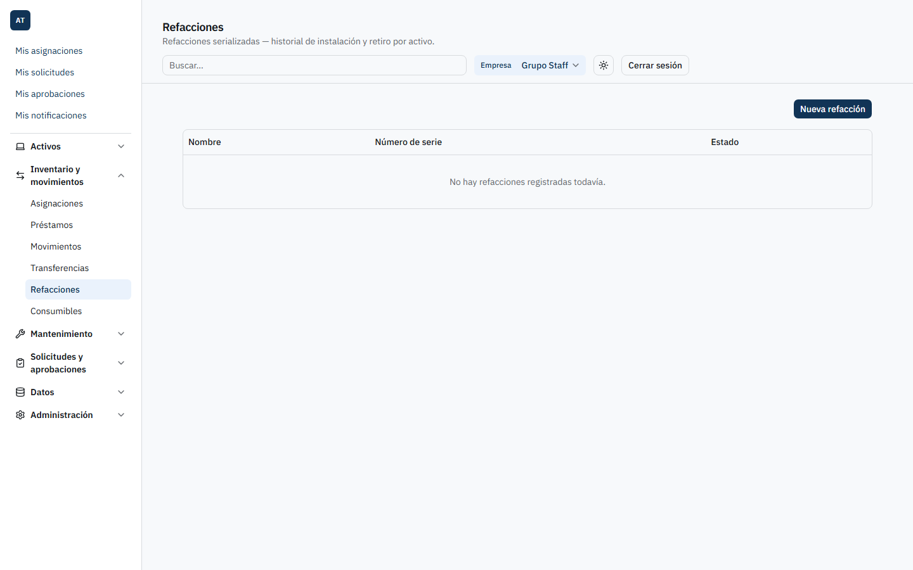).
2. Presione el botón de alta de refacción.
3. Se abre el formulario de alta (ver captura 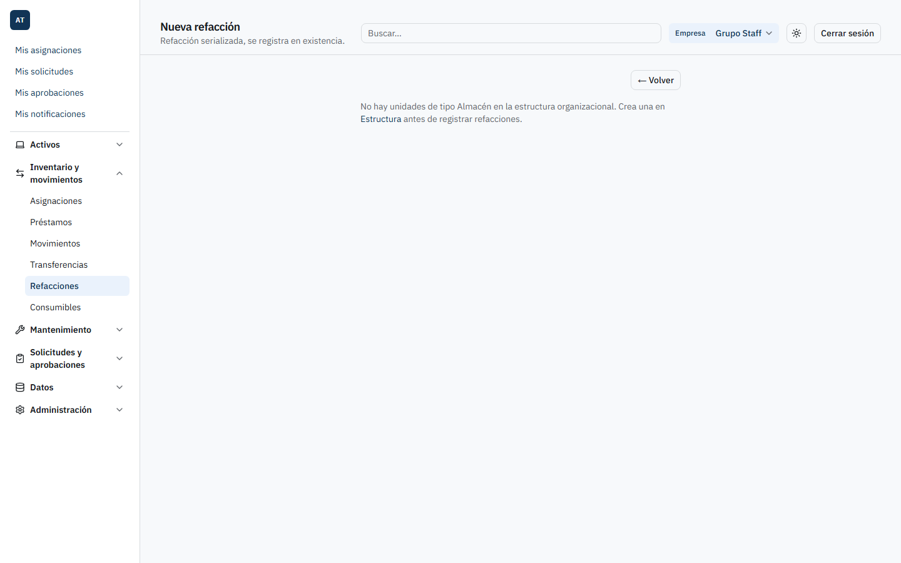).
4. Capture el **Nombre** de la refacción (obligatorio).
5. Capture el **Número de parte**, si aplica (opcional).
6. Capture el **Número de serie** (obligatorio) — debe ser único dentro de la empresa.
7. Seleccione el **Almacén** donde queda ubicada la refacción (obligatorio; solo se listan
   unidades de tipo "Almacén"). Si no existe ninguna, el sistema muestra un enlace directo al
   módulo de Estructura organizacional para crear una.
8. Presione el botón de registrar.
9. El sistema redirige a la ficha de detalle de la refacción recién creada, en estado "En
   existencia".

#### Campos

| Campo | Obligatorio | Restricción |
|---|---|---|
| Nombre | Sí | Máximo 200 caracteres |
| Número de parte | No | Máximo 100 caracteres |
| Número de serie | Sí | Máximo 100 caracteres; único por empresa (no globalmente) |
| Almacén | Sí | Unidad organizacional de tipo "Almacén" |

#### Botones y acciones

- Botón de alta en el listado: abre el formulario de nueva refacción.
- Botón de registrar en el formulario: envía el alta y redirige a la ficha de detalle.

#### Reglas de negocio

- El número de serie debe ser único **dentro de la empresa**, no de forma global en todo el
  sistema: dos empresas distintas podrían, en teoría, tener refacciones con el mismo número de
  serie registradas de forma independiente.
- La refacción se crea siempre en estado "En existencia" (`InStock`), ubicada en el almacén
  indicado.
- No existe comando para reasignar la refacción a otra empresa una vez creada.

#### Mensajes del sistema

- Validación de formulario si falta algún campo: **"Nombre, número de serie y almacén son
  obligatorios."**
- Error de dominio si falta el nombre: **"El nombre de la refacción es obligatorio."**
- Error de dominio si falta el número de serie: **"El número de serie de la refacción es
  obligatorio."**
- Error de conflicto si ya existe una refacción con ese número de serie en la empresa: **"Ya
  existe una refacción con ese número de serie en esta empresa."**
- Error de conflicto si el almacén no es válido para la empresa: **"El almacén indicado no es
  válido para esta empresa."**
- Listado vacío: **"No hay refacciones registradas todavía."**
- Sin permiso de consulta: **"No tienes permiso para consultar refacciones (SpareParts.Read)."**

#### Casos especiales

- Si intenta registrar dos refacciones con el mismo número de serie dentro de la misma empresa, el
  sistema rechazará la segunda con el mensaje de conflicto citado arriba. Verifique el número de
  serie físico de la pieza antes de capturarlo para evitar este rechazo.

#### Resultado esperado

La refacción queda visible en el listado de `/spare-parts`, en estado "En existencia", ubicada en
el almacén seleccionado, y disponible para ser instalada en un activo (ver proceso 6.4).

#### Buenas prácticas

- Capture el número de parte del fabricante siempre que esté disponible en la etiqueta física de
  la pieza; facilita identificarla en listados largos junto al nombre.
- Verifique con cuidado el número de serie al capturarlo — es el identificador que después
  aparecerá en todo el historial de instalación/retiro de la pieza.

---

### Instalar una refacción en un activo

#### Objetivo

Registrar que una refacción que está en existencia pasa a estar instalada físicamente en un activo
específico.

#### Cuándo utilizarlo

Cuando técnicamente se instala una pieza serializada (disco, memoria, fuente, etc.) dentro de un
equipo dado de alta como activo en el sistema.

#### Paso a paso detallado

1. Desde el listado de refacciones (), abra la refacción
   que desea instalar (debe estar en estado "En existencia"). [Captura pendiente: detalle de
   refacción en existencia con formulario de instalación.]
2. En la ficha de detalle, localice el formulario "Instalar".
3. Seleccione el **Activo** destino en el desplegable. Este desplegable solo muestra activos que
   se encuentran en estado "En almacén".
4. Presione el botón **"Instalar"**.
5. La refacción cambia a estado "Instalada" y queda vinculada al activo seleccionado; el
   movimiento se agrega al historial de instalación/retiro de la ficha.

#### Campos

| Campo | Obligatorio | Restricción |
|---|---|---|
| Activo | Sí | Se listan únicamente activos en estado "En almacén" |

#### Botones y acciones

- **"Instalar"**: ejecuta la instalación de la refacción en el activo seleccionado.

#### Reglas de negocio

- Solo una refacción que se encuentra en estado "En existencia" puede instalarse.
- La refacción y el activo deben pertenecer a la misma empresa.
- Esta operación queda registrada en la bitácora de auditoría.

#### Mensajes del sistema

- Error de dominio si la refacción no está en existencia: **"Solo una refacción en existencia
  puede instalarse."**
- Error de conflicto si la refacción y el activo no son de la misma empresa: **"La refacción y el
  activo deben pertenecer a la misma empresa."**

#### Casos especiales

- **Importante — el sistema no valida en el servidor que el activo destino esté realmente
  disponible en almacén al momento de instalar la refacción**, a pesar de que la pantalla, por
  diseño, solo ofrece en el desplegable a los activos que en ese momento aparecen como "En
  almacén". Esto significa que, en teoría, si el estado del activo cambiara entre que se cargó la
  pantalla y que se confirma la instalación, la operación podría completarse contra un activo que
  ya no está realmente disponible, sin que el sistema lo detecte ni lo impida. Tenga esto en cuenta
  en flujos de trabajo con varias personas operando simultáneamente sobre los mismos activos, y
  confirme visualmente el estado del activo en su propia ficha si tiene dudas.

#### Resultado esperado

La refacción pasa a estado "Instalada", queda asociada al activo indicado, y en el historial de la
ficha aparece un nuevo renglón con el folio del activo y la fecha de instalación, mostrando
"actualmente instalada" como estado del periodo.

#### Buenas prácticas

- Instale la refacción en el sistema en el mismo momento en que se realiza físicamente la
  instalación, para mantener el historial alineado con la realidad.
- Antes de instalar, confirme en la ficha del activo que efectivamente se encuentra disponible,
  ya que el sistema no hace esta verificación por usted al momento de guardar.

---

### Retirar una refacción de un activo

#### Objetivo

Registrar que una refacción actualmente instalada en un activo se retira físicamente y regresa a
existencia en un almacén.

#### Cuándo utilizarlo

Cuando se desinstala físicamente una pieza de un equipo (por reemplazo, reparación, reutilización
en otro equipo, etc.) y debe volver al inventario disponible.

#### Paso a paso detallado

1. Desde el listado de refacciones, abra la refacción que se encuentra en estado "Instalada".
   [Captura pendiente: detalle de refacción instalada con formulario de retiro.]
2. En la ficha de detalle, localice el formulario "Retirar".
3. Seleccione el **Almacén destino** al que regresará la pieza.
4. Presione el botón **"Retirar"**.
5. La refacción cambia a estado "En existencia", ubicada en el almacén seleccionado; el registro
   de instalación vigente se cierra con la fecha de retiro.

#### Campos

| Campo | Obligatorio | Restricción |
|---|---|---|
| Almacén destino | Sí | Unidad organizacional de tipo "Almacén" |

#### Botones y acciones

- **"Retirar"**: ejecuta el retiro de la refacción y la regresa a existencia.

#### Reglas de negocio

- Solo una refacción en estado "Instalada" puede retirarse.
- Debe existir un registro de instalación vigente asociado a la refacción; si por alguna
  inconsistencia no lo hay, la operación se rechaza.
- El almacén destino se valida igual que en los demás procesos (tipo "Almacén", misma empresa).

#### Mensajes del sistema

- Error de dominio si la refacción no está instalada: **"Solo una refacción instalada puede
  retirarse."**
- Error de dominio si no se encuentra el registro de instalación vigente: **"No se encontró el
  registro de instalación vigente de esta refacción."**
- Error de conflicto si el almacén no es válido para la empresa: **"El almacén indicado no es
  válido para esta empresa."**

#### Casos especiales

- Si el activo del que se retira la refacción fue eliminado o transferido de forma que ya no es
  visible para la empresa actual, el historial de instalación de la refacción **igual conserva y
  muestra ese registro** (el sistema deliberadamente no lo oculta), mostrando la leyenda
  **"(activo eliminado)"** en lugar del folio, para no perder trazabilidad de la pieza.

#### Resultado esperado

La refacción vuelve a estado "En existencia" en el almacén indicado, y el renglón correspondiente
en el historial de instalación/retiro se actualiza con la fecha de retiro en lugar de "actualmente
instalada".

#### Buenas prácticas

- Retire la refacción en el sistema en cuanto se retire físicamente, para que el historial de
  instalación refleje con precisión cuánto tiempo estuvo instalada.
- Verifique el almacén destino antes de confirmar, especialmente si su organización distingue
  entre varios almacenes físicos.

---

### Dar de baja una refacción

#### Objetivo

Marcar una refacción como definitivamente fuera de uso (baja), cuando ya no será reinstalada ni
reutilizada.

#### Cuándo utilizarlo

Cuando una pieza serializada se descompone de forma irreparable, se pierde, o se decide desecharla
y ya no debe seguir apareciendo como disponible en el inventario de refacciones.

#### Paso a paso detallado

1. Desde el listado de refacciones, abra la refacción que se encuentra en estado "En existencia".
   [Captura pendiente: detalle de refacción con botón de baja.]
2. Localice el botón **"Dar de baja"**.
3. Presione el botón.
4. La refacción cambia de inmediato a estado "Dada de baja", sin ningún cuadro de confirmación
   intermedio.

#### Campos

Este proceso no tiene formulario ni campos: es una acción de un solo botón sobre la refacción ya
existente.

#### Botones y acciones

- **"Dar de baja"**: cambia el estado de la refacción a "Dada de baja" de forma permanente.

#### Reglas de negocio

- Solo una refacción en estado "En existencia" puede darse de baja. Si está instalada, primero
  debe retirarse (proceso 6.5).
- Una vez dada de baja, la refacción no ofrece ninguna acción adicional en su ficha: la pantalla
  únicamente informa que ya fue dada de baja.
- No existe ningún comando para revertir la baja de una refacción ni para eliminarla del sistema.

#### Mensajes del sistema

- Error de dominio si la refacción no está en existencia: **"Solo una refacción en existencia
  puede darse de baja (retírala primero si está instalada)."**
- Mensaje mostrado en la ficha de una refacción ya dada de baja: **"Esta refacción ya fue dada de
  baja."**

#### Casos especiales

- **Advertencia — esta acción es irreversible y el botón "Dar de baja" no solicita ninguna
  confirmación antes de ejecutarse.** A diferencia de otras operaciones destructivas del sistema
  que muestran un cuadro de diálogo de confirmación, aquí basta con un solo clic para completar la
  baja de forma permanente, sin posibilidad de deshacerla desde la interfaz. Tenga especial cuidado
  de estar viendo la refacción correcta antes de presionar este botón — verifique el nombre y,
  sobre todo, el número de serie mostrados en la ficha.

#### Resultado esperado

La refacción queda en estado "Dada de baja" de forma permanente, deja de estar disponible para
instalación, y su ficha muestra únicamente el mensaje de que ya fue dada de baja, sin más acciones
disponibles.

#### Buenas prácticas

- Antes de presionar "Dar de baja", confirme visualmente el número de serie de la refacción en
  pantalla, ya que no habrá una segunda oportunidad de cancelar la operación.
- Si existe alguna duda sobre si la pieza realmente debe darse de baja o solo requiere
  mantenimiento, no ejecute esta acción hasta confirmarlo — recuerde que es irreversible.
- Dé de baja únicamente refacciones que estén en existencia; si está instalada, retírela primero
  siguiendo el proceso 6.5.

---

### Registrar una garantía

#### Objetivo

Crear un nuevo registro de cobertura de garantía vinculado a un activo específico, dentro del
módulo independiente de Garantías (recuerde la aclaración de la sección 6.0 sobre la coexistencia
con los campos de garantía propios del activo).

#### Cuándo utilizarlo

Cuando se adquiere o se identifica una cobertura de garantía para un activo — de fábrica, extendida
o de un tercero — y se desea llevar un registro formal de su vigencia, proveedor y términos dentro
del sistema.

#### Paso a paso detallado

1. En el menú, ingrese a **Activos → Garantías**. Se muestra el listado de garantías registradas
   (ver captura 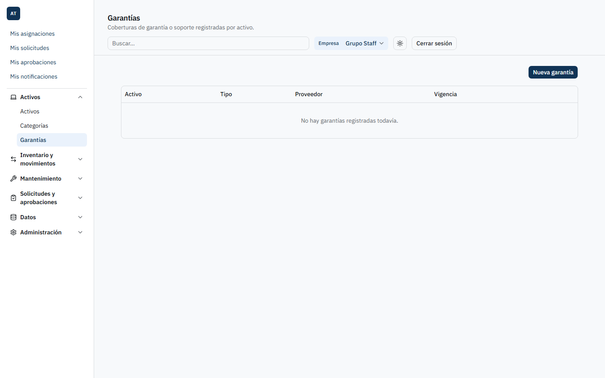).
2. Presione el botón de alta de garantía.
3. Se abre el formulario de registro (ver captura 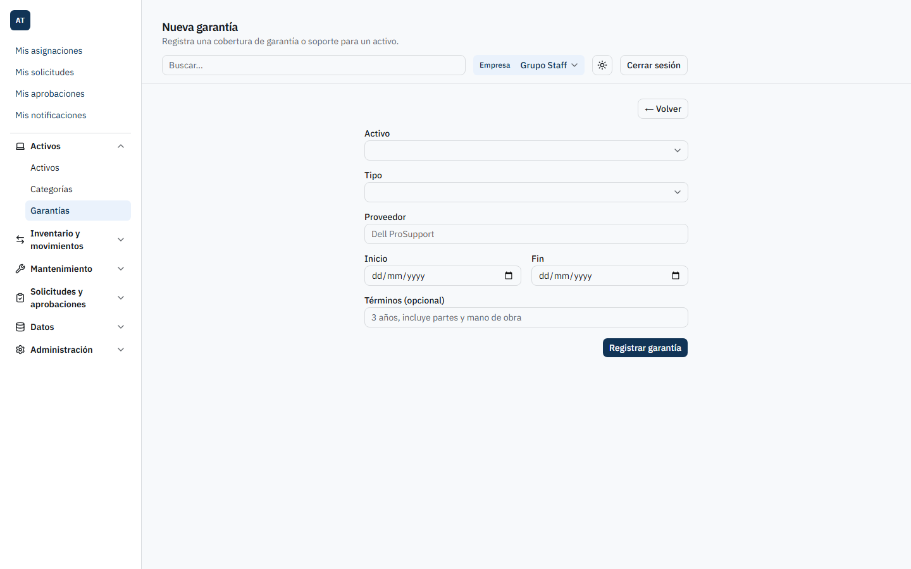).
4. Seleccione el **Activo** al que corresponde la garantía (obligatorio).
5. Seleccione el **Tipo**: Fabricante, Extendida o Terceros (obligatorio).
6. Capture el **Proveedor** (obligatorio).
7. Capture la **Fecha de inicio** y la **Fecha de fin** de la vigencia (ambas obligatorias).
8. Capture, si lo desea, los **Términos** de la cobertura en texto libre (opcional).
9. Presione el botón de registrar.
10. El sistema redirige al **listado** de garantías (no a una ficha de detalle individual, ya que
    esta no existe para garantías).

#### Campos

| Campo | Obligatorio | Restricción |
|---|---|---|
| Activo | Sí | Selección de un activo existente de la empresa activa |
| Tipo | Sí | Fabricante / Extendida / Terceros |
| Proveedor | Sí | Máximo 200 caracteres |
| Fecha de inicio | Sí | Fecha |
| Fecha de fin | Sí | Fecha; debe ser posterior o igual a la fecha de inicio |
| Términos | No | Texto libre, máximo 2000 caracteres |

#### Botones y acciones

- Botón de alta en el listado: abre el formulario de nueva garantía.
- Botón de registrar en el formulario: envía el alta y redirige al listado de garantías.

#### Reglas de negocio

- La fecha de inicio debe ser anterior o igual a la fecha de fin; el sistema rechaza combinaciones
  inválidas.
- Un mismo activo puede tener múltiples garantías registradas a lo largo del tiempo (por ejemplo,
  la de fábrica y, después, una extensión contratada); el sistema no limita la cantidad de
  garantías por activo.
- Los términos son texto libre; **no es posible adjuntar un documento** a la garantía desde esta
  pantalla, aun cuando el sistema cuenta con un módulo de documentos independiente — ambos módulos
  no están integrados entre sí en esta versión.
- No existe endpoint para reasignar la garantía a otro activo ni a otra empresa una vez creada.

#### Mensajes del sistema

- Validación de formulario si falta algún campo obligatorio: **"Activo, tipo, proveedor y fechas
  son obligatorios."**
- Error de dominio si falta el proveedor: **"El proveedor de la garantía es obligatorio."**
- Error de dominio si las fechas son inconsistentes: **"La fecha de inicio de la garantía debe ser
  anterior o igual a la fecha de fin."**
- Listado vacío: **"No hay garantías registradas todavía."**
- Sin permiso de consulta: **"No tienes permiso para consultar garantías (Warranties.Read)."**

#### Casos especiales

- A diferencia de Consumibles y Refacciones, tras registrar una garantía **el sistema redirige al
  listado, no a una ficha de detalle** — porque no existe una pantalla de detalle individual para
  garantías. Para volver a ver o modificar la garantía recién creada, localícela en el listado
  `/warranties`.
- El listado resalta en color rojo las garantías cuya vigencia ya venció, para facilitar
  identificarlas de un vistazo.
- Recuerde la aclaración de la sección 6.0: registrar aquí una garantía **no actualiza** los campos
  de garantía propios de la ficha del activo, y viceversa. Son dos registros independientes.

#### Resultado esperado

La garantía queda visible en el listado `/warranties`, asociada al activo seleccionado, mostrando
su tipo, proveedor y vigencia, con la acción "Editar" disponible en el mismo renglón.

#### Buenas prácticas

- Al registrar una nueva garantía, revise el listado para confirmar si el activo ya tenía
  coberturas previas registradas, y evalúe si conviene mantenerlas o si alguna quedó obsoleta.
- Documente en el campo de Términos cualquier condición relevante de la cobertura (alcance,
  exclusiones, datos de contacto del proveedor), ya que no hay forma de adjuntar un documento de
  respaldo desde esta pantalla.
- Si la garantía relevante para su organización es la misma que ya se refleja en los campos de
  contrato del activo, considere mantener ambos registros alineados manualmente, ya que el sistema
  no lo hace por usted.

---

### Editar una garantía

#### Objetivo

Corregir o actualizar los datos de una garantía ya registrada (tipo, proveedor, vigencia o
términos), sin poder reasignarla a un activo distinto.

#### Cuándo utilizarlo

Cuando cambian las condiciones de una cobertura ya registrada (por ejemplo, se renegocia la
vigencia con el proveedor) o se detecta un error de captura en el registro original.

#### Paso a paso detallado

1. En el listado de garantías (), localice el renglón de la
   garantía que desea modificar y presione **"Editar"**.
2. Se abre la pantalla de edición, que reutiliza el mismo formulario de alta, con los datos
   actuales precargados. [Captura pendiente: pantalla de edición de garantía.]
3. Los mismos campos del alta están disponibles para modificarse, **salvo el Activo**, que no
   puede reasignarse desde esta pantalla.
4. Modifique el **Tipo**, **Proveedor**, **Fecha de inicio**, **Fecha de fin** o **Términos** según
   corresponda.
5. Presione el botón **"Guardar cambios"**.
6. El sistema aplica los cambios y regresa al listado de garantías con los datos actualizados.

#### Campos

| Campo | Obligatorio | Restricción |
|---|---|---|
| Activo | — | No editable; se muestra de solo lectura |
| Tipo | Sí | Fabricante / Extendida / Terceros |
| Proveedor | Sí | Máximo 200 caracteres |
| Fecha de inicio | Sí | Fecha |
| Fecha de fin | Sí | Fecha; debe ser posterior o igual a la fecha de inicio |
| Términos | No | Texto libre, máximo 2000 caracteres |

#### Botones y acciones

- **"Guardar cambios"**: aplica las modificaciones a la garantía existente.

#### Reglas de negocio

- El activo asociado a la garantía **no puede cambiarse** desde la edición; si la garantía se
  registró contra el activo equivocado, no hay forma de corregirlo en esta pantalla (deberá
  evaluarse con un administrador si conviene registrar una garantía nueva en el activo correcto).
- Se mantiene la misma validación cruzada de fechas que en el alta.
- No existe pantalla de "solo lectura" separada para consultar una garantía: la única forma de ver
  el detalle completo de una garantía es entrando a su pantalla de edición.

#### Mensajes del sistema

- Validación de formulario si falta algún campo obligatorio: **"Tipo, proveedor y fechas son
  obligatorios."**
- Error de dominio si falta el proveedor: **"El proveedor de la garantía es obligatorio."**
- Error de dominio si las fechas son inconsistentes: **"La fecha de inicio de la garantía debe ser
  anterior o igual a la fecha de fin."**

#### Casos especiales

- **No existe un endpoint para consultar una garantía de forma individual en el servidor.** La
  pantalla de edición obtiene sus datos filtrando, del lado del navegador, sobre el listado
  completo de garantías de la empresa. En la práctica esto no cambia la forma de uso para usted,
  pero explica por qué, si tiene una cantidad muy grande de garantías registradas, la pantalla
  podría tardar un poco más en cargar mientras filtra el resultado.
- Si necesita corregir el activo al que pertenece una garantía, recuerde que esta pantalla no lo
  permite; consulte con un administrador la mejor forma de proceder (por ejemplo, registrar una
  garantía nueva en el activo correcto y dejar constancia de que la anterior quedó mal capturada).

#### Resultado esperado

La garantía se actualiza con los nuevos datos y estos se reflejan de inmediato en el listado de
`/warranties`, incluyendo el color rojo si la nueva fecha de fin ya está vencida.

#### Buenas prácticas

- Antes de guardar, verifique especialmente las fechas de vigencia, ya que un error aquí puede
  hacer que el sistema marque incorrectamente una garantía como vencida o vigente en el listado.
- Si la corrección que necesita hacer involucra cambiar el activo asociado, no intente forzarlo
  desde esta pantalla — no es posible — y resuelva el caso registrando un nuevo registro de
  garantía en el activo correcto.
- Aproveche el campo de Términos para dejar una nota del motivo de la edición cuando el cambio sea
  relevante para auditoría interna de su organización, ya que esta operación no se registra en la
  bitácora de auditoría del sistema.

---

## 6.5 Solicitudes y aprobaciones

### Introducción al módulo

Este módulo resuelve dos necesidades relacionadas pero distintas: por un lado, permitir que
ciertas operaciones (dar de baja un activo, disponer de él, o que un empleado pida algo para sí
mismo) queden condicionadas a la decisión de una o varias personas con un rol determinado; por
otro, dar a cualquier empleado una forma sencilla de autoservicio para pedir una asignación, un
préstamo o un mantenimiento sin tener que pasar por el módulo operativo correspondiente.

Para entenderlo hay que distinguir tres conceptos que a veces se confunden porque comparten
pantallas y menú:

- **Flujo de aprobación** (`/approval-flows`) es la **configuración**: para un tipo de operación
  identificado con una clave textual (por ejemplo `internal-request.loan` o
  `asset.decommission`), define qué roles pueden aprobarla, cuántas aprobaciones hacen falta y en
  qué modo (secuencial o paralelo). Un flujo se configura una sola vez y se reutiliza para todas
  las operaciones futuras de ese tipo, hasta que se desactiva.
- **Aprobación** (`ApprovalInstance`, visible en `/my-approvals` y `/approvals/{id}`) es la
  **instancia concreta**: la decisión pendiente que se genera cada vez que ocurre una operación de
  ese tipo. Cuando se crea, copia las reglas del flujo vigente en ese momento (roles, número de
  aprobaciones, modo), de modo que si alguien reconfigura el flujo después, las aprobaciones que ya
  estaban en curso no se ven afectadas.
- **Solicitud interna** (`InternalRequest`, visible en `/requests` y `/my-requests`) es el
  mecanismo de autoservicio: cuando un empleado pide una asignación de activo, un préstamo o un
  mantenimiento para sí mismo, el sistema crea automáticamente, detrás de esa solicitud, una
  Aprobación del flujo correspondiente. La solicitud interna no reemplaza a la Asignación, el
  Préstamo o la Orden de mantenimiento: solo dispara el proceso de aprobación; al aprobarse, el
  sistema construye la Asignación, el Préstamo o la Orden de mantenimiento exactamente igual que si
  se hubiera hecho desde esos módulos directamente.

En otras palabras: usted configura **un** flujo de aprobación para "préstamos", y a partir de ahí,
**cada** solicitud de préstamo que haga cualquier empleado genera **una** aprobación nueva que se
decide según las reglas de ese flujo.

#### Ciclo de vida de una Aprobación

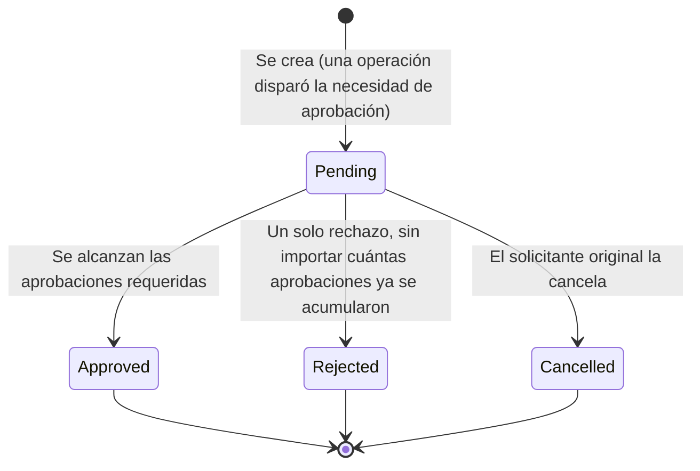
```mermaid
stateDiagram-v2
    [*] --> Pending: Se crea (una operación disparó la necesidad de aprobación)
    Pending --> Approved: Se alcanzan las aprobaciones requeridas
    Pending --> Rejected: Un solo rechazo, sin importar cuántas aprobaciones ya se acumularon
    Pending --> Cancelled: El solicitante original la cancela
    Approved --> [*]
    Rejected --> [*]
    Cancelled --> [*]
```

Ninguno de los tres estados finales (`Approved`, `Rejected`, `Cancelled`) tiene salida: una vez
decidida o cancelada, una aprobación no vuelve a moverse.

#### Ciclo de vida de una Solicitud interna

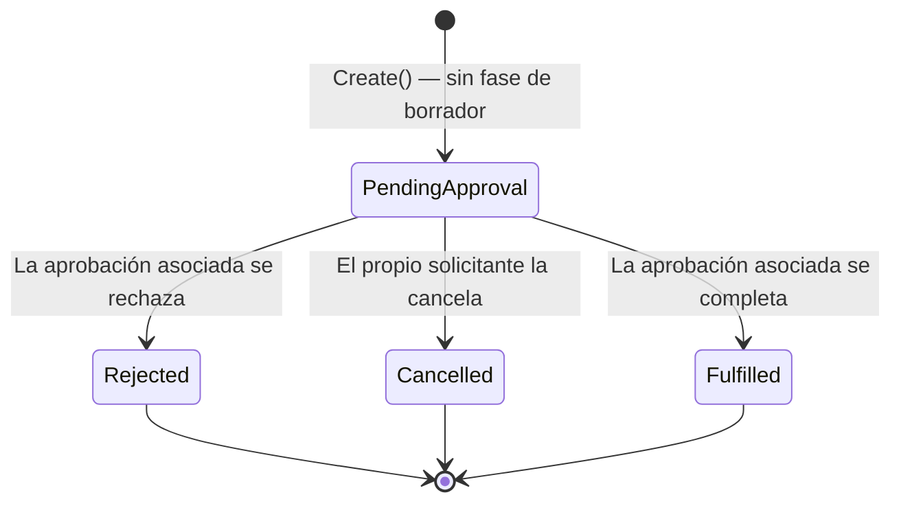
```mermaid
stateDiagram-v2
    [*] --> PendingApproval: Create() — sin fase de borrador
    PendingApproval --> Rejected: La aprobación asociada se rechaza
    PendingApproval --> Cancelled: El propio solicitante la cancela
    PendingApproval --> Fulfilled: La aprobación asociada se completa
    Rejected --> [*]
    Cancelled --> [*]
    Fulfilled --> [*]
```

Una solicitud interna nace directamente en `PendingApproval` — no existe una etapa de borrador
donde revisarla antes de enviarla. Es importante notar que esta máquina de estados **no está
sincronizada automáticamente en ambos sentidos** con la de la Aprobación: cuando la Aprobación se
completa o se rechaza, sí actualiza el estado de la Solicitud (`Fulfilled` o `Rejected`); pero si
es la Solicitud la que se cancela primero, la Aprobación **no** se cancela automáticamente (vea el
detalle en "Casos especiales" de la sección 6.6).

Las siguientes secciones explican, en el orden en que normalmente se usan, cómo configurar un
flujo, cómo activarlo o desactivarlo, cómo crear y gestionar solicitudes internas, y cómo decidir
sobre las aprobaciones pendientes.

---

### Configurar un flujo de aprobación

#### Objetivo

Definir, para un tipo de operación, qué roles deben aprobarla, cuántas aprobaciones distintas se
necesitan y si deben darse en un orden específico o pueden darse en cualquier orden.

#### Cuándo utilizarlo

Antes de que cualquier persona pueda enviar una solicitud interna de un tipo determinado (de
asignación de activo, de préstamo o de mantenimiento), o antes de que otro proceso que dependa de
aprobación (por ejemplo una baja o disposición de activo) pueda completarse. **Si no existe un
flujo activo para ese tipo de operación, el sistema simplemente no permite que se genere la
solicitud** — no hay manera de "aprobar sobre la marcha" sin configuración previa.

#### Paso a paso detallado

1. En el menú, entre al grupo **"Solicitudes y aprobaciones"** y seleccione **"Flujos de
   aprobación"**. Se abre `/approval-flows` con la lista de flujos existentes, de todas las
   empresas a las que su cuenta tiene acceso (ver captura 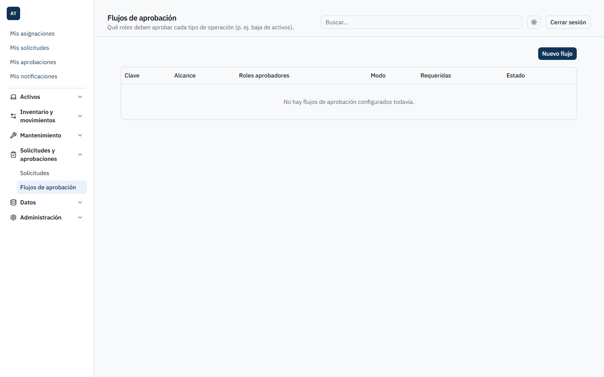).
2. Presione el botón **"Nuevo flujo"**, ubicado junto al título. El sistema navega a
   `/approval-flows/new` (ver captura 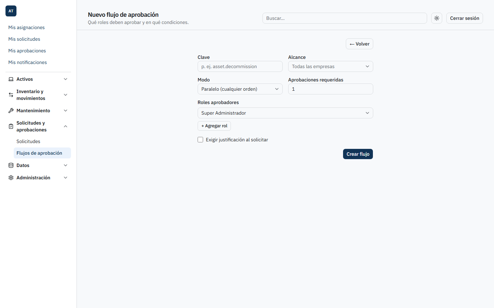).
3. Escriba la **Clave** del flujo. Debe coincidir exactamente con la clave que el proceso que
   consumirá este flujo espera (por ejemplo `internal-request.loan` para préstamos,
   `internal-request.asset-assignment` para asignaciones, `internal-request.maintenance` para
   mantenimientos, o claves propias de otros procesos como `asset.decommission`).
4. Elija el **Alcance**: déjelo en **"Todas las empresas"** si el flujo debe aplicar como
   respaldo general, o seleccione una empresa específica si esta debe tener sus propias reglas de
   aprobación para esa clave.
5. Elija el **Modo**: **"Paralelo (cualquier orden)"** si cualquier persona con alguno de los
   roles elegidos puede decidir en cualquier momento, o **"Secuencial (en el orden de la lista)"**
   si las aprobaciones deben darse en un orden estricto, rol por rol.
6. Agregue uno o más **roles aprobadores** usando el botón **"+ Agregar rol"**; quite alguno con
   **"Quitar"** (disponible solo si hay más de un rol en la lista). En modo secuencial, el orden en
   que aparecen los roles en la lista es el orden en que deberán decidir.
7. Revise el campo **Aprobaciones requeridas**. En modo paralelo puede escribir cualquier número
   igual o mayor a 1 (incluso mayor que la cantidad de roles elegidos, si se necesita que varias
   personas del mismo rol aprueben por separado). En modo secuencial este campo se calcula
   automáticamente como la cantidad de roles de la lista y no se puede editar.
8. Marque **"Exigir justificación al solicitar"** si quiere obligar a quien pida esta operación a
   escribir un comentario explicando el motivo.
9. Presione **"Crear flujo"**. Mientras se guarda, el botón muestra **"Guardando…"**. Al terminar,
   el sistema regresa a la lista de flujos.

#### Campos

| Campo | Tipo | Obligatorio | Detalle |
|---|---|---|---|
| Clave (`key`) | Texto | Sí | Máximo 100 caracteres. Debe coincidir con la clave que espera el proceso consumidor (p. ej. `internal-request.loan`). |
| Alcance (`companyId`) | Selección | No | Vacío = flujo global (todas las empresas); o una empresa específica de las asociadas a su cuenta. |
| Modo (`mode`) | Selección | Sí | "Paralelo (cualquier orden)" o "Secuencial (en el orden de la lista)". Por defecto, Paralelo. |
| Aprobaciones requeridas (`requiredApprovals`) | Numérico | Sí | Mínimo 1. En modo Secuencial queda fijo e igual a la cantidad de roles listados (solo lectura). |
| Roles aprobadores (`approverRoleIds`) | Lista de selecciones | Sí, al menos uno | Un rol por casilla; se pueden agregar o quitar casillas. En modo Secuencial, el orden importa y se numeran. |
| Exigir justificación al solicitar (`requiresComment`) | Casilla | No | Si se marca, quien solicite esta operación deberá escribir un comentario obligatorio. |

#### Botones y acciones

- **"Nuevo flujo"**: navega al formulario de creación.
- **"+ Agregar rol"** / **"Quitar"**: agregan o eliminan casillas de rol dentro del formulario.
- **"Crear flujo"**: envía el formulario (`POST /api/v1/approval-flows`). Deshabilitado mientras
  se procesa, mostrando **"Guardando…"**.

#### Reglas de negocio

- No hay condiciones basadas en montos, categorías u otros criterios variables: el flujo aplicable
  se determina únicamente por la combinación de **Clave** y **Empresa**.
- Un flujo específico de una empresa siempre tiene prioridad sobre un flujo global con la misma
  clave; el flujo global funciona como respaldo para las empresas que no tienen uno propio.
- **Un flujo nunca se edita.** Si las reglas cambian, se desactiva el flujo existente y se crea uno
  nuevo con la clave y el alcance correspondientes.
- En modo Secuencial, la cantidad de aprobaciones requeridas siempre es igual a la cantidad de
  roles listados, uno por uno, en ese orden.
- En modo Paralelo, la cantidad de aprobaciones requeridas es independiente de la cantidad de
  roles: puede pedirse, por ejemplo, un solo rol pero tres aprobaciones distintas de tres personas
  diferentes que tengan ese rol.
- Los roles que aprueban son **dinámicos**: no se fija a personas concretas al crear el flujo, sino
  al rol. Quien tenga asignado ese rol en el momento de decidir es quien puede hacerlo, aunque el
  rol haya cambiado de titulares desde que se creó el flujo.
- No existe validación que impida repetir el mismo rol más de una vez en la lista de roles
  aprobadores; si esto ocurre, tenga presente que puede generar ambigüedad al calcular turnos.

#### Mensajes del sistema

- Clave vacía: **"La clave del flujo de aprobación es obligatoria."**
- Sin roles aprobadores: **"Un flujo de aprobación necesita al menos un rol aprobador."**
- Aprobaciones requeridas menor a 1: **"El número de aprobaciones requeridas debe ser al menos 1."**
- Modo secuencial con número de aprobaciones distinto a la cantidad de roles: **"En modo
  secuencial se requiere una aprobación por cada rol, en orden."**
- Validación de formulario (antes de llamar al servidor): **"La clave y al menos un rol aprobador
  son obligatorios."**
- Ya existe un flujo activo con la misma clave y alcance: **"Ya existe un flujo activo con esa
  clave para ese alcance. Desactívalo antes de crear uno nuevo."**
- Algún rol seleccionado ya no existe: **"Uno o más roles aprobadores no existen."**
- Empresa sin roles activos: **"No hay roles activos todavía. Crea al menos un rol en Roles antes
  de configurar un flujo."**
- Sin permiso para consultar flujos: **"No tienes permiso para consultar flujos de aprobación
  (Approvals.Read)."**
- Sin permiso para consultar roles al abrir el formulario: **"Configurar un flujo requiere también
  poder consultar roles (Roles.Read)."**
- Error genérico al consultar: **"No fue posible consultar los flujos de aprobación."**
- Error genérico al crear (sin detalle específico del servidor): **"No fue posible crear el flujo
  de aprobación."**

#### Casos especiales

- Si intenta crear un flujo con la misma clave y el mismo alcance de uno que ya está activo, el
  sistema lo rechaza; primero debe desactivar el existente (vea la sección 6.3).
- Si su empresa todavía no tiene roles configurados, no podrá seleccionar ningún aprobador; deberá
  crear los roles primero desde el módulo de Roles.
- La lista de flujos (`/approval-flows`) muestra los de **todas las empresas** a las que su cuenta
  tiene acceso, sin distinguir por empresa en la vista — revise la columna "Alcance" de cada fila
  para saber a cuál corresponde.

#### Resultado esperado

Se crea un nuevo flujo activo. A partir de ese momento, cualquier operación que solicite
aprobación con esa clave (y, si aplica, en esa empresa) generará una Aprobación siguiendo estas
reglas. El flujo aparece en la lista con estado **"Activo"**.

#### Buenas prácticas

- Use claves consistentes y documentadas dentro de su organización — no hay un catálogo cerrado de
  claves válidas en la pantalla, así que un error de escritura en la clave generará un flujo que
  nunca se usará.
- Prefiera el modo Secuencial cuando el orden de las decisiones importe (por ejemplo, primero el
  jefe directo y después TI); use Paralelo cuando cualquier persona del rol pueda decidir sin
  depender de otras.
- Antes de crear un flujo específico de empresa, confirme si ya existe uno global con la misma
  clave — de lo contrario podría terminar con dos flujos activos que compiten por la misma
  operación en distintos alcances.

---

### Activar o desactivar un flujo de aprobación

#### Objetivo

Pausar (o reanudar) un flujo de aprobación sin eliminarlo del historial, dado que los flujos nunca
se editan directamente.

#### Cuándo utilizarlo

Cuando las reglas de aprobación de un tipo de operación deben cambiar: se desactiva el flujo
vigente y, junto con esto, se crea un flujo nuevo con la clave y el alcance correspondientes (ver
sección 6.2). También se usa para reactivar un flujo que se había desactivado por error o que
vuelve a ser necesario tal como estaba configurado.

#### Paso a paso detallado

1. Vaya a **"Flujos de aprobación"** (`/approval-flows`).
2. Ubique la fila del flujo que quiere pausar o reanudar (ver captura
   , columna "Estado" con el badge **"Activo"** o
   **"Inactivo"**).
3. Presione el botón de la fila: dirá **"Desactivar"** si el flujo está activo, o **"Activar"** si
   está inactivo.
4. El cambio se aplica de inmediato; la fila actualiza su badge de estado.

#### Campos

No aplica — esta acción no usa formulario, solo alterna un valor booleano (`isActive`) sobre el
flujo existente.

#### Botones y acciones

- **"Desactivar"**: envía `PATCH /api/v1/approval-flows/{id}/active` con valor `false`.
- **"Activar"**: mismo endpoint con valor `true`.

#### Reglas de negocio

- Desactivar un flujo **no afecta** a las Aprobaciones que ya se generaron bajo sus reglas (siguen
  su curso normal hasta que se decidan o cancelen), porque cada Aprobación guarda una copia de las
  reglas vigentes en el momento en que se creó.
- Mientras un flujo esté activo, no se puede crear otro con la misma clave y el mismo alcance; para
  reemplazar sus reglas, primero desactívelo.
- Reactivar un flujo antiguo restaura exactamente las reglas con las que fue creado — no es
  posible modificarlas al reactivar; si necesita reglas distintas, cree un flujo nuevo en su lugar.

#### Mensajes del sistema

- Si el flujo no existe (por ejemplo, un enlace obsoleto): respuesta 404 del servidor.
- Sin permiso: **"No tienes permiso para consultar flujos de aprobación (Approvals.Read)."** (para
  ver la lista); la acción de activar/desactivar en sí exige el permiso **Approvals.Configure**.

#### Casos especiales

- Si desactiva un flujo y **no** crea un reemplazo, cualquier intento posterior de generar una
  operación de ese tipo (por ejemplo, una solicitud interna de préstamo) fallará con: **"No hay un
  flujo de aprobación configurado para '{flowKey}'. Pide a un administrador que configure uno en
  Aprobaciones."**
- No hay confirmación adicional ("¿está seguro?") antes de desactivar un flujo — el cambio se
  aplica al primer clic.

#### Resultado esperado

El badge de estado del flujo cambia entre **"Activo"** e **"Inactivo"** de inmediato. Un flujo
inactivo deja de poder usarse para nuevas solicitudes, pero permanece visible en la lista para
referencia histórica.

#### Buenas prácticas

- Desactive el flujo viejo **y** cree el nuevo en la misma sesión de trabajo, para minimizar el
  tiempo en que ese tipo de operación queda sin flujo configurado (lo que bloquearía nuevas
  solicitudes).
- Antes de desactivar un flujo, verifique si hay aprobaciones pendientes que dependan de él —
  seguirán su curso, pero es buena práctica coordinar el cambio con quienes deben decidir.

---

### Crear una solicitud interna

#### Objetivo

Permitir que cualquier empleado pida, para sí mismo, una asignación de un activo del almacén, un
préstamo temporal, o un servicio de mantenimiento sobre un activo — sin necesitar acceso a los
módulos operativos de Asignaciones, Préstamos o Mantenimiento, y dejando que el proceso de
aprobación decida si procede.

#### Cuándo utilizarlo

- Necesita que le asignen un activo disponible en almacén.
- Necesita un préstamo temporal de un activo, con fecha estimada de devolución.
- Detecta que un activo (que está en almacén o que ya tiene asignado) necesita mantenimiento.

#### Paso a paso detallado

1. Vaya a **"Solicitudes"** en el menú de autoservicio, o directamente a **"Mis solicitudes"** y
   presione **"Nueva solicitud"**. Se abre `/requests/new` (ver captura
   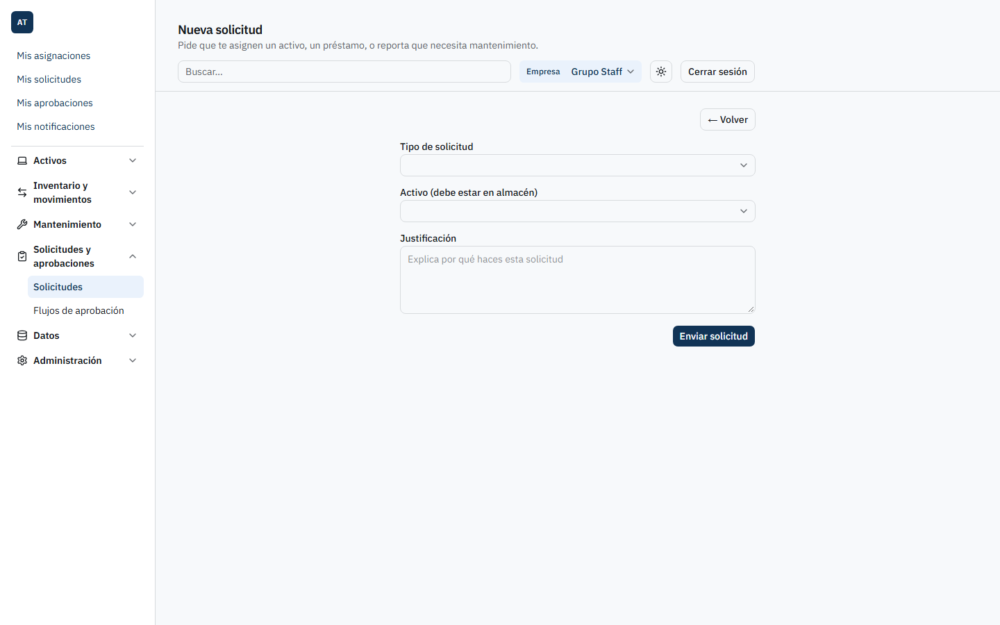).
2. Elija el **Tipo de solicitud**: Asignación de activo, Préstamo o Mantenimiento.
3. Elija el **Activo**. La lista de activos disponibles cambia según el tipo elegido:
   - Para Asignación o Préstamo, solo se listan activos **en almacén**. La etiqueta del campo
     muestra **"Activo (debe estar en almacén)"**.
   - Para Mantenimiento, se listan activos **en almacén o ya asignados** (incluyendo los que están
     asignados a usted mismo). La etiqueta cambia a **"Activo (en almacén o asignado a ti)"**.
   - Si no hay ningún activo elegible para el tipo elegido, el sistema lo indica con: **"No hay
     activos elegibles para este tipo de solicitud."**
4. Si el tipo es **Préstamo**, aparece el campo **Fecha esperada de devolución** — es obligatorio
   solo en este caso; para los otros tipos el campo ni siquiera se muestra.
5. Escriba la **Justificación**: explique brevemente por qué hace esta solicitud (hasta 1000
   caracteres).
6. Presione **"Enviar solicitud"** (mientras se procesa, el botón muestra **"Enviando…"**).
7. Al enviarse correctamente, el sistema lo lleva a **"Mis solicitudes"**, donde su nueva solicitud
   aparece con estado **"Pendiente de aprobación"**.

#### Campos

| Campo | Tipo | Obligatorio | Detalle |
|---|---|---|---|
| Tipo de solicitud (`type`) | Selección | Sí | Asignación de activo / Préstamo / Mantenimiento. |
| Activo (`assetId`) | Selección | Sí | Lista filtrada según el tipo elegido (ver paso 3). |
| Fecha esperada de devolución (`expectedReturnDate`) | Fecha | Sí, solo si el tipo es Préstamo | No se muestra para los demás tipos. |
| Justificación (`justification`) | Texto largo | Sí | Máximo 1000 caracteres. Placeholder: "Explica por qué haces esta solicitud". |

#### Botones y acciones

- **"Nueva solicitud"**: navega al formulario, desde "Solicitudes" o desde "Mis solicitudes".
- **"Enviar solicitud"**: envía la solicitud (`POST /api/v1/requests`); muestra **"Enviando…"**
  mientras está en curso.

#### Reglas de negocio

- Una solicitud interna **no tiene fase de borrador**: en cuanto se envía, queda directamente en
  estado "Pendiente de aprobación" — no hay forma de guardarla a medias ni de editarla después.
- El activo debe cumplir la regla de elegibilidad según el tipo: para Asignación y Préstamo debe
  estar en almacén; para Mantenimiento puede estar en almacén o ya asignado.
- Enviar una solicitud dispara automáticamente la creación de una Aprobación bajo el flujo
  configurado para ese tipo (`internal-request.asset-assignment`, `internal-request.loan` o
  `internal-request.maintenance`, según corresponda). Si no existe un flujo activo para esa clave,
  la solicitud no puede crearse.
- El activo **no cambia de estado** mientras la solicitud está pendiente — solo cambia si la
  aprobación se completa (ver sección 6.1 y 6.7).
- El beneficiario de la solicitud es siempre la persona que la creó; no es posible pedir algo en
  nombre de otra persona desde esta pantalla.

#### Mensajes del sistema

- Campos incompletos: **"Tipo, activo y justificación son obligatorios."**
- Préstamo sin fecha de devolución: **"Una solicitud de préstamo requiere la fecha esperada de
  devolución."**
- Activo no elegible para mantenimiento: **"Solo un activo en almacén o asignado puede reportarse
  a mantenimiento."**
- Activo no elegible para asignación o préstamo: **"Solo un activo en almacén puede solicitarse."**
- Sin flujo de aprobación configurado para ese tipo: **"No hay un flujo de aprobación configurado
  para '{flowKey}'. Pide a un administrador que configure uno en Aprobaciones."**
- Error genérico al enviar: **"No fue posible enviar la solicitud."**

#### Casos especiales

- Si el administrador todavía no configuró un flujo de aprobación para el tipo de solicitud que
  usted necesita, no podrá enviarla — deberá pedir que se configure uno (sección 6.2) antes de
  intentarlo de nuevo.
- Si el único activo elegible para el tipo elegido cambia de estado entre que usted abre el
  formulario y lo envía (por ejemplo, alguien más lo toma primero), la solicitud puede rechazarse
  con el mensaje de elegibilidad correspondiente.

#### Resultado esperado

Se crea una nueva solicitud interna en estado **"Pendiente de aprobación"**, y de forma automática
una Aprobación asociada, notificando a todas las personas con un rol elegible para decidir sobre
ella (vea la sección 6.7). Su solicitud aparece de inmediato en **"Mis solicitudes"**.

#### Buenas prácticas

- Escriba una justificación clara y específica: quien deba aprobar solo ve ese texto (y, en
  préstamos, la fecha de devolución) para decidir.
- Verifique la fecha de devolución antes de enviar una solicitud de préstamo — no se puede
  modificar después de enviada.
- Si necesita el activo con urgencia, avise directamente a quien deba aprobar, ya que el sistema no
  tiene mecanismo de prioridad ni de vencimiento automático de la aprobación.

---

### Consultar las solicitudes de la empresa

#### Objetivo

Dar a quien administra o gestiona una empresa visibilidad de **todas** las solicitudes internas
hechas por cualquier persona de esa empresa, sin importar quién las creó.

#### Cuándo utilizarlo

Para dar seguimiento operativo a las solicitudes en curso de la empresa, revisar su historial, o
verificar el estado de una solicitud que un empleado reporta como pendiente.

#### Paso a paso detallado

1. En el menú, entre a **"Solicitudes"** (`/requests`). Se muestra la tabla con todas las
   solicitudes de la empresa actualmente seleccionada (ver captura
   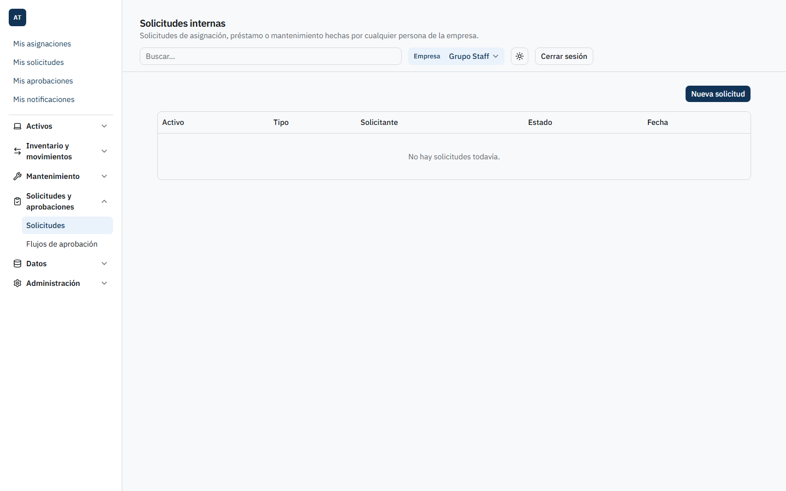).
2. Si su cuenta tiene acceso a más de una empresa, use el selector de empresa para cambiar de
   contexto; la tabla se actualiza para mostrar las solicitudes de la empresa elegida.
3. Revise la tabla: folio del activo (con enlace al detalle de la solicitud), tipo, quién la
   solicitó, estado y fecha.
4. Presione el folio de una fila para ver el detalle de esa solicitud en `/requests/{id}`.
   [Captura pendiente: detalle de una solicitud interna, `/requests/[id]`]. En esa pantalla se
   muestra el tipo, quién la solicitó, un badge de estado, la justificación completa, la fecha
   esperada de devolución (si aplica), la fecha en que se solicitó y, si ya fue decidida, la fecha
   de la decisión. Un botón **"← Volver"** regresa a la lista. Esta pantalla es de solo lectura: no
   tiene botones de acción, ni siquiera un enlace hacia la Aprobación asociada.

#### Campos

No aplica — esta vista es de solo lectura, sin formulario. Columnas de la tabla:

| Columna | Contenido |
|---|---|
| Activo | Folio del activo, con enlace al detalle de la solicitud. |
| Tipo | "Asignación de activo", "Préstamo" o "Mantenimiento". |
| Solicitante | Nombre de quien la creó (oculto en pantallas pequeñas). |
| Estado | Badge de estado. |
| Fecha | Fecha de creación (oculta en pantallas pequeñas). |

#### Botones y acciones

- **"Nueva solicitud"**: navega a `/requests/new` (equivalente al botón descrito en la sección
  6.4).
- Enlace sobre el folio de cada fila: navega al detalle de esa solicitud.
- **No hay botones de acción** en esta vista — ni cancelar ni decidir; cancelar solo está
  disponible desde "Mis solicitudes" (sección 6.6) para el propio solicitante, y decidir solo desde
  "Mis aprobaciones" (sección 6.7).

#### Reglas de negocio

- Requiere el permiso **Requests.Read**.
- Solo muestra solicitudes de empresas a las que la cuenta tiene acceso.
- El detalle por id (`/requests/{id}`) no vuelve a validar el acceso a la empresa de esa solicitud
  específica — a diferencia del listado, que sí filtra por empresa accesible. Es una limitación
  conocida: si usted tiene el permiso **Requests.Read**, en principio podría llegar al detalle de
  una solicitud de una empresa a la que no debería tener acceso si conociera o adivinara su
  identificador.

#### Mensajes del sistema

- Sin permiso: **"No tienes permiso para consultar solicitudes (Requests.Read)."**
- Lista vacía: **"No hay solicitudes todavía."**
- Error genérico: **"No fue posible consultar las solicitudes."**
- Detalle no encontrado: página 404 estándar del sistema.

#### Casos especiales

- Esta pantalla **no reemplaza** a "Mis solicitudes": incluso si usted mismo aparece como
  solicitante de alguna fila, no podrá cancelarla desde aquí — deberá ir a "Mis solicitudes".
- El detalle de una solicitud no muestra ni enlaza a la Aprobación asociada; si necesita revisar
  quién debe decidir o qué se decidió, consulte "Mis aprobaciones" o pida a la persona
  correspondiente que verifique desde ahí.

#### Resultado esperado

Una vista completa y actualizada de las solicitudes de la empresa seleccionada, útil para
seguimiento sin necesidad de intervenir en ellas.

#### Buenas prácticas

- Combine esta vista con "Flujos de aprobación" para detectar rápidamente si un tipo de solicitud
  se está acumulando sin decidirse por falta de un flujo activo o de aprobadores disponibles.
- Si detecta una solicitud estancada, verifique primero si el flujo correspondiente sigue activo y
  si existen personas con el rol aprobador asignado.

---

### Consultar y cancelar mis solicitudes

#### Objetivo

Que cada persona revise el estado de las solicitudes internas que ella misma ha hecho, y pueda
cancelar las que ya no necesite mientras sigan pendientes de decisión.

#### Cuándo utilizarlo

Para dar seguimiento a sus propias solicitudes, o para retirarlas si ya no las necesita, cambió de
opinión, o se equivocó al crearlas, siempre que aún no hayan sido decididas.

#### Paso a paso detallado

1. Vaya a **"Mis solicitudes"** (`/my-requests`) desde el menú de autoservicio (ver captura
   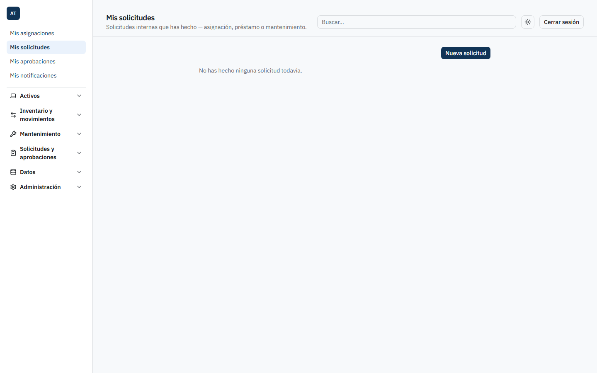).
2. Revise cada tarjeta: folio del activo (enlazado a `/assets/{assetId}`, es decir, a la ficha del
   activo, no al detalle de la solicitud), tipo, badge de estado, justificación completa y, si
   aplica, la fecha esperada de devolución.
3. Si una solicitud todavía está en estado **"Pendiente de aprobación"**, aparece el botón
   **"Cancelar"**. Presiónelo si ya no la necesita.
4. Para crear una nueva, presione **"Nueva solicitud"** (misma acción que en la sección 6.4).

#### Campos

No aplica — esta vista no tiene formulario propio; la única acción disponible es cancelar.

#### Botones y acciones

- **"Cancelar"**: visible únicamente si `estado == "Pendiente de aprobación"`. Envía `POST
  /api/v1/requests/{id}/cancel`.
- **"Nueva solicitud"**: navega a `/requests/new`.

#### Reglas de negocio

- Solo se listan las solicitudes creadas por la persona que consulta — no requiere ningún permiso
  RBAC, es autoservicio puro.
- Solo se puede cancelar una solicitud propia, y solo mientras esté **"Pendiente de aprobación"**.
- Cancelar una solicitud no revierte ningún cambio de estado del activo, porque el activo nunca
  cambió de estado mientras la solicitud estaba pendiente.

#### Mensajes del sistema

- Intento de cancelar una solicitud que ya no está pendiente: **"Solo una solicitud pendiente de
  aprobación puede cancelarse."**
- Intento de cancelar la solicitud de otra persona: **"Solo quien solicitó puede cancelar su
  propia solicitud."**
- Vacío: **"No has hecho ninguna solicitud todavía."**
- Error genérico: **"No fue posible consultar tus solicitudes."**

#### Casos especiales

- **Cancelar su solicitud no cancela la Aprobación asociada.** La solicitud pasa a estado
  "Cancelada" y desaparece de sus pendientes, pero la Aprobación que se había generado para ella
  **sigue existiendo y sigue en estado "Pendiente"** en el sistema. Esto significa que la persona
  que debía decidir sobre ella puede seguir viéndola en su bandeja "Mis aprobaciones" aunque la
  solicitud original ya no exista como tal. Si usted cancela una solicitud, es buena práctica
  avisar directamente a quien debía aprobarla, porque el sistema no hace esa notificación por
  usted ni retira la aprobación de su bandeja automáticamente.
- El enlace del folio en esta pantalla lleva a la ficha del activo, no al detalle de la solicitud;
  si necesita ver el detalle de la solicitud en sí, use la vista general de "Solicitudes" descrita
  en la sección 6.5 (siempre que tenga el permiso correspondiente).

#### Resultado esperado

La solicitud cambia a estado **"Cancelada"**, deja de mostrar el botón "Cancelar" y ya no es
elegible para ser aprobada o completada.

#### Buenas prácticas

- Cancele una solicitud tan pronto sepa que ya no la necesita, para no ocupar el tiempo de quien
  debe decidir sobre ella.
- Después de cancelar, si sabe quién debía aprobarla, avísele directamente — recuerde que la
  aprobación pendiente no se retira sola de su bandeja.

---

### Decidir sobre una aprobación pendiente

#### Objetivo

Permitir que una persona con un rol elegible apruebe o rechace una decisión pendiente, dejando
constancia firmada de esa decisión.

#### Cuándo utilizarlo

Cuando una aprobación aparece en su bandeja personal porque usted tiene, en ese momento, un rol
habilitado para decidir sobre ella (según el flujo configurado y, en modo secuencial, según el
turno correspondiente).

#### Paso a paso detallado

1. Vaya a **"Mis aprobaciones"** (`/my-approvals`) desde el menú de autoservicio (ver captura
   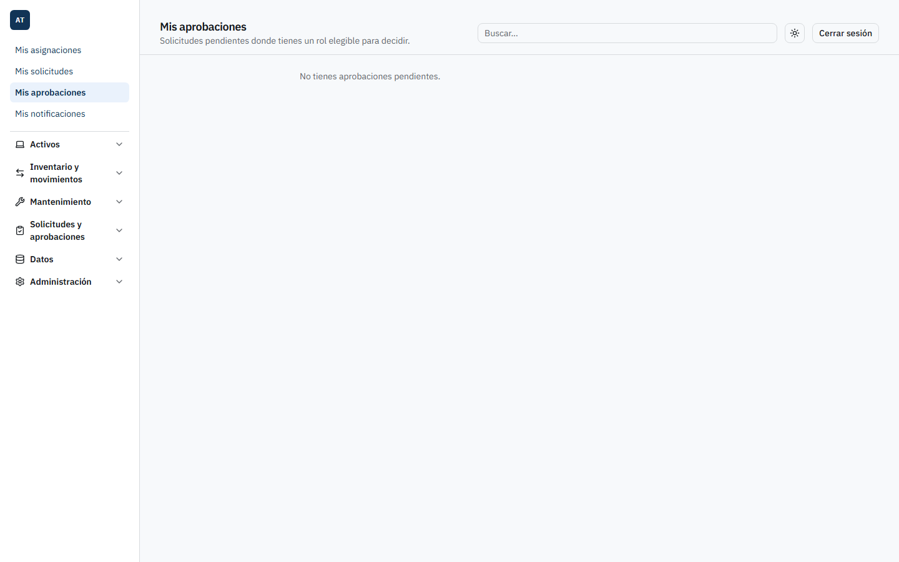).
2. Revise cada tarjeta: el tipo de contexto (por ejemplo "Solicitud interna", "Baja de activo"),
   quién la solicitó, la fecha, y la justificación entre comillas si el solicitante escribió una.
3. Si quiere revisar más detalle antes de decidir, presione **"Ver detalle"** (ver sección 6.8).
4. Para decidir, presione **"Aprobar"** o **"Rechazar"** en la propia tarjeta:
   - Si presiona **"Aprobar"**: se muestran los campos de firma (ver más abajo). Complételos y
     presione **"Confirmar aprobación"** (el botón muestra **"Enviando…"** mientras se procesa).
   - Si presiona **"Rechazar"**: se muestra el campo **"Motivo del rechazo"** (obligatorio) además
     de los campos de firma. Escriba el motivo y presione **"Confirmar rechazo"**.
   - En cualquiera de los dos modos puede presionar **"Cancelar"** para volver al estado inicial
     sin enviar nada (esto solo cancela el formulario en pantalla, no tiene relación con cancelar
     la Aprobación en el sistema).
5. Al confirmar, si todo es válido, la tarjeta se reemplaza por el mensaje **"Decisión
   registrada."** y la aprobación desaparece de la bandeja (ya no está pendiente para usted).

#### Campos

| Campo | Tipo | Obligatorio | Cuándo aparece |
|---|---|---|---|
| Motivo del rechazo (`comment`) | Texto | Sí, solo al rechazar | Máximo 1000 caracteres. Solo en el modo "Rechazar". |
| Mecanismo de firma (`signatureMechanism`) | Radio: "Escribir mi nombre" / "Dibujar firma" | Sí | Al aprobar o al rechazar. Por defecto, "Escribir mi nombre". |
| Nombre completo (`typedFullName`) | Texto | Sí, si el mecanismo es "Escribir mi nombre" | Máximo 200 caracteres. |
| Firma dibujada (`signatureImageDataUrl`) | Lienzo de dibujo | Sí, si el mecanismo es "Dibujar firma" | El sistema usa automáticamente el nombre de su cuenta; no se pide nombre por separado. |

#### Botones y acciones

- **"Ver detalle"**: enlaza a `/approvals/{id}` (sección 6.8).
- **"Aprobar"** / **"Rechazar"**: abren el formulario correspondiente.
- **"Cancelar"**: descarta el formulario en pantalla y regresa a los botones iniciales.
- **"Confirmar aprobación"** / **"Confirmar rechazo"**: envían la decisión.

#### Reglas de negocio

- La elegibilidad para decidir se basa en **rol de negocio**, no en un permiso de acceso: no hace
  falta ningún permiso especial de "Aprobaciones" para aprobar o rechazar desde esta bandeja —
  basta con tener asignado, en el momento de decidir, alguno de los roles definidos en el flujo.
- En modo **Secuencial**, solo puede decidir quien tenga el rol que corresponde al turno actual
  (el primero pendiente en el orden configurado); los demás roles listados deberán esperar su
  turno.
- En modo **Paralelo**, cualquier persona con alguno de los roles listados puede decidir en
  cualquier momento, hasta completar el número de aprobaciones requeridas.
- Una persona no puede registrar más de una decisión sobre la misma aprobación.
- Rechazar exige siempre un motivo; aprobar no lo exige (salvo que el flujo tenga marcada la
  opción de justificación obligatoria al solicitar, que aplica a quien solicita, no a quien
  decide).
- La firma (nombre escrito o dibujo) es obligatoria para registrar cualquier decisión; queda
  almacenada de forma inmutable. El sistema **no verifica** que el nombre escrito corresponda
  realmente a la persona que firma — confía en la sesión autenticada.

#### Mensajes del sistema

- Quien solicitó no puede decidir sobre su propia solicitud: **"Quien solicita una aprobación no
  puede decidir sobre su propia solicitud."**
- La aprobación ya no está pendiente (alguien más decidió primero, o ya se completó/rechazó):
  **"Esta aprobación ya no está pendiente."**
- Ya había registrado una decisión antes: **"Ya registraste una decisión para esta aprobación."**
- Rechazo sin motivo: **"Rechazar una aprobación requiere indicar el motivo."** / validación de
  formulario: **"Escribe el motivo del rechazo."**
- Sin rol elegible: **"No tienes un rol elegible para decidir sobre esta aprobación."**
- No es su turno (modo secuencial): **"Todavía no es el turno del rol correspondiente en este
  flujo secuencial."**
- Falta de datos de firma: **"Escribe tu nombre completo para firmar con este mecanismo."** /
  **"Dibuja tu firma para firmar con este mecanismo."**
- Éxito: **"Decisión registrada."**
- Error genérico: **"No fue posible aprobar."** / **"No fue posible rechazar."**
- Bandeja vacía: **"No tienes aprobaciones pendientes."**
- Error al consultar la bandeja: **"No fue posible consultar tus aprobaciones."**

#### Casos especiales

- **Quien solicita algo nunca puede aprobar su propia solicitud**, sin excepción — el sistema lo
  bloquea aunque esa persona tenga el rol requerido.
- **Un solo rechazo termina el proceso**, sin importar cuántas aprobaciones ya se hubieran
  acumulado antes. Si un flujo requiere tres aprobaciones y ya se registraron dos, un tercer
  aprobador que rechace hace que toda la aprobación pase a "Rechazada" de inmediato; las dos
  aprobaciones previas no cuentan para nada distinto de quedar en el historial de decisiones.
- **Es posible ser elegible para decidir sobre una aprobación sin tener permiso para ver su
  pantalla de detalle.** La elegibilidad para aprobar/rechazar depende de su rol de negocio; el
  botón "Ver detalle" de esta misma bandeja lleva a `/approvals/{id}`, que exige el permiso
  **Approvals.Read**. Si usted no tiene ese permiso, hacer clic en "Ver detalle" le mostrará un
  error de acceso denegado, aunque sí pueda aprobar o rechazar sin problema desde la propia
  tarjeta. **Recomendación**: decida siempre desde "Mis aprobaciones" — no necesita, ni debe
  intentar, construir o adivinar la URL de detalle de una aprobación para poder decidir sobre
  ella.
- Una decisión, una vez registrada, no se puede deshacer ni editar — ni por usted ni por nadie más.
  Cualquier corrección debe hacerse fuera del sistema o mediante los mecanismos de compensación del
  proceso de origen (por ejemplo, una nueva solicitud).

#### Resultado esperado

La decisión queda registrada de forma permanente. Si era la última aprobación requerida, la
Aprobación pasa a **"Aprobada"** y, si el contexto era una Solicitud interna, esta se completa
automáticamente (se genera la Asignación, el Préstamo o la Orden de mantenimiento correspondiente,
según el tipo). Si fue un rechazo, la Aprobación pasa a **"Rechazada"** y, en el caso de una
Solicitud interna, esta también queda **"Rechazada"**, sin que el activo haya cambiado de estado
en ningún momento del proceso.

#### Buenas prácticas

- Revise la justificación (y, si la hay, la fecha de devolución esperada en préstamos) antes de
  aprobar.
- Use siempre "Ver detalle" solo como consulta adicional, no como paso obligatorio — puede decidir
  directamente desde la tarjeta de "Mis aprobaciones".
- Si va a rechazar, escriba un motivo claro y útil: es lo único que verá el solicitante para
  entender por qué no procedió su pedido.

---

### Ver el detalle de una aprobación

#### Objetivo

Consultar el expediente completo de una aprobación concreta: qué se solicitó, quién lo solicitó,
qué reglas aplicaban (modo y número de aprobaciones requeridas), y el historial de decisiones ya
registradas.

#### Cuándo utilizarlo

Para revisar antecedentes de una aprobación ya decidida, dar seguimiento a una que sigue pendiente,
o verificar exactamente qué comentarios dejó cada persona que decidió.

#### Paso a paso detallado

1. La única forma prevista de llegar a esta pantalla es presionando **"Ver detalle"** desde **"Mis
   aprobaciones"** (sección 6.7); no existe un listado general de aprobaciones desde el cual
   navegar aquí.
2. La pantalla (`/approvals/{id}`) muestra:
   - Una migaja de pan: "Mis aprobaciones" → nombre del contexto.
   - Un encabezado con el nombre del contexto (por ejemplo "Solicitud interna", "Baja de activo",
     "Disposición de activo (venta/donación/destrucción)"), quién lo solicitó, el modo (Secuencial
     o Paralelo) y cuántas aprobaciones se requieren.
   - Un badge de estado: **"Pendiente"**, **"Aprobada"**, **"Rechazada"** o **"Cancelada"**.
   - Una tarjeta **"Justificación"**, visible solo si el solicitante escribió un comentario.
   - Una tarjeta **"Decisiones"**, con la lista de quién decidió, qué decidió y cuándo, con su
     comentario entre comillas si lo escribió. Si nadie ha decidido todavía: **"Todavía no hay
     decisiones registradas."**
   - **Esta pantalla no tiene botones de acción**: no se puede aprobar, rechazar ni cancelar desde
     aquí — esas acciones existen únicamente en "Mis aprobaciones".

   [Captura pendiente: detalle de una aprobación, `/approvals/[id]`]

3. **Importante — sobre la ruta directa `/approvals` sin identificador**: si usted (o alguien más)
   intenta entrar directamente a la dirección `/approvals`, sin especificar el identificador de una
   aprobación concreta, el sistema responde con una página no encontrada (ver captura
   ). **Esto no es un error del sistema**, sino
   el comportamiento esperado por diseño: deliberadamente **no existe** una pantalla de listado
   general de aprobaciones (a diferencia de, por ejemplo, "Solicitudes", que sí tiene una vista de
   lista en la sección 6.5). La única vista de aprobaciones que agrupa varias en una lista es la
   bandeja personal "Mis aprobaciones" (sección 6.7); el detalle de una aprobación específica solo
   se alcanza a través de un enlace que ya incluye su identificador — nunca escribiendo la
   dirección a mano.

#### Campos

No aplica — pantalla de solo lectura.

#### Botones y acciones

Ninguno. Es una vista exclusivamente de consulta.

#### Reglas de negocio

- Requiere el permiso **Approvals.Read** para poder consultarse — a diferencia de aprobar o
  rechazar desde "Mis aprobaciones", que no exige ningún permiso, solo el rol elegible.
- El acceso se resuelve únicamente por el identificador de la aprobación; el sistema no vuelve a
  validar que la empresa de esa aprobación esté entre las empresas accesibles para quien consulta.
  Es una limitación conocida: cualquier persona con el permiso **Approvals.Read**, en principio,
  podría consultar el detalle de una aprobación de una empresa a la que no debería tener acceso, si
  llegara a conocer su identificador.
- Si el identificador no corresponde a ninguna aprobación existente, la respuesta es una página no
  encontrada (404).

#### Mensajes del sistema

- Etiquetas de estado: **"Pendiente"**, **"Aprobada"**, **"Rechazada"**, **"Cancelada"**.
- Sin decisiones registradas todavía: **"Todavía no hay decisiones registradas."**
- Sin permiso: error de acceso denegado (403) al intentar abrir el detalle.
- Identificador inexistente: página no encontrada (404).

#### Casos especiales

- **Puede ser elegible para decidir sobre una aprobación sin poder ver su detalle.** Como se
  explicó en la sección 6.7, la capacidad de aprobar/rechazar depende de un rol de negocio, no del
  permiso **Approvals.Read**. Es perfectamente posible — y no es un error — que usted vea una
  aprobación en "Mis aprobaciones" y pueda decidir sobre ella, pero al presionar "Ver detalle"
  reciba un error de acceso denegado porque no tiene ese permiso. En ese caso, decida directamente
  desde la tarjeta de "Mis aprobaciones" sin necesidad de ver el detalle.
- No hay forma de llegar a esta pantalla desde el detalle de una Solicitud interna
  (`/requests/{id}`): esa pantalla no muestra ni enlaza el identificador de la aprobación asociada.
  Si necesita revisar el detalle de la aprobación de una solicitud específica, deberá ubicarla
  desde "Mis aprobaciones" (si usted es quien debe decidir) o pedir a la persona correspondiente
  que la consulte desde ahí.
- Nunca intente construir la dirección `/approvals/{id}` a mano ni adivinar identificadores: además
  de no ser el flujo previsto, no hay ninguna pantalla que le permita descubrir identificadores de
  aprobaciones de otras personas por su cuenta.

#### Resultado esperado

Una vista completa, de solo lectura, del historial de una aprobación específica: contexto,
solicitante, reglas aplicadas y todas las decisiones registradas hasta el momento.

#### Buenas prácticas

- Use esta pantalla para auditoría y seguimiento puntual, no como paso obligatorio del flujo de
  decisión — para decidir, use siempre "Mis aprobaciones".
- Si necesita compartir evidencia de una decisión (por ejemplo, el motivo de un rechazo), copie el
  texto de la tarjeta "Decisiones" en lugar de compartir la dirección de esta pantalla, ya que quien
  la reciba podría no tener el permiso **Approvals.Read** para abrirla.

---

## 6.6 Importación masiva de activos

### Objetivo

Permitir dar de alta muchos activos a la vez a partir de un archivo CSV, en lugar de capturarlos
uno por uno desde el formulario de alta individual de Activos.

### Cuándo utilizarlo

- Carga inicial del inventario de una empresa nueva en el sistema.
- Migración de datos desde una hoja de cálculo u otro sistema.
- Altas masivas periódicas (por ejemplo, la llegada de un lote de equipo nuevo).

No es el mecanismo adecuado para dar de alta un solo activo ocasional — para eso existe el alta
individual descrita en el capítulo de Activos.

### Paso a paso detallado

1. Entre al módulo **Importaciones** (`/imports`, ver captura 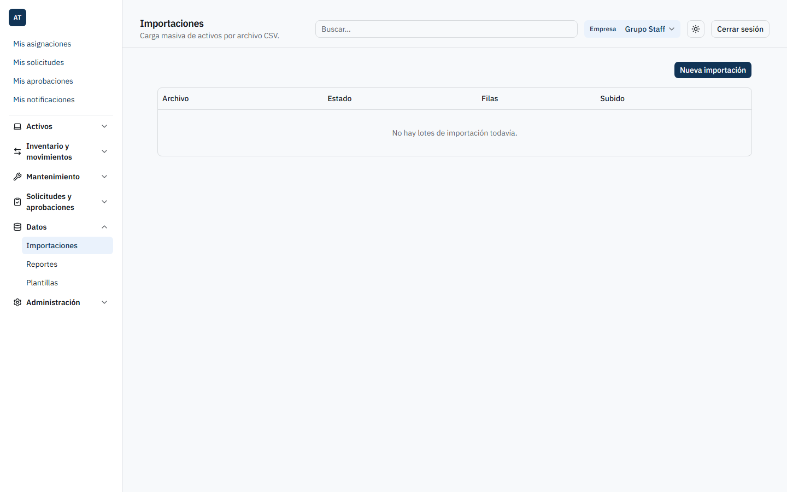).
   Verá la tabla de lotes existentes con columnas Archivo, Estado, Filas y Subido. Si aún no hay
   ninguno, el sistema muestra **"No hay lotes de importación todavía."**
2. Presione **"Nueva importación"** para ir a `/imports/new`
   (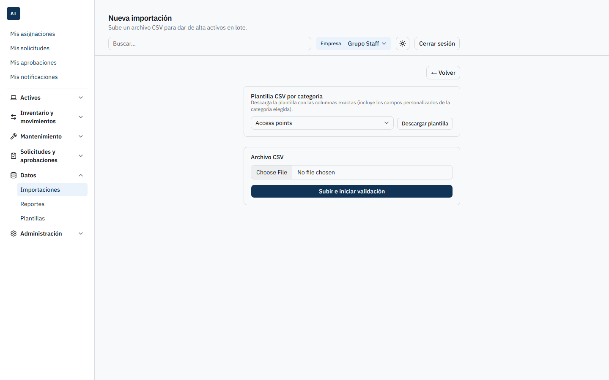).
3. Seleccione la categoría de activo correspondiente en el desplegable y presione **"Descargar
   plantilla"** para obtener el archivo CSV con las columnas exactas que espera esa categoría
   (incluyendo sus campos personalizados, si tiene).
4. Llene la plantilla fuera del sistema (Excel, Google Sheets, etc.) respetando exactamente los
   encabezados de columna.
5. Vuelva a `/imports/new`, seleccione el archivo CSV completo (`accept=".csv,text/csv"`) y
   presione **"Subir e iniciar validación"**.
   - Si no seleccionó ningún archivo: **"Selecciona un archivo CSV."**
   - Si no tiene el permiso `Imports.Create`: **"Iniciar una importación requiere permiso
     Imports.Create."**
   - **Importante**: subir el archivo en este paso **no valida ni escribe nada todavía** — el
     sistema únicamente crea el lote de importación en estado `Queued` (En cola) y lo encola para
     que un proceso en segundo plano lo revise.
6. El sistema lo lleva al detalle del lote (`/imports/[id]`, **[Captura pendiente: detalle de un
   lote de importación en validación/confirmación]**). Mientras el proceso en segundo plano
   trabaja, verá el mensaje **"El lote se está procesando en segundo plano. Actualiza la página
   para ver el avance."** junto con un botón **"Actualizar"** — la pantalla no se refresca sola,
   hay que presionar ese botón para ver el progreso más reciente.
7. Cuando el lote termina de validarse (estado `Validated`), la pantalla muestra un resumen de
   filas válidas/inválidas y una tabla **"Detalle por fila"** con columnas Fila, Resultado
   (✓ o ✗, con el folio asignado si fue exitoso) y Detalle (el o los errores encontrados en esa
   fila, si los hay).
8. Elija el modo de confirmación mediante los radios:
   - **"Solo filas válidas"** (opción por defecto): crea un activo por cada fila válida e ignora
     las inválidas.
   - **"Todo o nada"**: solo disponible si **no** hay filas inválidas — la opción aparece
     deshabilitada en cuanto existe al menos una fila con error.
   - Si presiona "Confirmar importación" sin elegir modo: **"Elige un modo de confirmación."**
9. Presione **"Confirmar importación"**. El lote pasa a `Processing` y, al terminar, a
   `Completed` (todo salió bien) o `CompletedWithErrors` (se crearon los activos válidos, pero
   hubo filas con error en modo "solo filas válidas") — o a `Failed` si el modo era "todo o nada"
   y algo invalidó el lote en el momento de confirmar (ver "Casos especiales").
10. Si necesita desistir de un lote antes de confirmarlo, use el botón **"Cancelar lote"**,
    disponible mientras el lote está en `Queued`, `Validating` o `Validated`.

### Campos

**Columnas fijas del CSV** (obligatorias para todas las categorías):

| Columna | Descripción |
|---|---|
| `AssetCategoryCode` | Código de la categoría del activo — debe existir y estar activa. |
| `Brand` | Marca del activo (máx. 100 caracteres). |
| `Model` | Modelo del activo (máx. 100 caracteres). |
| `SerialNumber` | Número de serie — debe ser único dentro del archivo y dentro de la empresa. |
| `Description` | Descripción libre (máx. 500 caracteres). |
| `PhysicalCondition` | Condición física del activo — debe ser un valor válido del catálogo. |
| `OrgUnitCode` | Código de la unidad organizativa, si se indica debe existir. |
| `IdentificationTechnology` | Tecnología de identificación (por ejemplo, código de barras, RFID), si se indica debe ser válida. |

**Columnas dinámicas**: una columna adicional por cada campo personalizado de la categoría
elegida, con el formato `CustomField:{Código}`. Solo se aceptan campos personalizados que
pertenezcan a esa categoría; los campos personalizados marcados como obligatorios deben venir
presentes en cada fila.

### Botones y acciones

| Botón | Dónde | Efecto |
|---|---|---|
| Descargar plantilla | `/imports/new` | Descarga el CSV con las columnas exactas de la categoría elegida. |
| Subir e iniciar validación | `/imports/new` | Crea el lote en `Queued`; no valida en el momento. |
| Actualizar | `/imports/[id]` | Vuelve a consultar el estado más reciente del lote (no hay auto-refresco). |
| Confirmar importación | `/imports/[id]` (lote `Validated`) | Crea los activos según el modo elegido. |
| Cancelar lote | `/imports/[id]` (lote `Queued`/`Validating`/`Validated`) | Marca el lote como `Cancelled`; no crea ningún activo. |

### Reglas de negocio

- La validación de cada fila es **acumulativa**: el sistema revisa todas las reglas de todas las
  filas y no se detiene en el primer error encontrado.
- El emparejamiento de códigos (categoría, unidad organizativa, tecnología de identificación) no
  distingue mayúsculas de minúsculas.
- El procesamiento ocurre en un proceso en segundo plano (un único trabajador que consume una cola
  interna); nunca ocurre de forma inmediata al subir el archivo.
- El sistema es **idempotente** frente a la cola: nunca confía en el mensaje recibido para saber
  qué hacer, siempre vuelve a consultar el estado real del lote guardado en base de datos antes de
  actuar. Un lote que ya no está en el estado esperado simplemente se ignora (no se reprocesa dos
  veces).
- **La confirmación vuelve a validar todo desde cero**, no reutiliza el resultado de la vista
  previa. Esto es intencional: puede haber pasado tiempo entre que se generó la vista previa y el
  momento en que la persona usuaria confirma, y algo pudo haber cambiado mientras tanto.
- Cada fila válida creada genera un Activo con folio y etiqueta propios, igual que si se hubiera
  dado de alta manualmente.
- Un lote solo puede cancelarse **antes** de empezar a confirmarse (`Queued`, `Validating` o
  `Validated`). Una vez que pasa a `Processing`, ya no se puede cancelar.

### Mensajes del sistema

- "El archivo de importación debe ser un CSV (.csv)."
- "El archivo no puede superar 25 MB."
- "Selecciona un archivo CSV."
- "Iniciar una importación requiere permiso Imports.Create."
- "No tienes permiso para consultar importaciones (Imports.Read)."
- "No hay lotes de importación todavía."
- "El lote se está procesando en segundo plano. Actualiza la página para ver el avance."
- "Elige un modo de confirmación."
- "Solo un lote en cola puede comenzar a validarse."
- "Solo un lote validado puede confirmarse."
- "El lote tiene filas inválidas — el modo 'todo o nada' requiere que todas las filas sean válidas."
- "El lote tiene filas inválidas al confirmar (el estado pudo cambiar desde la vista previa); no se creó ningún activo."

**Estados del lote** (como se muestran en la columna Estado del listado):

| Estado interno | Etiqueta en pantalla |
|---|---|
| `Queued` | En cola |
| `Validating` | Validando |
| `Validated` | Validado |
| `Processing` | Procesando |
| `Completed` | Completado |
| `CompletedWithErrors` | Completado con errores |
| `Failed` | Falló |
| `Cancelled` | Cancelado |

### Ciclo de vida de un lote de importación

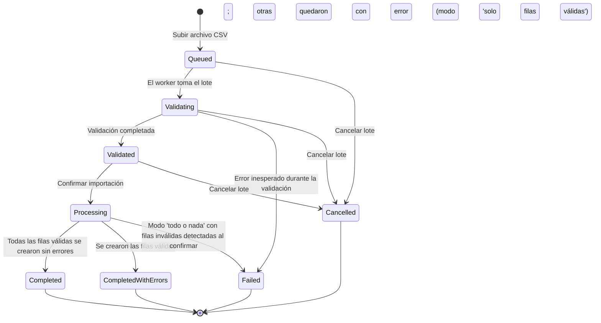
```mermaid
stateDiagram-v2
    [*] --> Queued: Subir archivo CSV
    Queued --> Validating: El worker toma el lote
    Validating --> Validated: Validación completada
    Validating --> Failed: Error inesperado durante la validación
    Validated --> Processing: Confirmar importación
    Queued --> Cancelled: Cancelar lote
    Validating --> Cancelled: Cancelar lote
    Validated --> Cancelled: Cancelar lote
    Processing --> Completed: Todas las filas válidas se crearon sin errores
    Processing --> CompletedWithErrors: Se crearon las filas válidas; otras quedaron con error (modo 'solo filas válidas')
    Processing --> Failed: Modo 'todo o nada' con filas inválidas detectadas al confirmar
    Completed --> [*]
    CompletedWithErrors --> [*]
    Failed --> [*]
    Cancelled --> [*]
```

> Note que no existe una salida de `Processing` hacia `Cancelled`: una vez que la confirmación
> comenzó, el lote ya no puede cancelarse, solo terminar en alguno de los tres estados finales de
> confirmación.

### Casos especiales

- **El modo "todo o nada" puede fallar igual al confirmar, aunque la vista previa haya mostrado
  todo válido.** Esto ocurre porque la confirmación vuelve a validar todo desde cero contra el
  estado real de la base de datos en ese momento — por ejemplo, si entre la vista previa y la
  confirmación otra persona dio de alta un activo con el mismo número de serie que traía una fila
  del archivo, esa fila que antes era válida ahora deja de serlo, y en modo "todo o nada" el lote
  completo falla sin crear ningún activo, con el mensaje "El lote tiene filas inválidas al
  confirmar (el estado pudo cambiar desde la vista previa); no se creó ningún activo."
- **Un lote no se puede cancelar una vez que empezó a confirmarse** (estado `Processing`). El
  botón "Cancelar lote" solo está disponible en `Queued`, `Validating` y `Validated`.
- **No existe un botón para reintentar un lote que terminó en `Failed`.** Si un lote falla, la
  única opción es iniciar una importación nueva desde cero (subir el archivo otra vez, corrigiendo
  lo que corresponda).
- Subir el archivo por sí solo nunca valida ni escribe nada — únicamente crea el registro del lote
  en `Queued`. La validación real ocurre después, en el proceso en segundo plano.
- En el entorno local, la cola interna que alimenta al proceso en segundo plano vive en memoria: un
  reinicio del proceso puede perder mensajes en cola sin reintento automático. Es una limitación
  conocida de esta versión, no un comportamiento esperado en producción.

### Resultado esperado

Al confirmar un lote, cada fila válida (según el modo elegido) produce un Activo nuevo con folio y
etiqueta propios, visible de inmediato en el listado de Activos. El lote queda con su estado final
(`Completed`, `CompletedWithErrors` o `Failed`) y conserva el detalle fila por fila para consulta
posterior.

### Buenas prácticas

- Descargue siempre la plantilla específica de la categoría que va a importar — las columnas de
  campos personalizados cambian de una categoría a otra.
- Revise con cuidado la vista previa de validación antes de confirmar, especialmente si piensa usar
  el modo "todo o nada".
- Evite dejar números de serie duplicados o en blanco cuando ya existan en el sistema; es la causa
  más común de filas inválidas.
- Para archivos grandes, considere dividir la carga en lotes más pequeños si necesita mayor certeza
  de que todo se procesará junto (modo "todo o nada"), dado el riesgo de que el estado cambie entre
  la vista previa y la confirmación.

## 6.7 Documentos

### Qué es

El panel de Documentos permite adjuntar archivos a un registro de **Activo** o de **Orden de
mantenimiento** — son los dos únicos tipos de entidad admitidos actualmente. No aparece como una
pantalla propia en el menú: es un panel **embebido** dentro del detalle de esos dos tipos de
registro. En el detalle de un Activo (**[Captura pendiente: panel de documentos embebido en el
detalle de un Activo]**) y en el detalle de una Orden de mantenimiento encontrará esta misma
sección de Documentos.

### Cómo funciona

- El panel muestra la lista de archivos ya adjuntos: nombre del archivo, tamaño y quién lo subió.
  Si todavía no hay ninguno: **"Sin documentos todavía."**
- Debajo hay un formulario de carga con un botón **"Cargar"** para adjuntar un archivo nuevo.
- **No hay restricción por tipo de archivo** (no existe una lista de extensiones permitidas) — la
  única restricción es sobre el **tipo de entidad** a la que se adjunta (Activo u Orden de
  mantenimiento); cualquier otro tipo de entidad produce el mensaje **"Tipo de entidad no válido
  para documentos."**
- El límite de tamaño por archivo es de **25 MB**, igual que en importaciones.
- Los archivos se guardan en almacenamiento de blobs, en un único contenedor, aislados por una
  ruta que incluye la empresa, el tipo de entidad y el identificador del registro al que
  pertenecen — de modo que un documento de una empresa nunca queda accesible por confusión desde
  otra.
- **La descarga nunca usa un enlace temporal (URL firmada con expiración)**: el archivo se
  transmite siempre a través de la propia API, que revalida el permiso de acceso en cada descarga,
  no solo al momento de generar un enlace. Esto es intencional para mantener el control de acceso
  vigente incluso si el archivo se descarga tiempo después de haberse compartido el enlace.
- Sin el permiso `Documents.Read`, el panel muestra **"No tienes permiso para consultar documentos
  (Documents.Read)."**

### Reglas de negocio

- Los documentos son **inmutables**: no existe edición ni borrado, solo consulta (`Documents.Read`)
  y carga (`Documents.Create`).
- Cargar un documento (`UploadDocumentCommand`) sí queda registrado en el módulo de Auditoría (ver
  sección siguiente).

## 6.8 Auditoría

### Qué es

La Auditoría es el registro cronológico, de solo lectura, de **todos los comandos auditables**
que se ejecutan en el sistema (identificados internamente como `IAuditableCommand`). Cada vez que
alguien ejecuta una de estas acciones, el sistema crea automáticamente una entrada de auditoría —
tanto si la acción tuvo éxito como si falló.

Un punto importante: solo llega a auditoría lo que **ya pasó** las validaciones de permisos y de
datos del sistema. Es decir, un intento bloqueado por falta de permiso en una capa anterior no
necesariamente genera una entrada (dependiendo de en qué punto del proceso se detuvo la solicitud).

### Por qué es de solo lectura

La auditoría existe para dejar un rastro confiable de "quién hizo qué y cuándo". Por diseño, **no
tiene ningún endpoint de edición ni de borrado** — solo de creación (automática, nunca manual) y de
consulta. No es tampoco un motor de comparación campo por campo entre el antes y el después de un
registro; es, deliberadamente, un rastro de eventos, no un historial de cambios detallado.

### Qué puede consultar la persona usuaria

En la pantalla `/audit` (ver captura 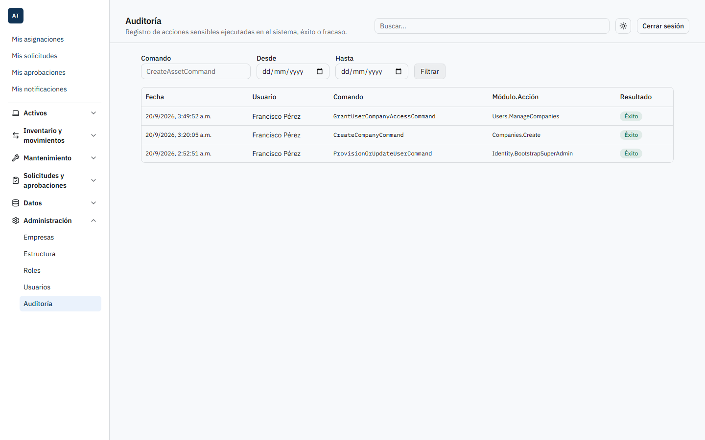) se muestra una tabla
con las columnas:

| Columna | Contenido |
|---|---|
| Fecha | Momento en que ocurrió la acción. |
| Usuario | Nombre de la persona que ejecutó el comando. |
| Comando | Nombre técnico del comando ejecutado. |
| Módulo.Acción | Identificador del módulo y la acción, por ejemplo `Imports.Commit`. |
| Resultado | Insignia de éxito o fracaso; si falló, se muestra también el mensaje de error. |

Internamente, cada entrada de auditoría guarda más información de la que se ve en pantalla:
empresa (`CompanyId`, cuando el sistema logra determinarla — ver más abajo), identificador y
nombre de la persona usuaria, nombre del comando, módulo/acción, un detalle en formato JSON,
si tuvo éxito o no, mensaje de error (si aplica), dirección IP, agente de usuario, un identificador
de correlación y la fecha/hora exacta en UTC.

**Relevante para los módulos de este capítulo**: entre los comandos auditables se incluyen
`UploadImportBatchCommand`, `CommitImportBatchCommand`, `CancelImportBatchCommand`, las cuatro
consultas de exportación (`ExportAssetsQuery`, `ExportExpiringWarrantiesQuery`,
`ExportLowStockConsumablesQuery`, `ExportMaintenanceKpisQuery`) y `UploadDocumentCommand`.

### Filtros disponibles

En la interfaz solo hay tres filtros expuestos:

- **Comando**: búsqueda de texto libre sobre el nombre del comando.
- **Desde** / **Hasta**: rango de fechas.

> El endpoint del API admite adicionalmente filtrar por usuario y por empresa (`userId` y
> `companyId`), pero estos dos filtros **no están expuestos en la interfaz** — solo se pueden usar
> mediante integración directa con el API.

Esta pantalla **no tiene selector de empresa** (`CompanySwitcher`), a diferencia de la mayoría de
los listados del sistema. Esto es intencional: el permiso `Audit.Read` es un permiso global de
todo el sistema, no ligado a la membresía en una empresa en particular, por lo que la vista de
auditoría siempre abarca todas las empresas a las que la persona tiene alcance según sus permisos.

Si la persona usuaria no cuenta con `Audit.Read`, verá **"No tienes permiso para consultar la
auditoría (Audit.Read)."** Si no hay ninguna entrada que mostrar: **"No hay entradas de auditoría
todavía."**

### Casos especiales

- El dato de empresa (`CompanyId`) de cada entrada se determina de forma automática y "en el mejor
  esfuerzo" a partir del propio comando ejecutado; en algunos comandos el sistema no logra
  determinarlo y la entrada queda con la empresa en blanco.
- Los comandos del módulo de Plantillas (crear plantilla, agregar versión, activar/desactivar) **no
  están marcados como auditables** actualmente, a diferencia de prácticamente todos los demás
  comandos con efecto en el sistema — tómelo en cuenta si necesita rastrear cambios sobre
  plantillas, ya que hoy no quedan registrados en Auditoría.

## 6.9 Plantillas

### Qué es (y qué no es)

El módulo de Plantillas es un **catálogo versionado de texto plano** — pensado, por ejemplo, para
guardar el contenido base de resguardos, correos o notificaciones. **Importante**: en esta versión
del sistema, Plantillas **no genera ningún documento final**. No existe todavía un motor de
sustitución de variables ni de renderizado, y tampoco se produce un PDF ni una firma a partir de
una plantilla. El módulo se limita a guardar y versionar el texto — cualquier uso posterior de ese
contenido (por ejemplo, para armar un resguardo firmado) es, por ahora, un proceso manual fuera del
sistema.

### Crear una plantilla

1. Vaya a `/templates` (ver captura 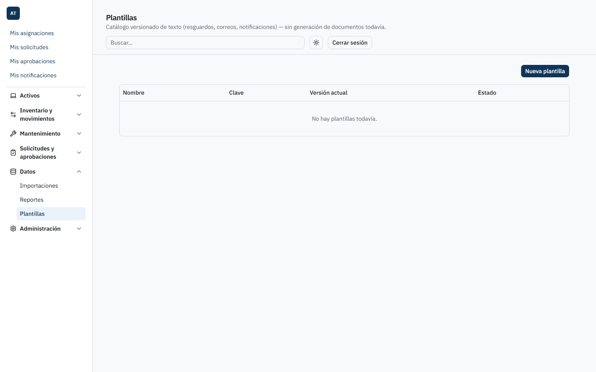). El listado muestra
   Nombre, Clave, Versión actual y Estado, con el subtítulo **"Catálogo versionado de texto
   (resguardos, correos, notificaciones) — sin generación de documentos todavía."**
2. Presione el botón para crear una nueva plantilla y llegará a `/templates/new`
   (ver captura 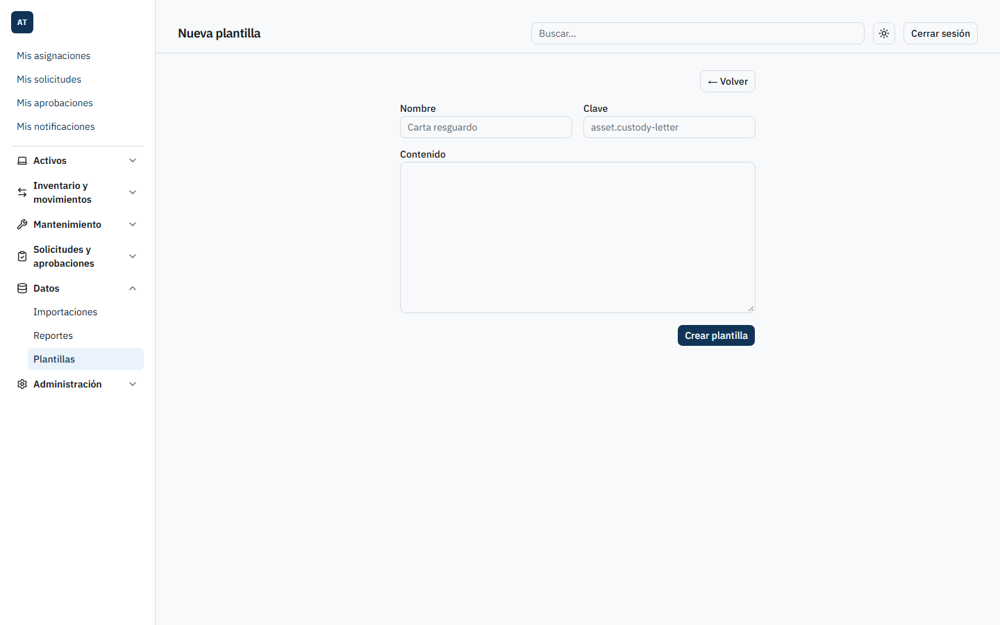).
3. Complete los campos:

   | Campo | Descripción |
   |---|---|
   | Nombre | Nombre descriptivo de la plantilla. |
   | Clave | Identificador único de la plantilla (no puede repetirse). |
   | Contenido | Texto plano de la plantilla, en un área de texto de hasta 10,000 caracteres. |

4. Si falta cualquiera de los tres campos: **"Clave, nombre y contenido son obligatorios."**
5. Si la clave ya existe en otra plantilla: **"Ya existe una plantilla con esa clave."**

### Agregar una nueva versión

Desde el detalle de una plantilla (`/templates/[id]`, **[Captura pendiente: detalle/edición de una
plantilla]**) hay un botón **"Agregar nueva versión"**, que permite capturar un nuevo contenido de
texto sin perder las versiones anteriores. Al guardar con éxito, el sistema muestra **"Versión
agregada."** y la nueva versión se suma al historial de versiones visible en esa misma pantalla.

### Activar / desactivar

El detalle de la plantilla también incluye un control para **activar** o **desactivar** la
plantilla. Una plantilla desactivada deja de considerarse vigente para su uso, pero **no
desaparece del catálogo ni se elimina**: el sistema no tiene, deliberadamente, un permiso de
borrado para plantillas — una plantilla nunca se elimina, únicamente se desactiva.

### Reglas de negocio

- La clave (`Clave`) es única en todo el sistema; intentar reutilizar una existente produce un
  error 409 con el mensaje "Ya existe una plantilla con esa clave."
- El contenido de cada versión es texto plano, con un límite de 10,000 caracteres.
- No existe permiso ni endpoint de borrado de plantillas — su ciclo de vida termina, a lo sumo, en
  "desactivada".
- Los permisos relevantes son `Templates.Read` (consultar), `Templates.Create` (crear) y
  `Templates.Update` (agregar versión, activar/desactivar).

### Casos especiales

- Como se indicó en la sección de Auditoría, las acciones sobre plantillas (crear, agregar
  versión, activar/desactivar) **no quedan registradas en el módulo de Auditoría** actualmente.
- No espere que una plantilla "activa" produzca automáticamente un documento en algún otro módulo
  (por ejemplo, al completar una asignación o un resguardo) — esa integración no existe todavía en
  esta versión del sistema.

## 6.10 Notificaciones

### Qué es

Mis notificaciones (`/notifications`, ver captura 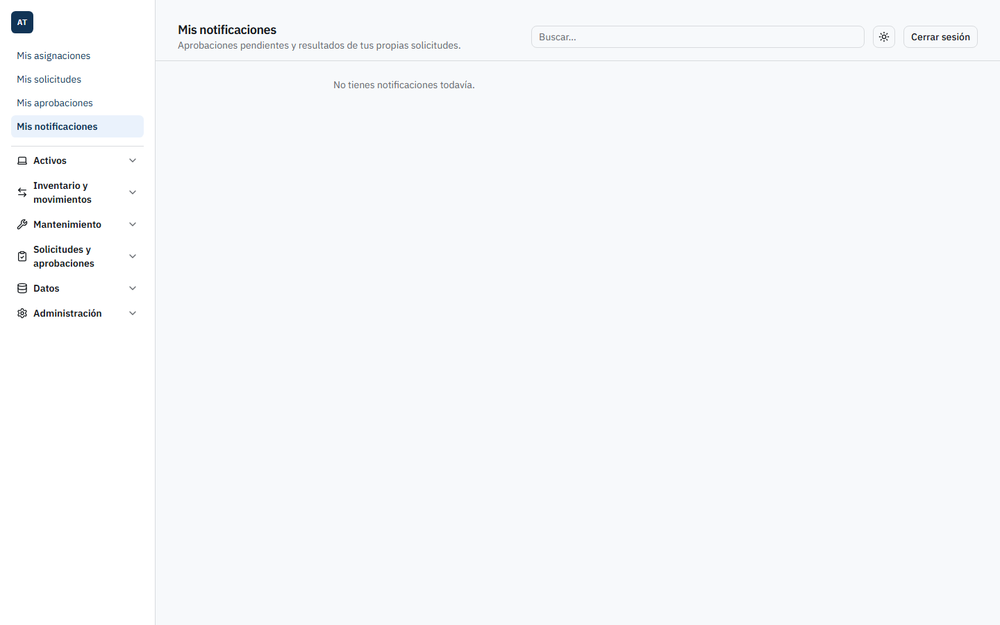) es la
bandeja personal de avisos dentro del sistema. **En esta versión, las notificaciones se generan
exclusivamente a partir del ciclo de vida de una Aprobación** — ningún otro módulo (importaciones,
documentos, auditoría, plantillas, reportes, búsqueda) genera notificaciones todavía. Si su cuenta
no participa en ningún flujo de aprobación (ni como solicitante ni como aprobador), es normal que
su bandeja esté siempre vacía.

### Cuándo se generan

| Evento | Quién la recibe | Título | Cuerpo |
|---|---|---|---|
| Se solicita una aprobación | Todas las personas con un rol elegible para decidirla (excepto quien solicitó) | "Tienes una aprobación pendiente" | "Alguien solicitó una aprobación que puedes decidir. Revisa Mis aprobaciones." |
| Una aprobación se completa (aprobada) | Quien la solicitó | "Tu solicitud fue aprobada" | "La aprobación que solicitaste fue completada." |
| Una aprobación se rechaza | Quien la solicitó | "Tu solicitud fue rechazada" | "La aprobación que solicitaste fue rechazada." |

> **Nota**: al solicitarse una aprobación, el sistema notifica a **todos** los titulares del rol
> elegible al mismo tiempo, sin respetar todavía un posible orden de turnos secuencial entre
> aprobadores — es una simplificación conocida de esta versión.

Cada notificación intenta además enviarse por correo electrónico de forma **best-effort**: si no
hay un servidor SMTP configurado, el sistema simplemente omite el envío de correo (la notificación
dentro del sistema se crea de todas formas); si sí hay SMTP configurado y el envío de correo falla,
la falla se ignora silenciosamente y tampoco afecta la notificación dentro del sistema.

### Marcar como leída

Cada tarjeta de notificación muestra su título, una insignia **"Nueva"** cuando aún no ha sido
leída, el cuerpo del mensaje, la fecha y un botón **"Marcar como leída"**.

Marcar una notificación como leída **no requiere ningún permiso RBAC** — el sistema únicamente
valida que la notificación pertenezca a quien la está marcando. Si se intentara marcar la
notificación de otra persona, el sistema respondería **"No puedes marcar como leída la
notificación de otra persona."**

Si todavía no tiene notificaciones: **"No tienes notificaciones todavía."**

> **Nota**: actualmente el sistema muestra el **mismo mensaje** tanto si ocurre un error de
> permisos como si ocurre cualquier otro error genérico al consultar la bandeja: **"No fue posible
> consultar tus notificaciones."** Si ve este mensaje, no hay forma de distinguir desde la propia
> pantalla si el problema fue de permisos o de otro tipo.

### Purga automática a los 90 días

Las notificaciones son el **único dato del sistema que se elimina automáticamente**. Un proceso en
segundo plano revisa periódicamente (cada 24 horas, de forma configurable) y **borra las
notificaciones con más de 90 días de antigüedad** (también configurable). Esto significa que, pasado
ese tiempo, una notificación desaparece de su bandeja sin ninguna acción de su parte y sin poder
recuperarse.

> Para contraste: ningún otro registro histórico del sistema se purga de esta forma — Movimientos,
> Transferencias, Asignaciones, registros de firma y las entradas de Auditoría se conservan de
> forma indefinida.

---

# 7. Consultas y búsquedas

Cada listado del sistema (Activos, Asignaciones, Préstamos, Movimientos, Órdenes de mantenimiento,
Consumibles, Refacciones, Garantías, Solicitudes, etc.) trae sus propios filtros específicos, ya
descritos en el capítulo correspondiente a cada módulo. Esta sección no repite ese detalle: cubre
únicamente las tres herramientas de consulta que son **transversales** a todo el sistema —
exportaciones, búsqueda global y reportes — y que no pertenecen a ningún módulo de negocio en
particular.

## Búsqueda global (`/search`)

### Cómo funciona

El buscador global está disponible desde el campo de búsqueda de la barra superior, visible en
todas las pantallas internas del sistema (ver captura 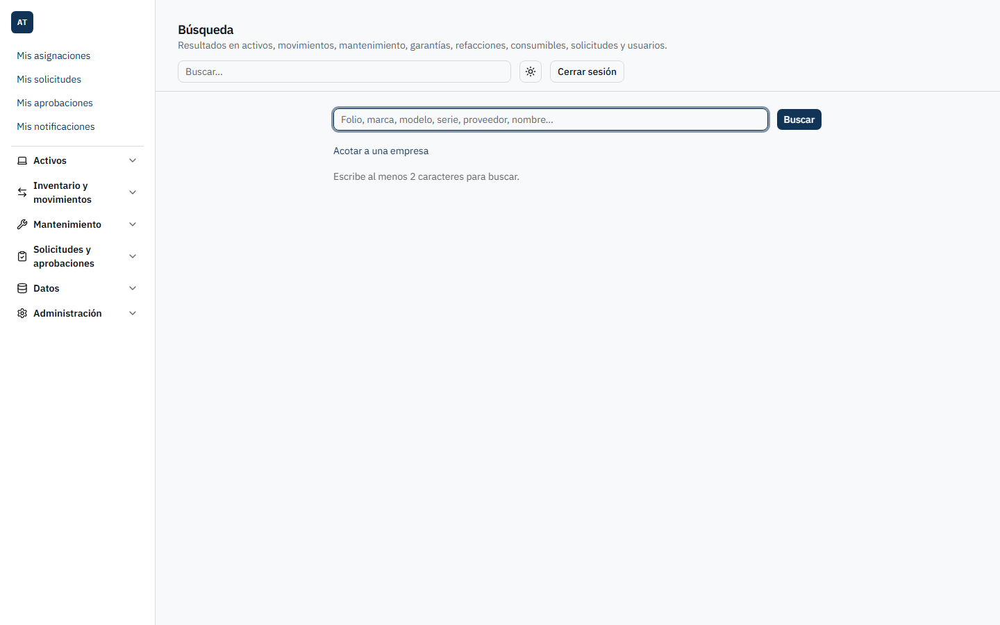). Al escribir
un término y presionar el botón **"Buscar"**, el sistema consulta simultáneamente ocho tipos de
entidad y agrupa los resultados por tipo en la misma pantalla.

**Requisitos**:

- Requiere sesión activa. Sin sesión válida, el sistema responde **"Se requiere iniciar sesión
  para buscar."**
- El término debe tener **al menos 2 caracteres**. Con menos, se muestra el mensaje **"Escribe al
  menos 2 caracteres para buscar."** sin llegar a consultar el API.
- La coincidencia es de tipo "contiene" (subcadena), no de coincidencia exacta ni de inicio de
  palabra.
- Los resultados se acotan siempre a las **empresas a las que la persona usuaria tiene acceso** —
  nunca se buscan registros de empresas ajenas.
- Cada tipo de entidad devuelve **como máximo 8 resultados**, aunque existan más coincidencias.

### Qué entidades busca y qué permisos la filtran

La búsqueda global no tiene un permiso propio: cada uno de los ocho tipos de entidad se filtra
internamente según si la persona usuaria cuenta con el permiso de lectura de ese módulo. Si no
tiene el permiso de un módulo, ese tipo de entidad simplemente no aparece entre los resultados
(no genera un error visible, se omite en silencio).

| Entidad | Permiso requerido | Campos donde busca el término |
|---|---|---|
| Activo | `Assets.Read` | Folio, Marca, Modelo, Serie |
| Movimiento | `Movements.Read` | Folio |
| Orden de mantenimiento | `Maintenance.Read` | Folio, Descripción |
| Garantía | `Warranties.Read` | Proveedor |
| Refacción | `SpareParts.Read` | Nombre, Serie, Número de parte |
| Consumible | `Consumables.Read` | Nombre, SKU |
| Solicitud interna | `Requests.Read` | Justificación |
| Usuario | `Users.Read` | Nombre, Correo (búsqueda global, sin filtrar por empresa) |

> **Nota**: los resultados de tipo Movimiento no tienen pantalla propia de detalle; al
> seleccionarlos, el sistema lo lleva al Activo relacionado.

Si no hay ninguna coincidencia, el sistema muestra **"Sin resultados para "{término}"."**

## Exportaciones (Excel/PDF)

El sistema ofrece exportación a archivo en dos puntos distintos, ambos de procesamiento
**síncrono** (la descarga se genera al momento de la solicitud, sin pasar por una cola en segundo
plano como sí ocurre con las importaciones):

1. **Exportación del listado de Activos**, disponible desde la pantalla de Activos. Usa el mismo
   conjunto de filtros que el listado en pantalla (categoría, estado, empresa, etc.), requiere el
   permiso **`Exports.Create`** y tiene un tope de **10,000 filas** por exportación. Genera un
   archivo con las columnas: Folio, Categoría, Marca, Modelo, Serie, Estado, Condición, Ubicación.
2. **Exportación de los paneles de Reportes** (Garantías por vencer, Existencias bajas, KPIs de
   mantenimiento — ver más abajo), disponible desde cada tarjeta de la pantalla `/reports` que
   incluya el botón correspondiente. Requiere el permiso **`Reports.Export`** y reutiliza
   exactamente la misma consulta que ya está mostrando el panel en pantalla, respetando los
   filtros que la persona usuaria tenga aplicados en ese momento.

**Formatos disponibles**: Excel (.xlsx) y PDF, en ambos casos. Los archivos PDF usan una fuente
embebida (Liberation Sans) para garantizar que se vean igual sin importar el sistema operativo del
servidor. El nombre del archivo descargado incluye una marca de fecha/hora en UTC.

> **Nota importante**: el permiso `Reports.Export` es **independiente** de los permisos para
> **ver** los reportes (`Reports.Read` / `Reports.ReadConsolidated`). Esto significa que, en
> teoría, una persona podría tener permiso para exportar un reporte que no puede ver en pantalla,
> o viceversa — son combinaciones de permisos que un administrador debe asignar con cuidado.

Si se solicita un formato no soportado, el sistema responde **"Formato de exportación no
soportado."**

## Reportes

La pantalla `/reports` (ver captura 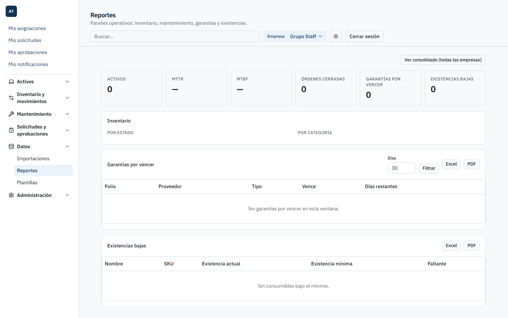) concentra los paneles
operativos de solo lectura del sistema. En la parte superior tiene un botón para alternar entre
**"Ver consolidado (todas las empresas)"** y **"Ver por empresa"**, y muestra 6 tarjetas de
indicador (StatTiles) con cifras generales antes de los cuatro paneles detallados.

El acceso a la pantalla depende de dos permisos distintos según la vista elegida:

- Vista consolidada: **`Reports.ReadConsolidated`**. Sin este permiso: **"No tienes permiso para
  consultar reportes consolidados (Reports.ReadConsolidated)."**
- Vista por empresa: **`Reports.Read`**. Sin este permiso: **"No tienes permiso para consultar
  reportes consolidados (Reports.Read)."**

A continuación, el detalle de cada uno de los cuatro paneles:

### Panel 1 — Resumen de inventario

| | |
|---|---|
| **Objetivo** | Dar un panorama general de cuántos activos hay y cómo están distribuidos. |
| **Campos que muestra** | Gráfico de barras con el conteo de activos agrupado por estado (según la máquina de estados de Activos) y por categoría. |
| **Filtros** | Únicamente el alternador consolidado/por empresa de la parte superior de la pantalla; no tiene filtros propios adicionales. |
| **Cómo exportarlo** | **No es exportable.** Es el único de los cuatro paneles sin botón de exportación — no lo confunda con los otros tres, que sí lo tienen. |

### Panel 2 — KPIs de mantenimiento

| | |
|---|---|
| **Objetivo** | Medir el desempeño del proceso de mantenimiento por categoría de activo. |
| **Campos que muestra** | MTTR (tiempo medio de reparación) y MTBF (tiempo medio entre fallas), desglosados por categoría de activo. |
| **Filtros** | Alternador consolidado/por empresa. |
| **Cómo exportarlo** | Botón de exportación en la propia tarjeta ("exportar Excel/PDF"), sujeto al permiso `Reports.Export`; genera el archivo con los mismos datos que se ven en pantalla en ese momento. |

### Panel 3 — Garantías por vencer

| | |
|---|---|
| **Objetivo** | Anticipar qué garantías de activos están por vencer, para gestionar su renovación o reemplazo a tiempo. |
| **Campos que muestra** | Activos con garantía próxima a vencer, con su proveedor y fecha de vencimiento. |
| **Filtros** | Un filtro numérico de **días hacia adelante** (por ejemplo, mostrar lo que vence en los próximos 30, 60 o 90 días), además del alternador consolidado/por empresa. |
| **Cómo exportarlo** | Botón de exportación en la tarjeta, sujeto a `Reports.Export`; respeta el filtro de días que tenga seleccionado en ese momento. |

### Panel 4 — Existencias bajas

| | |
|---|---|
| **Objetivo** | Identificar consumibles cuya existencia actual cayó por debajo del mínimo definido, para reabastecer a tiempo. |
| **Campos que muestra** | Consumibles por debajo de su mínimo, con su nombre, SKU y existencia actual frente al mínimo configurado. |
| **Filtros** | Alternador consolidado/por empresa (no tiene filtros adicionales propios). |
| **Cómo exportarlo** | Botón de exportación en la tarjeta, sujeto a `Reports.Export`. |

---

# 8. Gestión de usuarios y permisos

## Modelo de permisos

El sistema usa un modelo de permisos globales con formato `{Módulo}.{Acción}`. "Globales" significa que un permiso habilita una acción en **todas** las empresas a las que el usuario tenga acceso — los permisos nunca se acotan por empresa; lo que sí se acota por empresa es a **cuáles** empresas puede aplicar esa acción un usuario (ver §6, Paso 3, y la sección "Usuarios" más abajo).

El catálogo de permisos es fijo: se carga una sola vez mediante una migración de base de datos y, en esta versión del sistema, no puede ampliarse ni editarse desde la interfaz — solo se consulta. Nuevas versiones del sistema pueden agregar permisos nuevos al catálogo (por ejemplo, para módulos que hoy todavía no exigen ningún permiso propio).

La siguiente tabla lista el catálogo completo de permisos vigente (69 permisos en total, el mismo número que recibe automáticamente el rol "Super Administrador" en el bootstrap descrito en §6):

| Módulo | Permiso | Qué habilita | ¿Se exige hoy? |
|---|---|---|---|
| Companies | `Companies.Read` | Ver el catálogo de empresas. | Sí |
| Companies | `Companies.Create` | Registrar una nueva empresa. | Sí |
| Companies | `Companies.Update` | Activar o desactivar una empresa existente. | Sí |
| Structure | `Structure.Read` | Consultar la estructura organizacional de una empresa. | Sí |
| Structure | `Structure.Create` | Crear unidades organizacionales nuevas. | Sí |
| Structure | `Structure.Update` | Mover unidades en la jerarquía y activarlas/desactivarlas. | Sí |
| Roles | `Roles.Read` | Consultar el catálogo de roles. | Sí |
| Roles | `Roles.Create` | Crear un rol nuevo. | Sí |
| Roles | `Roles.Update` | Renombrar un rol y activarlo/desactivarlo. | Sí |
| Roles | `Roles.Duplicate` | Duplicar un rol existente junto con toda su matriz de permisos. | Sí |
| Permissions | `Permissions.Read` | Consultar el catálogo de permisos disponibles. | Sí |
| Permissions | `Permissions.Manage` | Editar la matriz de permisos de un rol. | Sí |
| Users | `Users.Read` | Consultar el listado y el perfil de los usuarios. | Sí |
| Users | `Users.Update` | Anonimizar el perfil de un usuario. | Sí |
| Users | `Users.ManageRoles` | Asignar o quitar roles a un usuario. | Sí |
| Users | `Users.ManageCompanies` | Otorgar o revocar el acceso de un usuario a una empresa. | Sí |
| Assets | `Assets.Read` | Consultar el inventario de activos. | Sí |
| Assets | `Assets.Create` | Dar de alta un activo. | Sí |
| Assets | `Assets.Update` | Editar los datos de un activo. | Sí |
| Assets | `Assets.Decommission` | Dar de baja un activo. | Sí |
| Assignments | `Assignments.Read` | Consultar asignaciones de activos. | Sí |
| Assignments | `Assignments.Create` | Registrar una asignación. | Sí |
| Assignments | `Assignments.Update` | Modificar una asignación existente. | Sí |
| Returns | `Returns.Read` | Consultar devoluciones. | Sí |
| Returns | `Returns.Create` | Registrar la devolución de un activo asignado. | Sí |
| Loans | `Loans.Read` | Consultar préstamos. | Sí |
| Loans | `Loans.Create` | Registrar un préstamo temporal. | Sí |
| Loans | `Loans.Update` | Modificar un préstamo existente. | Sí |
| Transfers | `Transfers.Read` | Consultar transferencias. | Sí |
| Transfers | `Transfers.Create` | Iniciar una transferencia de activo (única vía para cambiar la empresa de un activo). | Sí |
| Transfers | `Transfers.Update` | Modificar/avanzar el estado de una transferencia. | Sí |
| Movements | `Movements.Read` | Consultar el historial de movimientos de inventario. | Sí |
| Requests | `Requests.Read` | Consultar solicitudes internas. | Sí |
| Requests | `Requests.Create` | Crear una solicitud interna. | Sí |
| Requests | `Requests.Update` | Actualizar una solicitud interna. | Sí |
| Maintenance | `Maintenance.Read` | Consultar mantenimientos y checklists. | Sí |
| Maintenance | `Maintenance.Create` | Crear una orden o checklist de mantenimiento. | Sí |
| Maintenance | `Maintenance.Update` | Actualizar una orden de mantenimiento. | Sí |
| Warranties | `Warranties.Read` | Consultar garantías registradas. | Sí |
| Warranties | `Warranties.Create` | Registrar una garantía. | Sí |
| Warranties | `Warranties.Update` | Actualizar una garantía. | Sí |
| SpareParts | `SpareParts.Read` | Consultar refacciones. | Sí |
| SpareParts | `SpareParts.Create` | Registrar una refacción. | Sí |
| SpareParts | `SpareParts.Update` | Actualizar una refacción. | Sí |
| Consumables | `Consumables.Read` | Consultar consumibles. | Sí |
| Consumables | `Consumables.Create` | Registrar un consumible. | Sí |
| Consumables | `Consumables.Update` | Actualizar un consumible. | Sí |
| Documents | `Documents.Read` | Consultar documentos adjuntos. | Sí |
| Documents | `Documents.Create` | Adjuntar un documento. | Sí |
| Templates | `Templates.Read` | Consultar plantillas. | No verificado en este análisis |
| Templates | `Templates.Create` | Crear una plantilla. | No verificado en este análisis |
| Templates | `Templates.Update` | Actualizar una plantilla. | No verificado en este análisis |
| Reports | `Reports.Read` | Ver reportes de las empresas propias. | Sí |
| Reports | `Reports.ReadConsolidated` | Ver el reporte consolidado entre varias empresas. | Sí |
| Reports | `Reports.Export` | Exportar reportes. | Sí |
| Audit | `Audit.Read` | Consultar el historial de auditoría. | Sí |
| Catalogs | `Catalogs.Read` | Consultar catálogos, incluidas las categorías de activos y sus campos técnicos. | Sí |
| Catalogs | `Catalogs.Create` | Crear una categoría de activos. | Sí |
| Catalogs | `Catalogs.Update` | Actualizar una categoría de activos o agregar campos técnicos. | Sí |
| Imports | `Imports.Read` | Consultar lotes de importación masiva. | Sí |
| Imports | `Imports.Create` | Ejecutar una importación masiva. | Sí |
| Exports | `Exports.Create` | Generar una exportación de datos. | Sí |
| Approvals | `Approvals.Read` | Consultar flujos y solicitudes de aprobación. | Sí |
| Approvals | `Approvals.Configure` | Configurar flujos de aprobación. | Sí |
| Approvals | `Approvals.Approve` | Aprobar una solicitud pendiente. | Sí (sin flujo que lo use en la práctica todavía) |
| Approvals | `Approvals.Reject` | Rechazar una solicitud pendiente. | Sí (sin flujo que lo use en la práctica todavía) |
| Configuration | `Configuration.Read` | Consultar la configuración general del sistema. | Sin controles de acceso activos todavía |
| Configuration | `Configuration.Update` | Modificar la configuración general del sistema. | Sin controles de acceso activos todavía |
| Dashboards | `Dashboards.ViewExecutive` | Ver el dashboard ejecutivo consolidado. | Sí |

**Nota:** el menú lateral de "Administración" muestra siempre todas sus opciones a cualquier usuario, sin ocultar las que no puede usar; el control real de acceso ocurre al entrar a cada pantalla — si falta el permiso, la pantalla misma responde con un mensaje de "no tienes permiso" (ver ejemplos en §6). Esto significa que ver una opción en el menú no garantiza poder usarla.

---

## Roles

Los roles son paquetes de permisos con un nombre y una descripción. Se administran desde **Administración → Roles** (`/roles`).

**Listado.** Muestra Nombre (con enlace al detalle del rol), Descripción, cantidad de Permisos asignados y Estado. El subtítulo de la pantalla recuerda: "Los permisos son globales — la empresa no acota qué puede hacer un rol." Si todavía no hay roles: "Todavía no hay roles." Si falta el permiso: "No tienes permiso para consultar roles (Roles.Read)."

Nada más desplegar el sistema, el único rol que existe es el que se creó automáticamente en el bootstrap: **"Super Administrador"**, con la descripción "Rol de arranque con todos los permisos, creado automáticamente para el primer usuario del sistema." y sus 69 permisos activos.

**Crear un rol.** Desde "Nuevo rol" (`/roles/new`):

| Campo | Descripción | Obligatorio | Validaciones |
|---|---|---|---|
| Nombre | Nombre del rol (p. ej. "Técnico de soporte"). | Sí | Máximo 100 caracteres. Mensaje si falta: "El nombre es obligatorio." (Dominio: "El nombre del rol es obligatorio.") |
| Descripción | Texto libre que explica el propósito del rol. | No | Máximo 500 caracteres. |

Un rol recién creado no tiene ningún permiso asignado — deben agregarse desde su pantalla de detalle.

**Detalle de un rol** (`/roles/[id]`). *[Captura pendiente: pantalla de detalle de rol]* Reúne tres funciones independientes:

1. **Renombrar.** Formulario con Nombre y Descripción que actualiza el rol (permiso `Roles.Update`). Al guardar, el sistema confirma con: "Guardado."
2. **Duplicar.** Campo "Duplicar como" con el nombre del nuevo rol; al confirmar, crea un rol nuevo con **una copia completa** de la matriz de permisos del rol de origen (permiso `Roles.Duplicate`). Es la forma recomendada de crear variantes de un rol existente sin tener que marcar permiso por permiso otra vez. Si se intenta duplicar sin escribir un nombre: "Escribe un nombre para el rol duplicado."
3. **Matriz de permisos.** Casillas de verificación agrupadas por módulo, una por cada permiso del catálogo (permiso `Permissions.Manage`). Al guardar, **se reemplaza la matriz completa** del rol por la selección actual — no es una edición incremental, así que conviene revisar todas las casillas del módulo antes de guardar, no solo la que se quiere cambiar. Al guardar exitosamente: "Permisos guardados."

Además, desde esta misma pantalla se puede **activar o desactivar** el rol.

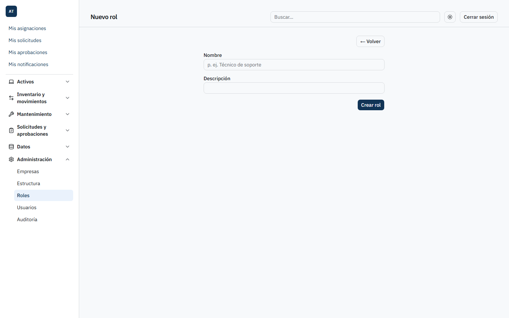

**Activar/Desactivar.** Un rol nunca se borra físicamente del sistema — desactivarlo es la única forma de retirarlo de circulación. Un rol desactivado sigue existiendo (y sigue mostrando su historial en auditoría) pero deja de poder asignarse a usuarios nuevos.

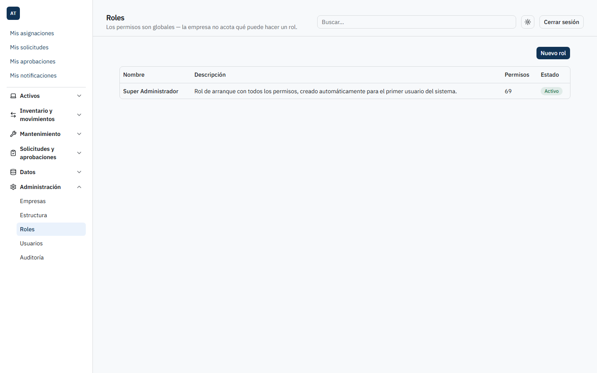

---

## Usuarios

Los perfiles de usuario **nunca se crean a mano**. Se crean automáticamente la primera vez que una persona inicia sesión con su cuenta de Microsoft Entra ID (ver §6, Paso 1, para el caso especial del primer usuario del sistema). Por eso, la pantalla de listado de usuarios (`/users`) no tiene botón "Nuevo usuario", y cuando todavía no hay ningún usuario cargado — situación que en la práctica solo existe antes del primer login — muestra: "Todavía no hay usuarios (se crean automáticamente en el primer inicio de sesión)."

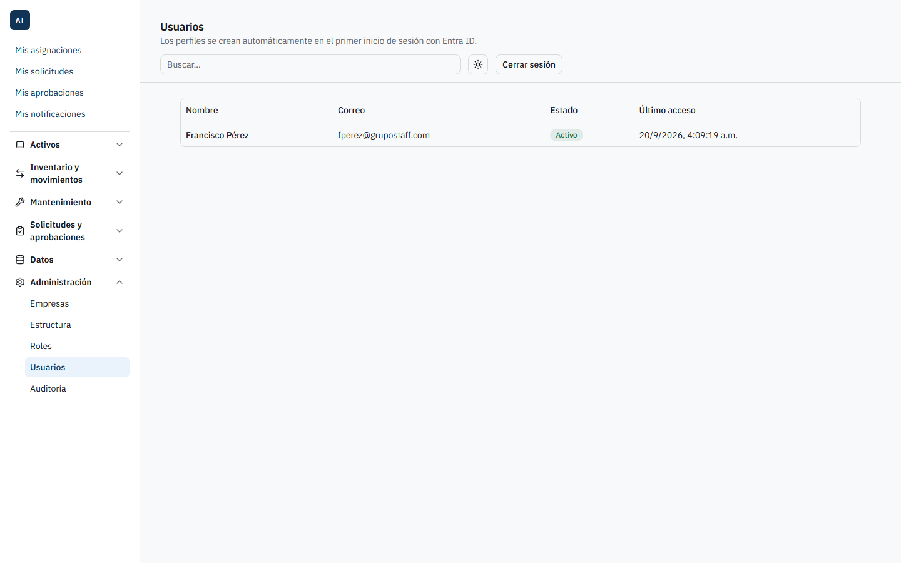

El listado muestra: Nombre (con enlace al detalle), Correo, Estado y Último acceso.

**Detalle de un usuario** (`/users/[id]`). *[Captura pendiente: pantalla de detalle de usuario]* Desde aquí se administra todo lo que un administrador puede hacer sobre un usuario ya existente — no hay edición manual de su nombre o correo, porque esos datos provienen directamente de Entra ID:

- **Roles asignados.** Una lista de los roles que tiene el usuario, cada uno con un botón "Quitar" (permiso `Users.ManageRoles`), y un selector con botón "Asignar" que solo ofrece los roles **activos** que el usuario todavía no tiene.
- **Empresas con acceso.** El mismo patrón, con "Otorgar" y "Revocar" (permiso `Users.ManageCompanies`). **Este es el mecanismo exacto que se usa en el Paso 3 de §6** para que el primer superadministrador se dé acceso a la primera empresa que creó, y es también la forma de dar de alta a cualquier usuario nuevo en una empresa.
- **Anonimizar (irreversible).** Botón destructivo (permiso `Users.Update`) que ejecuta la acción sin pedir una confirmación adicional en pantalla, así que debe usarse con cuidado. El texto junto al botón explica: "Elimina permanentemente el nombre y correo reales de este perfil... No afecta el historial de auditoría ya registrado. Esta acción no se puede deshacer." Si el usuario ya fue anonimizado antes, el botón se reemplaza por el texto: "Anonimizado el {fecha}. El nombre y correo reales ya no están disponibles."

**Nota sobre auditoría:** asignar un rol u otorgar acceso a una empresa queda registrado en el historial de auditoría; sin embargo, **quitar** un rol o **revocar** el acceso a una empresa no genera hoy un registro de auditoría equivalente. Si su organización necesita trazabilidad completa de estos cambios, lleve un registro complementario fuera del sistema hasta que esta asimetría se corrija.

**Nota sobre anonimización:** anonimizar a un usuario es distinto de desactivarlo. Anonimizar borra permanentemente su nombre y correo reales del perfil (útil, por ejemplo, ante una baja de personal y una solicitud de derecho al olvido), pero **no reescribe los registros de auditoría ya generados** — el nombre que aparece en auditoría por acciones pasadas de esa persona queda tal como se registró en su momento, de forma intencional, para no perder la trazabilidad histórica.

---

## Perfiles de acceso: roles configurables, no predefinidos

El sistema **no incluye roles predefinidos de fábrica** más allá del rol "Super Administrador" que se genera una única vez en el bootstrap (§6, Paso 1). Cualquier otro rol — "Administrador de Activos", "Encargado de Almacén", "Auditor", "Técnico de soporte", o el nombre que la organización prefiera — **debe crearlo un administrador** combinando los permisos del catálogo de la forma que tenga sentido para su estructura de trabajo, tal como se describe en "Roles" más arriba.

Lo que puede hacer una persona en el sistema depende exclusivamente de la combinación de permisos que tenga su rol (o roles) asignados, y de a qué empresas tenga acceso. A modo de referencia, estas son combinaciones de permisos **razonables pero enteramente de ejemplo** — no vienen incluidas en el sistema y deben configurarse manualmente si se desean:

| Ejemplo de configuración (nombre libre) | Combinación de permisos ilustrativa | Qué podría hacer con esos permisos |
|---|---|---|
| "Administrador de Activos" (ejemplo) | `Assets.*`, `Assignments.*`, `Transfers.*`, `Movements.Read`, `Warranties.*`, `Documents.*`, `Reports.Read` | Dar de alta, editar y dar de baja activos; asignarlos y transferirlos entre empresas o unidades; consultar el historial de movimientos; registrar garantías; adjuntar documentación; ver reportes de sus empresas. |
| "Encargado de Almacén" (ejemplo) | `Consumables.*`, `SpareParts.*`, `Movements.Read`, `Assignments.Read`, `Requests.Read`, `Requests.Create` | Gestionar el stock de consumibles y refacciones; consultar movimientos y asignaciones sin poder modificarlas; crear solicitudes internas de reposición. |
| "Auditor / solo lectura" (ejemplo) | `Audit.Read`, `Reports.Read`, `Reports.ReadConsolidated`, `Assets.Read`, `Movements.Read`, `Assignments.Read` | Consultar el historial de auditoría y reportes, incluido el consolidado entre empresas, así como el inventario y sus movimientos — sin permiso para crear ni modificar nada. |

Al crear roles propios, tenga en cuenta dos particularidades del catálogo documentadas más arriba: las categorías de activos se controlan con el permiso `Catalogs.*` (no existe un permiso `AssetCategories.*` dedicado), y `Reports.ReadConsolidated` está separado de `Reports.Read` precisamente para poder darle a alguien acceso a los reportes de sus propias empresas sin exponerle el consolidado de toda la organización.

---

# 9. Flujo operativo completo

Los diagramas de esta sección integran, en una sola vista, los procesos que los capítulos
anteriores documentaron por separado. Sirven como mapa de referencia rápida: no repiten el detalle
de campos, validaciones ni mensajes (ya cubiertos en cada capítulo), solo muestran cómo se
encadenan las pantallas y las decisiones.

## Del primer acceso a la operación diaria

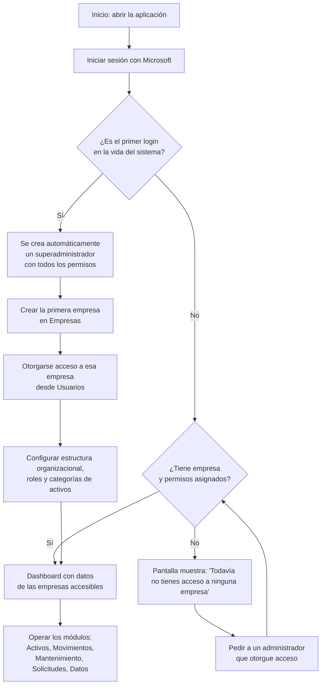
```mermaid
flowchart TD
    A[Inicio: abrir la aplicación] --> B[Iniciar sesión con Microsoft]
    B --> C{¿Es el primer login\nen la vida del sistema?}
    C -->|Sí| D[Se crea automáticamente\nun superadministrador\ncon todos los permisos]
    D --> E[Crear la primera empresa\nen Empresas]
    E --> F[Otorgarse acceso a esa empresa\ndesde Usuarios]
    F --> G[Configurar estructura organizacional,\nroles y categorías de activos]
    C -->|No| H{¿Tiene empresa\ny permisos asignados?}
    H -->|No| I[Pantalla muestra: 'Todavía no tienes acceso a ninguna empresa']
    I --> J[Pedir a un administrador\nque otorgue acceso]
    H -->|Sí| K[Dashboard con datos\nde las empresas accesibles]
    G --> K
    J --> H
    K --> L[Operar los módulos:\nActivos, Movimientos,\nMantenimiento, Solicitudes, Datos]
```

## Ciclo de vida completo de un activo

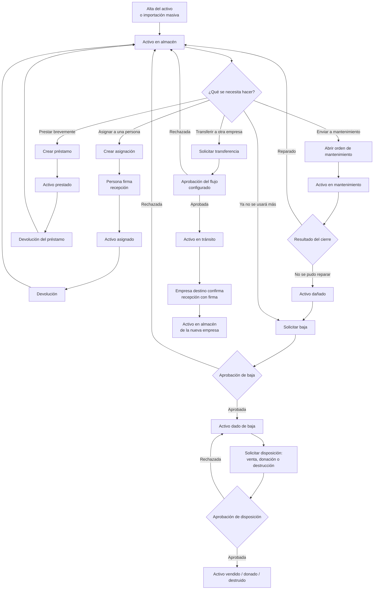
```mermaid
flowchart TD
    A[Alta del activo\no importación masiva] --> B[Activo en almacén]
    B --> C{¿Qué se necesita hacer?}
    C -->|Asignar a una persona| D[Crear asignación]
    D --> E[Persona firma\nrecepción]
    E --> F[Activo asignado]
    F --> G[Devolución]
    G --> B
    C -->|Prestar brevemente| H[Crear préstamo]
    H --> I[Activo prestado]
    I --> J[Devolución del préstamo]
    J --> B
    C -->|Enviar a mantenimiento| K[Abrir orden de mantenimiento]
    K --> L[Activo en mantenimiento]
    L --> M{Resultado del cierre}
    M -->|Reparado| B
    M -->|No se pudo reparar| N[Activo dañado]
    N --> O[Solicitar baja]
    C -->|Transferir a otra empresa| P[Solicitar transferencia]
    P --> Q[Aprobación del flujo\nconfigurado]
    Q -->|Aprobada| R[Activo en tránsito]
    R --> S[Empresa destino confirma\nrecepción con firma]
    S --> T[Activo en almacén\nde la nueva empresa]
    Q -->|Rechazada| B
    C -->|Ya no se usará más| O
    O --> U{Aprobación de baja}
    U -->|Rechazada| B
    U -->|Aprobada| V[Activo dado de baja]
    V --> W[Solicitar disposición:\nventa, donación o destrucción]
    W --> X{Aprobación de disposición}
    X -->|Rechazada| V
    X -->|Aprobada| Y[Activo vendido / donado / destruido]
```

## Solicitud de autoservicio → aprobación → cumplimiento

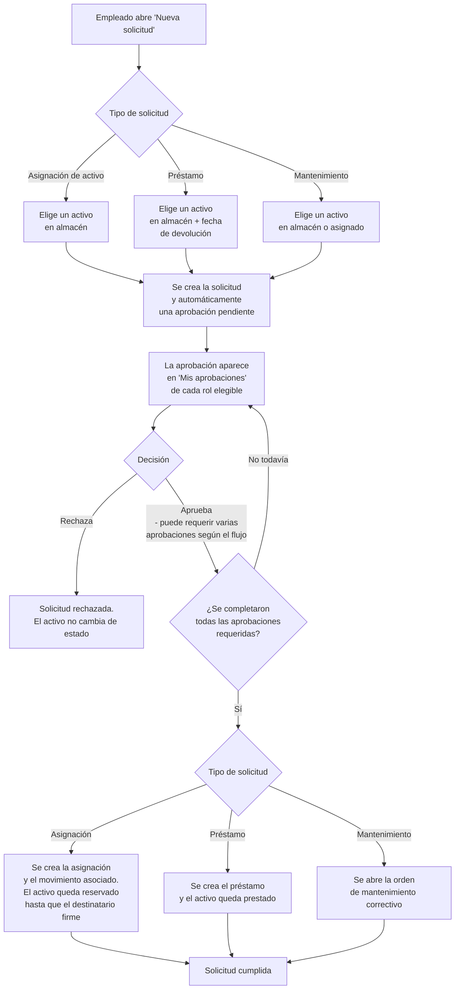
```mermaid
flowchart TD
    A[Empleado abre 'Nueva solicitud'] --> B{Tipo de solicitud}
    B -->|Asignación de activo| C[Elige un activo\nen almacén]
    B -->|Préstamo| D[Elige un activo\nen almacén + fecha\nde devolución]
    B -->|Mantenimiento| E[Elige un activo\nen almacén o asignado]
    C --> F[Se crea la solicitud\ny automáticamente\nuna aprobación pendiente]
    D --> F
    E --> F
    F --> G[La aprobación aparece\nen 'Mis aprobaciones'\nde cada rol elegible]
    G --> H{Decisión}
    H -->|Rechaza| I[Solicitud rechazada.\nEl activo no cambia de estado]
    H -->|Aprueba\n- puede requerir varias\naprobaciones según el flujo| J{¿Se completaron\ntodas las aprobaciones\nrequeridas?}
    J -->|No todavía| G
    J -->|Sí| K{Tipo de solicitud}
    K -->|Asignación| L[Se crea la asignación\ny el movimiento asociado.\nEl activo queda reservado\nhasta que el destinatario firme]
    K -->|Préstamo| M[Se crea el préstamo\ny el activo queda prestado]
    K -->|Mantenimiento| N[Se abre la orden\nde mantenimiento correctivo]
    L --> O[Solicitud cumplida]
    M --> O
    N --> O
```

## Notas de lectura de estos diagramas

- Las decisiones marcadas como "Aprobación" dependen de que la empresa tenga configurado un flujo
  de aprobación para ese tipo de operación (ver capítulo "Solicitudes y aprobaciones"); sin un flujo
  configurado, el sistema no permite crear la solicitud o la operación correspondiente.
- Cancelar una solicitud propia **no** cierra automáticamente la aprobación pendiente asociada —
  ver la nota correspondiente en el capítulo de Solicitudes y aprobaciones.
- El diagrama de ciclo de vida del activo es una simplificación de la máquina de estados completa
  documentada en el capítulo "Activos" (que incluye además los estados Reservado, Extraviado,
  Robado y En garantía) — consulta ese capítulo para el detalle exhaustivo de las 15 situaciones
  posibles y sus transiciones exactas.
